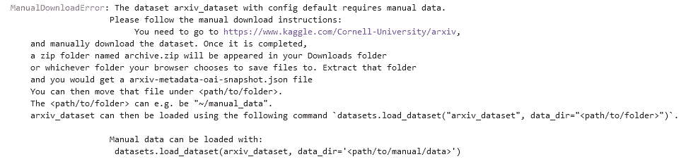
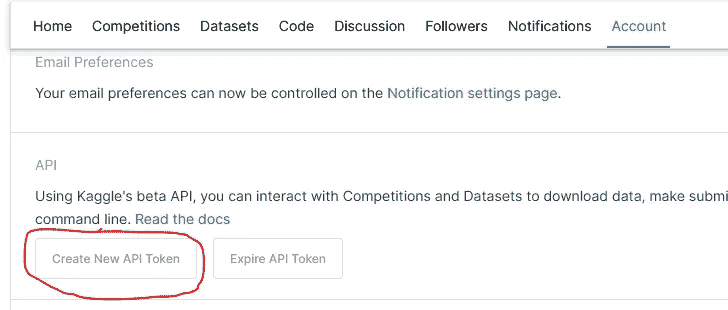
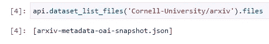
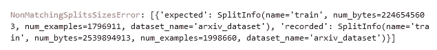

# 为您的 ML 项目从 Kaggle 下载数据集

> 原文：<https://towardsdatascience.com/downloading-datasets-from-kaggle-for-your-ml-project-b9120d405ea4>

# 为您的 ML 项目从 Kaggle 下载数据集

## 如何利用 Kaggle Python API 从他们的网站下载任何数据集

亚历山大·辛恩在 [Unsplash](https://unsplash.com?utm_source=medium&utm_medium=referral) 上的照片

# 这是怎么回事？

我最近想在我的一个 NLP 项目中使用 [Arxiv 数据集](https://huggingface.co/datasets/arxiv_dataset)(它是在 [Creative Commons CC0 1.0 通用公共领域专用协议](https://creativecommons.org/publicdomain/zero/1.0/)下许可的)，并试图利用 HF dataset hub 下载数据集。在这样做的时候，我收到了这条消息:

作者图片

看起来我不得不从 Kaggle 的网站上手动下载数据。我可以这样做，然后把它上传到我正在开发项目的云环境中。但我认为尝试不同的方法并学习新的东西可能会很有趣:)

在这篇博文中，我想简单介绍一下官方的 Kaggle API 及其 Python 实现。这个 API 使我们能够只使用 Python 从 Kaggle 下载任何数据集。一旦我们完成了这些，我们就可以用 HF 的数据集库加载数据集了。

本教程的笔记本可以在这个 [Github repo](https://github.com/marshmellow77/kaggle-api) 中找到。

# 创建 Kaggle API 密钥

为了与 Kaggle API 交互，我们需要一个 API 密钥，我们可以在网站上创建它(注意，你需要一个免费的 Kaggle 帐户)。为此，我们可以转到我们的帐户网站(https://www.kaggle.com/<user_name>/帐户)，在 *API* 部分下，我们可以创建这样一个密钥:</user_name>

作者图片

将会下载一个名为 *kaggle.json* 的文件，我们可以将这个文件存储在一个名为*的文件夹中。kaggle* 放在我们的主目录中，这样就可以用它来认证 API 服务。在本教程中，我们将使用操作系统环境变量直接在笔记本中执行身份验证，如下所示:

# 下载数据集

现在我们可以利用 Kaggle API 的 Python 实现。要做到这一点，我们只需查看一下[源代码](https://github.com/Kaggle/kaggle-api/blob/master/kaggle/api/kaggle_api_extended.py)，这是有据可查的。

在那里，我们找到了一些与数据集相关的方法，例如[*dataset _ list _ files()*](https://github.com/Kaggle/kaggle-api/blob/master/kaggle/api/kaggle_api_extended.py#L1068)方法。我们需要的只是我们感兴趣的数据集的标识符，我们可以从数据集的 URL 路径中提取这个标识符([https://www.kaggle.com/Cornell-University/arxiv](https://www.kaggle.com/Cornell-University/arxiv)):

作者图片

为了下载数据集，我们可以利用 download_files 方法:

这将下载与数据集相关的所有文件，作为一个 zip 文件，我们可以简单地解压缩它。

## 许多其他 API 函数

如果您经常与 Kaggle 交互，请注意这个 API 类中有许多其他方法可以让您做其他事情，例如与竞赛交互等。

# 奖金挑战

现在我们的环境中已经有了本地数据，我们可以返回到 HF dataset 类来加载我们的数据集。当尝试这样做时，我们会遇到另一个错误消息:

作者图片

出现此错误消息是因为当数据集在 HF Dataset Hub 上创建时，它预期有 176 万条记录，但数据集从那时起已经更新，现在有 199 万条记录。然而，我们可以通过添加 *ignore_verifications* 参数来规避这个问题:

# 结论

我们现在已经使用他们的 Python API 成功地从 Kaggle 网站加载了一个数据集。我希望这是有用的，请留下评论和/或问题，如果你有任何。