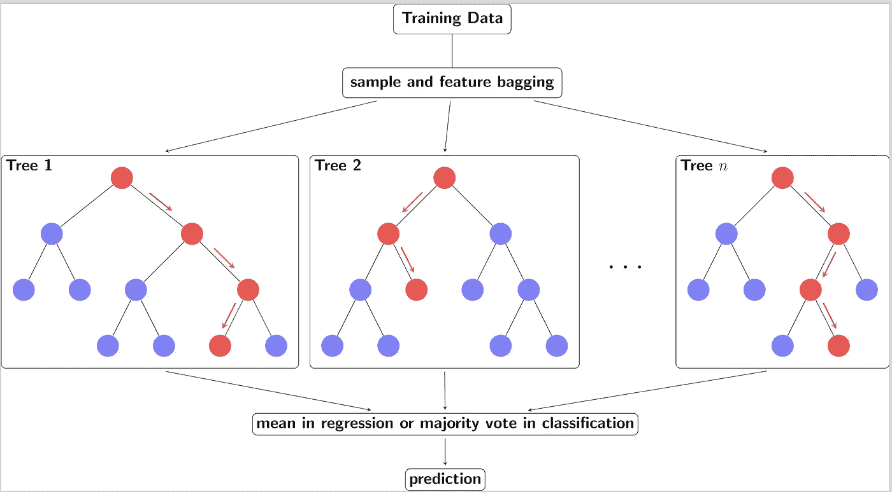
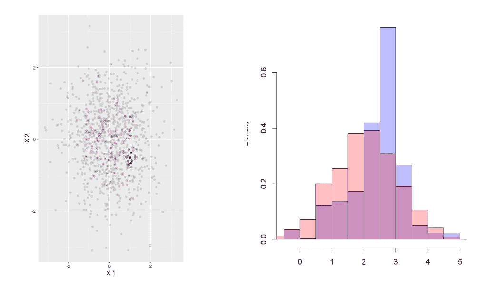
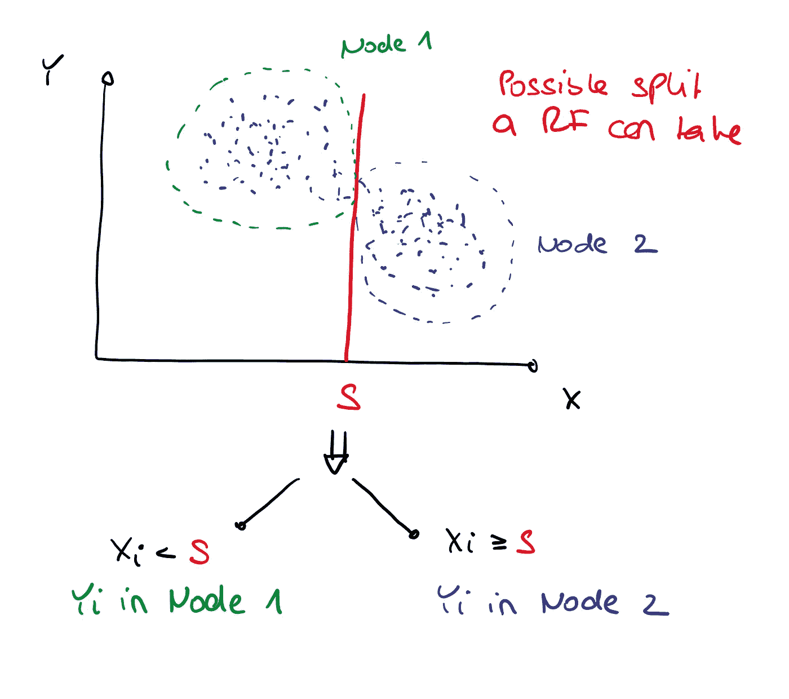
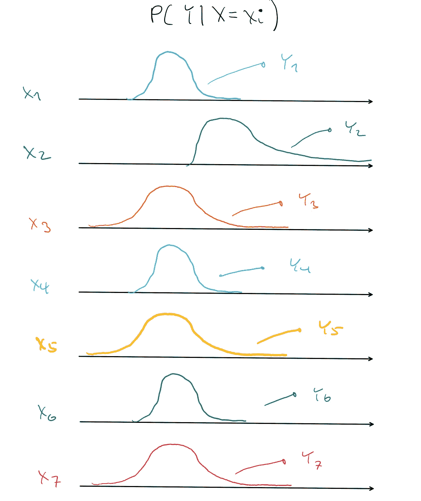
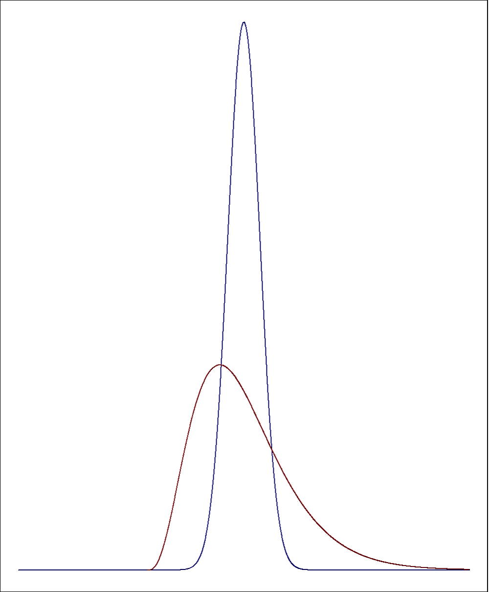
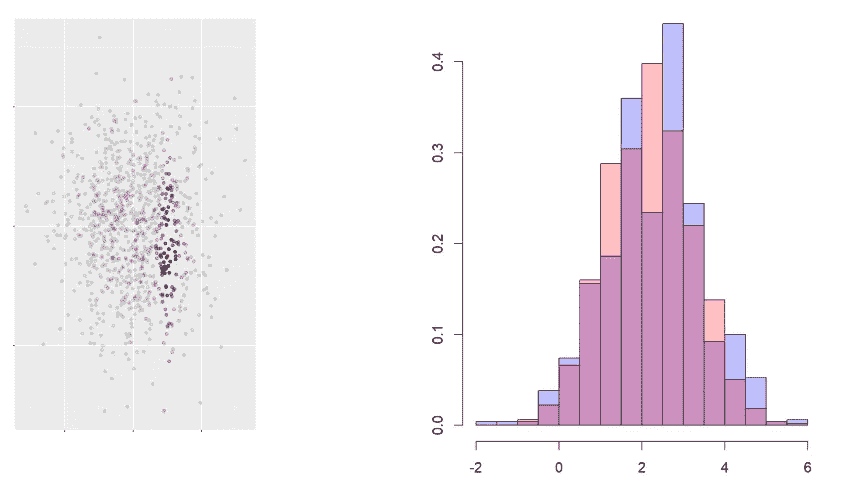
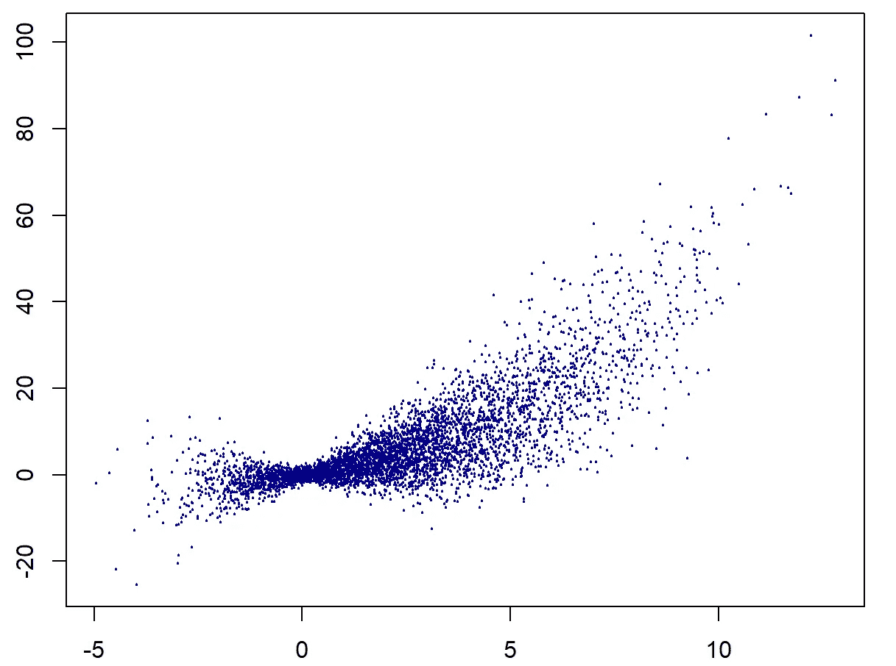
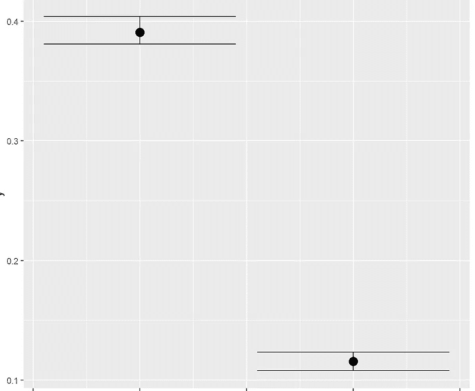

# DRF :(几乎)所有东西的随机森林

> 原文：<https://towardsdatascience.com/drf-a-random-forest-for-almost-everything-625fa5c3bcb8>


Geran de Klerk 在 [Unsplash](https://unsplash.com?utm_source=medium&utm_medium=referral) 上拍摄的照片

当 Breiman 在 2001 年引入随机森林(RF)算法时，他知道这会产生巨大的影响吗？如今，RF 是数据科学的许多领域中大量使用的工具。原因显而易见——RF 易于使用，并以其在极其广泛的任务中的高性能而闻名。这本身就令人印象深刻，但更有趣的是，获得这些结果通常不需要调优。

在本文中，我们讨论了原始 RF 的一个相当大的扩展，即我们最近在本文中开发的分布式随机森林(DRF ):

【分布随机森林:异质性调整和多元分布回归(jmlr.org)

与洛里斯·米歇尔的合作，米歇尔对本文也有贡献。其他代码和 python 实现可以在这里找到:[https://github.com/lorismichel/drf](https://github.com/lorismichel/drf)

我们将从随机森林这个主题的简单介绍开始，然后逐步介绍开发 DRF 的步骤。最后有一个小例子列表，我们很乐意在将来扩展它。

在我们继续之前，我们首先需要了解一些符号:在本文中，我们将把 **X** 、 **Y** 称为随机向量，我们假设从这些向量中观察一个 iid 样本(yi， **x** i)，i=1，…n。这在研究论文中很常见。如果我们改为处理随机变量(即单变量)，我们只写 Y 或 X。数据科学的许多应用程序的主要目标是*从一些特征中预测*Y**X**，假设我们想要从像素强度的向量( **X** )中预测标签“狗”(Y)。不太引人注目的是，预测实际上几乎总是条件分布 P(Y| **X** = **x** )的函数。所以我们问“如果向量 **X** 固定为一个值 **x** ，那么 Y 的某个分布方面是什么？”。最突出的例子就是条件均值或期望，即分布 P(Y| **X** = **x** )下的期望值。这是人们在要求预测时通常想要的。例如，如果我们使用线性回归进行预测，我们将一个值 **x** 代入线性公式，得到 Y 的期望值作为预测值。上面的图像分类示例已经不同了——这里我们可能要求最可能的值，即对于哪个标签*l*P(Y =*l*|**X**=**X**)最大化。长话短说:大多数预测都是条件分布的一部分，通常是条件期望。

有趣的是，人们后来发现 RF 不仅可以用于条件期望或均值预测，还可以预测(条件)分布的其他方面。例如，可以预测分位数，从而获得测量不确定性的预测区间。DRF 将这种方法提升到了一个新的水平:你可以向它提供一个多元响应 **Y** 以及特征的典型向量 **X** ，然后它会估计多元响应 **Y** 的*整体条件分布*给定任何(实现) **x** 。中给出了简单权重形式的估计值，便于从分布中模拟或计算感兴趣的量，即“预测”。

这里给出了对 RF 的全面解释，例如，,所以我们只是简单地触及一下:在 RF 中，安装了几个*独立的*决策树。每棵树只是得到变量的一部分，然后根据 **X** 中的特征分割结果空间。



行动中的随机森林。一个新的点 **x** 被放在每棵树上(红色),落在一个叶子或终端节点上。来源:使用 TikZ 代码从 s [tackexchange](https://tex.stackexchange.com/questions/503883/illustrating-the-random-forest-algorithm-in-tikz) 生成的图像。

因此，当我们“放下”一个新的点 **x** 时，它将在每棵树的一片叶子中结束。一片树叶是一组观察值 *i* 的集合，取该树叶中所有 yi 的平均值给出了对一棵树的预测。然后对这些预测进行平均，得出最终结果。因此，对于给定的 **x** 如果你想预测给定的**x**Y 的条件均值，你:

1.“下拉”每棵树的 **x** (在上图中用红色表示)。因为分割规则是在 **X** 上制定的，所以你的新点 **x** 将安全地落在一个叶节点的某个地方。

2.对于每棵树，你平均该树叶中的响应 yi，以获得每棵树的条件均值的估计。

3.你在树上平均每个条件平均值来得到最终的预测。

重要的是，平均所有树的预测导致方差的显著减少。可以说，误差得到了“平均”。这就是为什么让树尽可能独立是很重要的。

我们现在致力于扩展这一思想，不仅进行平均预测，而且预测整个(条件)分布。也就是我们要预测一个测试点 **x** 的 P(**Y**|**X**=**X**)。如前所述，人们通常想要预测的许多东西都是这个条件分布的直接函数:条件均值、条件分位数、条件方差、协方差等等。事实证明，DRF 的形式也使它适合于因果分析，甚至超越了最先进的方法。我们在本文的最后给出了一个小例子，在以后的文章中可能会给出更多的例子。

现在，我们一步一步地推导如何到达分布式随机森林。第一步是得到重量。

# 该理论

## **第一步:增加体重**

这其中的关键是获得射频提供的*权重*。首次介绍 RF 时，这一点通常会被忽略，但在这里却至关重要:

不是直接计算叶节点中的平均值，而是计算在进行平均值计算时隐含使用的权重。权重 wi( **x** )是(1)测试点 **x** 和(2)观测值 *i* 的函数。也就是说，如果我们把 **x** 丢下一棵树，我们会观察它最后落在哪片叶子上。该叶中的所有观察值都为 1，其他所有观察值都为 0。因此，如果我们最终在一片叶子中得到观察值(1，3，10)，那么该树的观察值 1，3，10 的权重是 1，而所有其他观察值都是 0。然后，我们进一步将权重除以叶节点中元素的数量。在前面的示例中，我们在叶节点中有 3 个观察值，因此观察值 1、3、10 的权重都是 1/3，而所有其他观察值在该树中的权重仍然是 0。对所有树的这些权重进行平均得到最终的权重 wi( **x** )。

为什么这些重量有用？首先，可以看出，像我们在传统随机森林中所做的那样计算平均值，与对 wi( **x** )*yi 求和是一样的。这看起来有点难看，但基本上只是交换两个和。因此，如果这个估计是合理的，它应该是合理的，如果你取 yi 的其他函数，比如 yi，你得到给定的 Y 的平均值 **X** 。或者你，对于某个数 t，你可以使用 I(yi < t)如果 yi < t 为 1，否则为 0，并将 wi( **x** )I(yi < t)上的和视为 Y < t 的条件概率的估计，这样你就可以直接获得条件累积分布函数(cdf)，它在理论上完全表征了条件分布。第二，这些权重实际上为您提供了在某种意义上与查询 **x** 相似的观察值的最近邻估计。正如我们将在下面看到的，这种相似性是以一种理想的方式来度量的，这种方式使得有可能将相关联的 yi 看作来自条件分布的 iid 样本。

这甚至可以更进一步。特别地，如果你用这些权重从 Y 中取样，你将得到一个条件分布的近似样本。在我们继续之前，让我们使用 r 中著名的 ranger 包做一个简单的例子。该包不直接提供这些权重，所以我们需要手动实现它们，这是一个很好的练习:

```
library(ranger)
library(ggplot2)
n<-1000## Simulate some data:
X<-matrix(rnorm(n*2),ncol=2)
Y=2*X[,1] + 0.5*X[,2]^2 + rnorm(n)
Y<-as.matrix(Y)## Get a test point
x<-matrix(c(1,-0.5),ncol=2)# Fit Random forest
RF<-ranger(Y~., data=data.frame(Y=Y, X=X),min.node.size = 10, num.trees=500)## Get the leaf/terminal node indices of each observation in the training samples
terminalX <- predict(RF, data=data.frame(X=X), type="terminalNodes")$predictions## Get the leaf/terminal node of the test point
terminalxnew <- predict(RF, data=data.frame(X=x), type="terminalNodes")$predictions## For the leafs in which x ends up, what are the number of observations (we need to normalize by that)
divid<-sapply(1:ncol(terminalxnew[1,, drop=F]), function(j) {sum(terminalX[,j]==terminalxnew[1,j])} )

# Average the weights over the trees:
weights<-rowSums(t(sapply(1:nrow(terminalX), function(j) as.numeric(terminalX[j,]==terminalxnew[1,])/divid )), na.rm=T)/length(terminalxnew[1,])## We can now sample according to those weights from Y
Ysample<-Y[sample(1:dim(Y)[1], prob=weights, replace = T),]## True conditional distribution
Ytrue<-2*x[,1] + 0.5*x[,2]^2 + rnorm(n) 
p1 <- hist(Ytrue, freq=F)                     
p2 <- hist(Ysample, freq=F)                     
plot( p2, col=rgb(0,0,1,1/4), freq=F)  
plot( p1, col=rgb(1,0,0,1/4), add=T, freq=F)## Plot the weights by looking at the point x and its nearest neighbors according to the weights
ggplot(data = data.frame(X=X), aes(x = X.1, y = X.2)) +
  geom_point(aes(alpha = exp(weights ))) + geom_point(data=data.frame(X=x), color = "red")## Get the estimated conditional mean:
mean(Ytrue)
mean(Ysample)
sum(weights*Y)
```



上面代码的结果:在左边，我们看到了一个 **Xi** (灰色点)和红色测试点 **x** 的图。观察点 **Xi** 越暗，RF 分配给它们的权重越大。在右边，来自真实条件分布(红色)的模拟与根据权重从 Y 提取的点进行比较。图片作者。

## 步骤 2:使用不同的分割标准

还有另一种方式来看待随机森林算法:它是一个同质机器。在树中的每个分裂中，选择在 **X** 中的分裂，使得结果节点中 Y 的两个样本尽可能“不同”。下图是单变量 X 和 y 的一个小例子。



RF 中完成的拆分的图示。图片作者。

在这样的例子中，一个给定的树很可能在 S 处分裂 X，如图所示。然后所有易与的< S will be thrown into node 1 and all Xi > = S 进入节点 2，从而识别数据簇。如果我们这样做足够长的时间，每个叶节点将有一个非常均匀的 Y 样本，或者换句话说，一个叶节点中的所有 yi 在某些方面将是*相似的*，因为所有“不相似的”观察值都被切掉了。因此，对于每棵树，您将数据分组到相似事物的桶中。

为什么这有意义？因为本质上，RF 是一种最近邻算法。如果你给它一个 **x** ,它会把它丢下树，直到它落在一个桶里或一片叶子上，观察结果“类似”。根据这些观察值，计算条件平均值。也就是说，在每棵树中，只考虑叶子中的观察值，其他都不考虑。所以它就像一个 k-NN，距离不是由欧几里得距离来衡量的，而是由森林来决定的。反过来，森林决定将这些 **x** i 标记为具有“相似”yi 的“相似”。因此， **x** i 的相似性是基于它们相关联的 yi 来决定的，如果你的目标是推断关于 Y 的事情，这就很有意义。事实上，即使是 k-NN 方法也假设了一些类似于“对于 **x** i 接近于 **x** 的条件分布 P( **Y** |**X**=**X**I，条件分布 P(**Y**)大致相同”的东西。下图说明了这一点:您可以看到样本中每个值 **x** i 的相关真条件分布，yi 就是从该分布中采样的。DRF 的完美版本将识别出( **x** 1， **x** 4， **x** 6)和( **x** 3， **x** 5， **x** 7)的条件分布是相似的(不管它们的欧几里德距离实际上是多少)，并且将 yi，(y1，y4，y6)和(y3，y5，y7)的相应组分别视为



对于样本中的每个值 **x** i，显示了 Y| **X** = **xi** 的条件分布，Yi 是该分布的平局。可以看出，有些分布与其他分布更相似。图片作者。

理想情况下，这将意味着在实践中，我们在一个叶内最终得到的同质 yi 样本实际上大约是来自条件分布 Y| **X=x** 的 iid 样本。这就是采用(加权)平均值的理由。

不幸的是，在最初的 RF 中，除了条件均值预测之外，这种方法不能如预期的那样工作。同样，我们想要的是一个分裂标准，它使得 Y 在两个分裂中的分布尽可能不同。相反，在原始 RF 中，我们得到的只是一个分裂，使两个样本之间的*均值*差异尽可能大。在上图中，这样的方法可能会将除了 **x** 2 之外的所有人归为一组，因为 **x** 1、 **x** 3、 **x** 4、 **x** 6、 **x** 7 都有非常相似的含义。当然，正如上图所示，分布并不是通过平均值来定义的。一个正态分布可以有相同的均值，但有非常不同的方差或其他矩。一般来说，你可以有很多均值相同的分布，但在其他方面却非常不同。



均值相同的两个分布。如果这是两个不同国家的收入不平等，它们会被视为相同吗？图片作者。

关键在于，每次拆分都应该取决于两个结果节点之间分布差异的度量。因此，不仅检测均值或方差的差异，而且检测分布的任何差异。DRF 通过调整射频中通常采用的分裂标准来解决这个问题，以利用*内核*的理论和实际能力以及所谓的 MMD 标准。MMD 可以非常有效地近似，并且原则上能够检测分布中的任何差异。从理论上讲，我们从而把每一个点 yi 送入一个无限维的空间，再生核希尔伯特空间，实际上在那个空间比较均值。通过内核方法的魔力，这种均值之间的比较实际上是分布的比较！在这个特殊的空间中，平均值就是分布。这在实践中意味着如下:一个叶节点将包含相似的 **x** i，在这个意义上，yi 在那个桶中的分布是相似的。因此，如果给定的 Y 的条件分布 **x** i 和 **x** j 相似，则它们将被分组到相同的桶中。原则上这是正确的，即使 **x** i 和 **x** j 在欧几里德空间中相距很远(即，如果它们在 k-NN 意义上不是最近的邻居)。因此，如果我们使用这些权重来计算我们感兴趣的条件事物，我们使用最近邻方法，该方法认为 **x** i 和 **x** j 是相似的，当它们相关的 yi，yj 的分布是相似的。特别地，在一些平滑度假设下，叶节点 **x** 中的样本大约是来自分布 P(**Y**|**X**=**X**)的 iid 样本。

## **第三步:使用多元响应**

这一步实际上很简单，因为 MMD 也允许比较多元分布。重要的是，区分不仅仅是平均值对于多变量响应变得更加重要，因为分布的差异可能更加复杂。例如，两个多元分布可以具有相同的均值和方差，但元素之间的协方差不同。

# 例子

我们来举几个小例子。这里的目标是提供非常简单的模拟例子来感受这种方法。首先，我们重复上面手动完成的操作:

```
library(drf)
# Fit DRF
DRF<-drf(X,Y)
weights<-predict(DRF,x)$weights[1,]### We can now sample according to those weights from Y
Ysample<-Y[sample(1:dim(Y)[1], prob=weights, replace = T),]## True conditional distribution
Ytrue<-2*x[,1] + 0.5*x[,2]^2 + rnorm(n) 
p1 <- hist(Ytrue, freq=F)                     
p2 <- hist(Ysample, freq=F)                     
plot( p2, col=rgb(0,0,1,1/4), freq=F)  
plot( p1, col=rgb(1,0,0,1/4), add=T, freq=F)ggplot(data = data.frame(X=X), aes(x = X.1, y = X.2)) +
  geom_point(aes(alpha = exp(weights ))) + geom_point(data=data.frame(X=x), color = "red")## Get the estimated conditional mean:
mean(Ytrue)
mean(Ysample)
sum(weights*Y)
```

现在产生了这些更好看的结果:



上面代码的结果:在左边，我们看到了一个 **Xi** (灰色点)和红色测试点 **x** 的图。观察点 **Xi** 越暗，DRF 赋予它们的权重就越大。在右边，来自真实条件分布(红色)的模拟与根据权重从 Y 提取的点进行比较。图片作者。

我们也可以预测条件分位数。例如，这样做给出了 Y| **x** 的值的预测区间，因此从该分布中得出的值应该大约是该区间中 95%的时间:

```
# Predict quantiles for a test point.
quants<-predict(DRF,x, functional = “quantile”, quantiles=c(0.025, 0.975))$quantile 
q1<-quants[1]
q2<-quants[2]mean(Ytrue >=q1 & Ytrue <=q2)
```

最后一行检查从条件分布模拟的新样本中有多少部分位于区间[q1，q2]内。在这种情况下，结果大约是 94%，接近我们希望的 95%。

## 二维响应

在这里，我们构建了一个具有二维响应的非常困难的示例，并计算了各种预测。我们首先模拟数据:

```
n<-5000
d<-2
p<-3## Simulate X and Y
X<-matrix( cbind(runif(n)*2, rnorm(n, mean = 1), rt(n, df=8)),nrow=n)Y<-matrix(NA, ncol=2, nrow=n)
Y[,1]<-X[,1]^2 + X[,2]*X[,1] + X[,3] + rnorm(n)
Y[,2] <- 2*Y[,1]*X[,2] + 0.1*X[,3] + rnorm(n)
```

对于非参数估计方法来说，这些是非常疯狂的关系，因为一个 **X** 的元素具有非常不同的分布。有一点要提的是 2*Y[，1]*X[，2]，意思是当 **X** 的第二个元素为正时 **Y** 的第一个和第二个元素的相关性为正，而当 **X** 的第二个元素为负时相关性为负。 **Y** 整体看起来是这样的:



如上面代码中模拟的。图片作者。

我们现在选择两个测试点，做一些大胆的预测，因为我们可以:

```
library(drf)# Fit DRF
DRF<- drf(X=X, Y=Y, num.features=200)# Choose a few test point:
x= matrix(c(0.093, -0.5,  1.37, 0.093, 0.5,  1.37) , ncol=p, nrow=2, byrow=T)# mean prediction
(predict(DRF, newdata=x, functional="mean")$mean)# correlation prediction
matrix(predict(DRF, newdata=x[1,], functional="cor")$cor, nrow=d,ncol=d)
matrix(predict(DRF, newdata=x[2,], functional="cor")$cor, nrow=d,ncol=d)# Estimated probability that Y is smaller than 0:
weightstotal<-predict(DRF, newdata=x)$weights
p1<-sum(weightstotal[1,]* (Y[,1] + Y[,2]<= 0) )
p2<-sum(weightstotal[2,]* (Y[,1] + Y[,2] <= 0) )# Bootstrapping the estimated probability of the sum being <=0 for both points:
B<-100
pb1<-matrix(NA, ncol=1,nrow=B)
pb2<-matrix(NA, ncol=1,nrow=B)
for (b in 1:B){
  Ybx1<-Y[sample(1:n, size=n, replace=T, prob=weightstotal[1,]), ]
  Ybx2<-Y[sample(1:n, size=n, replace=T, prob=weightstotal[2,]), ]
  pb1[b] <- mean(Ybx1[,1] + Ybx1[,2] <= 0)
  pb2[b] <- mean(Ybx2[,1] + Ybx2[,2] <= 0)
}ggplot(data.frame(x=1:2, y=c(p1, p2)), aes(x = x, y = y)) +
  geom_point(size = 4) +
  geom_errorbar(aes(ymax = c(quantile(pb1,1- 0.025), quantile(pb2, 1-0.025)), ymin = c(quantile(pb1, 0.025),quantile(pb2, 0.025) )))
```

我们不详细描述结果，但有趣的是，当 **x** 的第二个元素为负时，DRF 设法正确地检测到负相关性，当 **x** 的第二个元素为正时，检测到正相关性。此外，我们还加入了一个新的方面:我们甚至可以为我们的估计做一个(有条件的)bootstrap。在这种情况下，我们将其应用于 **Y** 的元素之和小于或等于 0 的估计概率。这导致该量的以下置信区间:



两个测试点 P 的自举 CIs(Y1+Y2≤0 |**X**=**X**)。

## 从预测到因果效应

为了让事情变得更有趣，我们研究了一个医学例子，我们希望得到因果效应(它完全是由完全不切实际的数字组成的，尽管它是由真实的问题激发的——男性和女性对药物的反应不同)。

在这个例子中，我们模拟了一个结果，比如说应该通过某种药物调节的血液稀释效应(B)。我们还知道患者的年龄和性别，并且我们模拟以下关系:对于男性患者，与年龄无关，药物线性增加血液稀释效果。对于女性患者，药物治疗也会增加 B，但如果她们的年龄超过 50 岁，则增加的程度会高于男性。然而，如果低于 50，效果完全相反，药物导致*降低*血液稀释效果。确切的数据生成过程如下:

```
n<-1000# We randomly sample from different ages…
Age<-sample(20:70, n, replace=T)# and sexes
Sex <- rbinom(n, size=1,prob=0.6) # 1=woman, 0=man# W denotes the dosis of the medication, the causal effect we are directly interested in
W<-sample( c(5,10,50,100),n, replace=T)# B is the thing we want to understand
B<- 60+ (0.5*W)*(Sex==0) + (-0.5*W)*(Sex==1)*(Age<50) + (0.8*W)*(Sex==1)*(Age>=50) + rnorm(n)
```

首先说明这种关系(因为我们知道真相，所以我们可以这样绘制):


按年龄组和性别说明药物的模拟效果。图片作者。

DRF 的一种方法是(1)取 **Y** =(B，W)(所以我们的 **Y** 也是二维的)和 **X** =(年龄，性别)，(2)得到给定的 **x** 的权重，然后(3)估计用这些权重加权的线性回归。这给出的是给定 **X** 固定为 **x** 时的效果估计值:

```
get_CATE_DRF = function(fit, newdata){
 out = predict(fit, newdata)
 ret = c()
 for(i in 1:nrow(newdata)){
 ret = c(ret, lm(out$y[,1]~out$y[,2], weights=out$weights[i,])$coefficients[2])
 }
 return(ret)
}
```

这里可以看到不同测试点的结果:

```
library(drf)# Construct the data matrices
X<-matrix(cbind(Age, Sex), ncol=2)
Y<-matrix(cbind(B,W), ncol=2)# Fit
DRF<-drf(Y=Y, X=X)# Get a test point (changing this test point gives different queries)
x<-matrix(c(40, 1), nrow=1)# Get the weights
weights <- predict(DRF, newdata=x)$weights[1,]# Study the weights
head(X[order(weights, decreasing=T),])# Result for given test point
(CATE_DRF = get_CATE_DRF(DRF, newdata=x))
```

可以看出，当运行 1000 个数据点的代码时，这些结果是相当准确的:在这个例子中，我们得到一个 40 多岁的女人的效应为-0.26(**x**=(40，1))，一个 60 多岁的女人的效应为 0.48(**x**=(60，1))，一个 30 岁的男人的效应为 0.28(**x**=(30，0))

在某些方面，这仍然是一个非常简单的例子，甚至以年龄和性别作为预测因素的线性回归可能也很有效。重要的是，DRF 在这里没有预先假设(例如线性)，并且完全自己学习关系，即使当 **X** 的效应是非线性的。对于较小的样本量，估计这种影响要困难得多，但总的方向通常不会太差。

# 结论

本文解释了分布式随机森林方法(希望以一种可以理解的方式)。该方法是一个随机森林，其中每棵树根据 **X** 分割响应 **Y** ，以这种方式，具有相似分布的观察结果在一个叶节点中结束。如果一个新的点 **x** 被放在一棵树上，它将和其他具有类似条件分布 **Y** 的 **x** i 一起到达一个叶子节点。这导致在所有树上平均的权重，以简单的形式给出条件分布的估计。这给出了 P(**Y**|**X**=**X**)的纯非参数估计，从中可以估计出许多有趣的量。

在本文的最后，我们只想提醒大家，非参数地估计多元条件分布是一项艰巨的任务。这是有意义的，尤其是当有大量的观察和复杂的关系是可疑的。然而，有时假设一个高斯分布的线性模型也可以。使 DRF 如此多才多艺的是，即使在参数模型更合适的情况下，权重对于半参数方法仍然是有用的，

大量额外的例子可以在原始论文中找到，或者在未来潜在的媒体文章中找到。我们希望 DRF 能在许多依赖数据的任务中提供帮助！