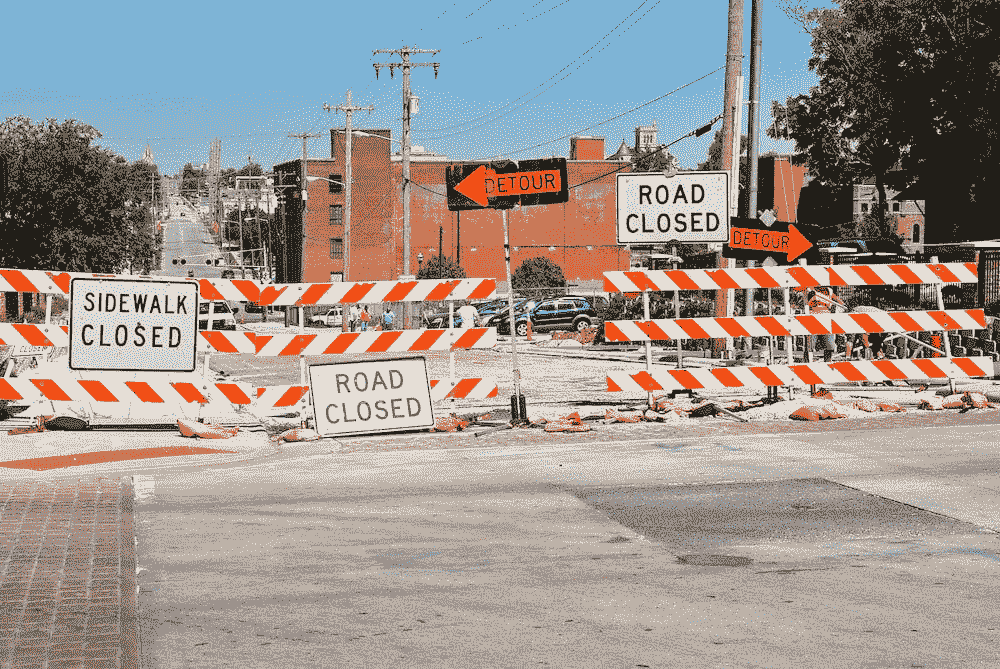
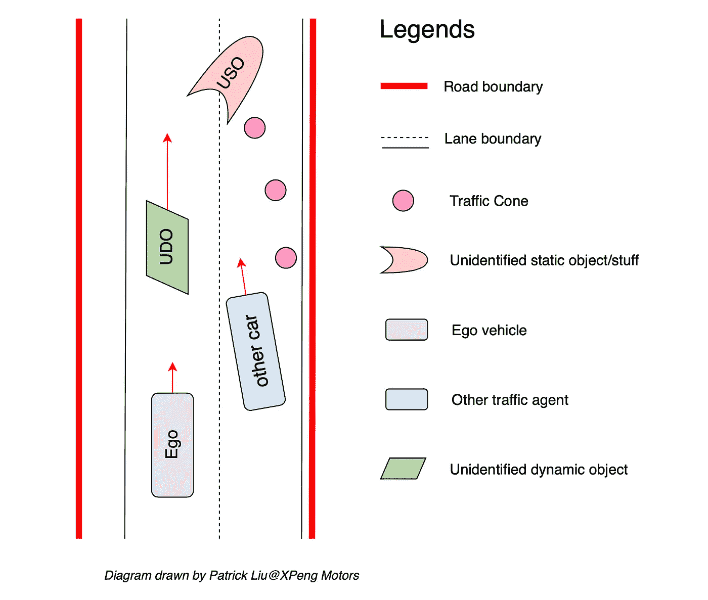
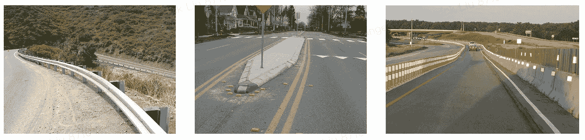
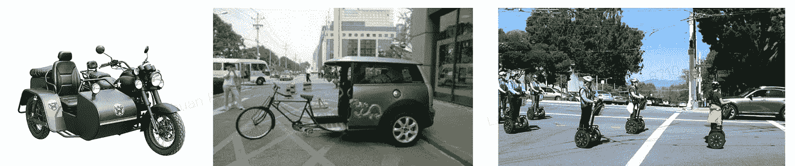
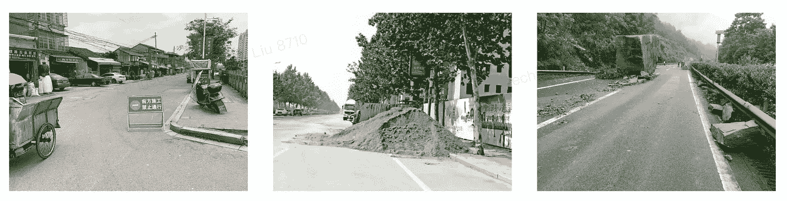
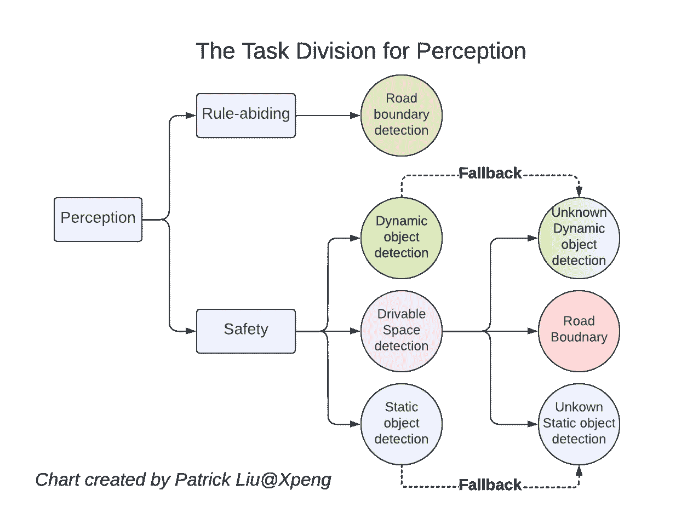
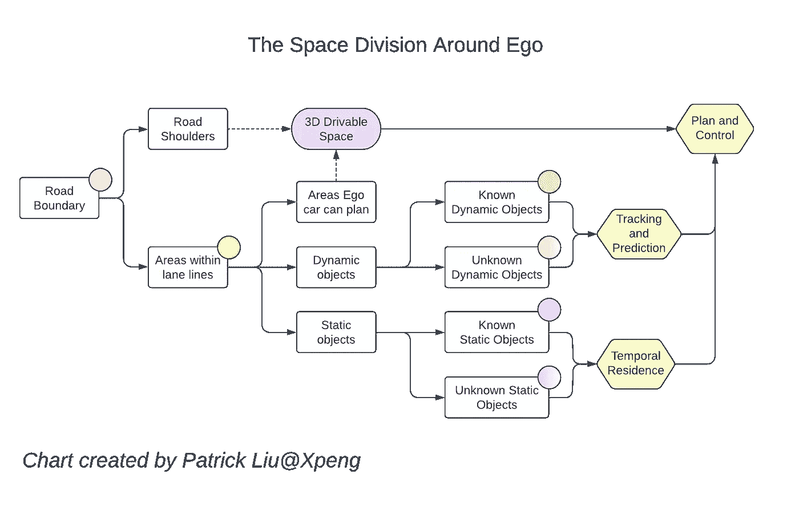

# 自动驾驶中的可驾驶空间:概念

> 原文：<https://towardsdatascience.com/drivable-space-in-autonomous-driving-the-concept-df699bb8682f>

## 可驾驶空间的内容和原因

你不会通过的(来源:[罗伯特·林德在 Unsplash](https://unsplash.com/photos/fUeGkp2kTgs)

**可驾驶空间**，也就是通常所说的**自由空间，**对于保证自动驾驶的安全性起着至关重要的作用。与自动驾驶中其他更知名的感知任务(如车辆检测和车道线检测)相比，可驾驶空间受到的关注要少得多。今天，让我们更仔细地看看这个安全至关重要的感知任务。

这是一个关于自动驾驶中可驾驶空间的三部分博客系列。今天我们将谈论可驾驶空间的概念和典型案例。然后在接下来的两篇博文中，我们将回顾学术界可驾驶空间的各种方法以及当前在工业中的应用。

# 背景

可驾驶空间，顾名思义就是确定自动驾驶车辆(ego vehicle)周围可行驶的区域。但是，对于具体的定义和覆盖范围，学术界和业界并没有统一的标准。让我们来看看一个相对常见的驾驶场景，尝试给出一个更清晰的可驾驶空间定义。

一般驾驶场景示意图(作者绘制的示意图)

# 覆盖范围

如上图所示，红色粗线代表**物理道路边界**(如路缘)，黑色细线代表路面上的标线(车道线)。虽然大多数车辆在道路标线的实线内行驶，但在紧急情况下，它们也可以在实线和道路边界之间的路肩上行驶和停车。安全驾驶的底线是必须避开物理道路边界。

第一类:物理道路边界的样本图像(来源:[知乎](https://www.zhihu.com/question/279120080)

在道路上，路面上会有动态物体(车辆、行人等主动交通参与者)和静态物体。动态对象可以分为已知类型和未知类型。使用动态对象检测网络可以检测已知类型的动态对象，例如普通车辆、行人、自行车和摩托车。但是路上经常会出现一些未知类型的动态物体，比如不太常见的三轮摩托车，改装过的重型车，赛格威滑板车上的行人。为了安全驾驶，我们还不得不**避开这些未知的动态物体(UMO)。**

> 更严格地说，这些类型应该是“不太为人所知”，但为了简单起见，我们称它们为“未知”。已知或未知的定义是相对的，取决于给定感知系统的进化。

第二类:未知动态对象的样本(来源:[知乎](https://www.zhihu.com/question/279120080)

同样，静态对象也有已知和未知的类型。已知类型的静态对象是可数的([全景分割](https://competitions.codalab.org/competitions/19507)术语中的“事物”)，具有明显的语义特征，比如交通锥。对于这些对象，可以使用对象检测网络(如 YOLO、CenterNet 等)进行实例检测。此外，还会有未知类型的静态物体，从地面上的街道标志到人工或自然的道路障碍物。这些静态障碍是不可计数的(在[全景分割](https://competitions.codalab.org/competitions/19507)术语中是“东西”)或者没有明确的类别。翻车的车辆也可以算作未知类型的静态障碍物。为了安全驾驶，我们还必须避开这些未知的静态物体(USO)。

第三类:未知静态对象的样本(来源:[知乎](https://www.zhihu.com/question/279120080)

总之，我们需要在没有明确语义类别的情况下识别物理道路边界和未知障碍，以确保驾驶安全。这些元素的检测包含在**可驾驶空间感知任务**中。可驾驶空间是作为辅助任务建立的，以支持已知类型的动态和静态对象的识别，这是一个“后退”任务。

> 不可否认，在众多合理的选择中，这只是一个关于可行驶空间范围的合理建议。另一种常见的做法是将物理道路边界的检测分离到单独的感知任务中。

# 双重回退系统

可驾驶空间作为一项感知任务，用于语义类别不明确的障碍物的后退检测。借助分类法中的这种概念后退，感知任务可以以互斥的集体穷尽(或 MECE)方式覆盖自动驾驶所需的所有类型的环境元素。

知觉的任务划分(图表由作者创建)

还有一层退路，比较实用。虽然动态对象检测任务被设计为检测具有清晰语义的已知对象，但是由于不完善的神经网络模型性能，经常会有漏检。在这种时候，我们需要使用可驾驶的空间来弥补错过的检测。

总而言之，两层回退是:

*   未知对象，或者不能被动态和静态对象的已知类别语义覆盖的对象，将被**可驱动空间**语义覆盖。
*   能够被已知类别的动态和静态对象语义覆盖，但实际上被相应的检测任务遗漏的对象，将被**可驱动空间**覆盖。

自我车辆周围的空间划分(图表由作者创建)

# 后处理

学术界通常不讨论的一个领域是与可驾驶空间相关的后处理。这一步涉及大量的工程实践，而且，不可否认的是，与神经网络任务本身相比，这一步并不那么有趣。然而，我们将看到为什么这一步是必要的，以及它通常是如何做的。

为了充当语义分类的后备，可驱动的空间任务必须在较低级的语义不可知方案中操作。只有这样，可驾驶的空间任务才能检测到车辆是一种类型的障碍，无论其类别是什么。这意味着这个任务的直接输出不加区别地对待所有障碍。这进一步意味着在可驾驶空间的输出和动态和静态物体检测的输出之间将不可避免地存在一些重叠。

这种检测结果的复制需要一个后处理步骤来将可驱动空间的输出与动态和静态物体检测的输出相融合。对于已经被动态和静态对象检测覆盖的对象，可驾驶空间输出将被抑制，并且不会被传递给感知的下游消费者。

可驾驶空间是自动驾驶不可或缺的安全网，其最大的效用是充当算法后备。在未来的博文中，我们将介绍学术界可驾驶空间的主流研究方向，然后介绍在行业中的应用。我们还将简要讨论如何将自动驾驶中的可驾驶空间扩展到通用机器人领域。

# 外卖食品

*   可驾驶空间范围的一个合理建议包括物理道路边界、未知动态物体和未知静态物体。
*   可驾驶空间是一个双重回退系统，覆盖语义间隙，还捕捉来自其他对象检测任务的遗漏检测。
*   可驾驶空间不能替代动态物体感知或静态物体检测。它是对这些感知任务的补充。

# 参考

*   [全景分割](https://arxiv.org/abs/1801.00868)，CVPR 2019