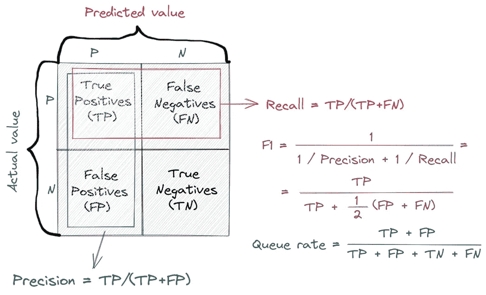
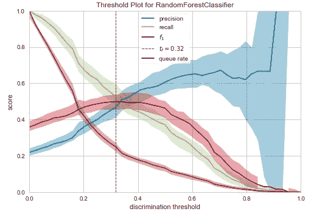
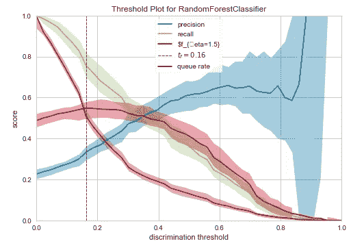
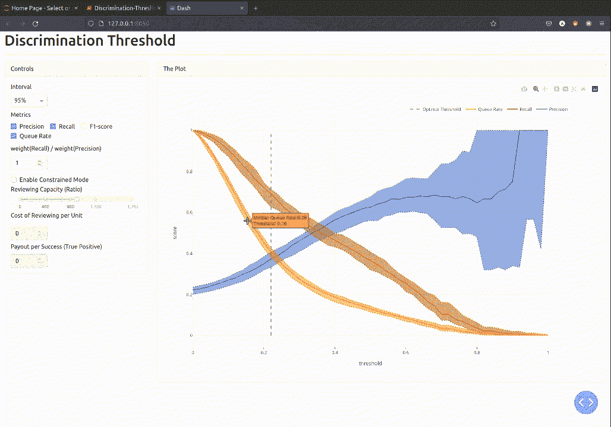
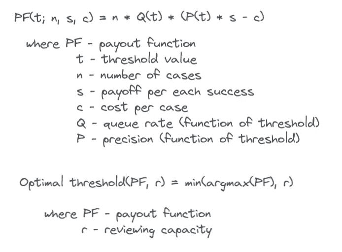

# DT 图:寻找二元分类器的最佳区分阈值

> 原文：<https://towardsdatascience.com/dt-plot-finding-the-optimal-discrimination-threshold-for-binary-classifier-c3f326d6326f>

## 学习如何使用一个鲜为人知但非常重要的诊断图

Alex Padurariu 在 [Unsplash](https://unsplash.com?utm_source=medium&utm_medium=referral) 上拍摄的照片

典型的机器学习任务的实质部分与训练算法相关，该算法将输入数据分配给两个预定义标签中的一个。这种算法通常被称为**二元分类器**。有多种方法可以直观显示这种分类器的性能，可以说最常用的工具是**接收器操作特性(ROC)** 和**精确召回(PR)** 曲线。

来自这两个图的洞察力几乎是相同的，但是有时一个比另一个更受青睐。根据经验，当具有真正阳性标记的观察值很少时，那么 PR 曲线是优选的。另一方面，ROC 曲线似乎在商业演示中更受欢迎，这可能是由于仅用一个度量来表达模型性能的直观吸引力:曲线下面积( **AUC** )。在任何情况下，这两个图，无论在选择最佳性能模型时多么有用，都不能决定性地回答随后的问题:*我们应该将否定预测与肯定预测的分界点放在哪里*？这种分界点的默认值是 0.5，这通常不是最佳值，尤其是在处理不平衡的数据集时。我们将在这里描述的可视化工具，称为**辨别阈值** **(DT)图**，有助于找到该截止点的最佳值。

在本帖中，我们将:

*   了解如何使用 DT 图找到二元分类器的最佳区分阈值(只是上述临界值的另一个名称)
*   展示一个简单的交互式 DT 绘图版本，您可以下载并将其用作项目的模板。

这里我们将只检查关键的代码片段，但是你可以在 Github 上找到整个项目。

## **数据集和模型**

在跳到情节和它的解释之前，让我们首先在 UCI 的信用卡客户数据集的[违约上训练一个分类模型。由于相同的数据集也位于](http://archive.ics.uci.edu/ml/datasets/default+of+credit+card+clients) [OpenML 的存储库](https://www.openml.org/search?type=data&status=active&id=42477)中，我们可以通过 scikit-learn 的 OpenML 接口轻松加载这些数据。

构建性能最佳的预测模型不是这篇文章的目标，所以我们将保持简单，坚持使用基本的随机森林分类器，对分类预测器进行顺序编码。

然而，我们必须记住，DT 图的静态和动态版本都是这样设计的，它们以模型本身而不是预测作为参数。此外，该模型将在数据集的不同子样本上进行多次训练和测试。这意味着我们必须以这样一种方式转换数据，即在每次拆分之后，训练集中的每个分类列都已经知道它可以在看不见的测试集中取的所有值。实现这一点的一种方法是应用分层随机分裂，但我们的数据集包含几个分类列，对所有这些列进行分层会很复杂(也可能不那么随机)。另一个策略是显式地将名义列转换成具有预定义无序值的 [pandas 的 categorical type](https://pandas.pydata.org/pandas-docs/stable/reference/api/pandas.CategoricalDtype.html)，这样，每当某个列的某个值在训练集中不存在时，在测试集中接收这样的值不会导致错误地分配标签或任何其他逻辑错误。下面的函数 *transform_data()* 就是这样做的。然而，要用第二种方法对数据进行编码，在继续建模之前，我们必须知道每个分类列可能取的所有值。

## **主要术语和定义**

在深入研究之前，有必要用我们将使用的主要术语的非正式定义来刷新我们的记忆。

*   **精度:**具有预测阳性标签的真阳性观察值的比例。在我们的例子中，它是那些预测会违约的客户中实际违约的客户的比例。
*   **回忆:**也称敏感度，这是预测阳性病例在所有阳性病例中所占的比例。因此，在我们的数据环境中，召回率是预测违约的客户占实际违约客户的比例。
*   **F1 得分:**这是精确度和召回率的调和平均值，当我们有一个不平衡的数据集时，这变得特别方便。我向你推荐[这篇简洁而写得很好的文章](/an-intuitive-guide-to-the-f1-score-55fe8233c79e)，让你了解更多 F1 分数背后的属性和直觉。下面的公式表明 F1 分数是精确度和召回率的单调递增函数(也是假阳性和假阴性的单调递减函数)。在其标准形式中，F1 分数假设精确度和召回率具有相同的权重(即从业务角度来看同等重要)，但正如下一节所讨论的，它可以扩展为权重不同的形式。
*   **排队率:**这是样本中预测阳性标签的比例，即得分大于区分阈值的观察值的份额。

主要定义(图片由作者提供)

## 现有实施

在写这篇文章的时候，用 Python 绘制 DT 图最常见的方法似乎是一个名为 [Yellowbrick](https://www.scikit-yb.org/en/latest/api/classifier/threshold.html) 的包中的函数，它包含了一组非常有用(并且通常不常见和被低估)的可视化工具。如果您不熟悉这个包，我强烈建议您阅读它的文档。

下面的代码片段显示了如何绘制该图。如上所述，预测是在函数内部生成的，因此作为一个参数，它采用模型或以模型结尾的管道。

那么，什么是 DT 剧情呢？它是一个图表，显示了每个阈值和四个性能指标之间的关系:精确度、召回率、F1 值和排队率。从下面的图中，我们可以观察到[提高精度会降低召回率，反之亦然](https://developers.google.com/machine-learning/crash-course/classification/precision-and-recall)(嗯，当阈值接近 1 时，精度有时会变得不稳定，但其总体趋势保持上升)。此外，我们可以看到对应于 F1 分数最大值的垂直虚线，即它是精确度的边际增加(F1 分数的导数 w.r.t .精确度)等于召回的边际减少(导数 w.r.t .召回)的点。

> DT 图中最大化 F1 分数的垂直虚线是最佳辨别阈值。

在图中，低于最佳阈值的是 0.32，这将分数在前 25 个百分点中的标签标记为正(即，排队率是 0.25)。该阈值的精度和召回值大约为 0.47 和 0.53。DT 图还描述了曲线的可变性，即它们的下限和上限，这是多次运行模型的结果。相应地，边界的默认值是第 10 和第 90 个百分点，但是这些值可以用函数的*分位数*参数来修改。

使用默认值的 yellobrick DT 图(图片由作者提供)

虽然在上面的设置中，我们认为精度和召回同等重要(即同等重要)，但我们可以想象一种方法优先于另一种方法的情况。一个典型的例子是脑肿瘤的分类，在某种程度上，尽管导致较低的精度，但具有大的召回率(即低假阴性)被认为优于任何其他配置。如果我们能够量化召回相对于精确度的重要性，我们可以相应地修改 F1 分数，这将导致不同的最佳阈值。举个例子，假设我们认为召回比精确重要 1.5 倍。我们要做的就是用参数 *fbeta* =1.5 调用函数 discrimination_threshold()

通过比较下面的 DT 图和原始图，我们立即注意到这里的最佳阈值更低了(现在是 0.16，而前面的图是 0.32)，这也提高了队列速率(大约。现在是 50%,而不是之前图中的 25%。

当 F1 分数加权时，Yellobrick 的 DT 图(图片由作者提供)

## **仪表盘版**

Yellowbrick 对 DT 情节的实现无疑是有用的，但也有几个小缺点，比如缺乏交互性和没有悬停注释。这就是为什么我们构建了一个带有输入部件的交互式仪表盘，它既可以在 Jupyter 环境中运行，也可以作为一个独立的应用程序运行。此外，仪表板可以在两种模式下获得最佳阈值:**基本模式**(即与 Yellowbricks 版本中最大 F1 分数对应的阈值)和**约束模式**，我们将在后面几段描述。

该应用程序是使用 Plotly Dash 构建的，因为我们希望它既可以在 Jupyter 笔记本上运行，也可以作为独立的应用程序运行。或者，我们可以使用 [Panel](https://panel.holoviz.org) ，但是 Plotly 的生态系统被认为更成熟，也更有据可查。 [Streamlit](https://streamlit.io) 是另一个吸引人的选择，但不幸的是，在写这篇文章的时候，它不支持 Jupyter 笔记本。你可以在这里找到主要仪表板框架[的详细对比。](https://medium.datadriveninvestor.com/streamlit-vs-dash-vs-voil%C3%A0-vs-panel-battle-of-the-python-dashboarding-giants-177c40b9ea57#1447)

下面的 gif 图示了仪表板的界面。如果您希望在本地计算机上运行它，可以从上面提到的 Github 库下载。

DT 绘图的仪表板界面(图片由作者提供)

虽然应用程序的默认基本模式很大程度上模仿了 Yellowbricks 实现的行为，但受约束模式的逻辑主要是受本文[的启发。您可以通过勾选仪表板中的相应复选框来启用约束模式。简而言之，约束模式下的最优阈值取决于三个估计:
1。*审查能力*，即我们有能力审查以确定其是否为真正阳性的预测阳性标签的比例(即我们有能力审核并确定符合贷款条件的贷款申请人的比例)；
2。*审查一个案例(即一个贷款申请人)的成本*；
3。*回报*我们从每一次成功中获得的回报(即从识别通过门槛但不应获得贷款的申请人中获得的收益)。](https://blog.insightdatascience.com/visualizing-machine-learning-thresholds-to-make-better-business-decisions-4ab07f823415)

在基本模式中，我们最大化 F1 分数，而在约束模式中，我们最大化*支付函数*(定义如下)，假定最大化该函数的阈值低于审查能力。从形式上看，这种关系是这样的:

第一个等式计算每个阈值 t 的支出函数。参数 *s* 和 *c* 通过输入小部件输入，而 *n* 是数据集的大小，因此这些可以被视为常数。在等式的右边，乘积 *P(t) * s* 表示每次成功的回报(即默认客户)，经过精度调整(即所有预测阳性中真实阳性的比例)，这使得术语 *(P(t) * s - c)* 成为每次成功的净回报。此外，由于我们没有将所有的情况都标记为正，我们还通过排队率 *Q(t)* 来调整净收益，并将乘积乘以观察次数 *n.*

第二个等式计算使支付函数*PF(t；n，s，c)* 鉴于其低于审查能力*r*；否则， *r* 成为最佳判别阈值。

调用交互剧情的脚本几乎和静态版一样短。

在附带的 Github 资源库中， [*模块中定义了准备数据和调用绘图函数的专用方法的类，interactive _ discrimina tion _ threshold . py*](https://github.com/poghostick/discrimination-threshold/blob/main/interactive_discrimination_threshold.py)*。*仪表盘的代码在 [*app.py*](https://github.com/poghostick/discrimination-threshold/blob/main/app.py) *中。我试图用每个类属性和方法的详细描述来填充模块内部的文档字符串，所以在这里重复相同的文本会使这篇文章过长。简单地说，类*InteractiveDiscriminationThreshold*包含方法 *prepare_data()、_append_metrics()、_get_metrics()* 和 *plot()、*其中:*

*   *prepare_data()* 迭代地抽取子样本(带替换)，在其上训练模型，获得测试集预测，然后为每次迭代调用方法*_ append _ metrics()*；
*   *_append_metrics()* 创建一个数组，包含所有可能的阈值以及每个阈值的真实标签和预测分数，调用方法*_ get _ metrics()；*
*   *_get_metrics()* 给定阈值、真实标签和预测分数，计算并返回精度、召回率、F1 分数和排队率；
*   *plot()* 在我们用输入值准备好表格后，从 app.py 调用函数 *build_plot()* 。

函数 *build_plot()* 大约有 350 行长，理解它需要一些使用 Plotly Dash 框架的经验。幸运的是，Plotly 是一个文档丰富的库，有一个非常活跃的社区。也就是说，掌握 Plotly 生态系统需要一定的耐心、承诺和修改代码。

## 结论

总而言之，这篇文章有三个要点:

*   在二元分类中，为模型性能选择最佳鉴别阈值与选择和微调最佳候选模型一样重要；
*   如果你正在寻找一个快速和肮脏的方法来计算和绘制最佳的辨别阈值，那么 Yellowbrick 的专用功能是你的首选工具；
*   作为一个更好看、功能更丰富、交互性更强的选择，您可以使用来自[这个库](https://github.com/poghostick/discrimination-threshold)的仪表盘，并根据您的需求进行定制。

感谢您的阅读！