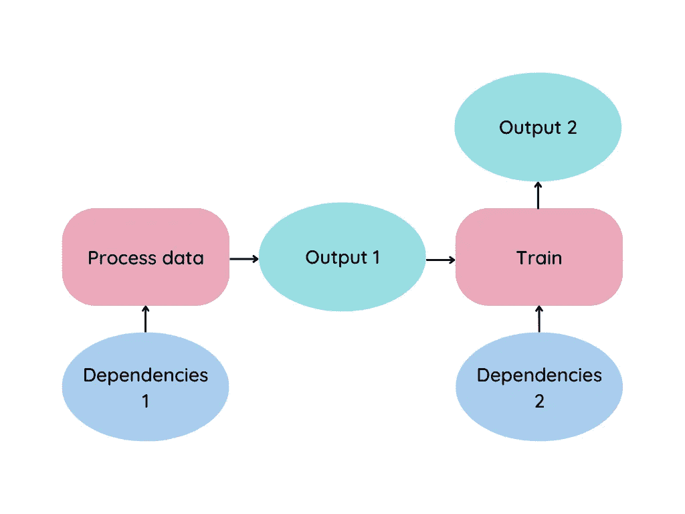
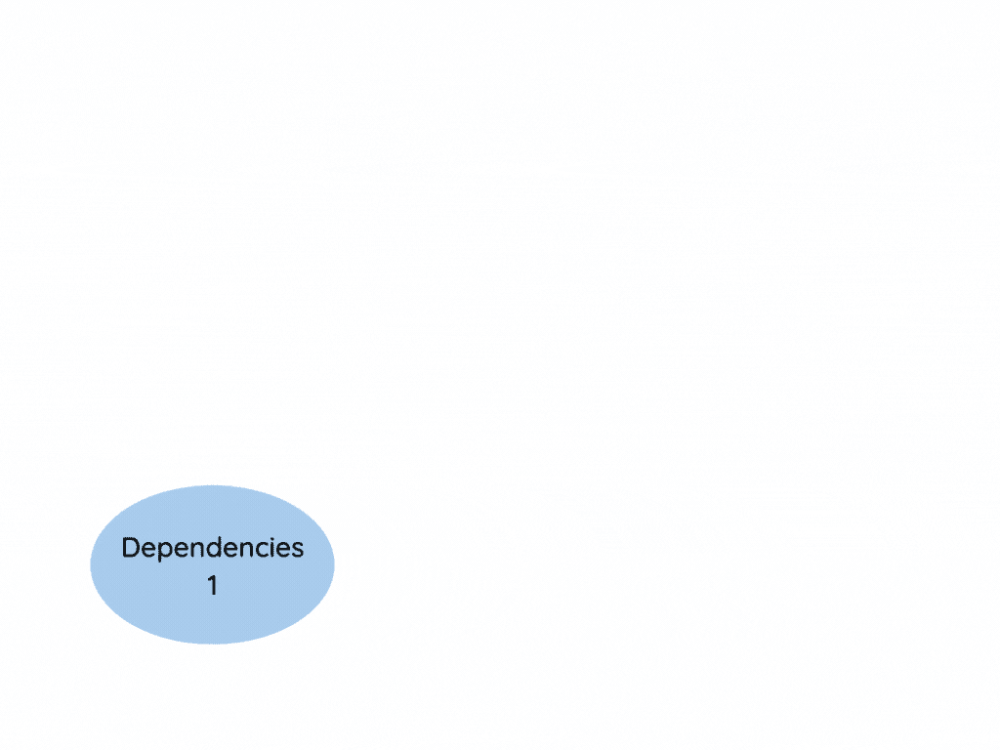
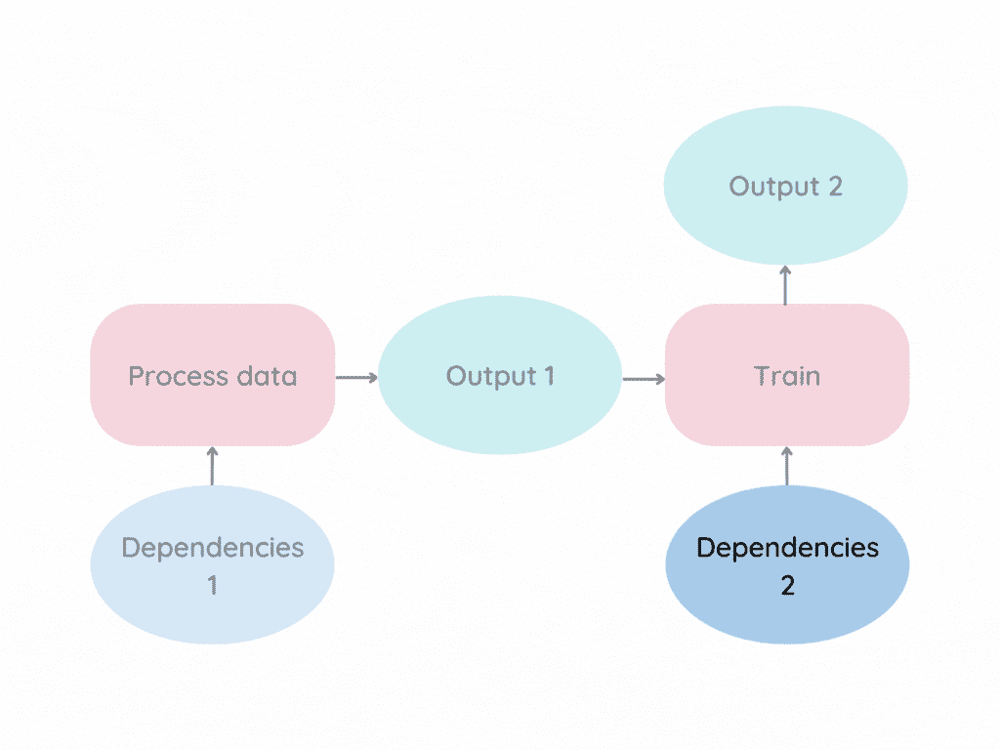
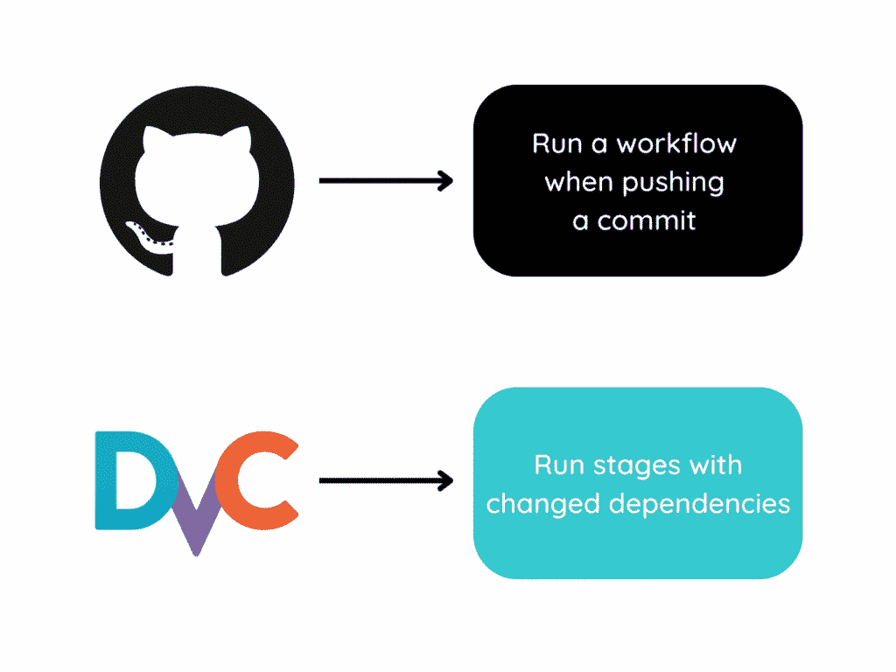
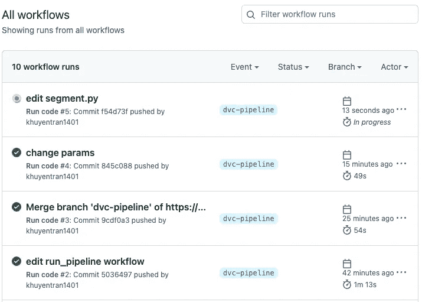
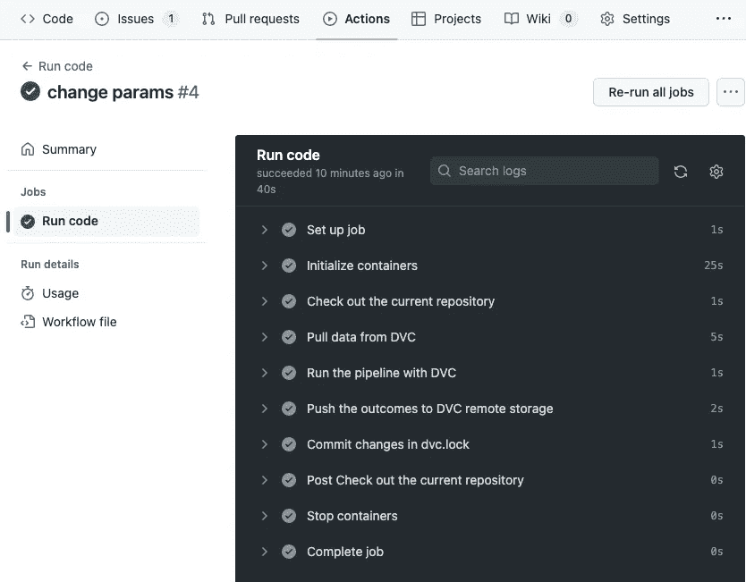

# DVC + GitHub 动作:自动重新运行修改过的管道组件

> 原文：<https://towardsdatascience.com/dvc-github-actions-automatically-rerun-modified-components-of-a-pipeline-a3632519dc42>

## 快速迭代 DS 项目的完美组合

# 动机

假设您的数据管道看起来类似于下图。



作者图片

粉色方框代表一个阶段，这是一个单独的数据过程。依赖项是阶段所依赖的文件，如参数、Python 脚本或输入数据。

现在想象一下`Dependencies 2`的变化。标准的方法是重新运行整个管道。



作者图片

这种方法可行，但效率低下。只运行**依赖关系改变了**的阶段不是更好吗？



作者图片

这时，DVC 和 GitHub 操作的结合就派上了用场。在本文中，您将学习如何:

*   推送提交时，使用 GitHub 操作运行工作流
*   使用 DVC 运行具有修改相关性的阶段

最终，结合这两个工具将帮助**减少**摩擦**和**时间**来试验不同的参数、代码或数据。**



作者图片

本文中使用的代码可以在这里找到:

<https://github.com/khuyentran1401/prefect-dvc/tree/dvc-pipeline>  

# 使用 DVC 管道运行修改后的数据流程

[DVC](https://dvc.org/doc/start) 是数据版本控制系统。它本质上类似于 Git，但用于数据。

</introduction-to-dvc-data-version-control-tool-for-machine-learning-projects-7cb49c229fe0>  

[DVC 管道](https://dvc.org/doc/start/data-management/data-pipelines)允许你指定产生最终结果的单个数据过程(称为*阶段*)。

## 流水线阶段

让我们通过在文件`dvc.yaml`中创建两个阶段来创建一个 DVC 管道。总而言之，

*   `process_data`阶段处理原始数据
*   `train`阶段训练处理后的数据

```
stages:
  process_data: # process raw data
    cmd: python src/process_data.py
    params: 
        - config/process/process_1.yaml:
    deps:
    - data/raw
    - src/process_data.py
    outs:
    - data/intermediate

  train: # train processed data
    cmd: python src/segment.py
    params:
        - config/main.yaml:
    deps:
    - data/intermediate
    - src/segment.py
    outs:
    - data/final
    - model/cluster.pkl
    plots:
    - image
```

上述代码的详细信息:

*   `cmd`指定运行舞台的命令
*   `deps`指定阶段所依赖的文件
*   指定了一种特殊的依赖:参数
*   `outs`指定阶段输出的目录
*   `plots`指定一种特殊的输出:plot

## 繁殖

要在`dvc.yaml`中运行管道，键入:

```
dvc repro
```

输出:

```
Running stage 'process_data'                                                                        
Updating lock file 'dvc.lock'                                                                         

Running stage 'train':
Updating lock file 'dvc.lock' 
```

第一次运行这个命令时，DVC:

*   运行管道中的每个阶段
*   缓存运行结果
*   创建`dvc.lock`文件。该文件描述了要使用的数据和生成管道结果的命令。


作者图片

现在让我们说我们改变了依赖于`train`阶段的`src/segment.py`文件。当您再次运行`dvc repro`时，您将看到以下内容:

```
Stage 'process_data' didn't change, skipping                                                                                                                               

Running stage 'train':
Updating lock file 'dvc.lock' 
```

从输出中，我们可以看到 DVC **只运行`train`阶段**，因为它:

*   检测`train`阶段的变化
*   不检测`process_data`阶段的变化。


作者图片

这可以防止我们在不必要的重播上浪费时间。

要使用 Git 跟踪管道中的变化，运行:

```
git add dvc.lock
```

要将更新发送到远程存储，请键入:

```
dvc push
```

# 用 GitHub 动作推送提交时运行管道

[GitHub Actions](https://github.com/features/actions) 允许你自动化你的工作流程，从而更快地构建、测试和部署你的代码。

<https://pub.towardsai.net/github-actions-in-mlops-automatically-check-and-deploy-your-ml-model-9a281d7f3c84>  

在向 GitHub 提交更改时，我们将使用 GitHub 操作来运行 DVC 管道。

首先在`.github/workflows`目录下创建一个名为`run_pipline.yaml`的文件:

```
.github
└── workflows
    └── run_pipeline.yaml
```

这是`run_pipeline.yaml`文件的样子:

```
name: Run code
on:
  push: 
    branches:
     - dvc-pipeline
    paths:
      - config/**
      - src/**
      - data/*
jobs:
  run_code:
    name: Run code
    runs-on: ubuntu-latest
    container: khuyentran1401/customer_segmentation:dvc
    steps:
      - name: Check out the current repository
        id: checkout
        uses: actions/checkout@v2

      - name: Pull data from DVC
        run: |
          dvc remote modify origin --local auth basic
          dvc remote modify origin --local user ${{ secrets.DAGSHUB_USERNAME }}
          dvc remote modify origin --local password ${{ secrets.DAGSHUB_TOKEN }}
          dvc pull

      - name: Run the pipeline with DVC
        run: dvc repro

      - name: Push the outcomes to DVC remote storage 
        run: dvc push

      - name: Commit changes in dvc.lock
        uses: stefanzweifel/git-auto-commit-action@v4
        with:
          commit_message: Commit changes in dvc.lock
          branch: dvc-pipeline
          file_pattern: dvc.lock
```

让我们通过分解来理解上面的文件。

文件的第一部分指定了导致[工作流](https://docs.github.com/en/actions/using-workflows/about-workflows)运行的[事件](https://docs.github.com/en/actions/using-workflows/events-that-trigger-workflows)。这里，我们告诉 GitHub Actions 在以下情况下会触发`Run code`工作流:

*   提交被推送到`dvc-pipeline`分支
*   推送包括对`configs`、`src`和`data`目录中文件的更改

```
name: Run code
on:
  push: 
    branches:
     - dvc-pipeline
    paths:
      - config/**
      - src/**
      - data/*
```

工作流运行由一个或多个作业组成。作业包括一组按顺序执行的步骤。文件的第二部分列出了`run_code`任务中的步骤。

```
jobs:
  run_code:
    name: Run code
    runs-on: ubuntu-latest
    container: khuyentran1401/customer_segmentation:dvc
    steps:
      - name: Check out the current repository
        id: checkout
        uses: actions/checkout@v2

      - name: Pull data from DVC
        run: |
          dvc remote modify origin --local auth basic
          dvc remote modify origin --local user ${{ secrets.DAGSHUB_USERNAME }}
          dvc remote modify origin --local password ${{ secrets.DAGSHUB_TOKEN }}
          dvc pull

      - name: Run the pipeline with DVC
        run: dvc repro

      - name: Push the outcomes to DVC remote storage 
        run: dvc push

      - name: Commit changes in dvc.lock
        uses: stefanzweifel/git-auto-commit-action@v4
        with:
          commit_message: Commit changes in dvc.lock
          branch: dvc-pipeline
          file_pattern: dvc.lock
```

写完工作流后，把文件推送到 GitHub。

让我们通过更改文件`src/segment.py`并将其推送到 GitHub 来尝试工作流。

```
git add .
git commit -m 'edit segment.py'
git push origin dvc-pipeline
```

当您单击存储库中的 [Actions 选项卡](https://github.com/khuyentran1401/prefect-dvc/actions)时，您应该看到一个名为`edit segment.py`的新工作流运行。



作者图片

点击[运行](https://github.com/khuyentran1401/prefect-dvc/actions/runs/3364202792/jobs/5578279064)以查看关于哪个步骤正在运行的更多细节。



作者图片

恭喜你！我们刚刚成功地使用 GitHub Actions 和 DVC 来:

*   当更改被推送到 GitHub 时运行工作流
*   仅重新运行具有已修改相关性的阶段

# 下一步是什么

如果您是一名数据从业者，正在寻找一种更快的方法来迭代您的数据科学项目，我鼓励您尝试一下。通过一些初始设置，从长远来看，您将为您的团队节省大量时间。

我喜欢写一些基本的数据科学概念，并尝试不同的数据科学工具。你可以在 [LinkedIn](https://www.linkedin.com/in/khuyen-tran-1401/) 和 [Twitter](https://twitter.com/KhuyenTran16) 上联系我。

如果你想检查我写的文章的代码，请点击这里。在 Medium 上关注我，了解我的最新数据科学文章，例如:

</create-a-maintainable-data-pipeline-with-prefect-and-dvc-1d691ea5bcea>  </4-pre-commit-plugins-to-automate-code-reviewing-and-formatting-in-python-c80c6d2e9f5>  </pytest-for-data-scientists-2990319e55e6>  </great-expectations-always-know-what-to-expect-from-your-data-51214866c24> 