# Power BI 中带场参数的动态轴

> 原文：<https://towardsdatascience.com/dynamic-axes-with-field-parameters-in-power-bi-fc3403d7dcf2>

## 没有其他方法可以在度量之间切换


图片来自[黛安·皮凯蒂诺](https://unsplash.com/@diane_soko)

直到最近，还很少有方法可以让用户更改度量或权力的轴心 BI 可视化。

我们要么受困于复制图表和创建大量书签，要么不得不采取变通办法，用汇总表格预先计算度量值，在模型中创建冗余或笨拙的新维度。它们都不容易维护或修改。

不再是了！在 5 月份的更新中，PBI 获得了一个名为字段参数的新功能。

本文将探讨如何使用它们，什么时候它能拯救世界，什么时候它能让我们期待更多。

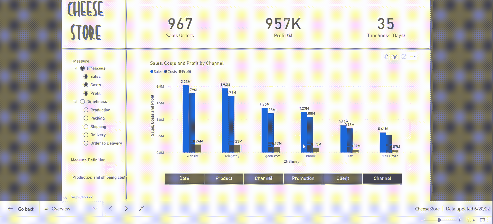

X 轴和 Y 轴的场参数可视化—图片由作者提供

## 要求

在我们开始之前，您可能需要更新您的 Power BI 桌面并启用现场参数。

要启用此功能，您需要进入:
文件—选项和设置—预览功能—字段参数

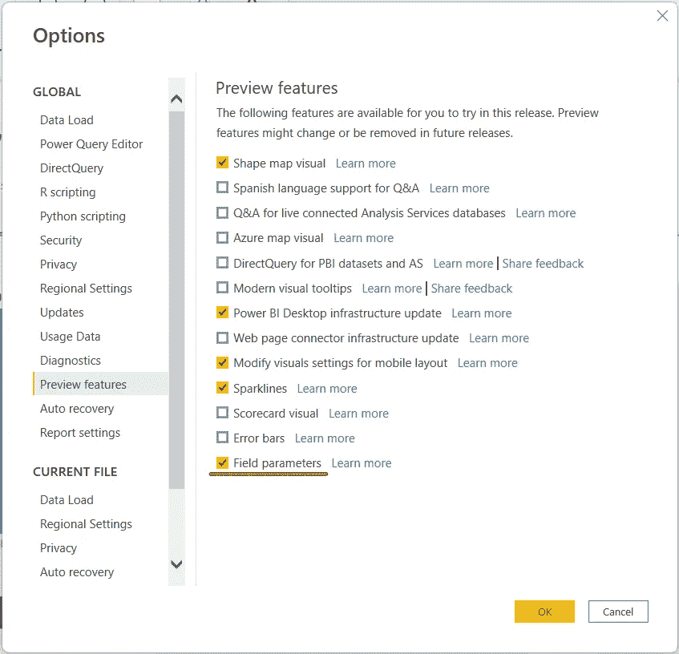

选项菜单—作者图片

## 添加字段参数

选中复选框并重新启动应用程序后，我们应该会在 Home-Modeling-New parameter 上看到新的字段选项。

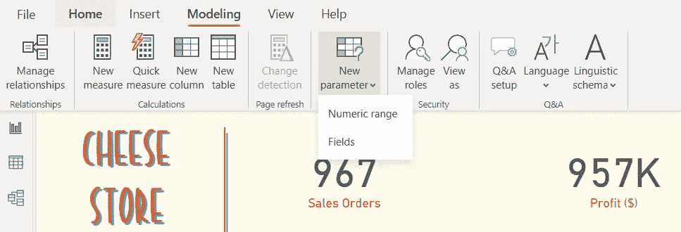

“新参数”下拉菜单-作者图片

单击它后，会出现一个窗口提示我们选择想要使用的度量或字段。

该操作将在我们的模型中创建一个新的计算表，该表将保存参数的显示名称、对字段/度量值的引用以及带有显示顺序的整数。

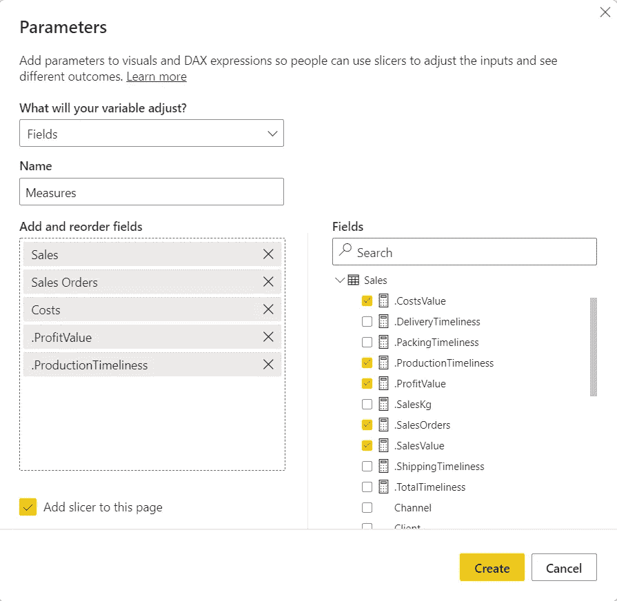

添加参数窗口-作者提供的图像

除了选择度量之外，我们还可以为新表设置一个名称，重命名我们的参数，并选择是否要为它们自动创建一个切片器。


带参数的切片器—图片由作者提供

酷，我们有一个带有参数的计算表，现在我们需要将它们添加到一个可视化中，这与任何其他度量或字段的工作方式相同。

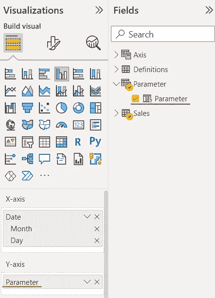

y 轴上有字段参数的视觉图像—作者提供的图像

厉害！现在，我们的用户可以动态地选择他们想要看到的度量。

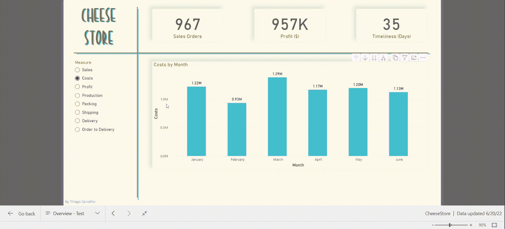

切换图表 y 轴的字段参数—图片由作者提供

使用相同的步骤，我们还可以创建一个参数来更改 X 轴:

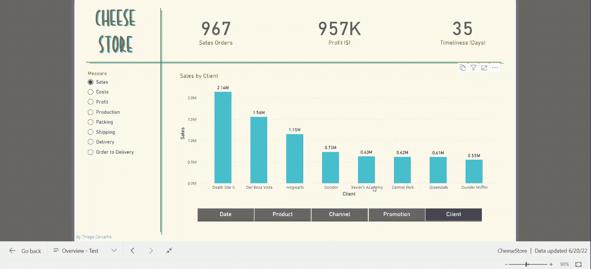

切换图表 x 轴和 y 轴的字段参数—图片由作者提供

出于某种原因，默认情况下，条形图使用 y 轴的值进行排序。我找不到禁止这种行为的方法；即使您更正了排序，当我们更改选择时，它也会回到默认状态。

这有点令人沮丧，因为我们的约会被打乱了。

我也错过了过滤器控制。当我们在 x 轴上的不同字段之间切换时，我们可能会发现没有完全填充的类别。在这个数据集中，“Promotion”有空值，我不想显示这些值。

如果我使用书签，我可以过滤掉促销画面中的空白，继续我的一天。有了参数，我需要向 DAX 公式添加一个条件，检查 Promotion 是否在范围内，如果是，则过滤掉空白。

## 编辑参数表

我们看到字段参数存储在一个计算表中，这意味着我们可以编辑它的 DAX 并添加新列。

要查看代码，我们可以单击参数字段。


该公式包含一个用括号括起来的列表；这个列表中的每一行都代表我们表中的一行。我们看到每条记录有三个值，一个字符串、一个函数和一个整数。

第一个值对应于我们的第一列 name，第二个值是检索我们的度量的函数，第三个值定义排序顺序。

```
Parameter = {("Sales", NAMEOF('Sales'[.SalesValue]), 0),
("Costs", NAMEOF('Sales'[.CostsValue]), 1),
("Profit", NAMEOF('Sales'[.ProfitValue]), 2),
("Production", NAMEOF('Sales'[.ProductionTimeliness]), 3),
("Packing", NAMEOF('Sales'[.PackingTimeliness]), 4),
("Shipping", NAMEOF('Sales'[.ShippingTimeliness]), 5),
("Delivery", NAMEOF('Sales'[.DeliveryTimeliness]), 6),
("Order to Delivery", NAMEOF('Sales'[.TotalTimeliness]), 7)}
```

如果需要更改任何名称、显示顺序、添加新参数或列，我们可以编辑这段代码。

例如，我们可以添加一个字符串来定义参数组。

```
Parameter = {("Sales", NAMEOF('Sales'[.SalesValue]), 0**, "Financials"**),
("Costs", NAMEOF('Sales'[.CostsValue]), 1**, "Financials"**),
("Profit", NAMEOF('Sales'[.ProfitValue]), 2**, "Financials"**),("Production", NAMEOF('Sales'[.ProductionTimeliness]), 3**, "Timeliness"**),
("Packing", NAMEOF('Sales'[.PackingTimeliness]), 4**, "Timeliness"**),("Shipping", NAMEOF('Sales'[.ShippingTimeliness]), 5**, "Timeliness"**),("Delivery", NAMEOF('Sales'[.DeliveryTimeliness]), 6**, "Timeliness"**),("Order to Delivery", NAMEOF('Sales'[.TotalTimeliness]), 7**, "Timeliness"**)}
```

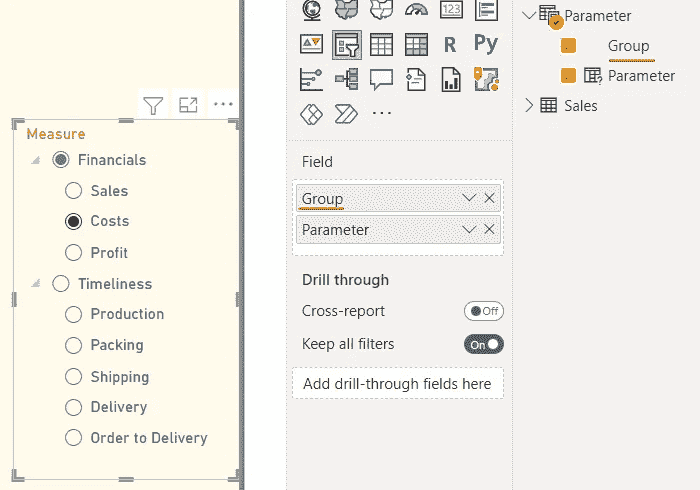

具有层次级别的字段参数—作者提供的图像

总的来说，这张桌子和其他桌子一样好用。我们不仅可以编辑它的内容，还可以创建与其他表的关系。

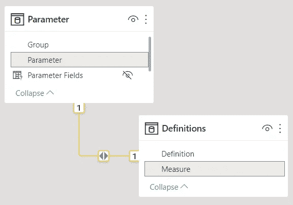

与参数表的关系—图片由作者提供。

除此之外，我们可以使用这些关系连接到一个带有定义的表，并动态地描述所选的度量。

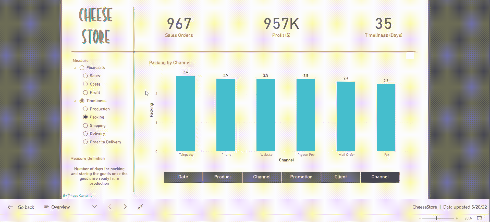

带有动态测量描述的报告-图片由作者提供

## 最后的想法

总的来说，字段参数为 Power BI 增加了很多功能；与以前的解决方案相比，重用可视化来显示不同的度量和字段使得开发速度更快，并且报表更易于维护。

综上所述，我认为还有改进的空间。在我看来，当我们需要更精确的可视化时，书签仍然是一个不错的选择。当我们需要一个特定的视觉配色方案，一个不同的排序，或者甚至当一些设计选择不能很好地与所有措施配合时，它们就非常有用。

Power BI 社区在提出变通办法或扩展工具的可用性时非常有创造力。我很兴奋地想看看场参数会带来什么样的可能性。

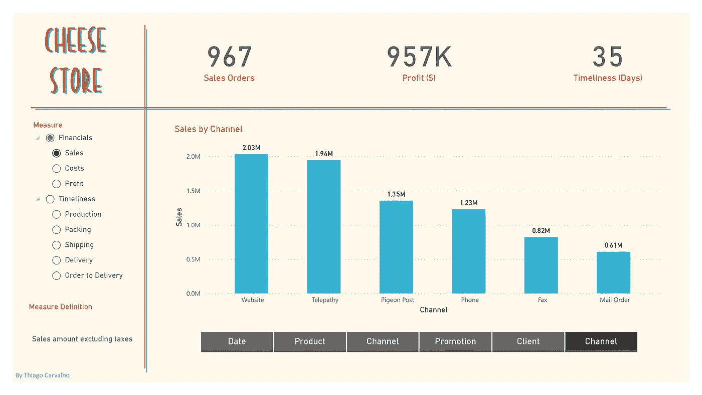

本例中使用的数据是用 [Mockaroo](https://www.mockaroo.com/) 生成的，可在[这里](https://gist.githubusercontent.com/Thiagobc23/0a6b03b0997640c67171c2e2058c8421/raw/213519e3f8e27e6685ed4de60f6830bc0030ee4b/dummy_data)获得。

感谢阅读我的文章！