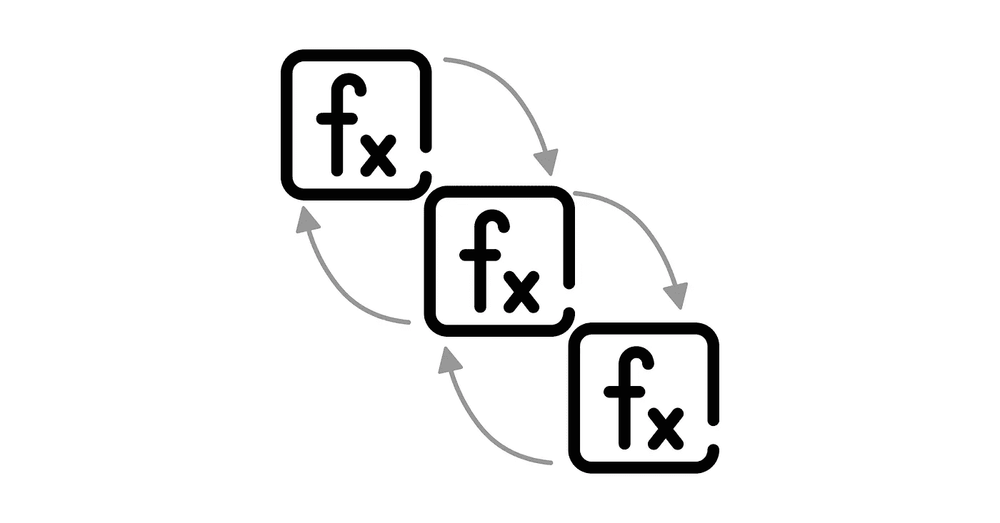
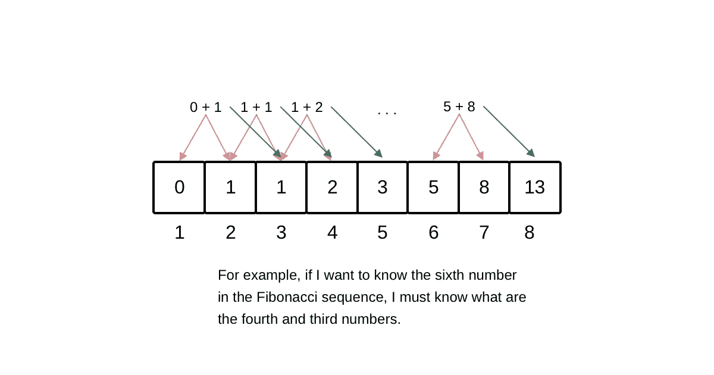
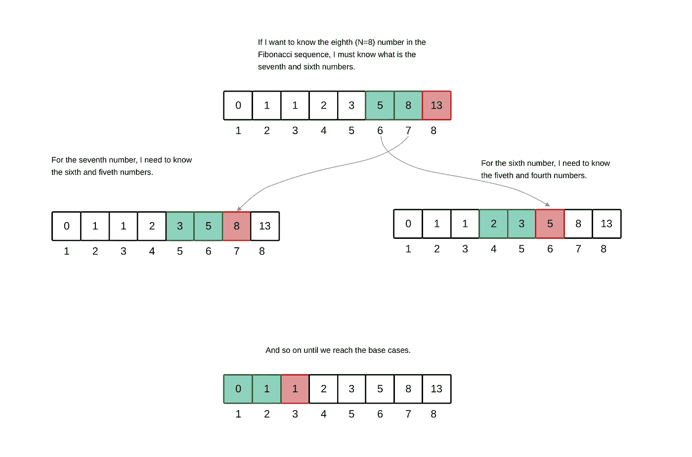

# 动态编程:框架

> 原文：<https://towardsdatascience.com/dynamic-programming-the-framework-7af71604cd78>

## 你在编码面试中需要知道的

图一。图标取自 Freepick

编码面试中最具挑战性的话题之一是动态编程。特别是在用动态规划将问题识别、处理和发展为优化任务的过程中。

在这篇博客中，我们将看到识别什么时候可以用动态编程解决问题的关键，以及如何一步一步地提出解决方案。你准备好了吗？让我们去吧！

# 如何识别一个问题可以用动态规划来解决？

动态规划范例指的是一个优化过程，其目的是有效地探索所有可能的解决方案，直到找到最佳结构。

通常，动态规划问题在其方法中需要计算"*某事*"的最大值或最小值，做"*某事*"的不同可能性，状态`k`中进程的结果值，等等。

比如斐波那契数列的`nth`数是多少？寻找斐波纳契数列的`nth`数变成了一个动态规划问题，因为本质上，第 n 个数是由数字`n-1`和`n-2`决定的，而这两个数字又分别由`n-2`和`n-3`以及`n-3`和`n-4`决定。换句话说，为了找到状态`k`的解，我们需要知道其解递归相关的前`k-1`状态的解。

在图 2 中，我们可以看到斐波纳契数列对循环关系的依赖性的图形表示。

图二。斐波那契数列|作者图片示例

值得一提的是，基于 ***动态编程*** 的解决方案的方法可能与基于 ***分治技术*** 的解决方案相混淆。区别在于，与动态编程解决方案相比，基于分而治之的解决方案不代表递归依赖关系。

简而言之，确定您的代码访问问题是否可以用动态编程解决的关键是:

*   确定问题是否可以**分解为子问题**(思考基本情况是什么在这一点上将是关键)。
*   识别每个子问题之间是否有任何**循环依赖关系**(例如，子问题的解决方案是否影响后续子问题的解决方案)。
*   **依靠关键词**:寻找*“某事”的最大值或最小值、*寻找在一定限制下做*“某事”*的`n`种可能性等。

一旦你确定手头的问题可以用动态规划来解决，你现在就需要一个策略来制定和开发解决方案。在下一部分，我们将看到提议和开发您的解决方案的三个基本组件。

让我们去吧！

# 框架

开发基于动态编程的解决方案的基本组件包括:

1.  对每种状态之间的递归关系进行建模的函数或数据结构。
2.  记忆和制表。
3.  基本案例

让我们详细看一下每个元素。

## 1.函数或数据结构

对所有状态的探索需要一种数据结构，这种数据结构允许跟踪每个状态的解决方案。通常，使用用于迭代扫描的数组(基于自下而上的方法)或用于递归扫描的函数(基于自上而下的方法)。

代码片段 1 展示了迭代关系函数和递归关系函数之间的比较。

代码片段 1。Fibonacci 序列中第 n 个元素的自底向上和自顶向下方法的比较。

## 1.a .基于自上而下和自下而上的方法

`top-down`方法意味着从后向前处理问题的递归函数。另一方面，`bottom-up`方法使用一个数据结构(通常是一个数组)迭代地进行状态依赖建模。

`top-down`方法从状态`n`开始，直到到达基本情况，而`bottom-up`方法从基本情况开始，直到到达情况`n`。

## 2.记忆和制表

记忆和列表是指使用数据结构来跟踪和追踪每个状态的解决方案。

记忆化通常与`top-down`方法一起使用，其中最常用的数据结构是散列表。制表通常与数据结构是数组的`bottom-up`方法一起使用。两种策略都允许跟踪每个状态的子问题的解决方案。

## 3.基础案例

基本情况决定了过程的开始(对于`bottom-up`方法)或结束(对于`top-down`方法)。

基本上，基本情况是不需要应用动态编程就可以定义的情况，换句话说，它是我们开始的情况或我们最终将达到的情况。

Fibonacci 数列的`top-down`和`bottom-up`方法的基本情况在代码片段 2 中指出。

代码片段 2。斐波纳契数列中第 n 个元素的自下而上和自上而下方法的基本情况。

既然我们已经知道了如何确定一个问题是否可以用动态编程来解决，以及构建一个解决方案的基本组件是什么，那么让我们继续看一个例子，在这个例子中我们将应用到目前为止所学的内容。

让我们去吧！

# 示例:查找第 n 个斐波那契数列

在我们开始解决方案之前，让我们一步一步来。首先，我们需要确定这个问题是否可以用动态编程来解决，所以让我们分析一下斐波那契数列是如何表现的。

图 3。斐波纳契数列计算的可视化描述。|作者图片

如图 3 所示，对于每个数字`i`，需要预先知道数字`i-1`和`i-2`的值，也就是说，问题可以分解为子问题，这些子问题在各自的解决方案中具有依赖关系。因此，我们可以说这个挑战可以作为一个动态规划问题来处理。

现在让我们应用上一节中看到的框架。第一部分指的是检测将保持每个状态的解的函数或数据结构，其中该函数可以处理`bottom-up`和`top-down`方法。

出于解释的目的，让我们解决这两种方法。对于`bottom-up`方法，我们需要一个迭代函数，对于`top-down`方法，我们需要一个递归函数。

在代码片段 X 中，展示了这两种方法的原型。

代码片段 3。斐波纳契数列第 n 项的自下而上和自上而下原型。

现在我们需要考虑**记忆**或**制表**。在这种情况下，出于解释的目的，我们将解决这两个问题。对于`bottom-up`方法，我们将使用**列表**，即包含每个状态的解决方案的数组，对于`top-down`方法，我们将使用**记忆化**，即包含每个状态的解决方案的散列表。

在代码片段 4 中，我们可以看到每种方法的列表和记忆的实现。

代码片段 4。展示列表和记忆。

最后，我们需要解决**基础案例**。`bottom-up`方法以基础案例为起点，直到到达状态`k`，`top-down`方法从案例`k`开始，直到找到基础案例为止。

代码片段 5 分别显示了`bottom-up`和`top-down`方法的基本情况。

代码片段 5。用自下而上和自上而下的方法完整实现斐波那契数列中的第 n 项。

仅此而已。寻找斐波纳契数列中的`nth`数的问题已经用基于动态编程范例的解决方案开发出来了。

# 结论

在这篇博客中，我们看到了如何确定一个问题是否可以用动态编程来解决，如果可以的话，提出和开发一个解决方案需要考虑哪些因素。最后，我们展示了一个示例，展示了如何构建一个基于动态编程的解决方案来解决寻找斐波那契数列的第 n 个数的问题。