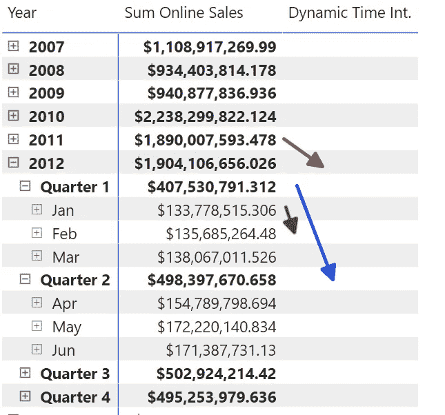
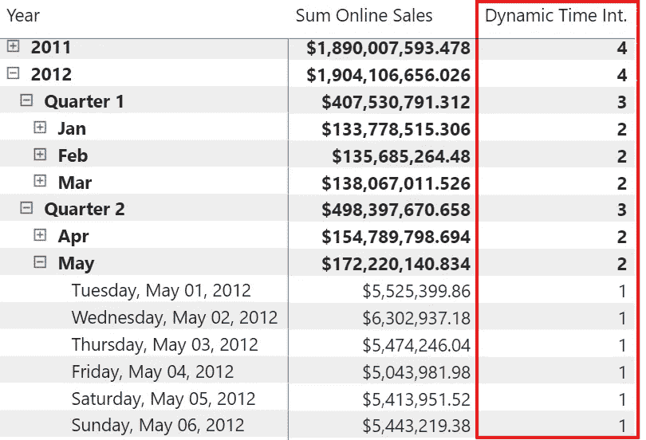
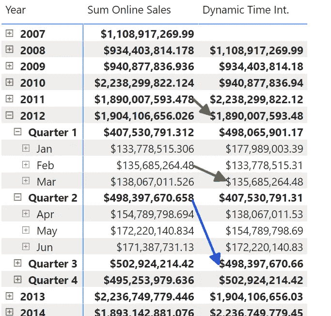
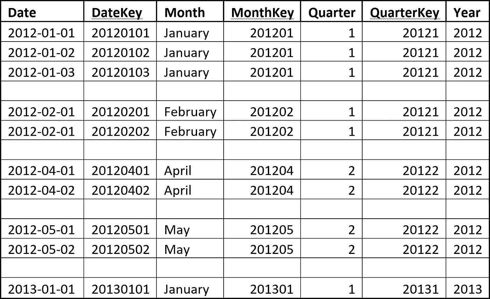
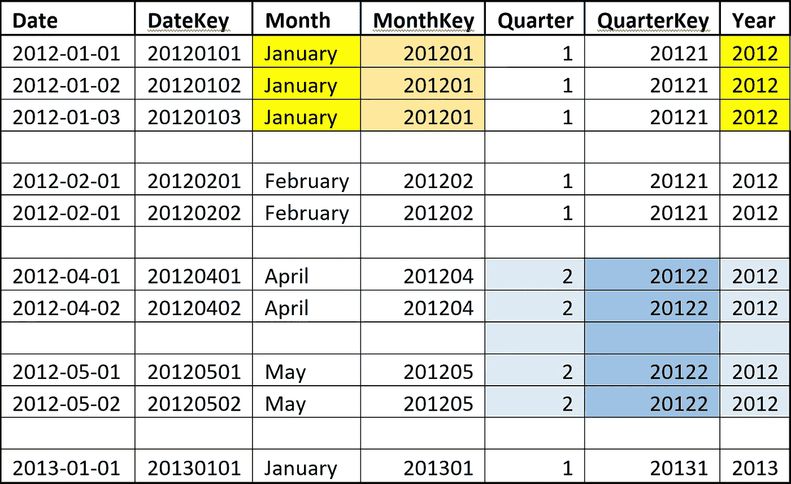
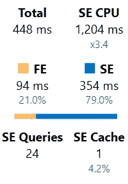

# DAX 中的动态时间智能变得简单

> 原文：<https://towardsdatascience.com/dynamic-time-intelligence-in-dax-made-easy-640b4e531ca8>

当你的客户要求你创建一个动态时间智能测量。根据所选期间，该度量应返回不同的值。让我们看看你如何做到这一点。


克劳迪奥·施瓦兹在 [Unsplash](https://unsplash.com?utm_source=medium&utm_medium=referral) 上的照片

# 介绍

几周前，一位客户向我们提出了以下问题:是否可以根据 Power BI 报告中所选的时间段显示之前时间段的值？

假设他在查看月份级别。然后，他希望看到前一个月的值。在季度级别，他希望看到前一季度，在年度级别，前一年。

见下图，看看我们的客户描述的要求:



图 1 —目标结果(作者提供的图)

在我们找到解决办法之前，有一些令人挠头的时刻。

我的同行考虑使用标准的 DAX 函数来获取以前的周期，如 PARALLELPERIOD()、SAMEPERIODLASTYEAR()、DATEADD()等。

但是它们都是基于特定的时间段(年、月、日等)获得值的。).因此，它们都无助于满足这一特定要求。

因此，我们必须创建自定义逻辑来满足这一需求。

# 获取所选期间

第一步是确定哪个是当前期间。

首先使用的方法是 FILTERED()、ISINSCOPE()和类似的函数。但是这些功能并没有提供所需的结果。

然后有人问我什么是正确的方法。我建议使用函数 HASONEVALUE()。

我们从获取实际日历级别(日、月、季度或年)并根据所选级别返回值的方法开始:

```
Dynamic Time Int. =
VAR SelectedPeriod = IF(HASONEVALUE(‘Date’[Date])
                     ,1
                     ,IF(HASONEVALUE(‘Date’[MonthKey])
                       ,2
                       ,IF(HASONEVALUE(‘Date’[QuarterKey])
                         ,3
                        ,4
                        )
                       )
                      )RETURN
    SelectedPeriod
```

结果是:

*   1 在日常水平
*   每月 2 次
*   3 在季度一级
*   每年 4 次

你可以在下图中看到结果:



图 2—中间结果(作者提供的图)

如您所见，该度量返回每个选定期间的正确值。

有趣的一点是，我可以使用我的日期表中与一个被检查的级别相关的任何属性，并且我将总是得到正确的结果。

稍后我会解释这种方法的工作原理。

# 计算前期

现在，我必须添加逻辑以获得基本度量，并添加基于正确时间段的时间智能逻辑:

```
Dynamic Time Int. =
VAR SelectedPeriod = IF(HASONEVALUE(‘Date’[Date])
                     ,1
                     ,IF(HASONEVALUE(‘Date’[MonthKey])
                       ,2
                       ,IF(HASONEVALUE(‘Date’[QuarterKey])
                         ,3
                        ,4
                        )
                       )
                      )RETURN
    SWITCH(SelectedPeriod
          ,1, CALCULATE([Sum Online Sales]
             ,DATEADD(‘Date’[Date], -1, DAY)
                      )
          ,2, CALCULATE([Sum Online Sales]
             ,DATEADD(‘Date’[Date], -1, MONTH)
                      )
          ,3, CALCULATE([Sum Online Sales]
             ,DATEADD(‘Date’[Date], -1, QUARTER)
                      )
            ,CALCULATE([Sum Online Sales]
              ,DATEADD(‘Date’[Date], -1, YEAR)
                      )
           )
```

当然，我可以在 IF 函数中添加 CALCULATE()代码部分。

但是这将导致复杂和混乱的代码，难以理解。
这样，所选期间的选择与计算部分是分开的，两部分都简单易懂。

下图显示了结果:



图 3—结果(作者提供的数据)

如您所见，该措施如预期一样有效。

但是为什么呢？

# 说明

在你继续之前，试着找出你自己的原因。

.

.

.

现在，让我们来看看这个措施为什么有效。

这里的关键概念是“Filter-context”:当过滤一个表中的一个或多个列时，所有其他列也会受到影响。

请看下面从一个简单的日期表中摘录的内容:



图 4—摘自日期表(作者提供的图表)

当你选择月=一月，年= 2012 时会发生什么？
当这两个值过滤这两列时，对这两列的过滤也会影响所有其他表列。

因此，列 MonthKey 只有一个不同的值:201201



图 5—选定时间段的数据表摘录(作者提供的图表)

当您选择“季度= 2”和“年份= 2012”时，也会发生同样的情况。

列 QuarterKey 也包含一个不同的值。

因此，我们可以在键列上使用 HASONEVALUE()来确定所选的周期:

HASONEVALUE('Date'[MonthKey])

使用 HASONEVALUE()的查询既高效又快速，而且整个度量几乎完全可以在存储引擎中计算:



图 6—测量的服务器计时(由作者提供)

# 结论

理解 DAX 的所有含义和复杂性以及表格模型中的筛选器上下文对于解决此类挑战至关重要。

有时，它是关于连接你的知识点，以找到正确的解决方案。

在这种情况下，我们需要意识到选择年份和月份会将 MonthKey 列限制为只有一个值。剩下的就简单了。

最初的方法并非完全错误。但是它们太复杂了，不能在所有情况下都提供正确的结果。

这个解决方案的美妙之处在于，您可以轻松地将这个逻辑添加到计算组中，并在其他度量中重用这个逻辑。

这里我想强调的另一个主题是如何构建解决方案。

我们从第一个版本开始，它只返回我们用来标记所选时间段的标志。
这种方法遵循我构建复杂度量的一种常见模式:

1.  构建中间版本，计算可理解且易于验证的值
2.  向代码中添加更多的逻辑，并检查每一步是否有错误或不想要的结果
3.  完成代码

这种方法帮助我根据需求和期望不断地验证结果。


由[朱尼尔·费雷拉](https://unsplash.com/@juniorferreir_?utm_source=medium&utm_medium=referral)在 [Unsplash](https://unsplash.com?utm_source=medium&utm_medium=referral) 上拍摄的照片

# 参考

我使用 Contoso 样本数据集，就像我以前的文章一样。你可以从微软[这里](https://www.microsoft.com/en-us/download/details.aspx?id=18279)免费下载 ContosoRetailDW 数据集。

Contoso 数据可以在 MIT 许可下自由使用，如这里的[所述](https://github.com/microsoft/Power-BI-Embedded-Contoso-Sales-Demo)。

我扩大了数据集，使 DAX 引擎工作更努力。
在线销售表包含 6300 万行(而不是 1260 万行)，零售表包含 1550 万行(而不是 340 万行)。

<https://medium.com/@salvatorecagliari/membership> 