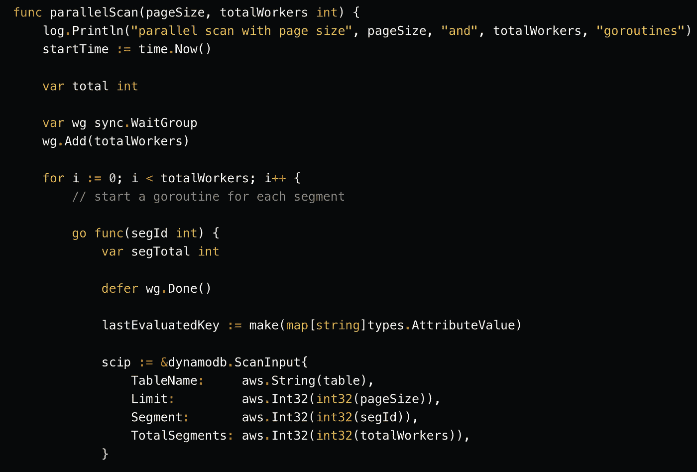
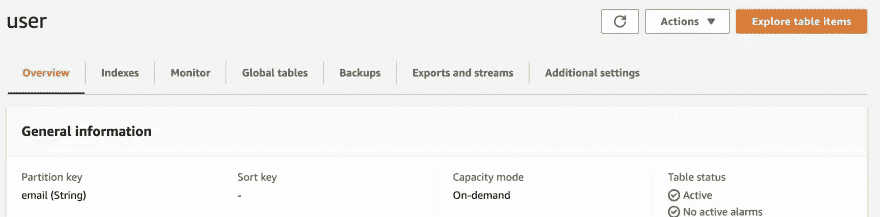

# DynamoDB Go SDK:如何有效地使用扫描和批处理操作

> 原文：<https://towardsdatascience.com/dynamodb-go-sdk-how-to-use-the-scan-and-batch-operations-efficiently-5b41988b4988>



使用 DynamoDB Go SDK 进行并行扫描(图片由作者提供)

## 通过实际的代码示例学习

[DynamoDB 扫描 API](https://docs.aws.amazon.com/amazondynamodb/latest/APIReference/API_Scan.html) 访问表中的每一项(或二级索引)。它相当于一个`select * from`查询。我将在这篇博客中讨论的事情之一是如何将 [Scan](https://pkg.go.dev/github.com/aws/aws-sdk-go-v2/service/dynamodb#Client.Scan) API 与 DynamoDB Go SDK 一起使用。

要扫描一个表，我们需要一些数据开始！所以在这个过程中，我还将深入研究如何使用`Batch` API 在`DynamoDB`中写批量数据。您可以使用 [BatchWriteItem](https://pkg.go.dev/github.com/aws/aws-sdk-go-v2/service/dynamodb#Client.BatchWriteItem) API 来批量(25 个)创建或删除项目，并且您可以跨多个表组合这些操作。

我们将从简单开始，逐步改进我们的方法来有效地使用 API。我还将回顾我运行的一些基本测试，以展示增量改进。最后，我将强调使用这些操作时的一些注意事项。

> *可以参考* [*上的代码 GitHub*](https://github.com/abhirockzz/dynamodb-go-sdk-scan-batch)

# 在您继续之前…

…确保创建一个名为`users`的`DynamoDB`表，其中包含:

*   分区键`email`(数据类型`String`)和
*   `On-Demand`容量模式。



DynamoDB 表(图片由作者提供)

此外，我还想称一些事情为背景:

*   该表是在`us-east-1`中创建的，测试也是从`us-east-1`中的`EC2`实例中执行的
*   因为这些是一般的测试，而不是专门的基准测试，所以我没有做任何特殊的调整(在任何级别上)。这些只是用不同的输入执行的 Go 函数，尽可能保持简单。
*   测试包括`BatchWriteItem`操作的编组(将 Go `struct`转换为`DynamoDB`数据类型)和`Scan`操作的解编组(从`DynamoDB`数据类型转换回 Go `struct`)。

让我们从探索`BatchWriteItem` API 开始。这样我们也将有数据来处理`Scan`操作。

双赢！

# 批量导入数据

由于您可以在一次调用中组合 **25** 项，因此与在循环中(甚至并行)调用 [PutItem](https://pkg.go.dev/github.com/aws/aws-sdk-go-v2/service/dynamodb#Client.PutItem) 相比，使用批处理方法进行批量数据导入要好得多。

下面是一个如何使用`BatchWriteItem`的基本示例:

```
func basicBatchImport() {

 startTime := time.Now()

 cities := []string{"NJ", "NY", "ohio"}
 batch := make(map[string][]types.WriteRequest)
 var requests []types.WriteRequest

 for i := 1; i <= 25; i++ {
  user := User{Email: uuid.NewString() + "@foo.com", Age: rand.Intn(49) + 1, City: cities[rand.Intn(len(cities))]}
  item, _ := attributevalue.MarshalMap(user)
  requests = append(requests, types.WriteRequest{PutRequest: &types.PutRequest{Item: item}})
 }

 batch[table] = requests

 op, err := client.BatchWriteItem(context.Background(), &dynamodb.BatchWriteItemInput{
  RequestItems: batch,
 })
 if err != nil {
  log.Fatal("batch write error", err)
 } else {
  log.Println("batch insert done")
 }

 if len(op.UnprocessedItems) != 0 {
  log.Println("there were", len(op.UnprocessedItems), "unprocessed records")
 }

 log.Println("inserted", (25 - len(op.UnprocessedItems)), "records in", time.Since(startTime).Seconds(), "seconds")
}
```

使用 [BatchWriteItemInput](https://pkg.go.dev/github.com/aws/aws-sdk-go-v2/service/dynamodb#BatchWriteItemInput) ，我们可以定义我们想要在批处理中执行的操作——这里我们将执行 [PutRequest](https://pkg.go.dev/github.com/aws/aws-sdk-go-v2/service/dynamodb/types#PutRequest) s(它封装在另一个名为 [WriteRequest](https://pkg.go.dev/github.com/aws/aws-sdk-go-v2/service/dynamodb/types#WriteRequest) 的类型中)。

我们将`WriteRequest`组装到一个切片中，最后将它们放在一个`map`中，key 是表名——这正是`BatchWriteItemInput`中的`RequestItems`属性所需要的。

> 在这种情况下，我们处理的是单个表，但是您可以在多个表上执行操作。

在本例中，我们只处理了一批 **25** 记录(最大允许批量)。如果我们想要导入更多的记录，我们需要做的就是将它们分成 **25** 的批次，并且一次执行一个(子)批次。很简单，下面是一个例子:

```
func basicBatchImport2(total int) {

 startTime := time.Now()

 cities := []string{"NJ", "NY", "ohio"}
 batchSize := 25
 processed := total

 for num := 1; num <= total; num = num + batchSize {

  batch := make(map[string][]types.WriteRequest)
  var requests []types.WriteRequest

  start := num
  end := num + 24

  for i := start; i <= end; i++ {
   user := User{Email: uuid.NewString() + "@foo.com", Age: rand.Intn(49) + 1, City: cities[rand.Intn(len(cities))]}
   item, _ := attributevalue.MarshalMap(user)
   requests = append(requests, types.WriteRequest{PutRequest: &types.PutRequest{Item: item}})
  }

  batch[table] = requests

  op, err := client.BatchWriteItem(context.Background(), &dynamodb.BatchWriteItemInput{
   RequestItems: batch,
  })

  if err != nil {
   log.Fatal("batch write error", err)
  }

  if len(op.UnprocessedItems) != 0 {
   processed = processed - len(op.UnprocessedItems)
  }
 }

 log.Println("all batches finished. inserted", processed, "records in", time.Since(startTime).Seconds(), "seconds")

 if processed != total {
  log.Println("there were", (total - processed), "unprocessed records")
 }
}
```

我用 **50000** 个记录(这意味着 **2000** 个批次)进行了尝试，花费了大约 **15** 秒。但是我们可以做得更好！

**平行批量导入**

我们可以为每一批增加一个`goroutine`，而不是顺序处理每一批:

```
func parallelBatchImport(numRecords int) {

 startTime := time.Now()

 cities := []string{"NJ", "NY", "ohio"}
 batchSize := 25

 var wg sync.WaitGroup

 processed := numRecords

 for num := 1; num <= numRecords; num = num + batchSize {
  start := num
  end := num + 24

  wg.Add(1)

  go func(s, e int) {
   defer wg.Done()

   batch := make(map[string][]types.WriteRequest)
   var requests []types.WriteRequest

   for i := s; i <= e; i++ {
    user := User{Email: uuid.NewString() + "@foo.com", Age: rand.Intn(49) + 1, City: cities[rand.Intn(len(cities))]}

    item, err := attributevalue.MarshalMap(user)
    if err != nil {
     log.Fatal("marshal map failed", err)
    }
    requests = append(requests, types.WriteRequest{PutRequest: &types.PutRequest{Item: item}})
   }

   batch[table] = requests

   op, err := client.BatchWriteItem(context.Background(), &dynamodb.BatchWriteItemInput{
    RequestItems: batch,
   })

   if err != nil {
    log.Fatal("batch write error", err)
   }

   if len(op.UnprocessedItems) != 0 {
    processed = processed - len(op.UnprocessedItems)
   }

  }(start, end)
 }

 log.Println("waiting for all batches to finish....")
 wg.Wait()

 log.Println("all batches finished. inserted", processed, "records in", time.Since(startTime).Seconds(), "seconds")

 if processed != numRecords {
  log.Println("there were", (numRecords - processed), "unprocessed records")
 }
}
```

结果大大改善了。这是我得到的。平均而言:

*   插入 **50000** 条记录花费了~ **2.5** 秒
*   在~ **4.5** 到 **5** 秒内插入 **100000** 记录
*   在不到 **9.5** 秒的时间内插入 **150000** 记录
*   在不到 **11.5** 秒的时间内插入 **200000** 记录

> *批量中可能存在未处理的记录。这个例子检测这些记录，但是为了简单起见，已经跳过了重试逻辑。理想情况下，您还应该有一个(基于指数回退的)重试机制来处理未处理的记录。*

为了插入更多数据，我循环运行了`parallelBatchImport`函数(如上)。例如:

```
for i := 1; i <= 100; i++ {
    parallelBatchImport(50000)
}
```

好吧，我们继续。现在我们有了一些数据，让我们试试…

# …扫描 API

基本用法如下:

```
func scan() {
 startTime := time.Now()

 op, err := client.Scan(context.Background(), &dynamodb.ScanInput{
  TableName:              aws.String(table),
  ReturnConsumedCapacity: types.ReturnConsumedCapacityTotal,
 })

 if err != nil {
  log.Fatal("scan failed", err)
 }

 for _, i := range op.Items {
  var u User
  err := attributevalue.UnmarshalMap(i, &u)
  if err != nil {
   log.Fatal("unmarshal failed", err)
  }
 }

 if op.LastEvaluatedKey != nil {
  log.Println("all items have not been scanned")
 }
 log.Println("scanned", op.ScannedCount, "items in", time.Since(startTime).Seconds(), "seconds")
 log.Println("consumed capacity", *op.ConsumedCapacity.CapacityUnits)
}
```

只需提供表(或二级索引)名称，就可以开始了！但是，由于 API 限制(每次调用相当于 1 MB 的数据)，您可能无法获得所有项目。在我的例子中，大约花费了 **0.5** 秒来处理大约 **15000** 条记录——其余的项目被跳过，因为超过了 1 MB 的限制。

**使用分页**

为了处理数据的限制，`Scan` API 在其输出中返回`LastEvaluatedKey`,指向最后处理的记录。您需要做的就是再次调用`Scan`，将`ExclusiveStartKey`属性的值设置为`LastEvaluatedKey`的值。

使用分页扫描方法花了我大约 **100 秒**来扫描~**750 万条**记录。

**平行扫描**

分页很有帮助，但它仍然是一个连续的过程。有很大的改进余地。幸运的是，`Scan`允许您采用并行化的方法，也就是说，您可以使用多个 workers(在本例中是`goroutine` s)来并行处理数据！

```
func parallelScan(pageSize, totalWorkers int) {
 log.Println("parallel scan with page size", pageSize, "and", totalWorkers, "goroutines")
 startTime := time.Now()

 var total int

 var wg sync.WaitGroup
 wg.Add(totalWorkers)

 for i := 0; i < totalWorkers; i++ {
  // start a goroutine for each segment

  go func(segId int) {
   var segTotal int

   defer wg.Done()

   lastEvaluatedKey := make(map[string]types.AttributeValue)

   scip := &dynamodb.ScanInput{
    TableName:     aws.String(table),
    Limit:         aws.Int32(int32(pageSize)),
    Segment:       aws.Int32(int32(segId)),
    TotalSegments: aws.Int32(int32(totalWorkers)),
   }

   for {
    if len(lastEvaluatedKey) != 0 {
     scip.ExclusiveStartKey = lastEvaluatedKey
    }
    op, err := client.Scan(context.Background(), scip)

    if err != nil {
     log.Fatal("scan failed", err)
    }

    segTotal = segTotal + int(op.Count)

    for _, i := range op.Items {

     var u User
     err := attributevalue.UnmarshalMap(i, &u)
     if err != nil {
      log.Fatal("unmarshal failed", err)
     }
    }

    if len(op.LastEvaluatedKey) == 0 {
     log.Println("[ segment", segId, "] finished")
     total = total + segTotal
     log.Println("total records processsed by segment", segId, "=", segTotal)
     return
    }

    lastEvaluatedKey = op.LastEvaluatedKey
   }
  }(i)
 }

 log.Println("waiting...")
 wg.Wait()

 log.Println("done...")
 log.Println("scanned", total, "items in", time.Since(startTime).Seconds(), "seconds")
}
```

`Segment`和`TotalSegments`属性是`Scan` API 如何实现并行的关键。`TotalSegments`只是需要产生的线程/工作进程的数量，而`Segment`是每个线程/工作进程的唯一标识符。

在我的测试中，对于大约 750 万条记录(我尝试了各种页面大小和`goroutine`组合)，性能(几乎)保持在 **37-40 秒**(平均)不变。

**我需要配置多少个** `**TotalSegments**` **？？？**

要调优适当数量的并行线程/工作线程，您可能需要做一些实验。这很大程度上取决于您的客户端环境。

*   您有足够的计算资源吗？
*   一些环境/运行时可能有托管线程池，所以您必须遵守这些规则

因此，您需要不断尝试，为您的找到最佳的并行性。考虑这个问题的一种方法是为每个数据单元选择一个段(单个工作线程/线程/ `goroutine`)。

# 总结— API 考虑事项

`Batch`和`Scan`API 都非常强大，但是有些细微差别你应该注意。我的建议是通读 API 文档。

**同**`**Batch**`**API:**

*   一批不超过 **25** 个请求
*   一批中的个别项目应*而不是*超过 **400KB**
*   单个`BatchWriteItem`中项目的总大小不能超过 **16MB**
*   `BatchWriteItem` *无法*更新物品
*   您*不能*指定单个`put`和`delete`请求的条件
*   它不*而不*在响应中返回已删除的项目
*   如果有*失败的*操作，您可以通过`UnprocessedItems`响应参数访问它们

**明智地使用扫描**

由于一个`Scan`操作遍历整个表(或二级索引),它很可能会消耗一大块提供的吞吐量，尤其是如果它是一个大表的话。话虽如此，`Scan`应该是你的最后一招。检查[查询 API](https://docs.aws.amazon.com/amazondynamodb/latest/APIReference/API_Query.html) (或 [BatchGetItem](https://docs.aws.amazon.com/amazondynamodb/latest/APIReference/API_BatchGetItem.html) )是否适用于您的用例。

> *同样适用于*平行`*Scan*` *。*

通过使用一个[过滤表达式](https://docs.aws.amazon.com/amazondynamodb/latest/developerguide/Query.html#Query.FilterExpression)、一个`Limit`参数(如前所述)或一个`ProjectionExpression`来进一步缩小结果的范围，只返回属性的一个子集。

这个博客到此为止。希望你觉得有用。

下次见，编码快乐！