# E-DALL-E:用不同的纵横比创建数字艺术

> 原文：<https://towardsdatascience.com/e-dall-e-creating-digital-art-with-varying-aspect-ratios-5de260f4713d>

## 如何使用 VQGAN 和 CLIP 修复侧面来扩展 DALL-E Mini 生成的图像

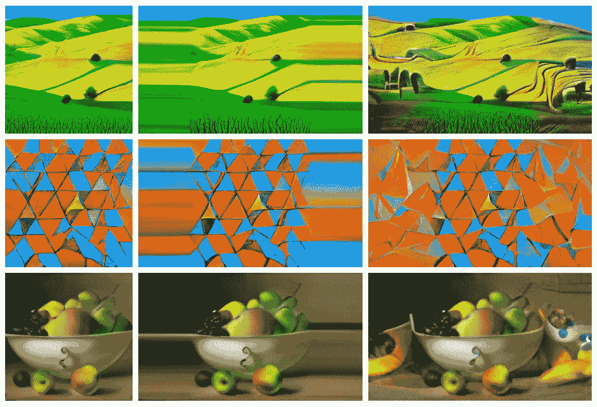

**图片来自 DALL-E Mini** (左)**，放大到 16:9，边缘像素重复**(中)**和 E-DALL-E** (右)，图片由作者提供

你可能见过一些使用 OpenAI 的 DALL-E 2 [1]从文本生成的图像。尽管该系统令人印象深刻，结果令人难以置信，但它目前只在封闭测试版中提供[等候名单](https://labs.openai.com/waitlist)。然而，你可以访问和运行一个独立的文本到图像系统，名为 DALL-E Mini [2]，由开发者 Boris Dayma 和 Pedro Cuenca 领导。虽然结果没有 DALL-E 2 生成的图像那么壮观，但仍然非常优秀，源代码和训练好的模型都是免费开源的。你可以在他们广告支持的[演示](https://www.craiyon.com/)中尝试一下。

您可能已经注意到，两种 DALL-E 型号生成的图像都使用 1:1 的纵横比；图像总是死方的。该系统不能产生横向或纵向格式的图像，限制了它们的实用性。

但是，我注意到 DALL-E Mini 的图像生成器使用了 VQGAN 模型[3]，这一点我从我写的几篇关于图像生成的文章[中非常了解。我还知道 VQGAN 可以渲染不同纵横比的图像。所以我写了一点代码来获取 DALL-E 模型的输出，或者任何图像，并使用 OpenAI [4]的 CLIP 引导的 VQGAN 来扩展纵横比。我称这个系统为 Expand-DALL-E，简称 E-DALL-E。你可以在这里运行它。请务必查看附录中的图片集。](https://robgon.medium.com/list/creating-fine-art-with-ai-73476c209de3)

# 系统概况

这是 E-DALL-E 系统的示意图，其中简要描述了流程。系统组件的完整描述如下。

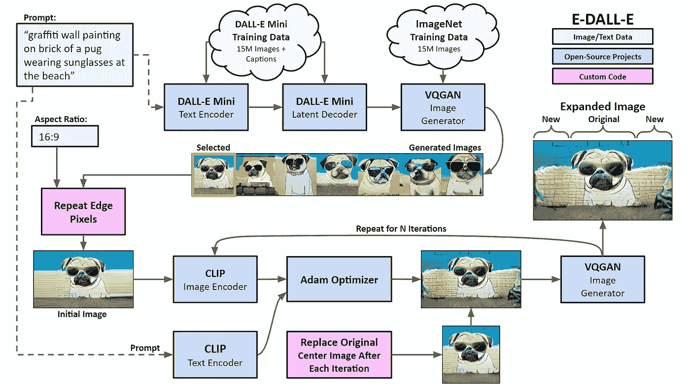

**E-Dall-E 组件，**作者提供的图表

该系统有两个主要组成部分:用于图像生成的 DALL-E Mini 和用于扩展纵横比的 E-DALL-E。

图像创建过程从用户的文本提示开始，就像“在海滩上戴着太阳镜的哈巴狗的砖块上涂鸦墙”DALL-E Mini 系统经过 1500 万对图像/字幕的训练，可以将文本转换为内部表示。然后，它将结果解码并采样为潜在向量，用作 VQGAN 图像生成器的输入，作者使用 ImageNet 数据集对其进行了训练[6]。VQGAN 为每个样本渲染 256x256 的图像，用户选择一个。

首先，用户向 E-DALL-E 提供所需的纵横比，如 16:9。然后，它通过重复原始边缘像素来填充所选图像，作为进一步迭代的初始图像。系统将文本提示输入剪辑文本编码器，用作指导。然后，它开始在生成过程中迭代 N 步，比如 100 步。系统使用 Adam 优化器[7]来改变 VQGAN 向量，以创建与文本提示最匹配的图像。然而，在每一步之后，系统将原始图像中心部分的矢量复制回来，因此它将只更新图像的边缘。

在完成迭代之后，系统显示扩展的图像，在侧面具有新添加的细节。

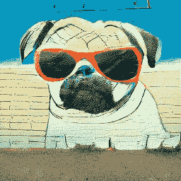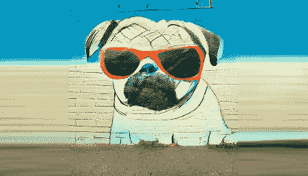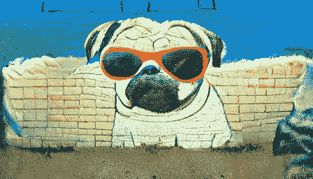

**DALL-E Mini 的原始 1:1 图像，具有重复边缘像素的初始 16:9 图像，使用 E-DALL-E 扩展的 16:9 图像，**作者提供的图像

仔细观察，您会发现右侧扩展图像的中心部分与左侧的原始图像略有不同。这是 VQGAN 渲染图像的一个有意的方面。我将在下面的图像拼接部分描述这种效果。

# 组件详细信息

## **达尔-E**

2021 年 1 月，OpenAI 发布了一篇论文和他们的 DALL-E 文本到图像系统的演示[8]。这个名字是一种文字游戏。这是画家萨尔瓦多·达利的姓氏和迪士尼动画电影《瓦力》的结合

DALL-E 模型是一个巨大的变压器。它有 120 亿个参数，并使用来自互联网的 2.5 亿对图像/字幕进行训练。以下是查询结果，“一只手风琴做的貘。有手风琴纹理的貘。”以及“一只穿着圣诞毛衣的小刺猬遛狗的插图。”

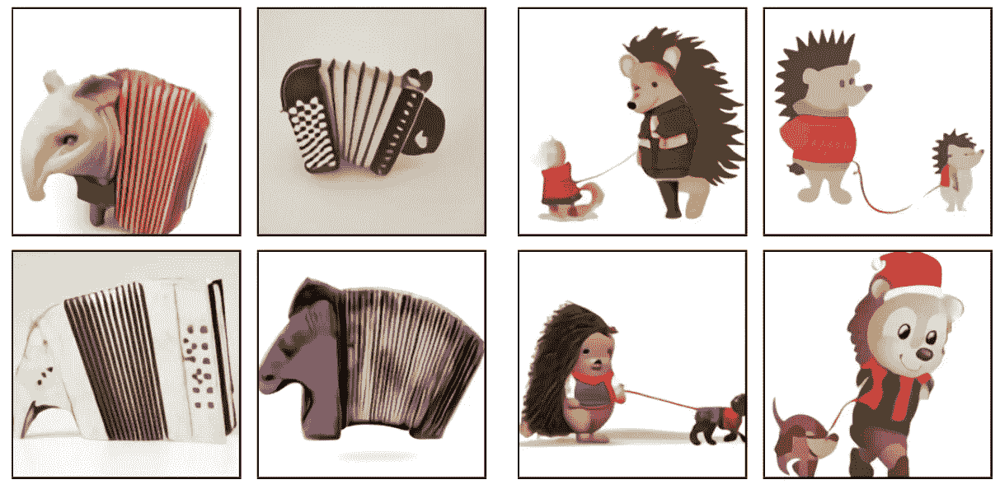

**来自 DALL-E 的输出**来自 OpenAI 的论文[零镜头文本到图像生成](https://arxiv.org/pdf/2102.12092.pdf)

DALL-E 的结果非常好。该系统在解释文本和渲染图像方面做得很好，既有创造性又很逼真。一个限制是输出相对较小，为 256x256 像素。OpenAI 没有提供 DALL-E 源代码或训练模型的访问权限。但 14 个月后，情况发生了变化。

## 达尔-E 2

2022 年 4 月 13 日，OpenAI 发布了名为 DALL-E 2 的更新版本[1]。它为文本编码器使用了他们的剪辑模型的变体，并使用了他们的 GLIDE [9]图像解码器模型的变体，具有 35 亿个参数。OpenAI 使用 6.5 亿张图像训练了 DALL-E 2 系统。该系统以 1024x1024 像素的高分辨率渲染图像。这是他们论文中的一些样本图片。

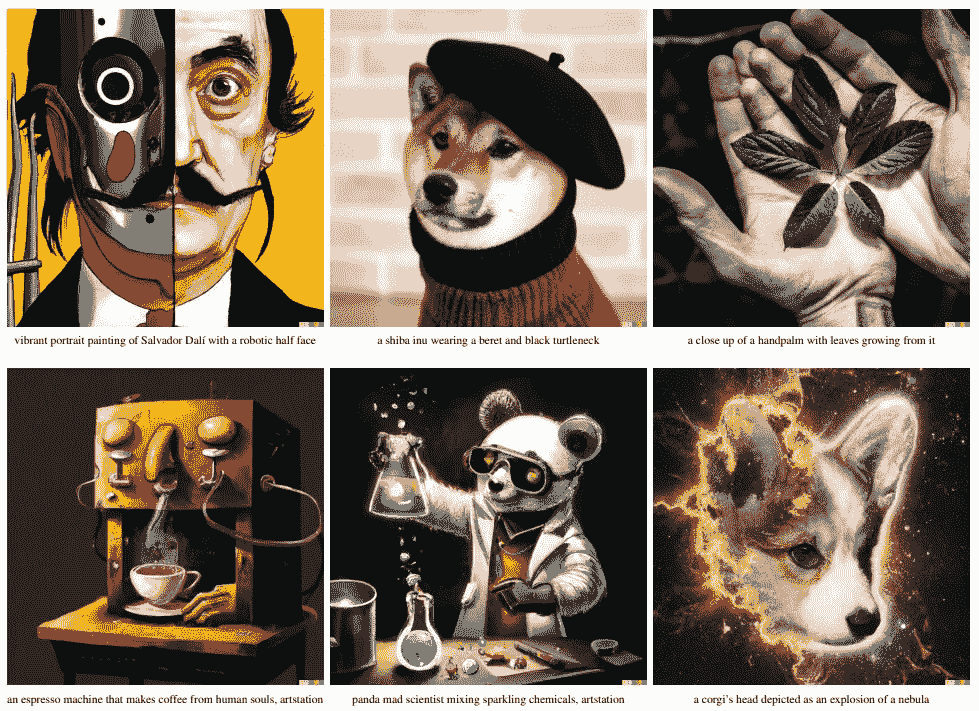

OpenAI 论文中 DALL-E 2 的输出，[带剪辑潜在时间的分层文本条件图像生成](https://arxiv.org/pdf/2204.06125.pdf)

这些成绩都很优秀！正如我在本文开头提到的，DALL-E 2 只提供封闭测试版。

## 达尔-E 迷你

开发人员 Boris Dayma 和 Pedro Cuenca 带领一个团队创建了一个免费的开源文本到图像生成器，名为 DALL-E Mini [2]。该系统使用一对经过训练的 BERT 变换器[10]将文本转换为潜在向量，这些潜在向量可以使用 VQGAN 渲染图像。顾名思义，DALL-E Mini 型号比较小。它“只”有 4 亿个参数，并且“只”在 1500 万张图像上进行训练。

这是 DALL-E Mini 的推理管道图。

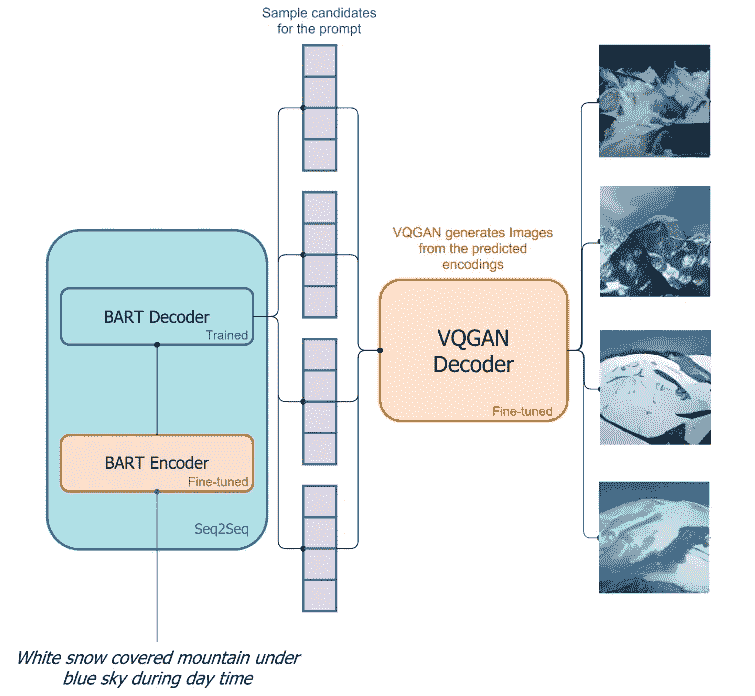

**DALL-E Mini 的推理管道**，来源: [DALL-E Mini 解释](https://wandb.ai/dalle-mini/dalle-mini/reports/DALL-E-Mini-Explained--Vmlldzo4NjIxODA)

文本提示被输入 BART，然后被解码以产生 VQGAN 的潜在向量样本，从而呈现候选图像。请注意，系统不会迭代生成图像。它转换成 VQGAN 用来直接渲染图像的矢量。DALL-E Mini 如何工作的完整解释是[这里](https://wandb.ai/dalle-mini/dalle-mini/reports/DALL-E-Mini-Explained--Vmlldzo4NjIxODA)。

这里有一些提示的示例图像，“一幅起伏的农田的画”、“一幅带有橙色三角形的抽象画”和“一碗水果的静物画”

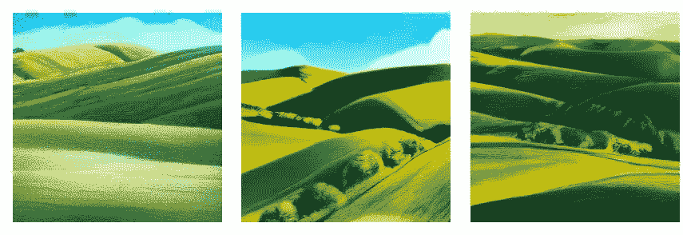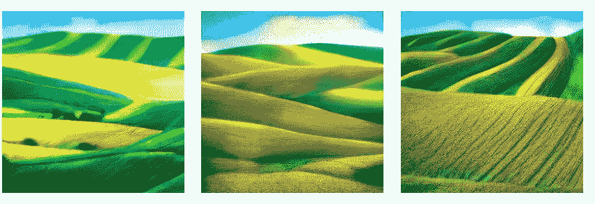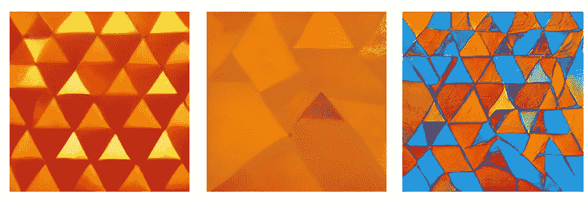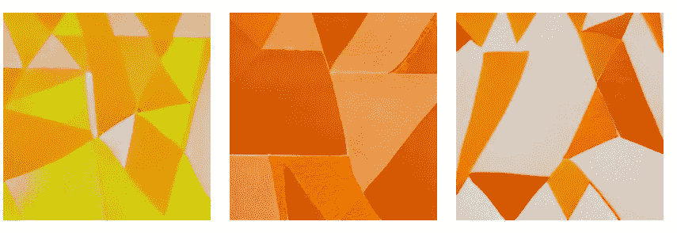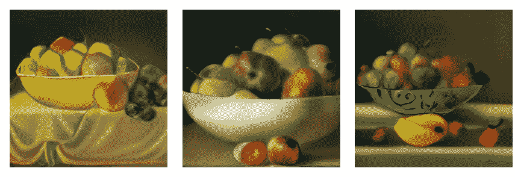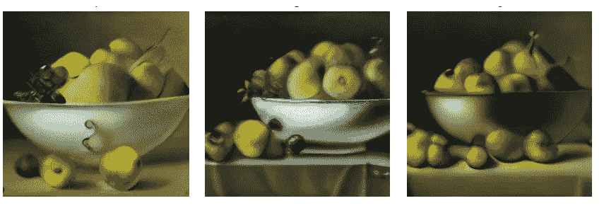

**DALL-E Mini**的输出样本，图片由作者提供

虽然它们不如 DALL-E 2 的图像好，但 DALL-E Mini 的输出还不错。这些图像有很大的变化，虽然缺乏细节，但每幅作品总体来说都很好。

接下来，我将向您展示如何扩展输出以获得不同的纵横比。

## 伊达尔伊

E-DALL-E 系统从用户指定的纵横比开始。例如，如果我们有一个 256x256 的图像，并想将其拉伸到比如说 16:9，我们需要在左侧添加 96 个像素，在右侧添加 96 个像素。这将产生大约为 16:9 的合成图像 448x256。

接下来，系统用重复的像素填充图像的边缘。这将有助于 VQGAN 模型在生成扩展图像的侧面时领先一步。重复像素是一个简单的编程技巧，不需要任何机器学习。

对于图像中的每一行，系统计算最后 8 个像素的平均值，并复制它们以制作水平颜色恒定的子图像。它还对原始图像执行 32 像素的线性混合以掩盖过渡，因此左右子图像的宽度必须为 96+32 像素。

这是三幅图像在 16:9 格式下的样子，有重复的边缘像素。

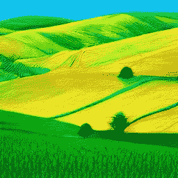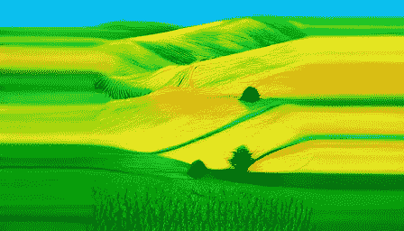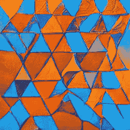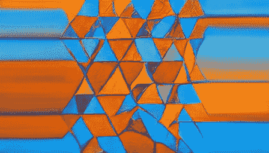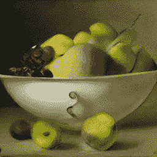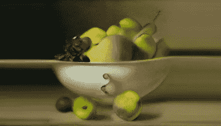

**具有重复边缘像素的 DALL-E Mini 的输出，**作者的图像

好吧，它们不能作为成品图像，但它们是下一步过程的良好起点。重复边缘像素的源代码在这里是。

## 使用 VQGAN 拼接图像

在我开始渲染扩展图像的侧面之前，我将讨论 VQGAN 的一个有趣的方面，据我所知，它还没有被写出来。)虽然 VQGAN 的作者创建它是为了生成新图像，但它在将相似图像拼接在一起方面做得非常好。

VQGAN 本质上是一个编解码器。编码器获取图像并生成潜在向量。解码器获取潜在向量并生成图像。在训练期间，系统更新模型的参数，以使输出图像尽可能接近地匹配输入图像。

与大多数 GANs 中的潜在向量不同，VQGAN 使用的潜在向量有一个空间方面。对于输入中每 16x16 块 RGB 像素，解码器会创建 256 个浮点数。因此，256x256 RGB 图像的潜在尺寸为 16x16x256。在 VQGAN 论文[4]中，256 个数字的组被称为“码本”。

当我在潜在向量空间中编辑图像时，系统会在解码结果图像时平滑结果。

例如，这里有两幅来自艺术家古斯塔夫·克里姆特和阿美迪欧·莫蒂里安尼的肖像。最上面一行显示了从中间开始拼接 RGB 图像的结果。左半部分来自克里姆特，右半部分来自莫迪利阿尼。底部一行显示了拼接 VQGAN 潜在向量和解码结果图像的结果。

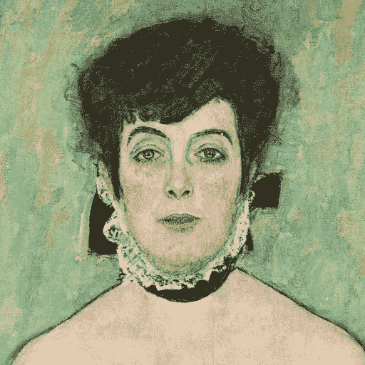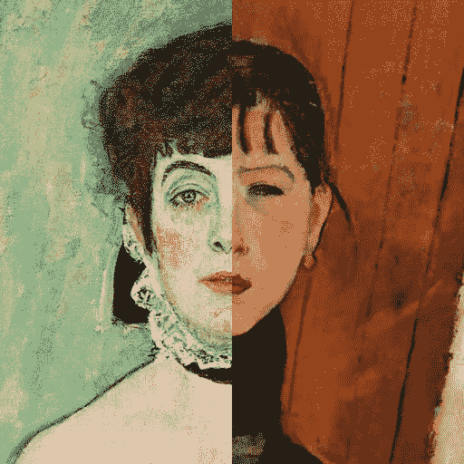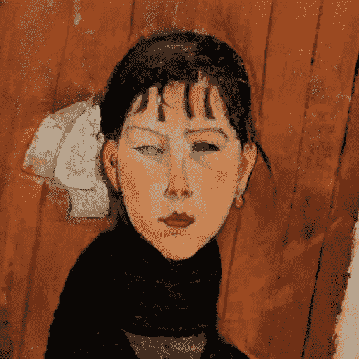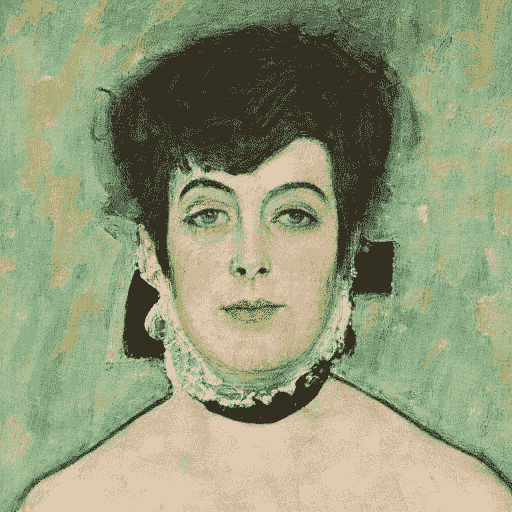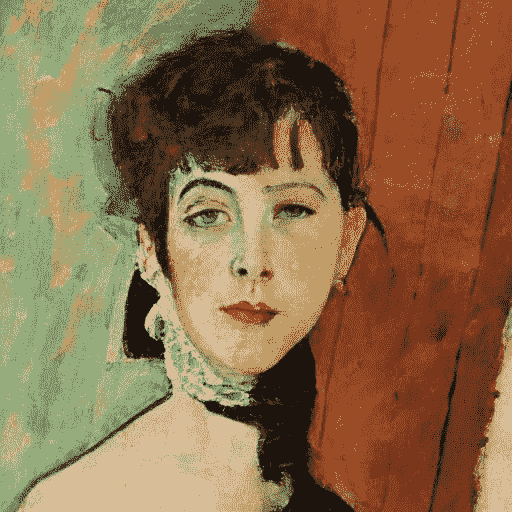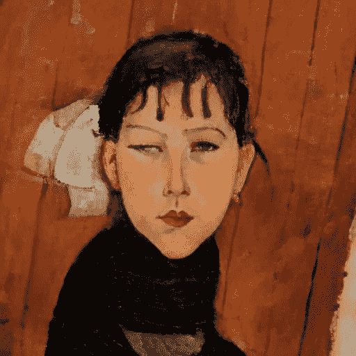

顶行: [WikiArt](https://www.wikiart.org/en/gustav-klimt/amalie-zuckerkandl-1918) 的古斯塔夫·克里姆特的 **Amalie Zuckerkandl** ，作者的**混合像素拼接**， [WikiArt](https://www.wikiart.org/en/amedeo-modigliani/marie-daughter-of-the-people-1918) 的阿美迪欧·莫蒂里安尼的 **Marie，人民的女儿**，底行: **Amalie Zuckerkland“通过 VQGAN，混合矢量拼接”，“通过 VQGAN 的 Marie，人民的女儿**，作者的图片

这里有几件事需要注意。首先，VQGAN 模型不是一个完美的编解码器。通过模型传递的图像与原始图像并不完全匹配。例如，左上和左下肖像中的眼睛看起来不同。但是，您可以看到在潜在向量空间中拼接图像是如何非常自然地混合图像部分的。尽管中下方的这张脸显然是由不同的两半组成的，但很难找到两者之间的接缝。这是因为每个 VQGAN 码本条目在解码时不仅会呈现其空间区域，还会影响其邻居基于训练数据创建内聚图像。

当渲染扩展图像的侧面时，我使用 VQGAN 的这个特性。

## 使用 E-DALL-E 扩展图像

这是组件图，只显示了用于扩展图像的过程。

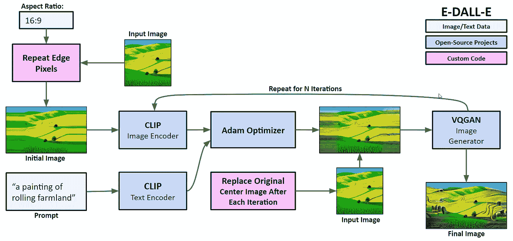

**E-DALL-E 组件细节**，作者提供的图表

该过程从输入图像和指定的纵横比开始。如上所述，系统重复边缘像素以拉伸图像。然后，它使用 CLIP 对提示进行编码，以指导优化过程。对于每次迭代，系统用 CLIP 对图像进行编码。它使用文本编码和图像编码之间的差异，通过 Adam 优化器来修改 VQGAN 潜在向量。在每次迭代之后，修改的图像向量的中心部分被来自输入图像的向量的中心替换，以保持中间部分相对恒定。只是侧面会有很大的变化。在 N 次迭代之后，系统显示具有新纵横比的最终图像。

以下是使用 E-DALL-E 的一些结果。

**来自 E-DALL-E 的结果，**作者提供的图片

相当不错！该系统似乎在扩展区域中很好地弥补了新的细节。而且很难看到原始图像和新生成的部分之间的接缝。但你也可以看到 VQGAN 有时如何改变图像的中心部分，以使新的部分更好地适应。例如，在右上角的图像中，天空的色调似乎在中心部分变成了更深的蓝色。右下角图像中心的橙色三角形的纹理似乎与边上新生成的三角形的表面相匹配。

# 文化偏见

像大多数基于互联网上发现的大量数据进行训练的神经网络模型一样，该项目中使用的模型具有内在的文化偏见，这些偏见会在数据中得到体现。

视频作者研究了他们系统中存在的文化偏见。

> CLIP 是在互联网上与图像配对的文本上训练的。这些图像-文本对未经过滤和切割，导致剪辑模型学习许多社会偏见。…例如，我们发现…‘保姆’和‘管家’等标签开始出现在女性身上，而‘囚犯’和‘暴徒’等标签开始出现在男性身上。…此外，CLIP 还贴上了一些标签，这些标签更多地描述了男性的高地位职业，如“高管”和“医生”。*——亚历克·拉德福德等人*

DALL-E Mini 的作者发现了以下情况。

> 总的来说，由于生成的人和脸的质量低，很难详细调查模型偏差，但很明显，偏差是存在的。表现出较高教育水平的职业(如工程师、医生或科学家)或高体力劳动(如建筑业)大多由白人男性代表。相比之下，护士、秘书或助理通常是女性，通常也是白人。生成的人大部分是白人。只有在具体的例子中，比如运动员，我们才会看到不同的种族，尽管他们中的大多数仍然没有得到充分的代表。该数据集仅限于带有英语描述的图片，这使得来自非英语文化的文本和图像无法呈现。 *- Boris Dayma 和 Pedro Cuenca 等人*

E-DALL-E 在渲染扩展图像的新部分时可能会延续这些偏见。

# 最后的想法和未来的步骤

DALL-E 迷你文本到图像模型的结果看起来非常好。VQGAN 是一种多功能的图像渲染模型，有许多意想不到的用途，如扩展图像以改变纵横比。

在未来的项目中，我可能会尝试使用 VQGAN 作为一个通用的修复工具。尽管系统将被掩蔽的区域量化为 16×16 的像素块，但是有可能混合回原始潜在向量和被掩蔽区域之外的原始像素。并且使用 CLIP 作为一个指导性的文本编码器，有可能执行类似于“在哈巴狗上画一顶派对帽”的功能。😀

# 源代码

这个项目的源代码可以在 [GitHub](https://github.com/robgon-art/e-dall-e) 上找到。我在 CC BY-SA 许可下发布源代码。你可以使用谷歌眼镜[创建](https://colab.research.google.com/github/robgon-art/e-dall-e/blob/main/DALL_E_Mini_Image_Generator.ipynb)和[扩展](https://colab.research.google.com/github/robgon-art/e-dall-e/blob/main/E_DALL_E_Image_Expander.ipynb)你自己的图像。

**知识共享署名共享**

# 感谢

我要感谢詹尼弗·林对这篇文章的帮助。

# 参考

[1] A. Ramesh 等人， [**DALL-E 2** 带剪辑潜在时间的分层文本条件图像生成](https://arxiv.org/pdf/2204.06125.pdf) (2022)

[2] B. Dayma 和 P. Cuenca， [**DALL E mini** —从任何文本提示生成图像](https://wandb.ai/dalle-mini/dalle-mini/reports/DALL-E-mini-Generate-Images-from-Any-Text-Prompt--VmlldzoyMDE4NDAy) (2021)

[4] **VQGAN** 作者:P. Esser、R. Rombach 和 B. Ommer，[驯服变压器实现高分辨率图像合成](https://arxiv.org/pdf/2012.09841.pdf) (2020)

[5] **剪辑**由 a .拉德福德等著，[从自然语言监督中学习可转移的视觉模型](https://cdn.openai.com/papers/Learning_Transferable_Visual_Models_From_Natural_Language_Supervision.pdf) (2021)

[6] J .邓等， [**ImageNet** :一个大规模的层次化图像数据库](https://www.image-net.org/static_files/papers/imagenet_cvpr09.pdf) (2009)

[7] D. P .金马和 j .巴雷，**亚当** : [随机优化的一种方法](https://arxiv.org/pdf/1412.6980.pdf) (2015)，国际学习表征会议2015

[8]**a . Ramesh 等人的 DALL-E** ，[零镜头文本到图像生成](https://arxiv.org/pdf/2102.12092.pdf) (2021)

[9] A. Nichol 等人， [**GLIDE** :利用文本引导扩散模型实现照片级真实感图像生成和编辑](https://arxiv.org/pdf/2112.10741.pdf) (2022)

[10] J. Devlin，M.W. Chang，K. Lee，K. Toutanova， [**BERT** :语言理解的深度双向转换器的预训练](https://arxiv.org/pdf/1810.04805.pdf) (2018)

# 附录

左边是 DALL-E Mini 的结果，右边是 E-DALL-E 的结果。

## 一幅带有蓝色、绿色和紫色漩涡的彩色抽象画

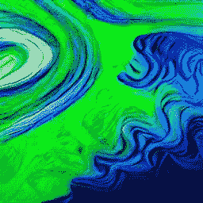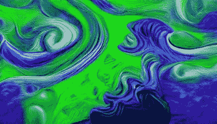

**“蓝色、绿色和紫色漩涡的彩色抽象画，”**作者图片

## 一幅吉娃娃冲浪的画

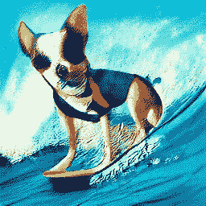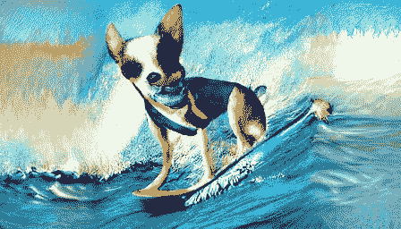

**“一只吉娃娃在冲浪”，作者**图片

## **一幅梵高《星夜》风格的埃菲尔铁塔画**

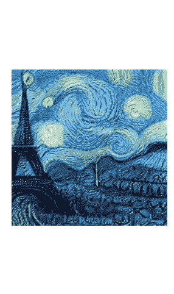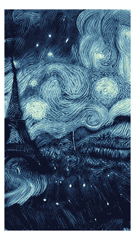

**“梵高《星夜》风格的埃菲尔铁塔画”，**作者图片

## 一幅色彩缤纷的新英格兰风景画

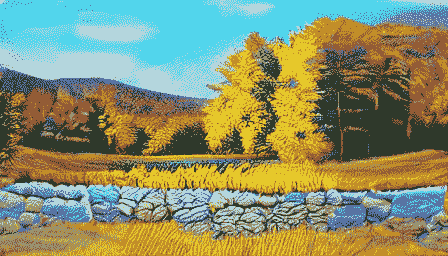

**“色彩缤纷的新英格兰风景画”，**作者图片

为了无限制地访问 Medium 上的所有文章，[成为会员](https://robgon.medium.com/membership)，每月支付 5 美元。非会员每月只能看三个锁定的故事。