# 作为一名程序员挣更多的薪水——更高的学位还是更多年的经验？

> 原文：<https://towardsdatascience.com/earn-more-salary-as-a-coder-higher-degree-or-more-years-of-experience-68c13f73a557>

## 在 Python 中使用可视化和贝叶斯推理的分析

# 动机

作为开发人员或数据科学家，您可能想知道:

*   随着你获得更多的经验，你会挣更多的薪水吗？如果是，多多少？
*   其他因素，如以前的学位、职位类型和公司的规模会影响你的薪水吗？

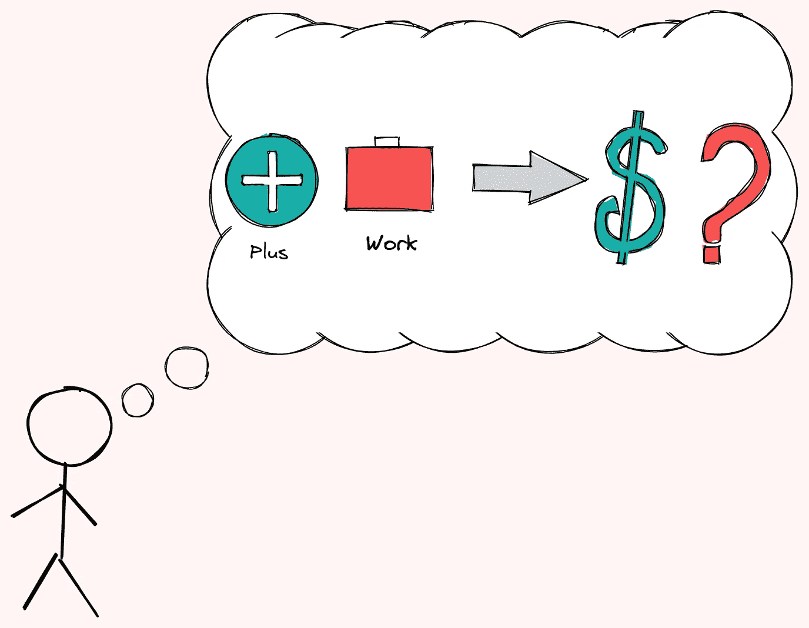

作者图片

在本文中，我们将使用可视化和贝叶斯推理来回答这些问题。

# 检索数据

我们将使用 Kaggle 上的 [Stack Overflow 2018 开发者调查](https://www.kaggle.com/stackoverflow/stack-overflow-2018-developer-survey)。该数据收集了 2018 年开发者调查中由 Stack Overflow 填写的个人回复。

首先将数据下载到当前目录，然后运行:

由于不同的国家和不同的就业类型的工资是不同的，我们只选择在美国，有全职工作，不是学生的开发人员。

我们还将过滤掉超过 30 万美元的工资极值:

可视化薪资范围:

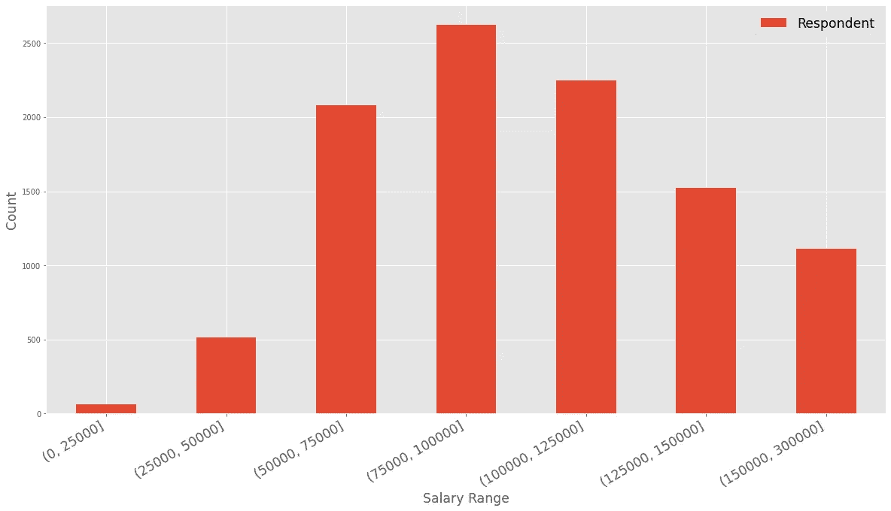

作者图片

看起来大多数开发人员的年收入在 75，000 美元到 100，000 美元之间。对于美国的开发人员来说，这听起来很合理。

# 编码年工资

我们最感兴趣的是编码年限如何影响工资。让我们用箱线图来想象一下。

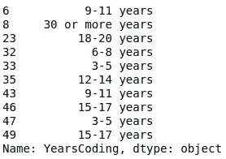

作者图片

由于`YearsCoding`是字符串类型，我们将把它转换成`pandas.Interval`:

可视化数据:

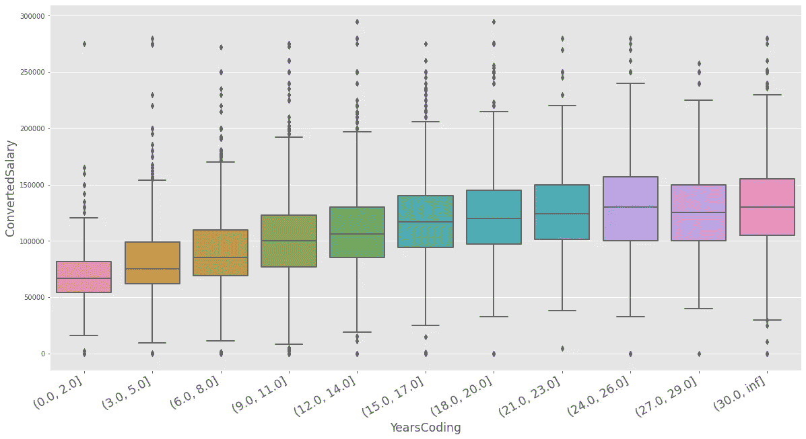

作者图片

太好了，似乎平均工资随着编码年限的增加而增加！

注意，上面的数据只是开发者的**样本**。我们如何确定 3-5 年和 0-2 年工作经验或 6-8 年和 0-2 年工作经验之间的平均工资有显著差异？我们可以用 Bambi 的双样本贝叶斯 t 检验来验证这一点。

# 斑比贝叶斯 t 检验

## 斑比是什么？

[Bambi](https://bambinos.github.io/bambi/main/index.html) 是用 Python 编写的高级贝叶斯建模接口。它构建在编程框架 PyMC3 之上。因此，Bambi 类似于 PyMC3，但是更容易使用。

[](/bayesian-linear-regression-with-bambi-a5e6570f167b)  

要安装 Bambi，请键入:

```
pip install bambi
```

## 基于 2 年不同经验的贝叶斯 t 检验

在一次性比较多年工作经验之前，让我们先来比较两年不同工作经验的平均工资:0-2 年工作经验和 3-5 年工作经验。

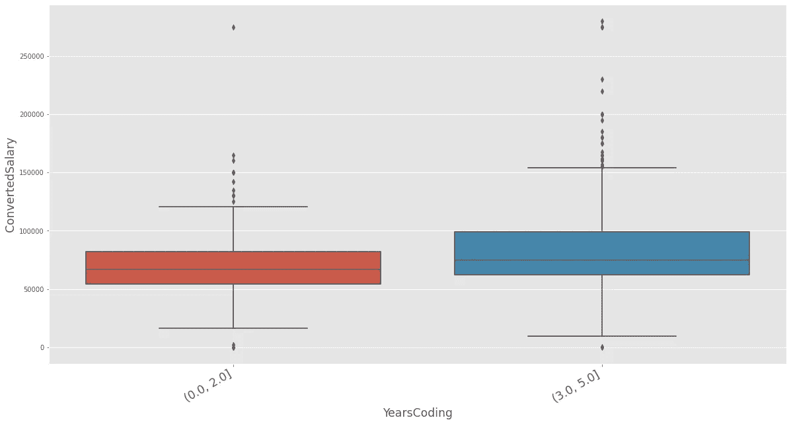

作者图片

我们表示:

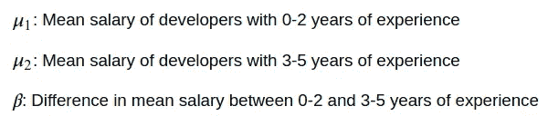

因此，我们可以这样写:

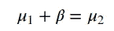

从上面的等式中，我们可以看到，如果两组之间的平均工资没有差异，那么𝛽 = 0。

我们将使用斑比来绘制 4000 个𝛽样本，并找出𝛽.的分布我们将假设 0-2 年和 3-5 年的工资分布是正态的。

在上面的代码中，`ConvertedSalary ~ YearsCoding`告诉斑比`YearsCoding`影响了`ConvertedSalary`。

总结结果:


作者图片

在上表中，`YearsCoding[(3.0, 5.0)]`是上式中指定的𝛽。我们可以看到，𝛽94%的最高密度区间(HDI)在 8418.925 和 14348.040 之间。

让我们想象一下𝛽:的分布

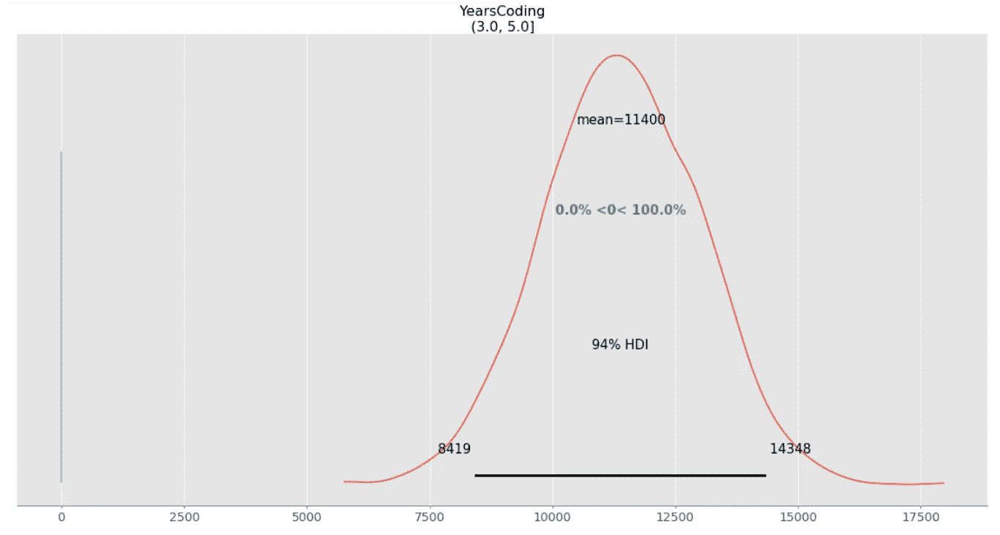

作者图片

从上面的分布，我们可以说:

*   两组的平均工资差为 11，400 英镑。
*   这两个群体之间工资差异的 94%在 8418.925 英镑和 14，348.040 英镑之间。

由于𝛽的所有值都远远高于 0，我们可以肯定地说，有 0-2 年经验的开发人员和有 3-5 年经验的开发人员的平均工资有很大的差别。

让我们仔细检查一下𝛽的所有值是否都大于 0:

```
1.0
```

酷！他们都是。

## 基于多年经验的贝叶斯 t 检验

现在，让我们将其他年份的经验与 0-2 年的经验进行比较。

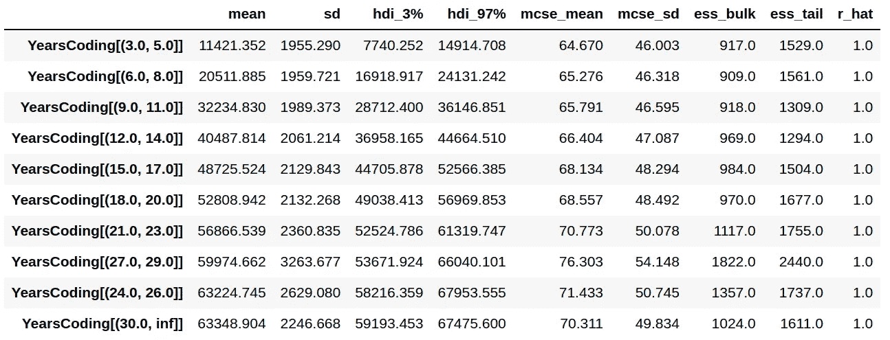

作者图片

从上表中，我们可以看到平均工资随着编码年限的增加而增加。随着编码年限变长，编码每多一年平均工资的增长变小。

# 影响工资的其他因素

我们知道经验年限影响薪资，但是正规教育、公司规模、开发者类型等其他因素呢？

让我们用可视化来找出答案。你可以在本笔记本中找到创建以下情节的代码。

## 正规教育工资

正规学历影响你挣多少钱吗？我们可以用一个方框图来找出答案，它的方框是根据教育水平的提高来排序的。

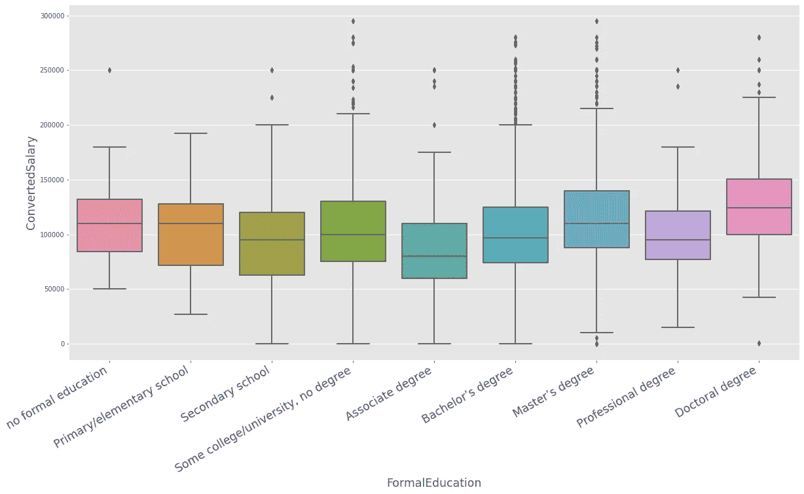

作者图片

在上面的图中，那些没有受过正规教育的人似乎和那些有硕士学位的人挣得一样多，并且平均比那些有学士学位的人挣得更多。因此，我们可以说，正规学位的水平和工资之间几乎没有关联。

## 按公司规模分类的工资

公司规模如何影响薪水？从下面的方框图来看，大公司的工资中位数似乎比小公司的工资中位数要大。

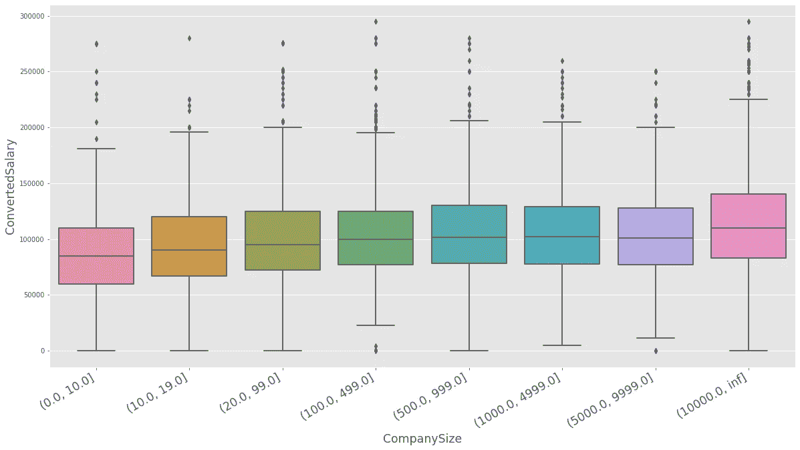

作者图片

## 按开发人员类型列出的薪金

某些类型的开发人员比其他人挣得多吗？下图显示了工程经理、首席执行官、首席技术官等管理职位的平均工资高于其他职位的平均工资。然而，差异很小。

学生的薪水似乎明显低于其他全职职位。

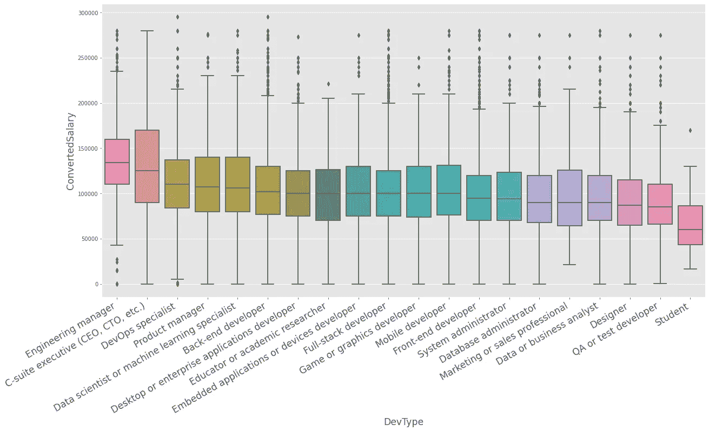

作者图片

首席执行官、首席技术官等高管的分布。)比其他发行版传播更广。不同规模的公司，高管薪酬可能会有很大差异。

# 总结和下一步

## 摘要

从上面的分析，我们可以说

*   经验年数少的开发人员和经验年数多的开发人员在平均薪资上有显著差异。
*   正式学位对薪水的影响很小，甚至没有影响。
*   当公司规模扩大，职位更高时，工资中位数会略有增加。

那么你应该获得更高的学位还是获得更多的经验来挣更多的薪水呢？从上面的数据分析来看，更好的投资是在你感兴趣的领域获得更多年的经验。

## 下一步

能否使用贝叶斯 t 检验来确定不同公司规模之间或不同职位类型之间的平均工资是否存在显著差异？

在这里随意发挥和分叉本文的代码:

[](https://github.com/khuyentran1401/Data-science/blob/master/statistics/stackoverflow_survey/analyze_salary.ipynb)  

我喜欢写一些基本的数据科学概念，并尝试不同的数据科学工具。你可以在 LinkedIn 和 T2 Twitter 上与我联系。

星[这个回购](https://github.com/khuyentran1401/Data-science)如果你想检查我写的所有文章的代码。在 Medium 上关注我，了解我的最新数据科学文章，例如:

[](/detect-change-points-with-bayesian-inference-and-pymc3-3b4f3ae6b9bb)  [](/bayes-theorem-clearly-explained-with-visualization-5083ea5e9b14)  [](/how-to-create-interactive-and-elegant-plot-with-altair-8dd87a890f2a)  [](/pyvis-visualize-interactive-network-graphs-in-python-77e059791f01)  

# 参考

堆栈溢出。2018–05–15.堆栈溢出 2018 开发者调查，第 2 版。数据库内容许可证。检索自[https://www . ka ggle . com/stack overflow/stack-overflow-2018-developer-survey](https://www.kaggle.com/stackoverflow/stack-overflow-2018-developer-survey)。