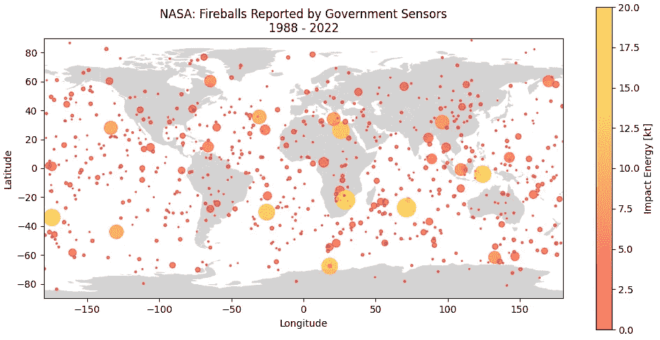

# 用熊猫和地质熊猫在世界地图上绘图的最简单方法

> 原文：<https://towardsdatascience.com/easiest-way-to-plot-on-a-world-map-with-pandas-and-geopandas-325f6024949f>

## 使用 Python 中的 Pandas 和 GeoPandas 读取、清理和绘制地理空间数据的综合指南



报道的火球撞击能量[由作者创造]

学习如何用 Python 创建世界地图可能需要一点时间来弄清楚，但是一旦你知道如何做，你就可以很容易地复制它。假设您有想要绘制的地理数据；你可以用一个带有国家名称的条形图，把你的数据绘制成一个条形图，但是这很无聊。一种更具视觉吸引力的数据呈现方式是将其叠加在地图上，以物理方式显示数据的交互方式。这可能是一个具有挑战性的努力，但我在这里提供帮助。按照这个例子，你应该开始创造惊人的地理空间视觉效果。


照片由锡德·巴拉钱德朗在 [Unsplash](https://unsplash.com?utm_source=medium&utm_medium=referral) 上拍摄

在本文中，我将假设您对如何使用 Python 有一个基本的了解，但是如果您在浏览代码时有任何问题，请在评论中告诉我。我非常乐意帮忙。对于本文，我们将使用来自近地天体研究中心(NASA 喷气推进实验室的一部分)的数据集。如果你想重现本文中的形象，你应该从这个[链接](https://cneos.jpl.nasa.gov/fireballs/)下载。将文件下载为*。csv* 文件并保存在方便的位置。现在，让我们进入代码:

## 导入库

以下是绘制数据所需的库的列表:

*   *Matplotlib* 用于导入 *pyplot* 包(为方便起见定义为`plt`)，用于绘图目的
*   *Pandas* (为方便起见定义为`pd`)用于从*读取和操作数据集。csv* 文件
*   *GeoPandas* (为方便起见定义为`gpd`)用于创建我们的世界地图

```
# Importing libraries
import matplotlib.pyplot as plt
import pandas as pd
import geopandas as gpd
```

我看过很多论坛和文章，都是关于人们努力安装 *GeoPandas* 的。我自己也有点纠结，但是这个[教程](https://geoffboeing.com/2014/09/using-geopandas-windows/)很有帮助，解决了我遇到的问题。如果你还没有安装 *GeoPandas* ，我强烈建议你遵循那个教程。

## 读取数据文件

接下来，我们将使用 *Pandas* (as `pd`)从*cneos _ fireball _ data . CSV*文件中读取数据。在`read_csv`函数中，我们使用文件的标题名来提取所需的数据列。这些头文件的格式并不总是最容易阅读的，所以我们可以使用如图所示的`rename`函数来重命名它们。

```
# Reading cvs file using pandas
df = pd.read_csv('cneos_fireball_data.csv', 
                 usecols=["Peak Brightness Date/Time (UT)", 
                 "Calculated Total Impact Energy (kt)", 
                 "Latitude (deg.)", "Longitude (deg.)"])
df = df.rename(columns={"Peak Brightness Date/Time (UT)": 
                        'Datetime',
                        "Calculated Total Impact Energy (kt)": 
                        'Impact Energy [kt]',
                        "Latitude (deg.)": 'Latitude',
                        "Longitude (deg.)": 'Longitude'})

# Showing raw data and data types
print(pd.DataFrame(df))
print('\n')
print(df.dtypes)
print('\n')
```

导入数据后，我们可以显示数据集的一部分，并查看有哪些数据类型。下面是这段代码的输出:

```
 Datetime Latitude Longitude  Impact Energy [kt]
0      1/11/2022 3:33    58.4S    160.2W               2.900
1      1/1/2022 20:23    66.1N    152.6W               0.420
2     12/29/2021 3:15    69.7S    115.0E               0.073
3    12/23/2021 21:27     4.9S     29.6W               0.076
4    12/20/2021 23:15    62.7N     60.3E               0.110
..                ...      ...       ...                 ...
881  11/29/1993 17:48    26.5N     78.3E               0.092
882   10/31/1993 3:39    51.3N    100.9W               0.130
883    10/4/1991 9:22    78.7N      6.3E               1.400
884    10/1/1990 3:51     7.5N    142.8E               5.200
885    4/15/1988 3:03     4.1S    124.3E              14.000[886 rows x 4 columns]Datetime               object
Latitude               object
Longitude              object
Impact Energy [kt]    float64
dtype: object
```

注意，`Datetime`、`Latitude`和`Longitude`都是*对象*数据类型。在我们绘制数据之前，需要对这些进行修正。

## 清洗数据集

清理该数据集的第一步是使用 *Pandas* 将`Datetime`列转换为 *datetime* 数据类型。接下来，我们还需要将`Longitude`和`Latitude`列转换为 *float* 数据类型。这包括删除字母 N、E、S 和 W，并将这些方向转换为正确的正值或负值。此外，我们可以将我们的`Impact Energy [kt]`列限制在 20 kt 以下，以消除一些异常值。

```
# Converting to a datetime datatype
df['Datetime'] = pd.to_datetime(df['Datetime'], errors='coerce')

# Applying +/- based on direction and converting to numeric datatype
for x in range(len(df['Longitude'])):
    if str(df.loc[x, 'Longitude'])[-1] == 'E':
        df.loc[x, 'Longitude'] = str(df.loc[x, 'Longitude'])[:-1]
    if str(df.loc[x, 'Longitude'])[-1] == 'W':
        df.loc[x, 'Longitude'] = \
            '-' + str(df.loc[x, 'Longitude'])[:-1]

for x in range(len(df['Latitude'])):
    if str(df.loc[x, 'Latitude'])[-1] == 'N':
        df.loc[x, 'Latitude'] = str(df.loc[x, 'Latitude'])[:-1]
    if str(df.loc[x, 'Latitude'])[-1] == 'S':
        df.loc[x, 'Latitude'] = \
            '-' + str(df.loc[x, 'Latitude'])[:-1]

df['Longitude'] = pd.to_numeric(df['Longitude'], errors='coerce')
df['Latitude'] = pd.to_numeric(df['Latitude'], errors='coerce')

# Converting to numeric datatype
threshold = 20
df = df[df['Impact Energy [kt]'] < threshold]
df['Impact Energy [kt]'] = pd.to_numeric(df['Impact Energy [kt]'], 
                                         errors='coerce')
```

清理数据集的最后一步是消除在数据类型转换过程中出现错误的行。当出现错误时,`error='coerce'`代码将引入一个`NaN`(意味着当一个值不能被转换成正确的数据类型时),因此我们可以使用`dropna`和`reset_index`来消除那些错误并重置我们的数据集索引。

```
# Dropping the errors from data conversions and resetting index
df.dropna()
df = df.reset_index(drop=True)

# Showing cleaned data and data types
print(pd.DataFrame(df))
print('\n')
print(df.dtypes)
print('\n')
```

以下输出显示了清理后的数据集和更正后的数据类型。

```
 Datetime  Latitude  Longitude  Impact Energy [kt]
0   2022-01-11 03:33:00     -58.4     -160.2               2.900
1   2022-01-01 20:23:00      66.1     -152.6               0.420
2   2021-12-29 03:15:00     -69.7      115.0               0.073
3   2021-12-23 21:27:00      -4.9      -29.6               0.076
4   2021-12-20 23:15:00      62.7       60.3               0.110
..                  ...       ...        ...                 ...
876 1993-11-29 17:48:00      26.5       78.3               0.092
877 1993-10-31 03:39:00      51.3     -100.9               0.130
878 1991-10-04 09:22:00      78.7        6.3               1.400
879 1990-10-01 03:51:00       7.5      142.8               5.200
880 1988-04-15 03:03:00      -4.1      124.3              14.000[881 rows x 4 columns]Datetime              datetime64[ns]
Latitude                     float64
Longitude                    float64
Impact Energy [kt]           float64
dtype: object
```

## 创建世界地图和绘制数据

最后，我们可以利用 *GeoPandas* 库导入一张世界地图。为了绘制`worldmap`数据，我们需要创建一个图形。然后，我们可以调用`worldmap`变量的`plot`方法。这将在我们的地图上创建世界地图，但我们也想包括我们的火球数据。为了包含它，我们调用`scatter`并为我们的点定义一些绘图参数。最后，没有标题和轴的情节是不完整的，所以我们也创造了它们。

```
# From GeoPandas, our world map data
worldmap = gpd.read_file(gpd.datasets.get_path("naturalearth_lowres"))

# Creating axes and plotting world map
fig, ax = plt.subplots(figsize=(12, 6))
worldmap.plot(color="lightgrey", ax=ax)

# Plotting our Impact Energy data with a color map
x = df['Longitude']
y = df['Latitude']
z = df['Impact Energy [kt]']
plt.scatter(x, y, s=20*z, c=z, alpha=0.6, vmin=0, vmax=threshold,
            cmap='autumn')
plt.colorbar(label='Impact Energy [kt]')

# Creating axis limits and title
plt.xlim([-180, 180])
plt.ylim([-90, 90])

first_year = df["Datetime"].min().strftime("%Y")
last_year = df["Datetime"].max().strftime("%Y")
plt.title("NASA: Fireballs Reported by Government Sensors\n" +     
          str(first_year) + " - " + str(last_year))
plt.xlabel("Longitude")
plt.ylabel("Latitude")
plt.show()
```

如果操作正确，您的绘图应该如下所示:


报道的火球撞击能量[由作者创造]

感谢您阅读文章！给我一个关注，看看我关于 Python、空间和轨道力学的其他文章！如果您有任何意见或顾虑，请告诉我！

## 承认

这里使用的数据集是由美国宇航局 EOSDIS 提供的。由于美国宇航局是一个政府实体，它不许可其材料，包括数据集。你可以在这里找到更多关于 NASA 许可的信息:[https://earth data . NASA . gov/earth-observation-data/data-use-policy](https://earthdata.nasa.gov/earth-observation-data/data-use-policy)