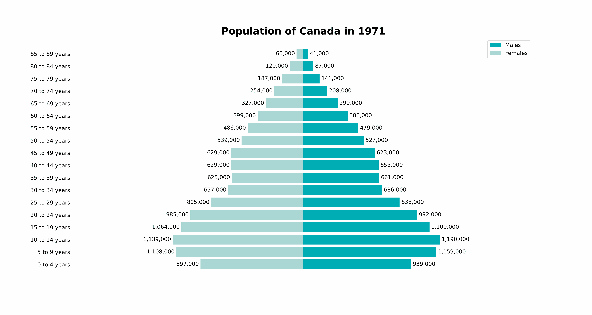
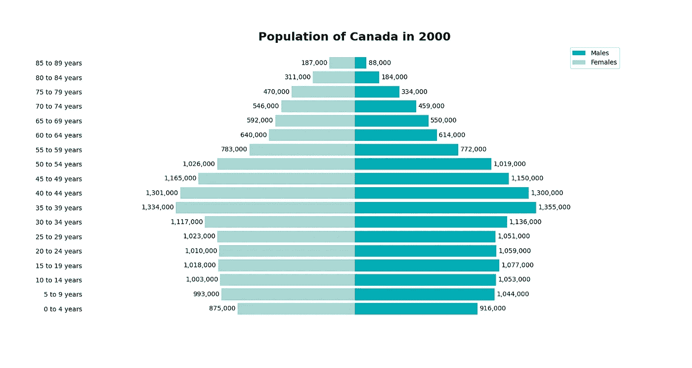

# 轻松制作 Matplotlib 图形动画

> 原文：<https://towardsdatascience.com/easily-animate-your-matplotlib-graphs-99b62db63697>

## 让 Matplotlib 动画更容易理解

由[卢卡斯·布拉塞克](https://unsplash.com/@goumbik?utm_source=medium&utm_medium=referral)在 [Unsplash](https://unsplash.com?utm_source=medium&utm_medium=referral) 上拍摄

将数据可视化制作成动画可以增加可视化的整体深度。例如，下面的示例将时间维度添加到数据可视化中。你可以很容易地看到不同年龄组的人口随着时间的推移是如何变化的。通过动画可视化，我们可以很容易地看到趋势随时间的变化，在详细的组。

考虑到 Matplotlib 中可用选项的广度，学习如何制作图形动画似乎是一项艰巨的任务。本教程旨在解决这个问题！

请看下图，看看我们今天要创造什么:

你将学会创造什么(来源:Nik Piepenbreier)

激动吗？让我们开始吧！

你可以在这里下载数据集[。它基于加拿大统计局免费提供的数据，描述了加拿大人口按年份、年龄组和性别的细分。](https://raw.githubusercontent.com/datagy/mediumdata/master/populations.csv)

# 创建基础可视化

Matplotlib 动画通过不同的可视化效果循环工作。因此，我们可以设置一个基本的可视化，然后创建一个 for 循环，根据数据变化修改可视化。

让我们先创建一个我们满意的基础可视化:

创建我们的基础可视化

代码太多了！让我们来分析一下我们在这里做了什么:

1.  我们导入了项目所需的库
2.  我们使用`read_csv()`函数读入数据
3.  我们应用了一些数据清理来使我们的数据达到最佳状态。我们向前填充缺失的年龄类别，将我们的人口数转换为整数，并将我们的女性人口数乘以-1，这样她们就出现在我们视觉的左侧
4.  然后，我们创建了一个图形和轴对象来保存我们的可视化
5.  然后，我们过滤我们的数据，使之可视化
6.  然后，我们使用`barh()`函数创建两个相互叠加的可视化效果，并添加我们的值作为标签
7.  最后，我们通过移除脊柱等来自定义我们的可视化。最后，我们设置一个标题来表示年份。

这将返回以下可视化结果:

您将创建的基本图像(来源:Nik Piepenbreier)

现在我们已经建立了基础，让我们创建我们的动画！

# 创建可视化

为了动画化我们的可视化，我们将使用`FuncAnimation`类。顾名思义，这个类使用函数来创建动画。在我们进一步讨论之前，让我们看一下类的定义:

了解 FuncAnimation 类

从上面的代码块中我们可以看到，我们需要传入三个关键参数:

1.  要使用的数字
2.  修改图形的功能
3.  对于每个帧，将什么数据传递到函数中

您已经做了大量定义图形外观的艰苦工作。很容易把它转换成一个函数！让我们看看如何做到这一点:

创建我们的动画功能

我们在上面的代码中所做的只是简单地将之前的代码转换成一个函数。该函数接受一个参数，即年份，稍后我们将使用我们的`frames=`参数填充它。

这里需要注意的是，我们还在函数中添加了第一行。`ax.clear()`调用清除了我们的 axes 对象，并允许我们使用函数重新创建它。

# 把所有的放在一起

让我们看看现在如何把这些放在一起。我们可以通过用我们的轴、函数和一组框架实例化它来创建一个`FuncAnimation`对象。

我们可以通过创建一个捕捉最小值和最大值的范围，使我们的框架对数据是动态的:

加入我们的动画(终于！)

在上面的代码中，我们首先创建我们的动画对象。然后，我们使用`PillowWriter`类将我们的动画保存为 GIF 文件。这允许我们自定义动画运行的速度。在上面的代码中，我们将其设置为每秒 5 帧。

# 结论

厉害！您已经创建了您的动画！创建动画数据可视化可让您以全新的方式浏览数据。在这种情况下，我们能够看到人口如何随着时间的推移而变化。添加动画并不总是一个好主意，但确实可以使数据交流更容易。