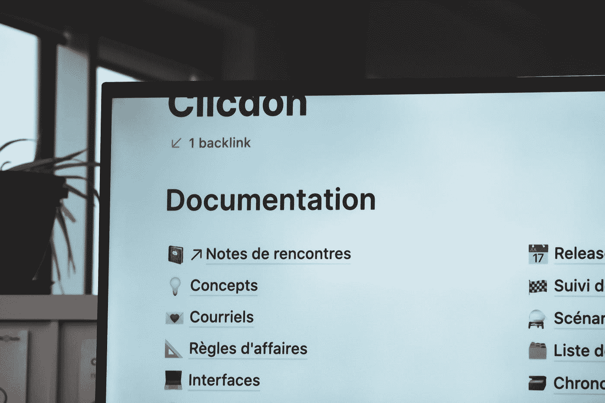

# 轻松自动化您的文档，再也不用碰它了

> 原文：<https://towardsdatascience.com/easily-automate-and-never-touch-your-documentation-again-a98c91ce1b95>

## 使用 MkDocs 的完全自动化的 Python 文档过程

作为开发人员，每个人最喜欢的方面是:维护文档化的代码，并在 GitHub 上为他们的开发伙伴托管文档。

当然，我是在开玩笑。文档常常是一项被忽视的任务，这使得新成员接管过时的代码库成为一项浪费且痛苦的任务。我们都经历过——在我之前的开发者在这里做什么？还有……这到底是怎么回事？

不会了。在 [Mkdocs](https://www.mkdocs.org/) 、 [Mkgendocs](https://github.com/davidenunes/mkgendocs) 、[我写的一个自定义脚本](https://github.com/jeremydiba/automatic-mkgendocs)和 GitHub 动作的帮助下，我们可以自动维护像这样的华丽文档！



照片由[西格蒙德](https://unsplash.com/@sigmund?utm_source=medium&utm_medium=referral)在 [Unsplash](https://unsplash.com?utm_source=medium&utm_medium=referral) 上拍摄

## 第一步——确保你的代码库有谷歌风格的 python 文档串

自动化的第一步只是将 [google 风格的文档字符串](https://sphinxcontrib-napoleon.readthedocs.io/en/latest/example_google.html)添加到 python 文件中。对于 atom 文本编辑器用户，我推荐使用 [docblock atom 扩展](https://atom.io/packages/docblock-python)来自动完成这项工作！

这一步并不是绝对必要的，但是以这种方式添加的任何文档字符串都将在接下来的步骤中被删除并添加到我们的站点中！这一步也可以在闲暇时逐步完成。您添加的文档越多，您的自动文档就越有成效！

## 步骤 2—安装必要的软件包

安装这两个包就这么简单！

```
mkgendocs==0.9.0
mkdocs==1.2.3
```

## 步骤 3——下载启动代码并将其添加到您的项目根目录中

点击下载启动代码[。这提供了三个有助于自动化的文件！](https://github.com/jeremydiba/automatic-mkgendocs/tree/main)

mkgendocs.yaml 该文件是 python 文件(例如 main.py)到其关联的文档文件输出(例如 docs/modules/main.md)。它还包含了我们希望包含在文档中的所有类和文件的列表。我们将自动创建这个映射，以及降价文件本身。

这个文件获取我们的文档文件(例如 docs/modules/main.md)，并将它们组织到站点文件夹中，以便创建站点地图。这也将由我们的脚本自动完成。

automate _ mkdocs . py——这个脚本受 Louis de Brujin 的[工作的启发，但我自己针对更多情况进行了进一步的扩展和优化，填充了 mkgendocs.yaml 和 mkdocs.yaml 文件。将包括所有存在且不包含语法错误的文件。目录结构的样式将反映您的软件包文件夹的设置方式。](/five-tips-for-automatic-python-documentation-7513825b760e)

花点时间填写 mkgendocs.yaml 和 mkdocs.yaml 的顶部，让它们成为您的项目所独有的！

[](/why-is-thunderbolt-3-such-a-huge-deal-and-why-apple-loves-them-614542d32dc2)  

## 第 4 步—立即创建文档！

运行以下命令:

```
python automate_mkdocs.py 
```

这将自动填充 mkdocs.yaml 和 mkgendocs.yaml 文件。

```
gendocs --config mkgendocs.yml
```

这个命令获取我们的 mkgendocs 文件，并生成我们的 markdown 文件！注意:您可能需要在根目录下创建 docs 文件夹。

我们现在可以使用以下工具测试和查看我们的文档:

```
mkdocs serve
```

当您对它在本地的外观感到满意时，我们可以用

```
mkdocs gh-deploy
```

就是这么简单！刚刚创建了一个新的分支来保存您的文档和自动生成的站点地图！如果您喜欢在每次更改文档时都运行这些命令，那么到此结束就好了，但是，我们还可以做一个进一步的优化，那就是设置 Github 操作，以便在每次我们推送到我们的主(或任何)分支时更新和部署我们的文档！

## 步骤 5——使用 GitHub 动作自动部署文档

如果你以前从未使用过 GitHub actions，我推荐你先熟悉一下这里的！并创建基本 yaml 文件。从那里，我们将添加命令到:

1.  设置我们的 python 版本并检查我们的代码
2.  安装需求并更新 mkdocs 和 mkgendocs
3.  建立或更新我们的降价文件
4.  部署我们的网站
5.  提交可能已经发生的任何更改
6.  将这些更改推送到关联的分支

这可能看起来很多，但一旦做到了，它会让生活变得容易得多！

注意:你的 GitHub actions 文件很可能是相似的，但是会根据你使用的 python 版本，选择的主题，以及你是否有额外的需求比如自定义站点或者 GitHub 推送限制而有所不同！

设置我们的 Python 版本并检查我们的代码。这相当简单！

```
- name: Checkout
        uses: actions/checkout@v1- name: Set up Python python-version
        uses: actions/setup-python@v1
        with:
          python-version: 3.7
```

安装需求并更新 mkdocs 和 mkgendocs——requirements . txt 文件应该包含项目的所有文件，包括在步骤 2 中安装的文件。

```
- name: Autogenerate new documentation
        continue-on-error: true
        run: |
          pip install -r requirements.txt
          python automate_mkdocs.py
          git add .
```

构建或更新降价文件——我为安装添加了一些额外的 pip 文件，尽管这些文件可能会被排除！我个人对 jinja2 包有问题。

```
- name: Update and Build GH Pages
        run: |
          python -m pip install --upgrade pip
          pip install mkdocs==1.2.3
          pip install mkgendocs==0.9.0
          pip install jinja2==2.11
          gendocs --config mkgendocs.yml
```

部署我们的站点——它使用了一个非常酷的自定义 GitHub 动作,并且有大量可选参数，包括设置自定义域！

```
- name: deploy docs
        uses: mhausenblas/mkdocs-deploy-gh-pages@master
        env:
          GITHUB_TOKEN: ${{ secrets.GITHUB_TOKEN }}
          #CUSTOM_DOMAIN: optionaldomain.com
          CONFIG_FILE: mkdocs.yml
          EXTRA_PACKAGES: build-base
          # GITHUB_DOMAIN: github.myenterprise.com
          # REQUIREMENTS: docs/docs_requirements.txt, separate requirements file to install any themes you may want on your site 
```

提交任何更改—我们使用“出错时继续”,因此如果没有更改，它不会失败！

```
- name: Commit any changes to docs
        continue-on-error: true
        run: |
          git config --local user.name "github-actions[bot]"
          git add ./docs
          git commit -m "Auto-updating the docs"
```

推送我们的更改—注意:您可以选择将这些更改推送至哪个分支

```
- name: Push the changes to master
        continue-on-error: true
        uses: ad-m/github-push-action@master
        with:
          github_token: ${{ secrets.GITHUB_TOKEN }}
          branch: master
          force: true
```

仅此而已！一旦您解决了任何部署难题，您现在就有了一个完全自动化的文档工作流！如果这真的对你有帮助，[这里有一个链接](https://ko-fi.com/davidenunes)指向 mkgendocs 捐赠页面的创建者。我给他寄了一笔小小的捐款，以表达我对制作这个包裹的感激之情！

我希望这篇文章对您的文档之旅有所帮助！这篇文章是我最喜欢写的文章之一。如果您认为需要回来参考，请务必保存/标记该故事！如果你喜欢这篇文章，请随意[关注我](https://jerdibattista.medium.com/)，阅读我写的更多内容，或者将我[作为推荐人](https://jerdibattista.medium.com/membership)，这样我就可以继续制作我喜欢的内容。

[](/the-best-python-sentiment-analysis-package-1-huge-common-mistake-d6da9ad6cdeb) 