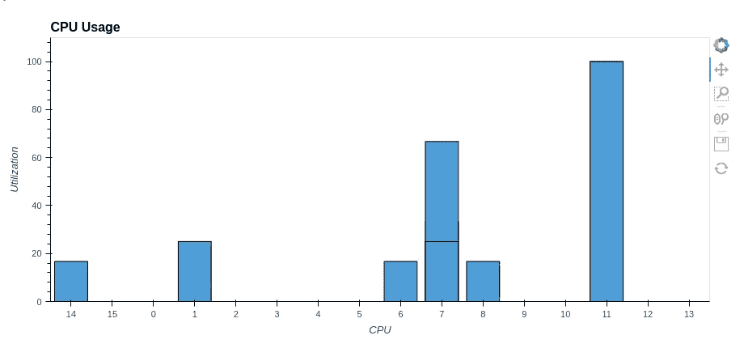
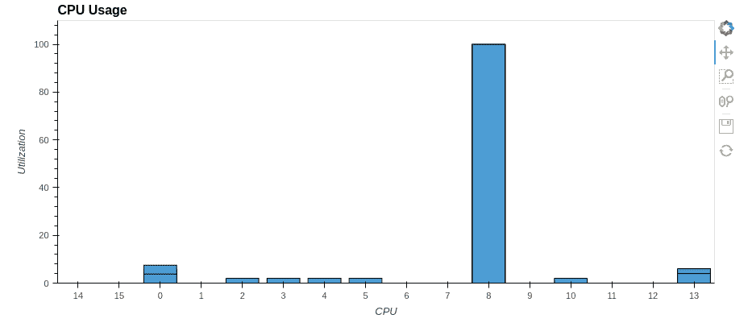
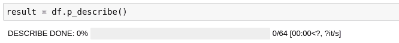
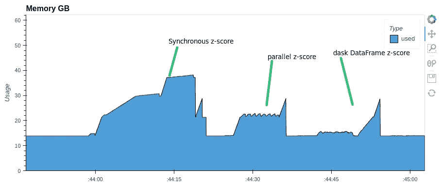

# 在 pandas 和 parallel-pandas 中轻松并行计算

> 原文：<https://towardsdatascience.com/easily-parallelize-your-calculations-in-pandas-with-parallel-pandas-dc194b82d82f>


由[菲利普·奥罗尼](https://unsplash.com/@philipsfuture?utm_source=medium&utm_medium=referral)在 [Unsplash](https://unsplash.com?utm_source=medium&utm_medium=referral) 上拍摄的照片

## 介绍

Pandas 是最受欢迎的数据科学图书馆之一。来自官方[文档](https://pandas.pydata.org/):

> **pandas** 是一个快速、强大、灵活且易于使用的开源数据分析和操作工具，构建于 [Python](https://www.python.org/) 编程语言之上

而每一个熟悉熊猫的人都会很有信心地证实这些话。与此同时，他们管道中的许多人面临着这样一个事实，即 pandas 没有充分利用 CPU 的能力。换句话说，pandas 方法不支持并发。

考虑一个简单的例子:

```
synchronous describe time took: 37.6 s.
```



(图片由作者提供)

从上图中可以看出，100%时只使用了一个内核。其余的无所事事。但是如果你使用所有的处理器内核呢？你能多快得到同样的结果，最重要的是——如何实现？

所以我们先想想 describe()是怎么工作的？它处理这些列，并为每个列计算一些统计数据。我们有一个包含 1000 列的数据框架。沿着第一个轴(沿着列)将我们的数据帧分成几个更小的部分，分别计算每个部分的 describe，然后将结果组合回一个公共数据帧，怎么样？让我们看看如何沿着指定的轴将数据帧分割成多个部分。这可以通过`**numpy**`模块的`array_split`功能轻松完成。让我们看一个简单的例子:

```
[   cat  dog
 0    0    0
 1    1    1
 2    2    2,
    cat  dog
 3    3    3
 4    4    4
 5    5    5,
    cat  dog
 6    6    6
 7    7    7,
    cat  dog
 8    8    8
 9    9    9]
```

并按列拆分

```
[   cat
 0    0
 1    1
 2    2
 3    3
 4    4
 5    5
 6    6
 7    7
 8    8
 9    9,
    dog
 0    0
 1    1
 2    2
 3    3
 4    4
 5    5
 6    6
 7    7
 8    8
 9    9]
```

因此，我们有了一个算法，可以将一个大的数据帧沿着我们需要的轴分割成更小的部分。下一步是什么？如何让我们 CPU 的所有核心都工作起来？众所周知，pandas under the hood 使用`[**numpy**](https://numpy.org/doc/stable/user/whatisnumpy.html)`数组和方法来处理它们，这通常会移除全局解释器锁(GIL)。因此，我们可以使用线程池来并行计算。让我们转向`[**concurrent.futures**](https://docs.python.org/3/library/concurrent.futures.html#module-concurrent.futures)`模块的`ThreadPoolExecutor`类的`map`方法:

> **map** ( *func* ， **iterables* ， *timeout=None* ， *chunksize=1* )
> 类似于`[map(func, *iterables)](https://docs.python.org/3/library/functions.html#map)`除了:
> 1。立即收集*可重复项*而不是延迟收集；
> 2。 *func* 异步执行，可以并发调用几次 *func* 。

在我们的例子中，`describe()`方法是函数，iterable 对象是数据帧列表。下面给出了实现管道的完整代码。

```
parallel desribe time took: 15.0 s.
```



(图片由作者提供)

所以我们将`pandas.DataFrame.describe()`方法的速度提高了两倍！类似地，您可以并行化其他的`pandas`方法。

## 平行熊猫简介

`[**parallel-pandas**](https://pypi.org/project/parallel-pandas/)`库在本地实现了上述`pandas`方法的并行化。首先，使用`pip`软件包管理器安装`parallel-pandas`:

```
pip install --upgrade parallel-pandas
```

只要两行就够入门了！

```
synchronous time took: 3.7 s.
parallel time took: 0.688 s. 
```

如你所见，`p_quantile`方法比**快 5 倍**！

一旦`parallel-pandas`被初始化，你继续照常使用熊猫。`pandas`方法的并行模拟以来自单词 **parallel** 的`p_`为前缀。此外，`parallel-pandas`允许您查看并行计算的进度。为此，在初始化期间指定`disable_pr_bar=False`就足够了。



带有进度条并行描述方法

如您所见，`parallel-pandas`负责将原始数据帧分割成块，并行化并为您聚合最终结果。

更复杂的计算可以以类似的方式并行化。例如，让我们对数据帧的列进行 z 规范化。同样，为了比较，我们用[**dask**](https://docs.dask.org/en/stable/dataframe.html)data frame 实现 z 归一化:

```
synchronous z-score normalization time took: 21.7 s.
parallel z-score normalization time took: 11.7 s.
dask parallel z-score normalization time took: 12.5 s.
```

注意内存消耗。`parallel-pandas`和`dask`使用的 RAM 几乎是`pandas`的一半



RAM 使用

对于某些方法，parallel-pandas 比 dask DataFrame 更快:

```
dask nunique time took:42.5 s.
dask rolling window mean time took: 19.8 s.
paralle-pandas nunique time took:12.5 s.
parallel-pandas rolling window mean time took: 11.8 s.
```

`parallel-pandas`实现了许多熊猫方法。完整列表可在[文档](https://pypi.org/project/parallel-pandas/)中找到。

**总结一下:**

*   在本文中，我们简要回顾了并行化`pandas`方法的思想，并以`describe`方法为例实现了它
*   我们还熟悉了`parallel-pandas`库，它使得基本`pandas`方法的并行化变得容易。
*   我们还使用几个例子将`parallel-pandas`的工作与另一个著名的分布式计算库`dask`进行了比较。

希望这篇文章对你有帮助，祝你好运！