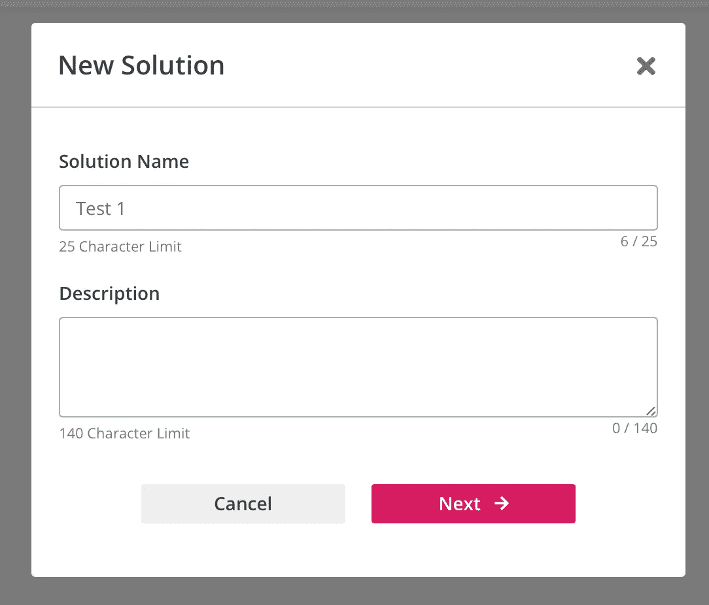
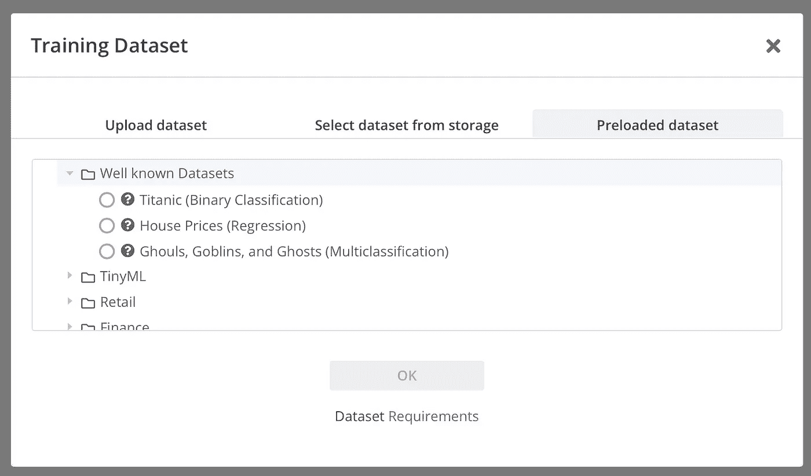
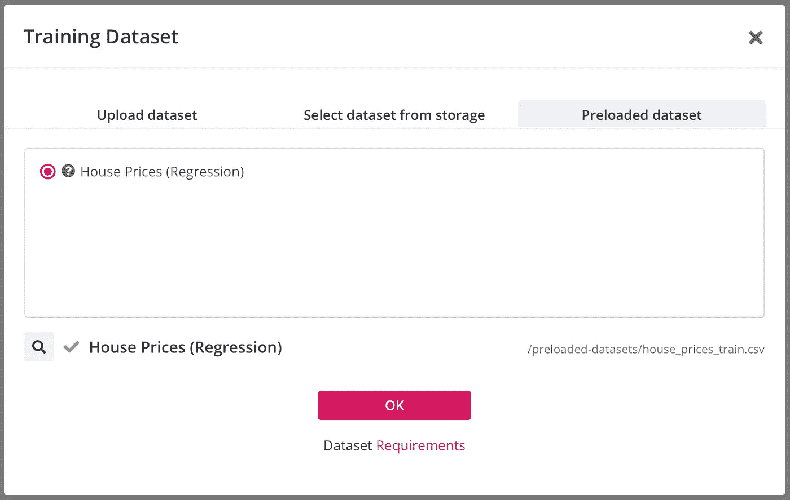
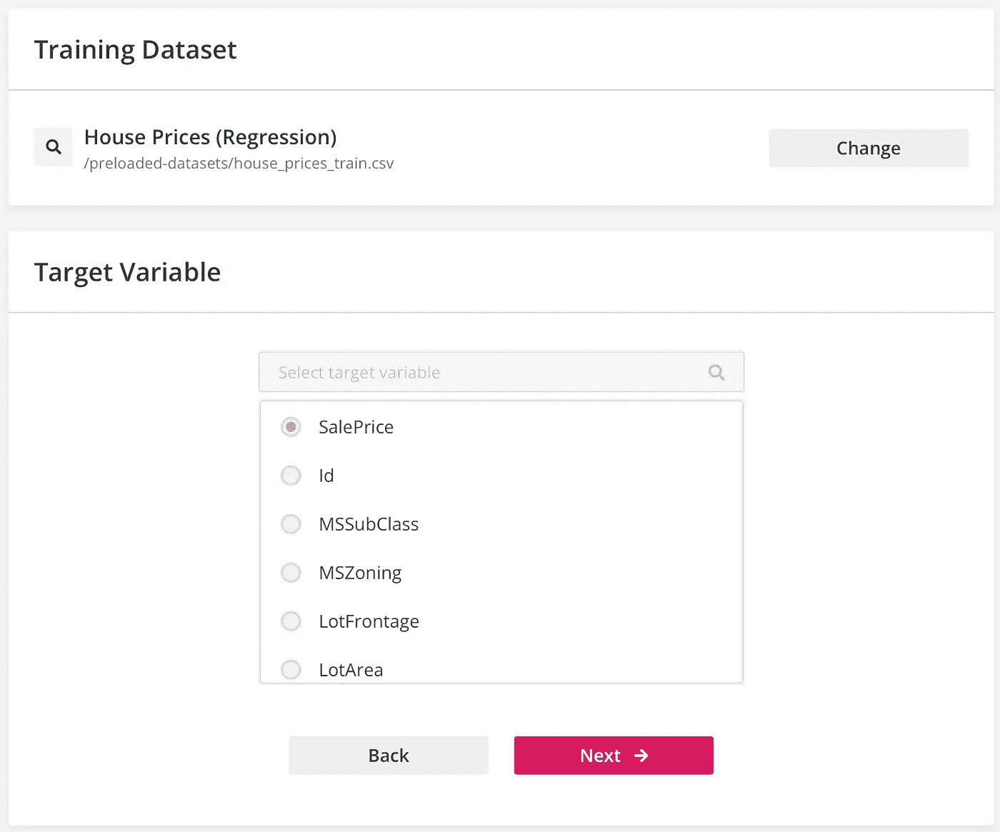
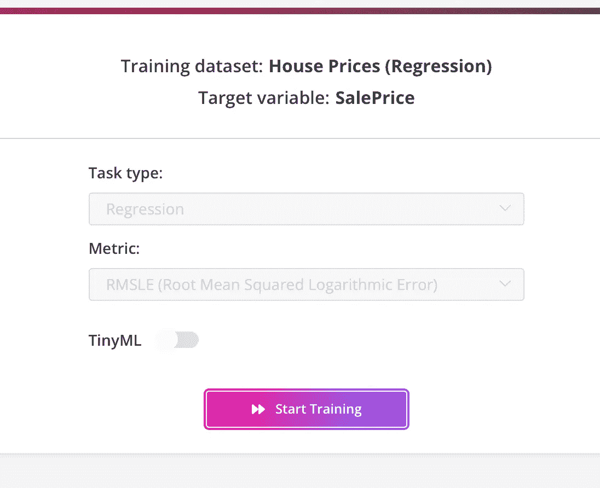
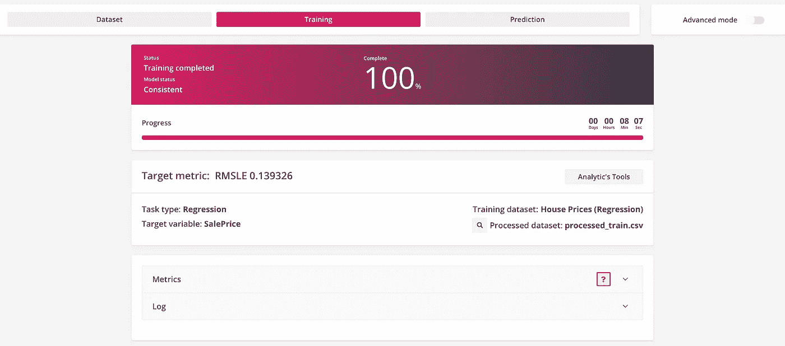
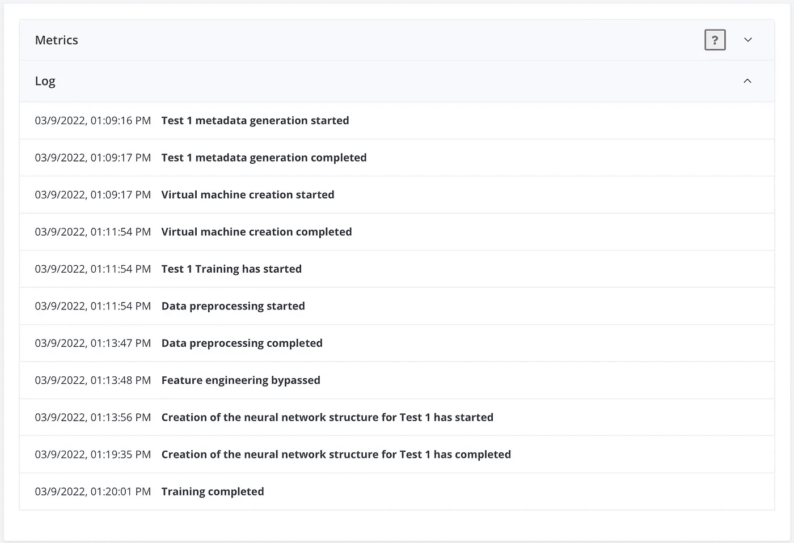
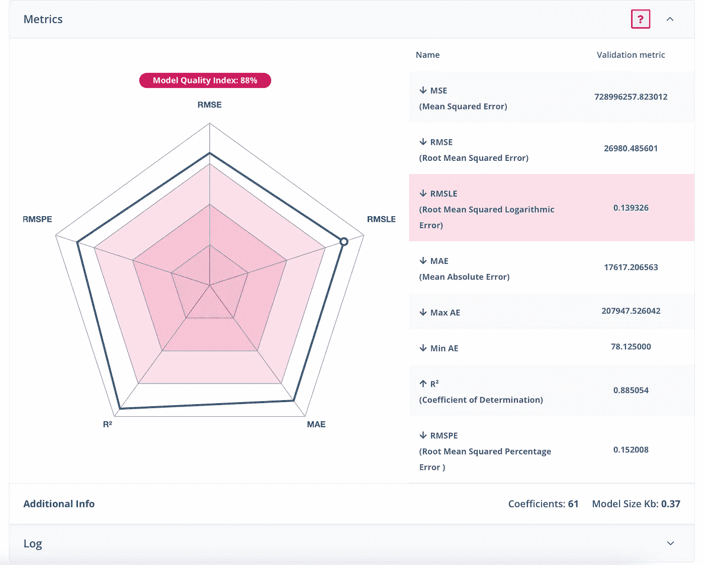
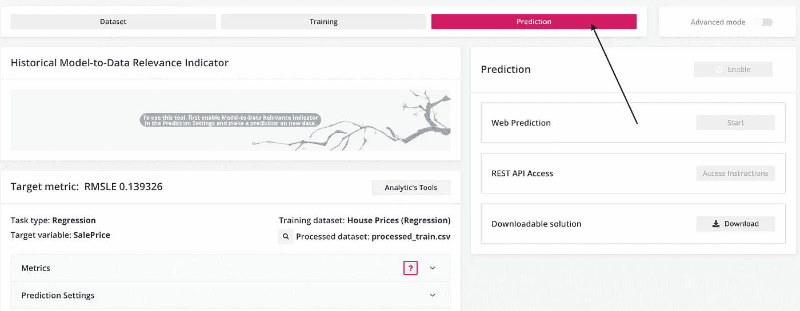

# 用内乌顿自动语言实现简单的机器学习

> 原文：<https://towardsdatascience.com/easy-machine-learning-with-neuton-automl-881437a09061>

内乌顿汽车公司房价数据的探索性数据分析。作者创造的形象。

在过去十年中，机器学习(ML)领域在应用科学、社会科学、商业和经济学的不同领域中的应用蓬勃发展。ML 是困难的，找到最佳算法需要用户大量的经验、精力和直觉。

由于多种因素导致 ML 的复杂性增加，在过去几年中，出现了自动 ML 的激增。自动 ML 的目标是尽可能简化用户与底层 ML 算法的交互。仅举一个例子，Tableau、Power BI 等几个 BI 应用。在许多情况下，通过最大限度地减少用户输入，只需很少的点击即可执行 ML 算法。

即使 [Tableau](https://www.tableau.com/learn/articles/machine-learning-examples) 或者 PowerBI 可以进行回归、分类等 ML 算法。它们不是执行复杂 ML 算法的最佳选择。现在很多 ML 算法通常都是用 Mathematica，Python，Matlab，Octave 等来做的。当一个人必须执行复杂的 ML 算法时，这些软件通常是最好的选择。

然而，随着技术和人工智能的进步，商业领域的许多公司可能没有预算(或想省钱)来负担员工执行 BI ML 算法。在这方面，这种类型的公司可能会寻求能够通过最大限度地减少用户与底层 ML 算法的交互来几乎不用代码执行 ML 的软件。这个软件之一是[内乌顿-AutoML](https://neuton.ai) 。在这篇文章中，我讨论了内乌顿-AutoML 的最重要的方面，以及为什么它在许多方面对那些不太了解 ML 但却不得不在业务中使用的大公司非常有用。

# 什么是内乌顿汽车公司，它做什么？

内乌顿是一个使用 ML 的神经网络框架，无需从用户端编写代码。它不是基于一个预先存在的框架，而是利用 TinyML 来解决用户可能遇到的不同的 ML 问题。

许多最大似然算法的一个关键问题是，由于它们的复杂性和在训练过程中使用的大量数据，这些算法在计算机云上运行并消耗大量能量。由于这个原因，在过去的几年里， [TinyML](https://www.tinyml.org) 领域有了显著的发展。ML 的这一新领域的目标是在微控制器上使用 ML 算法，以尽可能减少执行算法时使用的能量。

内乌顿是一个获得专利的神经网络框架，不是基于预先存在的算法。它有四个主要特征，使得修剪、量化和提取变得不必要，也不需要最终的模型压缩。这四个主要特征是:

1.  ***专利优化算法*** *。*内乌顿算法使平台的计算不基于误差的反向传播和随机梯度下降。这使得遇到局部最小值的可能性最小化。
2.  ***无需用户手动搜索神经网络参数。*** 该功能使用户无需随机搜索参数，如层数、批量、学习率。
3.  ***逐神经元结构生长。*** 该功能可以从一般特征到最具体的特征进行学习，并选择解决问题所需的几乎任何模型精度和尺寸。
4.  ***有选择地接近选中的特征。*** 内乌顿的这一特性有助于在创建模型时只建立必要的神经元连接，不允许结构随机增长。

# 内乌顿的实际方面

要使用内乌顿，你只需在内乌顿的官方网站注册。我将不描述这个过程的必要步骤。我在这篇文章中的重点是内乌顿的实践和技术方面。

与任何 ML 过程一样，第一步是获取数据集并清理它。在这方面，内乌顿对数据集的类型及其要素数量有一些限制。*训练数据*必须满足的一些数据集特征如下:

1.  数据集必须是使用 UTF 8 或 ISO-8859–1 编码的 CSV 文件。
2.  数据集必须至少有 2 列或 2 行。
3.  数据集不能有任何空列。
4.  注意重复行:在预处理阶段，将从训练集中删除重复行，这可能导致与数据集最小大小和样本数要求不一致。
5.  数据集中的第一行必须包含列名，并且必须使用逗号、分号、竖线、插入符号或制表符作为分隔符。CRLF 或 LF 应该用作行字符的结尾。数据集中的分隔符和行尾字符应该一致。
6.  所有列名必须是唯一的，并且只能包含字母(a-z、A-Z)、数字(0–9)、连字符(-)或下划线(_)。
7.  所有空值都必须从目标变量中排除。
8.  对于回归任务类型，目标变量必须只有数值。
9.  对于分类任务类型，必须为每类目标变量提供至少十个样本。

其他细节可以在内乌顿的[用户指南](https://neuton.ai/uploads/user-guide.pdf)文件中找到。一个关键的方面是数据集文件必须是 CVS 格式。类似的信息可以在*测试数据集*中找到。

一旦选择了数据集，接下来的内乌顿最大似然算法步骤如下:

1.  **选择数据进行训练**
2.  **训练选中的模型**
3.  **做出预测**

为了帮助您更清楚地了解内乌顿汽车公司是如何工作的，我将展示几幅房屋数据集训练测试程序的图像。注册内乌顿网站后，点击“添加新解决方案”按钮，将出现以下窗口:

图一。“新建解决方案”对话框。作者创造的形象

点击“下一步”后，您将看到一个新的对话窗口。通过单击预加载数据集选项卡，您将看到以下窗口:

图二。训练数据集选项。在本文中，我使用预先加载的房价数据集。

在图 2 中，我勾选了房价(回归)选项，然后单击 OK 继续。之后，出现以下对话框:

图 3。作者创造的形象。

点击“确定”按钮，将出现以下对话框:

图 4。选项来选择目标变量。作者创造的形象。

在图 4 中，可以选择将哪个特征用作目标变量 *y* 。在这个例子中，我选择 SalePrice 变量作为目标变量。单击“下一步”按钮，您将看到以下窗口:

图 5。开始训练程序

在图 5 中，对话窗口给予用户选择任务类型的可能性，例如回归、分类等。，以及度量的类型。在这种情况下，软件默认选择 RMSLE。这是因为在这个训练程序中，我使用了**基本模式**，这是新用户的默认计划，并且是免费的。详情可在内乌顿[用户指南](https://neuton.ai/uploads/user-guide.pdf)中找到。

# 培训结果

一旦在**基础模式下开始训练，**内乌顿默认获取训练数据集(由内乌顿或用户预加载)并将数据拆分成**训练数据集**和**验证数据集**。如果用户选择**高级模式**计划，则可以选择加载验证数据集，而无需对原始数据集进行训练测试分割。

在培训过程结束时，内乌顿将为基本模式用户显示以下窗口

图 6。培训过程结束。作者创造的形象。

从图 6 中可以看出，在训练过程结束时，内乌顿向用户提供了所获得结果的详细信息。例如，训练模型大约需要 8 分 7 秒。如果点击图 6 中的“日志”按钮选项，将显示以下信息

图 7。内乌顿在培训过程中采取的步骤。作者创造的形象。

从图 7 中可以看出，内乌顿基本上是从创建一个虚拟机开始的，然后是预处理数据，然后是特征工程，等等。如果用户单击“Metrics”按钮，则会显示以下信息

图 8。培训过程的模型质量和度量指标。作者创造的形象。

在图 8 中，有训练测试分割过程的度量指标的总结。结果是通过将学习的函数应用于验证测试而获得的。可以看出，MSE 误差相当大，正如人们对房价数据集的预期。内乌顿默认选择非常小的 RMSLE 误差，RMSLE = 0.139326。

要查看模型是否运行良好，还可以使用决定系数 R =0.88，这是一个非常好的输出结果。所有这些指标给出不同的结果，这完全取决于用户使用哪一个以及如何解释它。

在图 8 所示的训练测试结果之后，可以使用训练模型来对训练测试过程中未使用的看不见的数据进行预测，如下图 9 所示

图 9。模型预测选项选项卡。作者创造的形象。

# 结论

在这篇文章中，我讨论了最重要的特点，内乌顿汽车用于 ML。作为一个例子，我使用了 ***房价*** 数据集来说明内乌顿如何在给定的数据集上执行 ML。

你或你的公司应该使用内乌顿汽车吗？这个问题的答案取决于几个因素，但从技术和实用的角度来看，我强烈推荐。正如我在本文开始时已经提到的，内乌顿 AutoML 的主要目标之一是尽可能地减少编写代码的用户算法。在这方面，内乌顿做得非常出色，因为几乎所有的 ML 流程都是自动化的，如上图所示。

有了内乌顿，人们根本不需要执行 EDA。唯一的要求是那些必须在 CSV 等格式的训练数据集。正如我上面讨论的。尽管执行 ML 解决方案不需要任何代码，但决定使用内乌顿的个人或公司需要了解一些基本的 ML。事实上，他们需要知道什么是特征变量，什么是输出。他们还需要知道如何解释图 8 所示的输出结果，以评估模型的准确性。

内乌顿在当前阶段需要改进的一点是，让用户不仅可以使用 CSV 格式的数据集，还可以使用其他格式的数据集。此外，我认为**支持库**不应该依赖 ***维基百科*** 链接来指引用户到特定的定义。事实上，维基百科是一个公共百科全书，不时会有关于 ML 度量等的定义。，可能会发生变化，可能与其他 ML 学习材料不一致。

## 如果你喜欢我的文章，请与你可能对这个话题感兴趣的朋友分享，并在你的研究中引用/参考我的文章。不要忘记订阅将来会发布的其他相关主题。