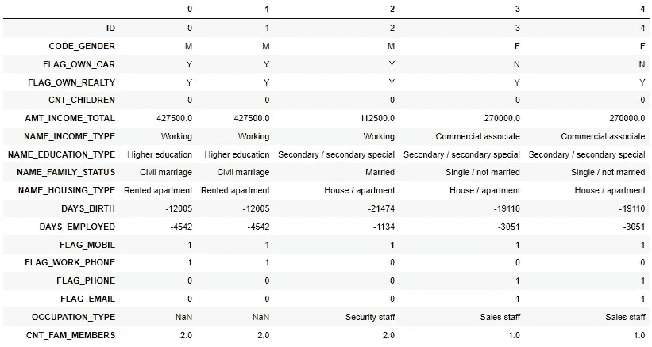
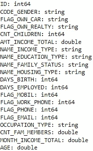
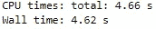
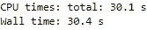
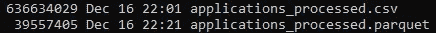
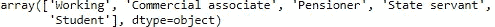
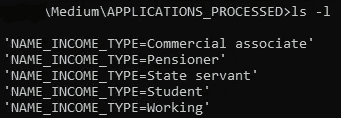
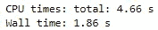
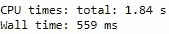

# 简单拼花教程和最佳实践

> 原文：<https://towardsdatascience.com/easy-parquet-tutorial-best-practices-237955e46cb7>

## *开始学习拼花地板的实践教程*


[杰瑞登·维勒加斯](https://unsplash.com/@jeriden94?utm_source=medium&utm_medium=referral)在 [Unsplash](https://unsplash.com?utm_source=medium&utm_medium=referral) 上的照片

*Parquet* file 是一个文件存储系统，它改变了任何与几个数据用户之间的日常数据操作有关的人的生活，例如*数据工程师*、*数据科学家*、*分析工程师*以及其他技术角色。

*拼花*的原理在于其**面向列的**存储，以及数据沿着*列*比沿着行更加*同质*的事实，提供了数据的优化压缩，从而导致**更小的存储大小**和**增加的处理速度**。

在本教程中，我们将概述一些最佳实践，让你开始学习镶木地板。

# **加载数据**

首先，我们将使用一个公开的信用卡应用数据集。数据集可在 Kaggle 上获得:[信用卡审批预测| Kaggle](https://www.kaggle.com/datasets/rikdifos/credit-card-approval-prediction) 。

获取这些数据最简单的方法是在您的环境中安装Kaggle API，提取数据并将归档文件解压到您的工作文件夹中:

```
pip install kaggle
kaggle datasets download -d rikdifos/credit-card-approval-prediction
unzip credit-card-approval-prediction.zip
```

让我们加载教程所需的包。6.0.0 以上的 **pyarrow** 任何版本都可以。

```
import pandas as pd
import numpy as np
import pyarrow as pa
```

在 zip 存档中，您将拥有 *credit_record.csv* (关于客户每月信用状况的数据集)和 *application_record.csv* (关于客户的信息)。为了简单起见，我们只对 zip 存档中的*应用程序记录. csv* 文件感兴趣。

为了让事情变得有趣，我们将复制数据 10 次并重置 id，使数据帧大约有**400 万**行和 **18** 列。

```
applications = pd.read_csv('application_record.csv')
applications = pd.concat(10*[applications]).reset_index().drop(columns=['ID','index']).reset_index().rename(columns={'index':'ID'})
```

以下是数据帧前 5 行的概述(面向列):

```
applications.head(5).T
```



我们注意到名为 *FLAG_X* 的变量不共享相同的输出类型，将它们规范化为布尔值应该是一个合理的选择。

首先，让我们构建一些简单的功能，即家庭收入和申请人年龄的月度版本:

```
applications['MONTH_INCOME_TOTAL'] = applications['AMT_INCOME_TOTAL']/12
applications['AGE'] = - np.floor(applications['DAYS_BIRTH']/365)
```

现在，我们希望与其他数据用户共享这些数据。为此，我们将以 CSV 和 parquet 格式将数据保存到其他用户可以访问的一些路径中。但在此之前，我们先来看看模式的概念。

# **模式**

对于 parquet 文件，一个非常有价值的实践是定义数据集的**模式**。原因是，这将显著提高您正在共享的数据的一致性和健壮性，在用户之间传输数据时，列上不会出现任何*类型的*模糊性。

要获得 pandas DataFrame 的**模式**，只需使用 *pyarrow 的 *from_pandas* 。模式*。在内部，该函数将 DataFrame 列的类型与 *pyarrow* 能够理解的类型进行匹配，以用于 *Parquet* 文件。

```
my_schema = pa.Schema.from_pandas(applications)
my_schema
```



从上面的**模式**中，我们注意到我们最好做两个操作:

flags 变量实际上是**布尔值** (1/0)，这样存储它们除了避免任何*类型*模糊性之外，还会节省我们的存储空间。
- **出生天数**与**年龄**重复，可以删除。

**Schema** 可以轻松完成这两种操作(类型转换和变量过滤)。该方法集用于用第二个参数更新第*个* 列，该参数应该是一个 **pyarrow.field** 对象。

```
my_schema = my_schema.set(12, pa.field('FLAG_MOBIL', 'bool'))
my_schema = my_schema.set(13, pa.field('FLAG_WORK_PHONE', 'bool'))
my_schema = my_schema.set(14, pa.field('FLAG_PHONE', 'bool'))
my_schema = my_schema.set(15, pa.field('FLAG_EMAIL', 'bool'))
my_schema = my_schema.remove(10)
```

现在让我们比较一下保存*拼花*和 *CSV* 文件的执行时间:

```
%%time
applications.to_parquet('applications_processed.parquet', schema = my_schema)
```



```
%%time
applications.to_csv('applications_processed.csv')
```



以 *CSV* 格式存储不允许任何*类型*声明，与*拼花*模式不同，并且在执行时间上有显著差异，以*拼花*格式存储比以 *CSV* 格式存储快 5-6 倍。

您刚刚见证了由*拼花*文件提供的处理速度。

为了减少存储大小，在本例中,*拼花*文件的存储差几乎是 **20** 乘以*便宜*(CSV 为 636MB，拼花为 39MB)。



总的来说，处理速度和存储减少是 *Parquet* 文件的主要优势，但不是唯一的优势。

# 创建分区

另外，关于 *Parquet* 非常有趣的一点是，您可以通过**分区**来分割数据，这意味着将与*分区名称*上的相同值相关的信息组合在一起。

您可以将数据分区视为将图书馆中相同类型的书籍排列在一起。就像整理书籍一样，它有许多优点:

*   数据的**用户**可以访问指定的一组数据，显著提高了*加载速度*，降低了 *RAM 消耗*
*   数据的**生产者**可以*并行化*处理，允许*数据大小*的可伸缩性和*运行时间*的可伸缩性减少

下面我将向您展示如何产生 *Parquet* 分区数据。

从列 *NAME_INCOME_TYPE，*中，我们观察到只有 5 个不同的值涉及客户的职业活动类别。



现在假设，我们作为数据的*制作者*，想要保存到*拼花*文件，但是在这个列上分区，因为数据的*用户*有兴趣分别查看那些专业活动:

```
applications.to_parquet('APPLICATIONS_PROCESSED', schema = my_schema, partition_cols=['NAME_INCOME_TYPE'])
```

注意，当我们保存到具有一个或多个**分区**列的 *Parquet* 时，我们必须提供一个**文件夹路径**而不是一个 *Parquet* 文件路径，因为方法 *to_parquet* 将创建关于 *partition_cols* 所需的所有子文件夹和 *Parquet* 文件。

生成的 *APPLICATIONS_PROCESSED* 文件夹现在根据信用申请人的 *NAME_INCOME_TYPE* 为每个信用申请人类别包含一个文件夹。



现在，对特定专业类别进行分析或决策选择感兴趣的最终用户，如*【国家公务员】*可以以很快的速度加载数据，并且只针对这群信贷申请人。

# 读取分区

我们将数据创建为分区的 *Parquet* 文件。

但是*用户*如何访问它们呢？这是我们从数据的*用户*的角度将要看到的。

有几种方法可以读取*拼花*文件。

如果它是由*生成器*生成的，没有*分区*列，并且假设我们，作为一个用户，对是“*工薪阶层”*的候选人感兴趣，我们必须写:

```
%%time
test = pd.read_parquet('applications_processed.parquet')
test[test.NAME_INCOME_TYPE=='Working']
```



这个操作花了将近 5 秒，仍然比在 *CSV* 中读取要好，但不是最佳的，因为*用户*正在加载所有数据并在那之后过滤它们。这意味着我们在浪费宝贵的*内存*和计算*时间*。

我们刚刚看到了分区的存在，一个熟练的数据工程师生成了由 *NAME_INCOME_TYPE* 分区的数据，这样我们就可以通过简单地加载感兴趣的分区来加快读取时间并减少 RAM 消耗。

有两种方法可以在相似的执行时间内完成:

*   我们可以直接将 *NAME_INCOME_TYPE* 的分区路径读作“*Working”*
*   或者我们可以使用 filters list 参数以同样的方式到达分区。过滤器选项会查看文件夹中的所有分区，并选择符合您条件的分区，这里是*NAME _ INCOME _ TYPE**=**‘正在工作’，而不是直接进入路径。*

下面列出了两种可能性:

```
%%time
pd.read_parquet('APPLICATIONS_PROCESSED/NAME_INCOME_TYPE=Working/')
# OR (the run-time below corresponds to either one of way of reading)
pd.read_parquet('APPLICATIONS_PROCESSED', filters=[('NAME_INCOME_TYPE', '=', 'Working')])
```



你看到*速度*增加了吗？速度快了 3 倍，而且你不必加载全部数据，节省了你机器上的大量内存。

这两种读取分区数据的方法有一个区别，但在我们的例子中几乎察觉不到:使用过滤器读取数据取决于内部分区的数量。实际上，这里我们在 *NAME_INCOME_TYPE，*上只有 5 个分区，所以读取数据的路径和过滤器方法之间的*运行时*是相同的。然而，如果我们有 1000 个分区，运行时的差异将会很大，因为 *Apache Parquet* 必须发现所有的分区，并返回与您的过滤器匹配的分区。

然而，我强调这样一个事实，用过滤器读取在灵活性和容量方面要强大得多，如果运行时的*权衡*可以接受的话，我强烈建议您尝试一下。

一个简单的例子是，如果您想专门读取两个或更多的分区(但不是所有的分区)，那么您无法使用路径读取有效地做到这一点，但是使用过滤器，您可以做到。

例如，如果我们不仅对标准的*【工作】*申请人感兴趣，而且对*【国家公务员】*申请人也感兴趣:

```
filters = [('NAME_INCOME_TYPE', 'in', ['Working', 'State servant'])]
pd.read_parquet('APPLICATIONS_PROCESSED', filters=filters)
```

您也可以通过给出文件夹路径 *:* 来加载整个数据，即使它是在 *NAME_INCOME_TYPE* 上分区的

```
pd.read_parquet('APPLICATIONS_PROCESSED')
```

请注意，在生成的数据帧上，列 *NAME_INCOME_TYPE* 是存在的，而如果您正在读取 *NAME_INCOME_TYPE* 的分区，则它是隐藏的。

这是正常的行为:通过简单地读取分区，分区数据上的*Apache**Parquet*假设您已经知道这个列是针对这个特定的已过滤分区值而存在的(因为您告诉他根据 *NAME_INCOME_TYPE* 进行过滤)，所以它不会在输出数据帧中重复该列，因为它只是一个具有唯一值的 *NAME_INCOME_TYPE* 的列。

总之，我们概述了使用 *Parquet* 的最佳实践，包括定义一个模式和划分数据。我们还强调了使用*拼花*文件在*处理速度*和*存储效率*方面的优势(在*硬盘*和 *RAM* 上)。此外，我们还考虑了数据用户的观点以及使用 *Parquet* 文件的相关性和简单性。

用我的其他文章继续学习拼花地板:

</parquet-best-practices-discover-your-data-without-loading-them-f854c57a45b6>  <https://pub.towardsai.net/parquet-best-practices-the-art-of-filtering-d729357e441d>  

*无需额外费用，您可以通过我的推荐链接订阅 Medium。*

<https://medium.com/@arli94/membership>  

或者你可以在收件箱里收到我所有的帖子。*[***做到这里*** *！*](https://arli94.medium.com/subscribe)*