# 可解释的助推机器:弥合 ML 和可解释性之间的鸿沟

> 原文：<https://towardsdatascience.com/ebm-bridging-the-gap-between-ml-and-explainability-9c58953deb33>

## 什么是可解释性，为什么它很重要？

安德烈·德·森蒂斯峰在 [Unsplash](https://unsplash.com/s/photos/ai?utm_source=unsplash&utm_medium=referral&utm_content=creditCopyText) 上拍摄的照片

## **什么是可解释性，为什么它很重要？**

人工智能在过去几十年中不断发展，已经在各个领域找到了应用，包括医疗保健、军事、银行和自动驾驶汽车等关键系统。然而，很多时候，许多机器学习模型的黑盒性质阻碍了它们的采用。例如，在商业中，机器学习的应用将是预测未来销售、预测客户流失、锁定客户等。黑箱模型或许能够准确预测未来的销售或客户流失，但它无法解释不同的因素如何影响产出。这在银行业等行业尤其重要，因为这些行业受到监管机构的监管，这些机构要求其模型透明、结构公正。此外，对模型决策的理解有助于企业理解不同因素如何影响其业务，更好地为不确定的未来做准备，并做出更好的战略决策。这是通过可解释的或玻璃盒子的 ML 模型提供给他们的。

机器学习中的可解释性指的是模型或建模技术解开模型内关系的能力。根据算法提供的可解释性水平，机器学习模型可以大致分为两类:玻璃盒模型和黑盒模型。本文探讨了什么是玻璃盒模型和黑盒模型，是什么赋予了玻璃盒模型的可解释性，以及一种称为可解释助推机(EBM)的玻璃盒模型。

**玻璃盒型号:**

这些都是固有解释的模型。属于这一类的两个最简单的模型是线性回归和逻辑回归。以逻辑回归为例，它将概率预测为一个或多个独立变量的线性组合的函数。这个模型的等式可以写成:

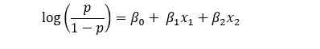

作者图片

其中 p 是事件发生的概率，log(p/(1-p))是事件的对数概率。这种将对数概率表示为独立变量的线性组合的能力使得该模型具有可解释性。对于这个逻辑回归模型，可以说变量 x1 的单位变化改变了事件的对数概率β1。注意，为了便于解释，因变量不需要与自变量具有线性关系。例如，即使是以下形式的“广义加性模型”

作者图片

是可以解释的，因为你可以估计任何变量 x 的变化是如何影响目标 y 的

**黑盒模型:**

在这些模型中，自变量和因变量之间的关系并不明显。诸如随机森林、梯度增强树和神经网络之类的算法是一些黑盒模型。

为了进一步说明黑盒的概念，考虑一个简单回归树的例子，它具有以下数学形式:

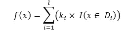

作者图片

其中，ki 是常数，I(。)是一个指示函数，如果其参数为真，则返回 1，否则返回 0。

和 Di 是训练数据的不相交分区。下面的例子说明了这个等式:

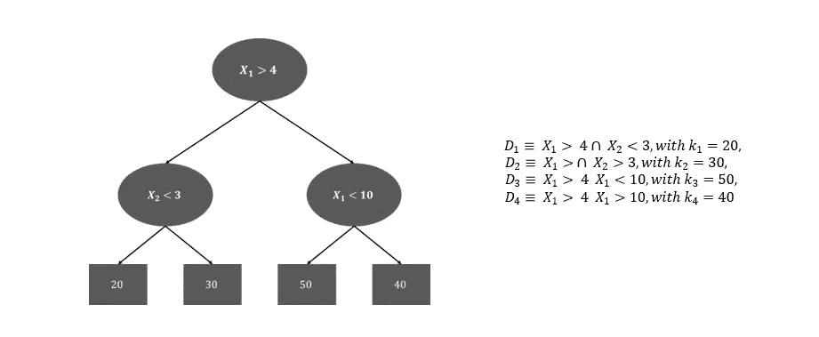

作者图片

使用上述等式的更简洁的表示，我们得到:

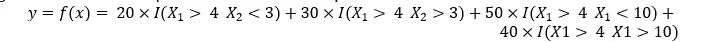

作者图片

然而，玻璃盒模型虽然可以解释，但与黑盒模型相比往往不够准确。EBM 试图通过提供一个与一些黑盒模型一样准确同时又保持相当可解释性的解决方案来弥合这一差距。

**可解释增压机**

**什么是循证医学？**

EBM 是一个广义的加法模型，它使用梯度推进和浅回归树的集合[1]。因此，简单地说，循证医学是以下形式的广义函数

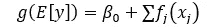

作者图片

其中 g(。)是一个链接函数(类似于广义线性模型)。该模型使用非常低的学习率在“循环周期”中一次训练一个特征，因此特征顺序无关紧要[1]。

因此，在迭代 1 中:

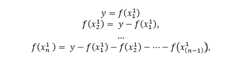

作者图片

在迭代 2 中:

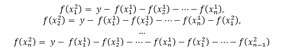

作者图片

这一直持续到迭代 r。每个特征的最终函数是通过将该特征的所有函数相加而获得的，即

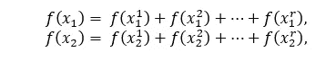

作者图片

诸如此类。

对于每一个特征，EBM 计算一个 f(xi)对 xi 表，用它来产生得分对 xi 图，帮助理解 xi 和易之间的关系以及每一个特征对易预测的贡献。然而，循证医学并不止于此。它还包括变量之间的二维相互作用。由于二维交互仍然可以在二维平面上呈现为热图，因此包含二维交互的模型仍然是可解释的。因此，EBM 的最终形式可以表示为:

作者图片

传统上，确定交互项在所需的计算能力方面是复杂的，尤其是对于具有大量变量的大型数据集。EBM 通过提出两阶段构建方法和使用 FAST 有效地对成对交互进行排序来解决这个问题。这种方法的两个阶段是:

1.在第一阶段，仅使用一维组件构建最佳的附加模型。

2.在阶段 2 中，固定一维函数并为残差上的成对相互作用构建模型，即，使用 FAST 选择前 K 个相互作用对，并使用残差 R 上的对来拟合模型，其中 K 是根据计算能力选择的。[2]

由于 EBM 通过将每个特征的贡献相加来计算最终输出，因此很容易可视化和理解各个特征和交互项的贡献。然而，由于预测的这种模块化，EBM 必须支付额外的训练成本，这使得它比类似的方法要慢一些。但是这并没有使它在预测过程中变慢，因为进行预测涉及到简单的加法和特征函数内部的查找。事实上，这使得 EBMs 成为预测中执行速度最快的模型之一[1]。

**循证医学实例:**

在下面的例子中，我使用了来自 Kaggle [3]的信用卡欺诈检测数据集。根据 ODC ODBL 许可协议，该数据集可供用户自由共享、修改和使用。

**数据集描述:**

该数据集包含欧洲持卡人在 2013 年 9 月的信用卡交易。数据集高度不平衡，正类(欺诈)占所有交易的 0.172%。它包含从 V1 到 V28 的特征，这些特征是在 PCA 之后获得的。不使用 PCA 进行转换的唯一特征是时间(数据集中第一次和每次交易之间经过的秒数)、数量(每次交易中使用的数量)和类别(目标变量)[3]。

**循证医学模式:**

由于数据已经被处理，我们将直接进入建模部分。

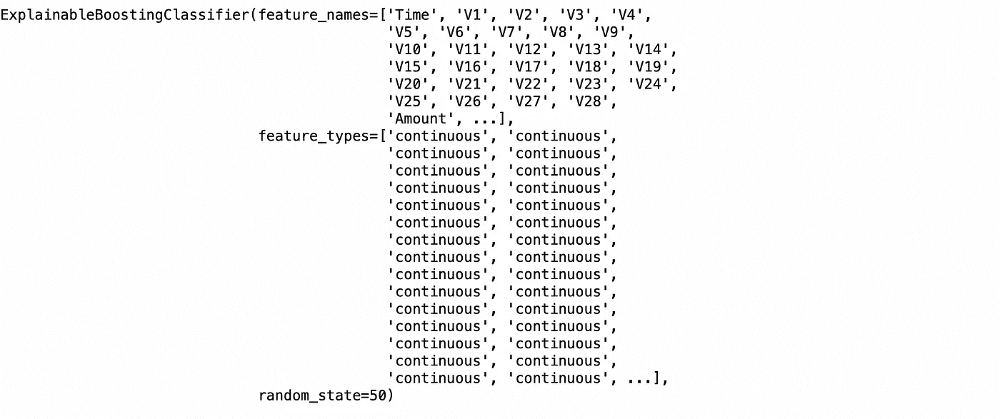

作者图片

一旦我们有了模型，让我们看看模型是如何表现的。循证医学提供了两种解释:全局和局部。

**全局解释:**

全局解释有助于我们理解特性对模型的整体贡献，以及每个特性与模型的关系。

1.  了解特征对模型的整体贡献

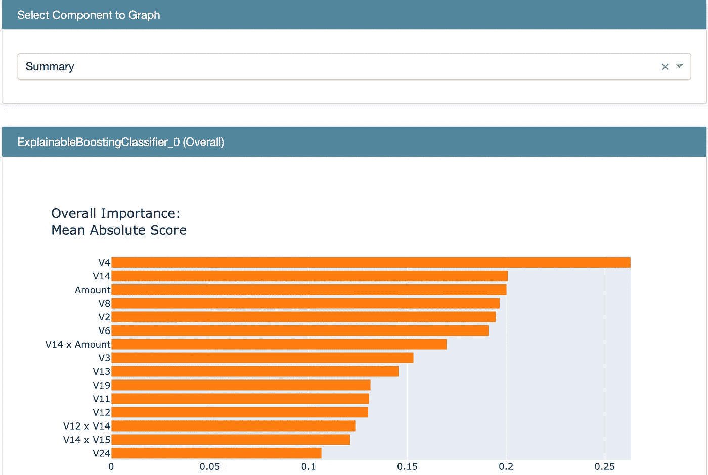

作者图片

还可以通过使用 ebm.feature_importances_ 和 ebm.feature_names 来获取特征和特征重要性

**特征(x) v/s 目标(y)关系:**

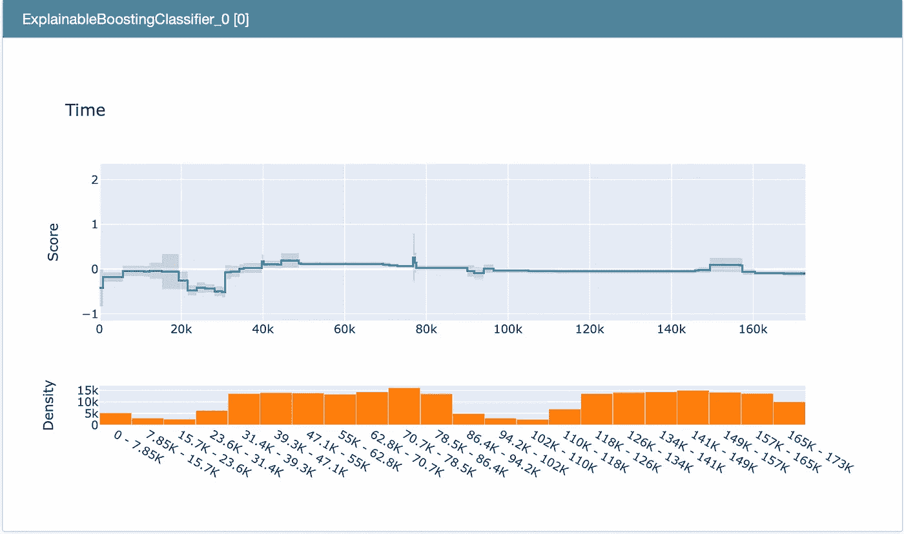

作者图片

**局部解释:**

局部解释有助于我们理解在每次预测中，即在局部水平上发生了什么。

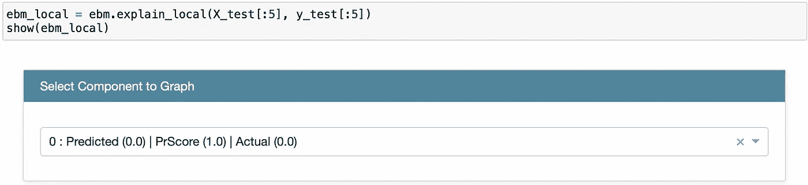

作者图片

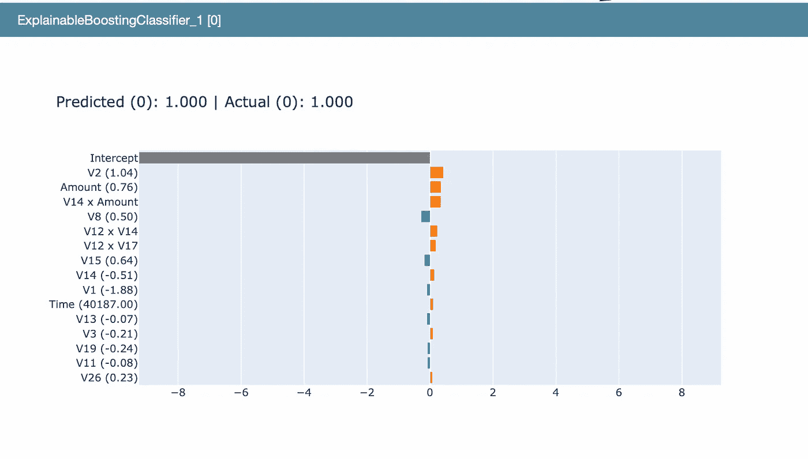

作者图片

**从 EBM 获得预测:**

由于数据集非常不平衡，我们使用“精确召回曲线下的面积”这一指标来测试模型。

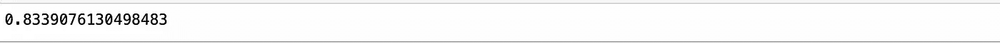

作者图片

**让我们比较一下 EBM 和 xg-boost 的竞争情况:**

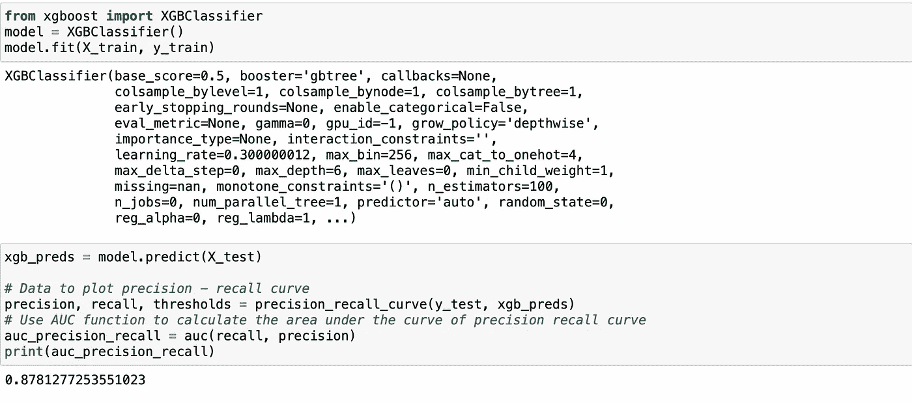

作者图片

很接近吧！

参考资料:

[1]https://interpret.ml/docs/ebm.html

[2]尹娄，丰富卡鲁阿纳，约翰内斯·盖尔克，和贾尔斯·胡克。具有成对交互的精确可理解模型。第 19 届 ACM SIGKDD 知识发现和数据挖掘国际会议论文集，623–631。2013.

[3][https://www.kaggle.com/datasets/mlg-ulb/creditcardfraud](https://www.kaggle.com/datasets/mlg-ulb/creditcardfraud)