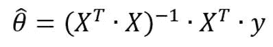
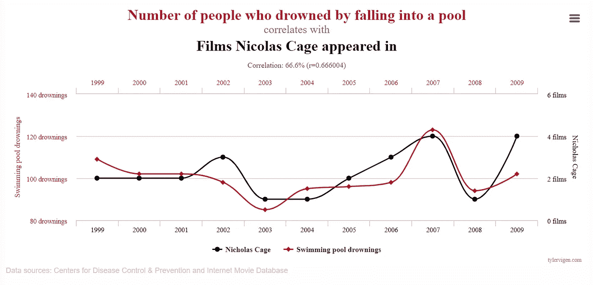

# 计量经济学是原始的数据科学

> 原文：<https://towardsdatascience.com/econometrics-is-the-original-data-science-6725d3f0d843>

## 这就是你应该多了解它的原因


米克·豪普特在 [Unsplash](https://unsplash.com/s/photos/economics?utm_source=unsplash&utm_medium=referral&utm_content=creditCopyText) 上的照片

我记得开始我的第一门机器学习在线课程时，我意识到我已经知道了大部分内容。

我将在这篇文章的开头说，我是一个受过训练的、[杂志发表的](https://link.springer.com/article/10.1007/s10640-020-00529-7)计量经济学家——我有偏见。你知道谁也有偏见吗？约书亚·安格里斯特——一位 2021 年诺贝尔奖获得者，我在为这篇文章做研究时发现他的视频说了同样的话。

如果你正在读这篇文章，我假设你对数据科学有些兴趣——你可以从计量经济学中学到很多东西，所以请系好安全带，认真听讲。

# 有什么区别？

## 总的来说，它们是一个硬币的两面。

数据科学和计量经济学的大部分课程都是从同一个地方开始的。计量经济学线性回归与数据科学线性回归完全相同。然而，你可能会学到不同的东西。例如，在计量经济学课程中，有相当多的关于“正规方程”的提及，这是一个代数方程，允许你解析地求解最优参数。从下面可以看出:



由作者创建— θ是参数权重的向量，X 和 y 分别是你的观测值和目标的矩阵。

我一直认为这是一个非常漂亮的等式，但在数据科学中经常被忽略。我认为原因是法线方程在处理少量数据时表现良好，不需要特征缩放，而梯度下降则相反。随着大数据的兴起，在数据科学课程中坚持梯度下降是有意义的。

你会注意到一些符号是不同的，这让我觉得非常讨厌。

计量经济学和数据科学都会教你很多相同的东西，因为两者都需要对统计学有很强的理解。然而，在讨论了线性和逻辑回归之后，课程往往会在最后有所不同，数据科学将继续谈论神经网络，而计量经济学将深入研究工具变量和[回归不连续设计](/how-to-find-causal-inference-when-a-b-tests-are-unsuitable-2962846f1759)的主题。

## 它们的目标和结果确实不同

不过，这两者的不同之处在于它们创建的模型的结果和用途。计量经济学家和数据科学家可以制作完全相同的模型，并撰写非常不同的讨论论文。

我注意到，大多数数据科学家似乎只对他们的模型感到满意，如果它获得了高准确率的话。我们都知道这个问题——尤其是在试图预测罕见事件的模型中。计量经济学倾向于更深入地研究模型，并试图推断因果关系。

虽然数据科学只关注预测，但计量经济学试图实现高准确性，同时也寻求找到因果关系。然而，寻找因果关系是一种约束，这往往会损害你的准确性。

计量经济学用准确性换取理解。

数据科学用数据找关系，计量经济学用数据证明关系。计量经济学从一个理论开始，然后用一个模型来检验它的假设。

因此，根据项目的不同，您可能经常希望理解多于准确。我稍后会解释原因。

# 数据科学遗漏了什么？

计量经济学课程让学生更好地理解基本面

在我个人看来，计量经济学的课程提供了对基本面更好的理解，尤其是在回归这样的领域。有多少数据科学家知道并理解[高斯-马尔科夫定理](https://en.wikipedia.org/wiki/Gauss%E2%80%93Markov_theorem)？我相信很多人都有，但我很少在课程中看到他们被提及。**高斯马尔可夫定理**告诉我们，如果满足[某组假设](https://www.statisticshowto.com/gauss-markov-theorem-assumptions/#assumptions)，回归系数的[普通最小二乘](https://en.wikipedia.org/wiki/Ordinary_least_squares)估计会给出*可能的最佳线性无偏估计(蓝色)*。像 Josh Angrist 一样，我觉得花时间在课堂上证明它是浪费时间，但对我来说，它肯定回答了很多关于我们为什么在回归中做某些事情的问题。在现实中，这些假设永远不会得到完美的满足，但它们肯定有助于作为基准来改进您的模型。这就引出了我的下一点。

## 因果关系

计量经济学家如此关心正确地描述他们的模型，有时为了做到这一点而放弃准确性的原因是，他们主要关心的是因果关系。

让我们忽略亚里士多德和休谟，采取实际意义上的因果关系。让我们看看维基百科的定义:

> **因果关系**(也称为**因果关系**，或**因果关系**)是一个[事件](https://en.wikipedia.org/wiki/Event_(relativity))，过程，状态，或对象(一个*原因*)促成另一个事件，过程，状态，或对象(一个*效果*)的产生的影响，其中原因部分地对结果负责，结果部分地依赖于原因。一般来说，一个过程有很多原因，也可以说是这个过程的*原因*，都在于它的[过去](https://en.wikipedia.org/wiki/Past)。一个效应可以反过来成为许多其他效应的原因或因果因素，这些都在于它的[未来](https://en.wikipedia.org/wiki/Future)。

实际上，因果关系是一个物体对另一个物体的影响。

然而，因果关系不能与相关性相混淆。在计量经济学中，第一课是——“相关性并不意味着因果关系”。关于计量经济学因果关系的精彩阅读，请试试这个。

强烈的相关性可能表明因果关系，但它可能存在许多其他原因。这很可能是出于偶然——为了好玩，请看下面来自[网站](https://www.tylervigen.com/about)的一个例子。



[https://www.tylervigen.com/spurious-correlations](https://www.tylervigen.com/spurious-correlations)——[https://creativecommons.org/licenses/by/4.0/](https://creativecommons.org/licenses/by/4.0/)

或者它很容易来自另一个我们没有包括在分析中的秘密变量。例如，想象你看到皮肤癌和锻炼之间有很强的相关性。你会很快得出结论，锻炼不会导致皮肤癌，但锻炼越多的人往往越活跃，因此更多地外出。

所以这是计量经济学真正试图解决的问题。作为一名数据科学家，我可以向墙壁扔东西，看看有什么粘在一起，但作为一名计量经济学家，我真的必须考虑我在扔什么(以及我没有扔什么)。

## 那么如何推导因果关系呢？

通过实验和传统数据科学技术的巧妙结合。

我不会详细介绍计量经济学家的所有不同技术，但这里有一个很好的例子——*工具变量。*

以线性回归为例，如果真实模型被认为在解释变量和误差项之间没有协方差(来自高斯-马尔可夫假设)，那么由于任何原因，这是不真实的(例如，有一个被忽略的变量影响因变量和自变量)，那么 OLS 将不会产生 X 对 y 的因果影响

基本上，除非模型是完美的，否则我们有将相关性视为因果关系的风险。

如果你担心错误指定的模型，工具变量是推断因果关系的一个很好的方法，特别是在随机对照试验不适合的领域。

工具变量是第三个变量，Z，当您有内生变量或不确定模型是否指定错误或缺少关键变量时，在回归分析中使用。

例如，让我们以一种降低血压的药物为例。我们想知道，假设这种药物是免费的，任何人都可以购买，这种药物是否有效(我们无法进行随机对照试验)。其他变量如锻炼和饮食也将发挥作用，我们不知道是锻炼越多的人服用药物的可能性越小，还是我们只是忽略了一些变量。

因此，我们必须找到一个仅通过服药途径影响血压的变量。一个我们确信对血压绝对没有影响的变量，但由于与服用药物相关，可能显示出一些相关性。

常用的例子是靠近药房。你离药店有多近绝对不会对你的血压产生影响，除非是因为你更有可能服药。因此，我们可以通过第三个变量来分离药物和血压之间的因果关系。


由作者创建。

然后你可以通过[两阶段回归](https://en.wikipedia.org/wiki/Instrumental_variables_estimation) /OLS 来解释结果。

通过这种实验和统计操作的巧妙结合，我们可以对药物的能力更有信心。

这只是计量经济学可以用来确定因果关系的许多技术之一。作为我最喜欢的另一个例子，这是我写的另一篇关于[回归不连续设计的文章。](/how-to-find-causal-inference-when-a-b-tests-are-unsuitable-2962846f1759)

# 你为什么要在乎？

这篇文章的要点是因果关系很重要——大公司也知道这一点。正如乔希·安格里斯特所说，对于受过计量经济学培训的人来说，私营部门有一个非常大的市场。

他们在寻找能做一些统计的人，但这些公司感兴趣的很多问题都是因果问题。例如，改变价格的后果会是什么。'

在就业市场上，有能力确定因果关系是一个巨大的优势。

# 计量经济学也可以从数据科学中学到很多东西。

为了完善这一点，并确保我没有试图侮辱数据科学家——我就是其中之一——这里有几点我认为计量经济学可以从数据科学中吸取的。

## 探索性分析

通过学习许多数据科学课程，我也学到了许多可以应用于计量经济学的东西。

计量经济学家在探索性研究方面很糟糕，绝对糟糕。

显然，这并不适用于每个计量经济学家，但就教科书和课程而言，绝对没有强调理解你的数据。如果你只是绘制一些数据，你可以节省很多时间来决定在你的模型中放入什么。

## 准确(性)

当我学习计量经济学的时候，曾经困扰我的是对 p 值的依赖，以及对模型整体准确性的缺乏关注。对我来说，如果模型只解释了 4%的方差，那么吹嘘一个变量有多重要就没什么意义了。是的，这个变量可能是有趣的，但当我们只解释和理解图片的一部分时，这并不重要。

# 结论

归根结底，计量经济学可以从数据科学中学到很多东西，数据科学也可以从计量经济学中学到很多东西。两者之间的鸿沟当然也在缩小。

对因果影响的理解确实是所有数据科学家都应该具备的技能。

只要记住‘所有的模型都是错的，但有些是有用的。有时候理解一个更差的模型比不理解一个稍微好一点的模型更有用。

干杯，

詹姆斯

感谢阅读，我希望这能帮助你。

```
If I’ve inspired you to join medium I would be really grateful if you did it through this [link](https://jamesasher4994.medium.com/membership) — it will help to support me to write better content in the future.If you want to learn more about data science, become a certified data scientist, or land a job in data science, then checkout [365 data science](https://365datascience.pxf.io/c/3458822/791349/11148) through my [affiliate link.](https://365datascience.pxf.io/c/3458822/791349/11148) 
```

这是我写的其他一些东西:

</how-to-easily-run-python-scripts-on-website-inputs-d5167bd4eb4b>  </how-to-easily-show-your-matplotlib-plots-and-pandas-dataframes-dynamically-on-your-website-a9613eff7ae3>  </how-to-easily-automate-your-keyboard-to-do-tasks-in-python-b698e98a5c40> 