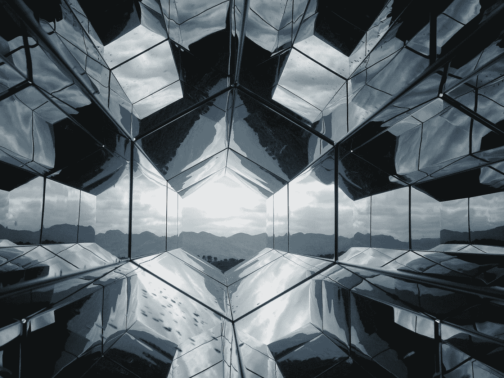
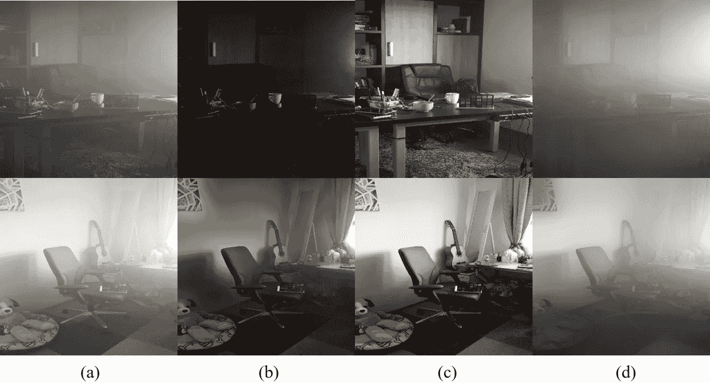
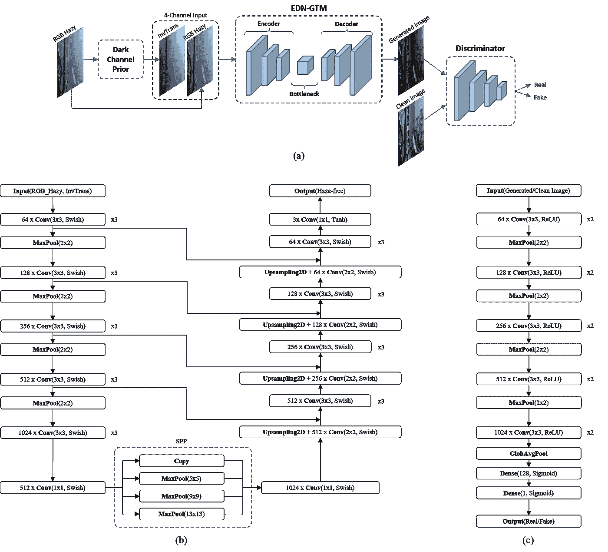
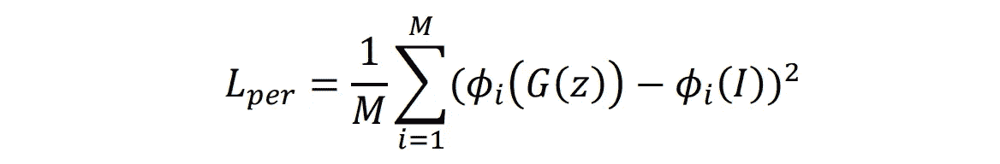
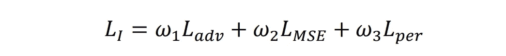
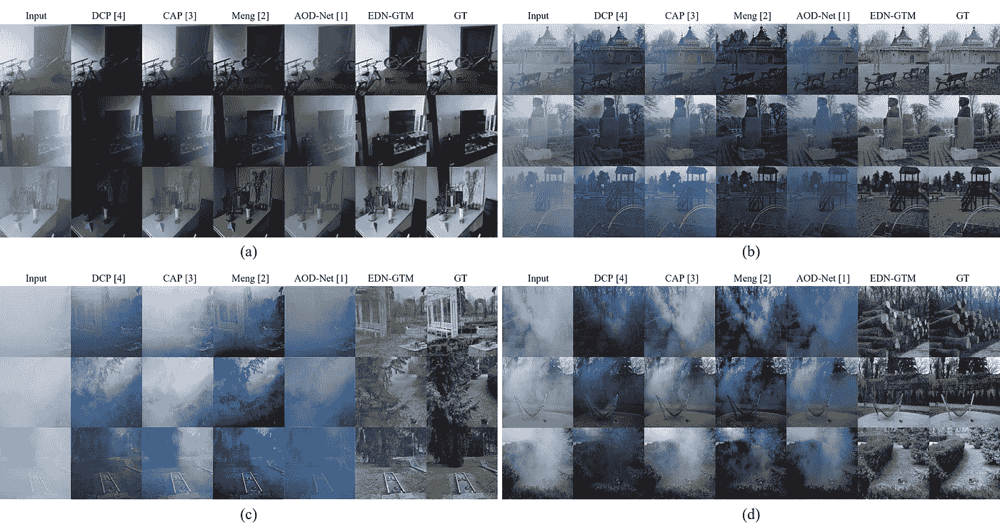
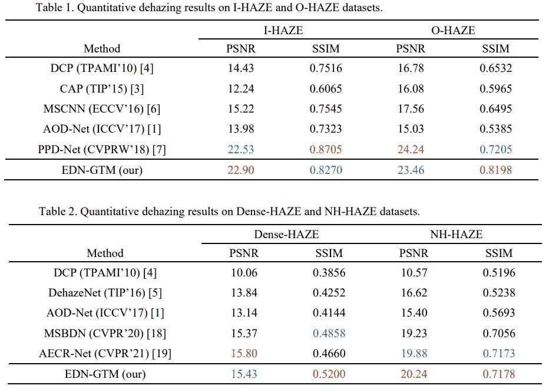
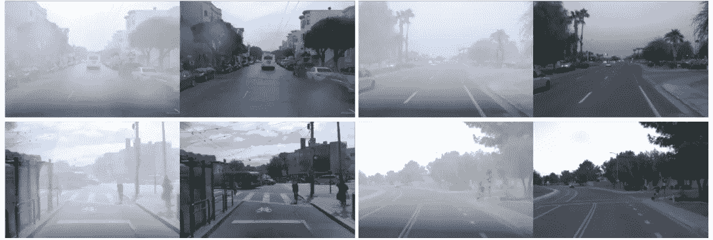
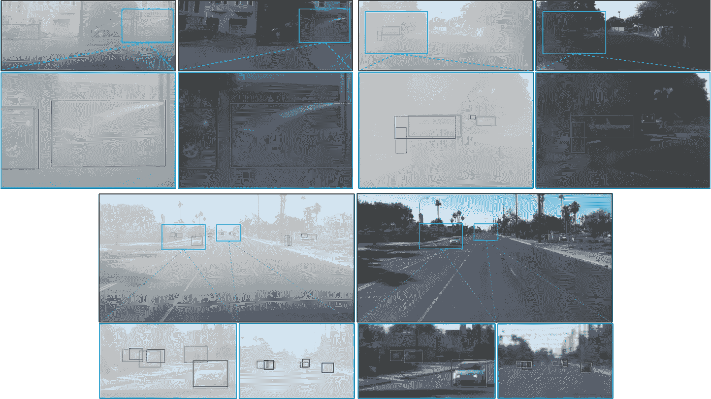
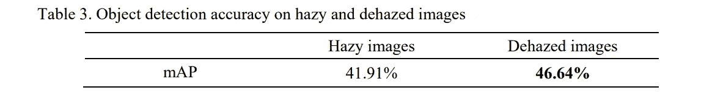

# EDN-GTM:具有用于单一图像去雾的引导传输图的编码器-解码器网络

> 原文：<https://towardsdatascience.com/edn-gtm-encoder-decoder-network-with-guided-transmission-map-for-single-image-dehazing-78e8036bbaa3>

## 当传统的计算机视觉和深度学习结合时。

由 [Unsplash](https://unsplash.com?utm_source=medium&utm_medium=referral) 上的 [drmakete 实验室](https://unsplash.com/@drmakete?utm_source=medium&utm_medium=referral)拍摄的照片

# 图像去雾

增强从自然场景捕获的数字图像的可见性的目的在许多现实世界应用中变得非常必要，因此图像去雾(或去雾)在几十年前已经成为计算机视觉和图像处理中的重要任务。

如果你想知道这个话题有多热，我想让你知道何，深度学习中各种经典理论如残差网络、更快 R-CNN、空间金字塔池、特征金字塔网络等的发明者在他的博士研究期间研究了这个主题，并在他的[论文](http://kaiminghe.com/publications/thesis.pdf)和[IEEE Transactions on Pattern Analysis and Machine Intelligence](https://ieeexplore.ieee.org/xpl/RecentIssue.jsp?punumber=34)中提出了之前的[暗通道(DCP)。](https://ieeexplore.ieee.org/document/5567108)

去雾算法有两种范式:传统方法和基于深度学习的方法。许多传统方法已经使用纯计算机视觉技术将手工制作的图形模型应用于去雾(例如，DCP)，而基于深度学习的方法已经采用卷积神经网络(CNN)来解决去雾问题。然而，这些方法仍然有它们的缺点，并且总是有改进的空间。

这篇文章回顾了使用导向传输图(EDN-GTM)实现有效的单幅图像去雾的编码器-解码器网络。EDN-GTM 是一种新的方案，它利用传统计算机视觉技术和现代深度学习算法的能力来执行图像去雾。具体地，利用通过采用暗通道先验估计的透射图作为 CNN 模型的指南来执行去雾。论文全文可在 [arXiv](https://arxiv.org/abs/2202.04757) (预印本)或[Procedia Computer Science 204](https://www.sciencedirect.com/science/article/pii/S1877050922008201?via%3Dihub#!)(已发表论文)上找到。

# 作为 CNN 指南的传输图

暗通道先验(DCP)的去雾结果:(a)输入模糊图像，(b)通过 DCP 的去雾图像，(c)地面真实图像，(d)通过 DCP 的反转透射图。(纸张中的图像)

DCP 是基于无薄雾的室外图像的统计而提出的，因此，它在室内场景中不太有效，并且当薄雾图像包含看起来类似于空气光的大区域时可能无效。在上图中可以看到一个例子，当 DCP 试图在看起来像空气光和薄雾的墙壁场景区域中去雾时，从而提出了比地面真实图像更暗的输出图像。

然而，当重新思考由 DCP 产生的倒置透射图时，它们可以被认为是一种注意力图，其中较亮的区域指示密集雾度的区域，而较暗的区域指示不太雾度的区域(除了墙壁场景区域)。现在的问题是如何找到墙景区域？

哦，CNN 刚刚举手了！由于具有提取和分析图像特征的能力，CNN 可能是一个潜在的候选者。

有了这些强有力的证据，由 DCP 和 CNN 模型获得的透射图可以被统一以形成有效的霾去除系统。传输图“告诉”CNN 关注哪里。从这些建议区域，CNN 可以通过监督学习知道它应该更加关注哪些区域(例如，在输入和输出图像中墙壁场景区域没有太大不同，但是模糊区域不同)。

# 网络架构

图表和网络架构:(a)EDN-GTM 方案的图表，(b) EGN-GTM 设计，以及(c)鉴别器设计。(纸张中的图像)

上图显示了 EDN-GTM 方案以及发生器和鉴别器的网络架构。

## 发电机设计(EDN-GTM)

作为语义分割和图像恢复中最流行和最强大的网络之一，U-Net 被选为 EDN-GTM 方案的基础网络。为了获得 EDN-GTM 的架构设计，作者进一步将以下主要修改添加到网络中:

1.  输入通道:传输图与图像的深度信息有着密切的关系，在去雾方案中起着重要的作用，然后它被用作网络输入的附加通道(与传统的 RGB 图像一起)。
2.  瓶颈:通过使用一组具有不同内核大小的池操作，空间金字塔池(SPP)模块能够分离出最重要的功能，它被插入到基础网络的瓶颈中(就像它在 YOLOv4 object detector 的颈部使用的方式)。
3.  激活:ReLU 在最近的 CNN 模型中逐渐变得过时，因此，ReLU 被 Swish 函数所取代，该函数已经被证明在现代深度网络中始终优于 ReLU。
4.  感受野:去雾网络的感受野应该足够大，这是由于在模糊图像中霾(或雾)的扩散分布，因此在基本网络的每个卷积级中增加一个 3×3 conv 层。

## 鉴别器的设计

该方案选择 U-Net 的编码器部分作为鉴别器的结构。鉴别器设计的这种选择可以帮助两个网络(发生器和鉴别器)具有提取和分析输入图像特征的竞争能力，从而两个网络可以相互“战斗”以获得它们的性能。

# 损失函数

EDN-GTM 应用积分损失函数，该函数是对抗性损失、MSE 损失和感知损失的加权和。

## 对抗性损失

其中 B 是批量，z 是模糊图像，G 是发生器，D 是鉴别器。

## MSE 损失

其中 N 是输入(输出)图像中的像素数，I 是干净的图像。

## 知觉丧失

其中 M 是预训练 VGG16 模型的层 Conv3_3 的特征图φ中的元素数量。

## 整体损失

积分损失是上述所有相关损失函数的加权和。

# 基准测试的结果

提供了去雾任务的四个基准数据集上的实验结果，包括 I-HAZE、O-HAZE、Dense-HAZE 和 NH-HAZE。下图显示了各种方法的典型视觉去雾性能。EDN-GTM 已被证明在可见度方面始终优于其他现代去雾方法。

视觉去雾的结果是:(a) I 雾度，(b) O 雾度，(c)致密雾度，和(d) NH 雾度。(图片来自论文)

下表显示了 EDN-GTM 和其他最新去雾方法的定量结果(红色和蓝色数字分别表示最佳和次佳性能)

来自纸张的图像

# 应用于对象检测

EDN-GTM 作为预处理工具应用于目标检测任务。比较了有雾和去雾图像的检测性能。实验中使用的数据集是 WAYMO 数据集。WAYMO 数据集不提供模糊图像数据，因此，通过应用本文[帖子](/synthesize-hazy-foggy-image-using-monodepth-and-atmospheric-scattering-model-9850c721b74e)中描述的方法合成模糊图像。

合成模糊 WAYMO 数据集上的视觉去雾结果。(图片来自论文)

在两组模糊和去雾图像上的对象检测性能(红色:地面实况框，绿色:预测框，蓝色:放大区域)。(图片来自论文)

图片来自纸张。

# 结论

在这篇文章中，我简要回顾了 EDN-GTM，一种新颖的单幅图像去雾方案。EDN-GTM 利用纯计算机视觉和深度学习方法来形成一个统一的网络，以实现最先进的去雾性能。EDN-GTM 利用 U-Net 作为基础网络，并对网络进行各种修改，以便能够实现最佳去雾性能。EDN-GTM 的有效性已经在基准去雾数据集上得到验证。论文全文可以在 [arXiv](https://arxiv.org/abs/2202.04757) (预印本)或[Procedia Computer Science 204](https://www.sciencedirect.com/science/article/pii/S1877050922008201?via%3Dihub#!)(发表的论文)上找到。

欢迎读者访问我的脸书粉丝页面分享关于机器学习的事情:[投入机器学习](https://www.facebook.com/diveintomachinelearning)。我的其他著名帖子也可以在这里找到:

*   [元格式器](/metaformer-de-facto-need-for-vision-93476cc9fec5)
*   [黑暗时代](/darkeras-execute-yolov3-yolov4-object-detection-on-keras-with-darknet-pre-trained-weights-5e8428b959e2)
*   [EFPN:扩展特征金字塔网络](/efpn-extended-feature-pyramid-network-for-small-object-detection-980af794a093)
*   [数据扩充](/data-augmentation-compilation-with-python-and-opencv-b76b1cd500e0)
*   [数据提炼](/data-distillation-for-object-detection-92a89fe5d996)
*   而其他人在[我的页面](https://tranlevision.medium.com/)。

感谢您抽出时间！