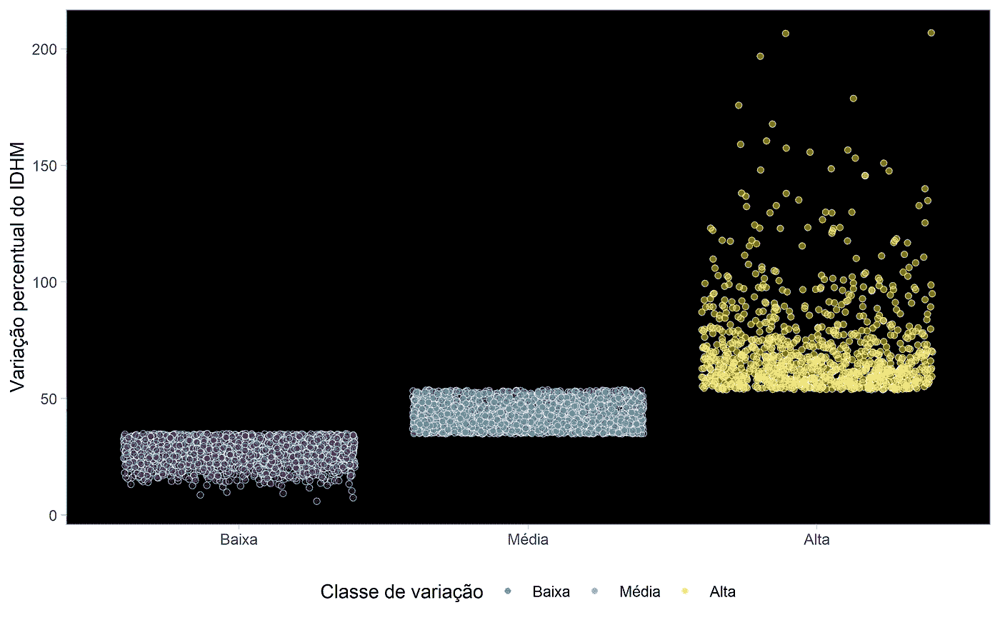
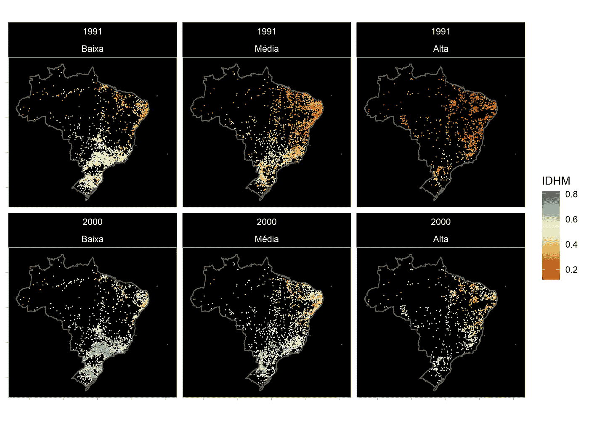
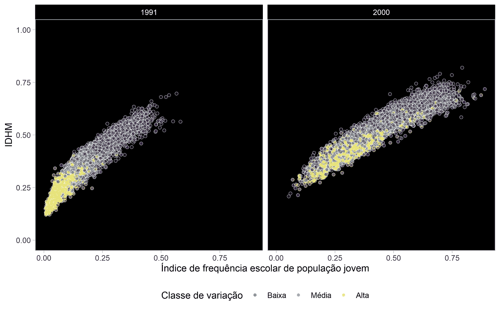
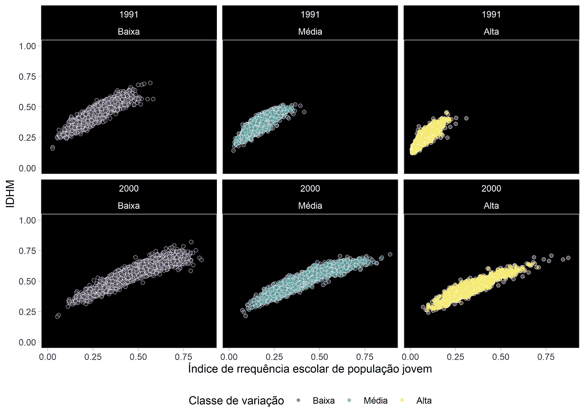
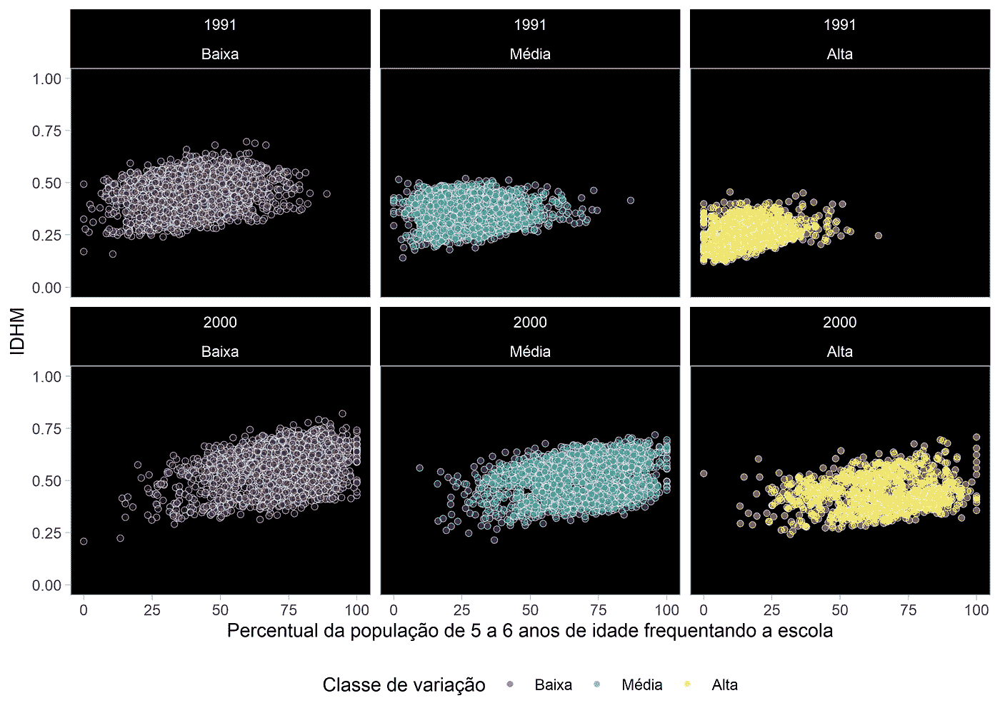
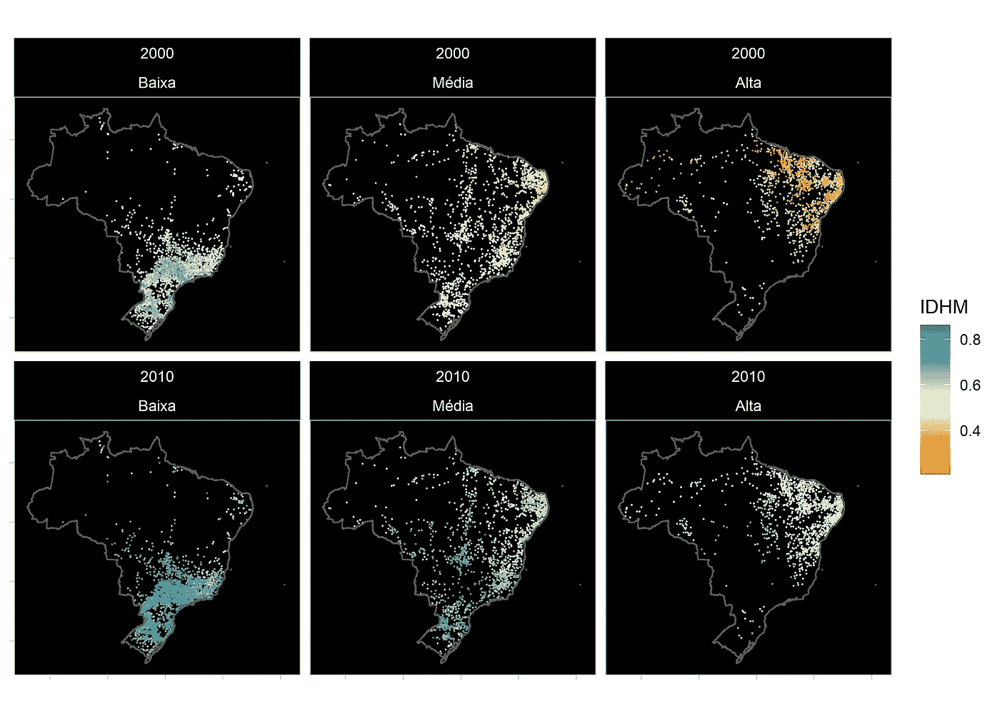
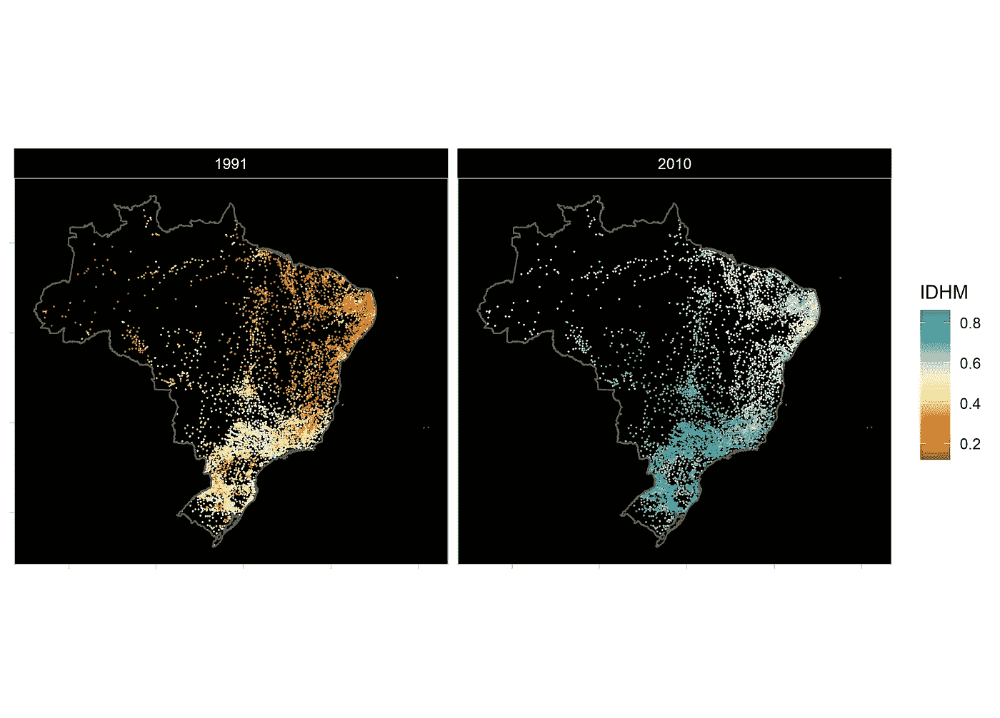
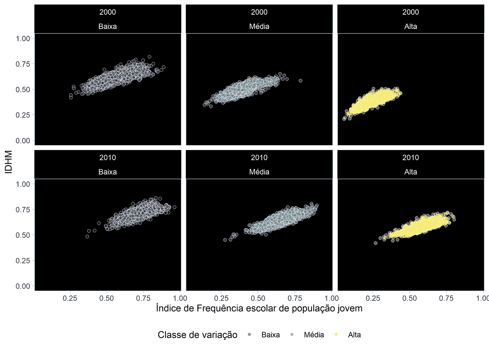
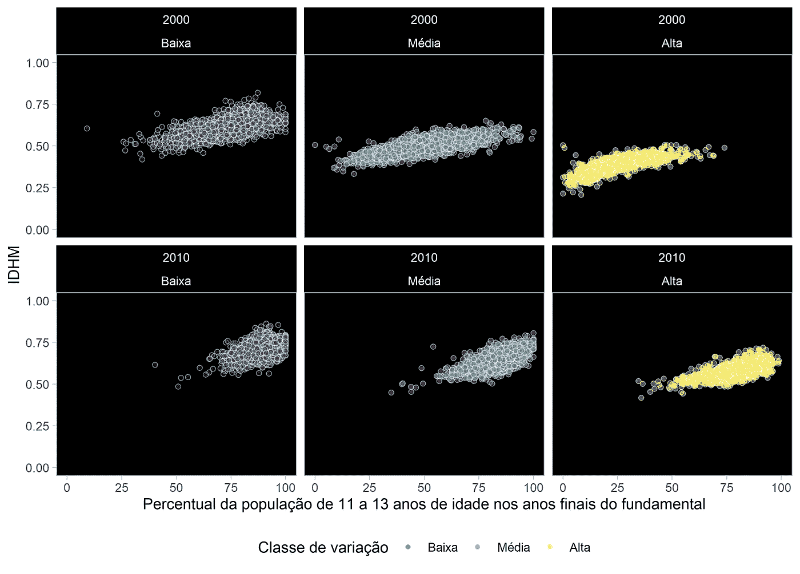

# 教育是巴西人类发展的驱动力

> 原文：<https://towardsdatascience.com/education-as-the-driver-of-human-development-in-brazil-e95f9f0124fe>

## 巴西人口普查数据分析

图片: [Freepik](https://br.freepik.com/fotos-gratis/menina-de-sorriso-com-livros-prontos_867179.htm#query=educa%C3%A7%C3%A3o&position=14&from_view=search)

T2010 年的上一次人口普查更新了衡量巴西各城市(MHDI)人类发展指数的数据。该国本应在 2020 年进行随后的人口普查，但主要是因为疫情，数据收集推迟了两年。疫情和经济危机的影响使人们对 2000 年和 2010 年人口普查中观察到的改善感到关切。虽然不可能与该国的现状进行比较，但如何从冰冷的数字和图形的视觉感受中更详细地了解过去的演变呢？

以下段落，尤其是下面的图片，对 1991 年至 2010 年间的变化进行了简要总结。这里我先做了 1991 年和 2000 年的比较，然后是 2000 年和 2010 年的比较。这个想法是通过 [*聚类*](https://en.wikipedia.org/wiki/Cluster_analysis) 技术显示 MHDI 的变化之间的比较形成了哪三组城市，然后从组成 MHDI 的各种变量的变化中显示影响这三组城市框架的主要因素是什么。

# 1991 年和 2000 年的比较

下图显示了该算法如何在 1991 年至 2000 年间将巴西城市分布在 MHDI 的三个不同等级中。

MHDI 变差的分类。图片由作者提供。

在图表中，每个点都是一个自治市。在低变化等级中，紫色部分是 2167 个城市，它们的 MHDI 变化在 5.9%到 34.8%之间。浅绿色表示中等变化等级，集中了 2107 个 MHDI 在 34.81%和 53.7%之间变化的地点，在最后一个用黄色表示的类别中，其余 991 个城市的变化范围在 53.71%和 207%之间。

下面，我们可以看到 MHDI 三个不同等级的城市分布情况。

1991 年和 2000 年之间的地图和 HMDI 变化。图片由作者提供。

应用于地图的图例表明，自治市点的颜色越蓝，MHDI 越高，越红，值越低。颜色范围的变化发生在 0.5 的测量中，对应于我们开始考虑[中等发展](https://educacao.uol.com.br/disciplinas/geografia/indice-de-desenvolvimento-humano-idh-mede-nivel-de-qualidade-de-vida.htm)的 HDI 的值。

对地图的观察表明，MHDI 地区差异较小，同时 MHDI 值最高的城市集中在南部和东南部地区。另一方面，变化大的城市在 1991 年与非常低的 MHDI 联系在一起。2000 年，总的来说，这一阶层有所改善，一些城市甚至超过了中等发展人类发展指数点(人类发展指数> 5)。通过这种方式，可以看到一些带有蓝色阴影的城镇，这在 1991 年并没有出现。

MHDI 由 200 多个变量综合而成。一些因素可能对每个城市的指标演变产生了较大影响，而另一些因素则影响较小。因此，我使用了一个被称为 [*决策树*](https://en.wikipedia.org/wiki/Decision_tree) 的程序，试图找出最相关的特征来确定上面显示的三组城市。

该算法指出了八个重要变量，它们都与教育有关。第一个是年轻人口的入学率。根据所使用的方法，这一变量比第二重要的变量，即 5 至 6 岁儿童的入学率，重要 2.28 倍。让我们来看图表。

**年轻人口的入学率**

使用四个指标来计算青年人口的入学率:5 至 6 岁儿童的入学率、11 至 13 岁儿童在小学最后几年的入学率、15 至 17 岁儿童完成小学教育的百分比以及 18 至 20 岁儿童完成高中教育的百分比。见下文该指标如何划分 1991 年至 2000 年 MHDI 的三类变化。

1991 年至 2000 年 MHDI 入学率变化的影响。作者图片

在上图中，我们可以看到，在参考年份 1991 年，三组的三种颜色在它们的位置上得到了很好的巩固。在他们的 MHDI 里，移动最少的城市，用紫色的点标出，在另外两个班级里，有着比其他城市高得多的入学率。更相关的是，运动最显著的城市，用黄色画的，占据了低 MHDI 和低入学率的空间。

另一方面，当我们看到 2000 年发生的情况时，黄色和浅绿色的点更接近紫色的点，从而表明这些群体中的城市在入学率指数方面取得了多大进展，以及这种进展对 MHDI 的改善产生了多大影响。

另一种观察这种运动的方式是通过下图。

1991 年至 2000 年 MHDI 入学率变化的影响。作者图片

人们可以在 1991 年观察到，黄点集中在一个象限，其特点是 MHDI 非常低，入学率很低。实际上，几乎没有一个城市的 MHDI 高于 0.4，学校出勤率高于 0.25。另一方面，在 2000 年，黄点很快出现在入学率高于 0.5 和 MHDI 高于 0.4 的象限中。还值得注意的是，在以高入学率和低 MHDI 率为标志的象限中，没有一个班级是他们的代表，这加强了这一组成部分在 MHDI 整体改善中的重要性。

**5 至 6 岁在校人口**

如前所述，衡量 5 至 6 岁儿童上学的百分比是青少年上学指标的一部分。根据我们的算法，这是通过 MHDI 的变化形成组的第二个最重要的变量。那么，让我们来看一个与这个指标相关的数字。

1991-2000 年间 MHDI 5-6 岁学生变化的影响。作者图片

很容易看到市政当局向右移动，特别是对于 MHDI 中高变化的城市。然而，我们也注意到，这种迁移对 MHDI 的改善并没有像青年人口频率指数那样产生强烈的影响。人们可以看到，所有群体都存在中等和高中入学率以及中等和低 MHDI 的城市。

# 2000 年和 2010 年的比较

十多年的文明进程改进带来了更多的蓝点和更少的关注点。但是，更重要的是，在 2000 年和 2010 年之间 MHDI 的变化所形成的群体中有一个区域性的重点。

2000 年和 2010 年之间的地图和 HMDI 变化。图片由作者提供。

上图显示，2010 年几乎没有 MHDI 点被归类为低发展。南部和东南部地区集中在两次人口普查之间差异较小的城市。最有可能的原因是，这些地区已经出现中高 MHDI 的频率更高，因此不会有更大的增长空间。另一方面，东北地区集中了 MHDI 变化最大的城市。

这种大约 20 年的转变促使我们将 1991 年与 2010 年进行比较，使颜色之间的对比更加强烈。我们会做这个比较，因为我们有数据。

1991 年至 2010 年间的地图和 HMDI 变化。图片由作者提供。

但是，2000 年到 2010 年之间的变化的重要变量是什么呢？同样，所有重要的因素都与教育有关。同样，年轻人口的入学率是最重要的，其次是 11 至 13 岁小学生的比率。让我们来看图表。

**年轻人的入学率——第二部分**

看看下面的点和颜色告诉我们什么。

2000 年至 2010 年 MHDI 入学率变化的影响。作者图片

不出所料，所有阶层的起点都远高于前十年的对比。我们再一次看到了所有不同班级的出勤率和 MHDI 之间高度相关的视觉亮点。

**小学 11 至 13 岁学生的比例**

同样，构成年轻人入学率的一个指标在人类发展指数变化组的定义中排在第二位。让我们看一下图表。

2000 年至 2010 年 MHDI 11-13 岁学生的影响变化。作者图片

当将 2000 年与 2010 年进行比较时，中低变化等级被压缩，对于中变化城市，可以清楚地看到 MHDI 向上移动。另一方面，对于高度变化的城市，点向右的位移与向上的位移一样大。这显示了适龄儿童接受初等教育对改善 2010 年观察到的 MHDI 的重要性。

该分析中使用的算法有助于发现构成 MHDI 数据库的近 17000 行和 230 列中的隐藏模式。这里我们只强调文本中最重要的变量的一个子集。

年轻人在学校的存在与年龄和学校阶段之间一致性的重要性之间高度相关的模式变得很明显。此外，在 2000 年和 2010 年的比较中，根据人类发展指数的变化划分的市镇群体的明显的区域成分也很突出。

总的来说，这些进步与其他几个变量有关。例如，一个更细心的研究人员可能想解释婴儿死亡率的大幅下降、收入的提高等等。仍有大量数据有待探索。恢复人口普查之前的这一时刻似乎是恢复巴西在 2010 年之前取得的进步并将其与极不稳定情况下的预期进行对比的大好时机。

如果对 MHDI 的数据感兴趣，非政府组织 Base dos Dados 可以从这个[地址](https://basedosdados.org/dataset/mundo-onu-adh)轻松获取这些数据。另一方面，如果你有兴趣知道我是如何使用算法或构建图形的，R 语言的代码可以在我的 [GitHub](https://github.com/fernandobarbalho/idhm) 上找到。