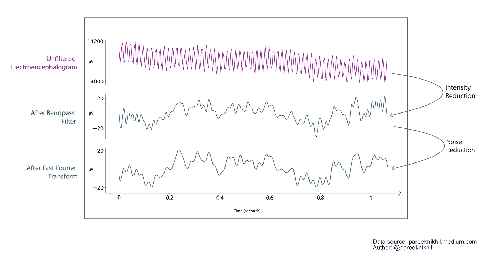
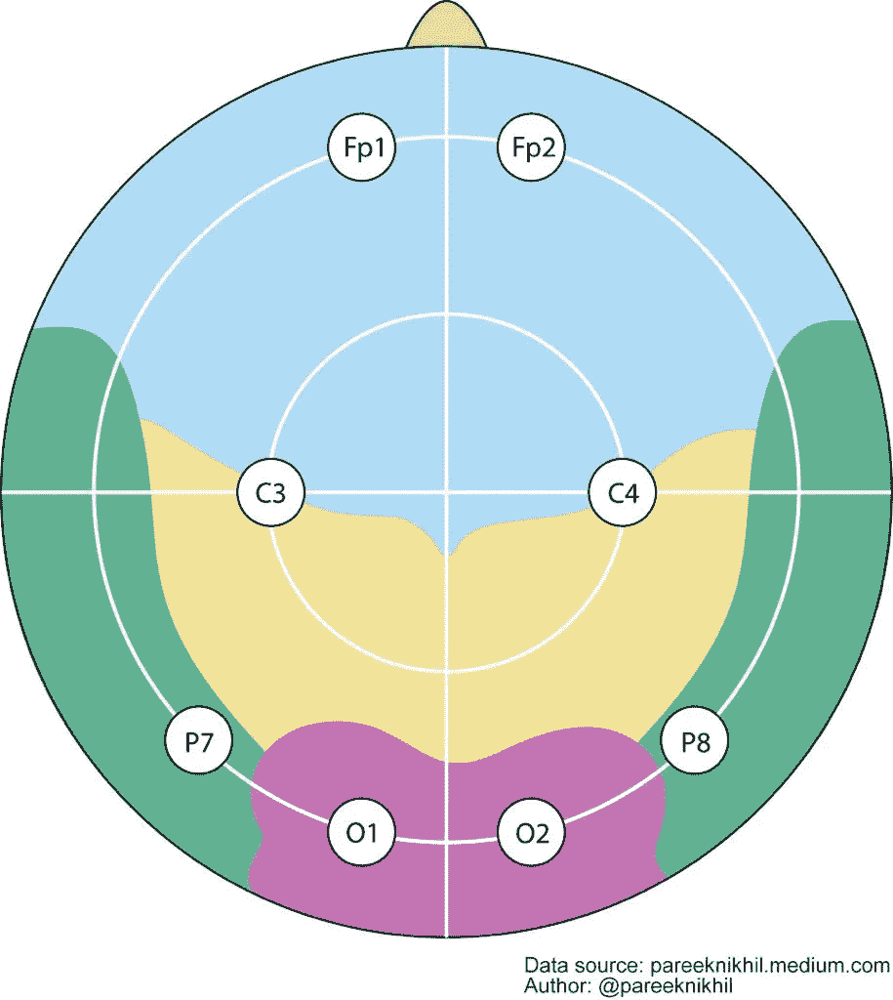
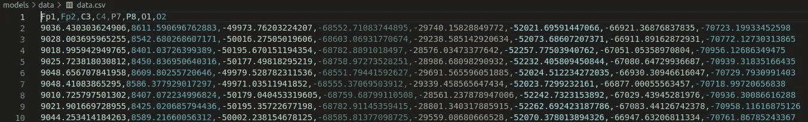
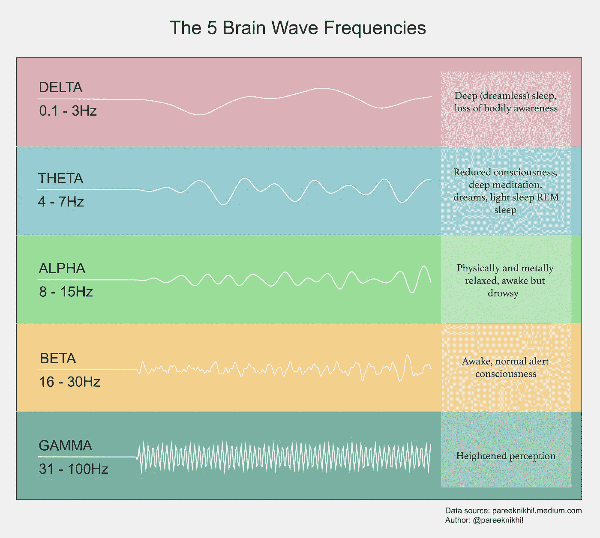
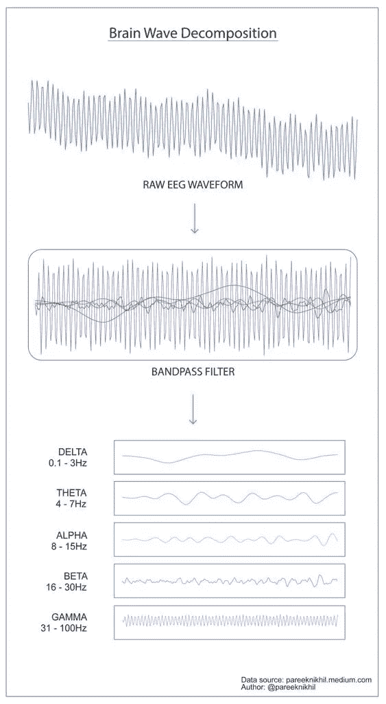
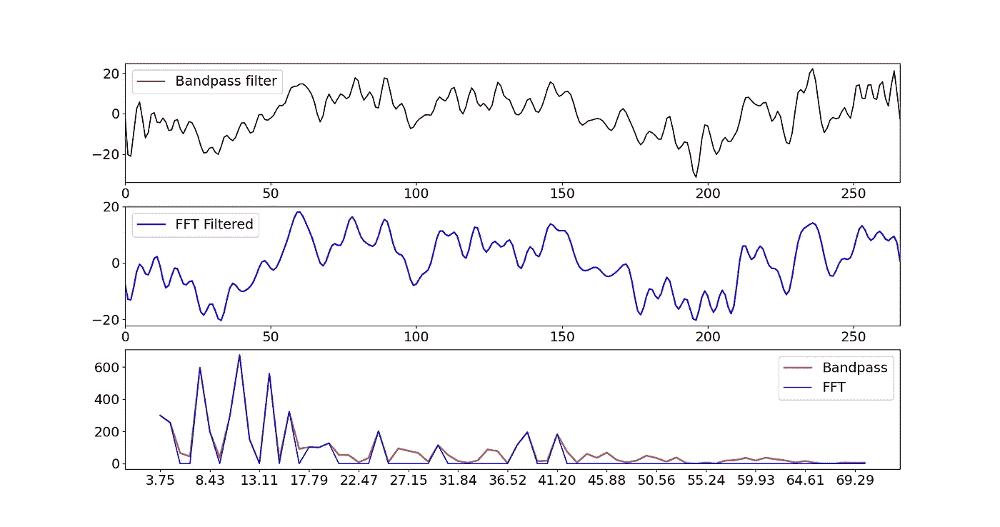

# 使用 OpenBCI Ultracortex 的脑电图 101

> 原文：<https://towardsdatascience.com/eeg-101-using-openbci-ultracortex-fbeb0202d0c5>

使用*open BCI*—*ultra cortex Mark IV EEG 耳机演示 EEG(脑电图)信号中的数据采集、数据滤波和去噪技术的教程。*



图:1 (A)直接从 Ultracortex Mark EEG 耳机收集的未滤波 EEG 数据(B)带通滤波器(> 1Hz 和<50 Hz) ( C)Denoising with Fast Fourier Transform(FFT).

# Modus Operandi

I have recorded live EEG※ from my own scalp using an *Ultracortex Mark IV EEG 耳机* :) Ultracortex 耳机共有 16 个通道，但在本教程中，我们将仅使用 8 个通道(图 2)。电极按照*国际 10–20 系统*放置，这使我们能够测量大脑皮层中潜在的电活动。

E 电极放置: *Fp1* 和 Fp2，测量额叶前部皮层的活动， *C3* 和 *C4* ，来自顶叶的 *P7* / *T5* 和 *P8* / *T6* ，颞侧的 *O1* 和 *O2*



图 2:使用基于国际 10–20 系统的 Cyton 板(8 通道)收集 EEG 数据。

Ultracortex Mark IV※可用于湿电极和干电极。它也可以被配置成作为有源电极或无源电极工作。但是对于这个实验的范围，我使用了*干电极和无源电极*的组合以及 *Cyton 生物传感板* ※以 *250 赫兹(采样频率)*采样信号。

# 数据收集

在 *Python (Python 3.8.0: CPython 实现)*中，我们将使用 [BrainFlow 用户 API](https://brainflow.readthedocs.io/en/stable/UserAPI.html) ※ (BoardShim 类)进行数据收集，使用 Scipy(信号类)进行数据过滤和去噪技术。这两个软件包都可以通过 pip 安装在终端中，如下所示:

```
pip install brainflowpip install scipy
```

让我们开始编码吧！！( [Github: collection.py](https://github.com/pareeknikhil/EEG/blob/master/UltraCortex/src/collection.py) )

1.  库导入

```
import time
import argparse
import numpy as np
import pandas as pdfrom brainflow.board_shim import BoardShim, BrainFlowInputParams
```

2.串行端口和板 ID 配置

```
parser = argparse.ArgumentParser()parser.add_argument('--serial-port', type=str,
        help='serial port', required=False, default='/dev/ttyUSB0')parser.add_argument('--board-id', type=int,
        help='board id, check docs to get a list of supported
        boards', required=False, default=0) ## Cyton board ID = 0)args = parser.parse_args()
```

3.用于加载配置的 BrainflowInput 参数 API

```
params = BrainFlowInputParams()
params.serial_port = args.serial_port
board = BoardShim(args.board_id, params)
```

4.记录实时脑电图数据流(时间间隔= 1 秒)

```
board.prepare_session()
board.start_stream()
time.sleep(1)
data = board.get_board_data(250*1) ## (250 Hz @ 1sec) ##
board.stop_stream()
board.release_session()
```

N 注意:`get_board_data()`方法获取最新的板卡数据，并从环形缓冲区中删除这些数据。其他方法如`**get_current_board_data()**` 如果没有足够的数据，则获取指定数量或更少的数据，并且不从环形缓冲区中移除数据。

5.获取 Cyton 板所有活动 EEG 通道的列表

```
eeg_channels = BoardShim.get_eeg_channels(args.board_id)
eeg_names = BoardShim.get_eeg_names(args.board_id)
```

注:Cyton 板有 24 个通道来捕捉所有生物传感活动(体温、心跳等)。但在我们目前的设置中，我们使用的是 8 通道 EEG 配置:Fp1、Fp2、C1、C2、P7、P8、O1 和 O2。

6.将脑电图数据存储到 CSV 文件中

```
df = pd.DataFrame(np.transpose(data[:,1:]))
df_eeg = df[eeg_channels]
df_eeg.columns = eeg_namesdf_eeg.to_csv('data.csv', sep=',', index = False)
```



图 3:熊猫数据框架的前 10 行数据。

# 数据分解

EEG 信号可以分解成多个频段，每个频段都有独特的功能特征，如图 4 所示。这些子带的范围从被称为以 0.1 赫兹振荡的德尔塔波的极低频到被称为以 40 赫兹振荡的伽马波的高频。我们过滤掉其余的频率。※



图 4:脑电图中感兴趣的频谱(频域)。

在本教程中，我们将使用带通滤波器对数据进行滤波，这也是信号处理中最常用的滤波器。重要的是要注意，在应用滤波器后，信号会被*衰减*，即当频率成分被移除时，信号强度会有*强度降低*。人们可以在图 1 中观察到同样的情况；原始 EEG 和带通数据之间的幅度差异(V)。

N 注:为了简化计算，我们将只对其中一个通道进行预处理，即使用带通滤波器对 Fp2(前额叶皮层—右侧)进行预处理，并将其分解为各种其他子带。

让我们开始编码吧！！( [Github: bands.py](https://github.com/pareeknikhil/EEG/blob/master/UltraCortex/src/bands.py) )

1.  库导入

```
import pandas as pd
import matplotlib.pyplot as pltfrom scipy.signal import butter, lfilter, lfilter_zi
```

2.定义带通滤波方法

```
def butter_bandpass(lowcut, highcut, fs, order=5):
    nyq = 0.5 * fs
    low = lowcut / nyq
    high = highcut / nyq
    b, a = butter(order, [low, high], btype='band')
    return b, adef butter_bandpass_filter(data, lowcut, highcut, fs, order=5):
    b, a = butter_bandpass(lowcut, highcut, fs, order=order)
    zi = lfilter_zi(b, a) * data[0]
    y, _ = lfilter(b, a, data, zi=zi)
    return y
```

3.分解频带(α、β、δ、θ、γ)

```
sampling_frequency = 250df = pd.read_csv('data.csv')delta = butter_bandpass_filter(data = df.Fp2, lowcut = 0.1, highcut
    = 4 , fs = sampling_frequency, order = 3)theta = butter_bandpass_filter(data = df.Fp2, lowcut = 4, highcut
    = 8, fs = sampling_frequency, order = 3)alpha = butter_bandpass_filter(data = df.Fp2, lowcut = 8, highcut
    = 13, fs = sampling_frequency, order = 3)beta = butter_bandpass_filter(data = df.Fp2, lowcut = 13, highcut
    = 32, fs = sampling_frequency, order = 3)gamma = butter_bandpass_filter(data = df.Fp2, lowcut = 32, highcut
    = 50, fs = sampling_frequency, order = 3)
```

4.数据可视化(图 5:脑电波分解)

```
fig = plt.figure(1)plt.subplot(6,1,1)
plt.plot(df.Fp2, linewidth=2)plt.subplot(6,1,2)
plt.plot(delta, linewidth=2)plt.subplot(6,1,3)
plt.plot(theta, linewidth=2)plt.subplot(6,1,4)
plt.plot(alpha, linewidth=2)plt.subplot(6,1,5)
plt.plot(beta, linewidth=2)plt.subplot(6,1,6)
plt.plot(gamma, linewidth=2)plt.show()
```



图 5:单个波形在不同频率下进行滤波，以展示其频率构成。

N 注:随着滤波器阶数的增加，滚降也会降低，从而大幅削减阻带频率，但更高的阶数也会在滤波数据中引入延迟。与当前值(即 3)相比，通过将上述代码中的顺序更改为 1，可以看到相同的情况。

# 用 FFT 对数据去噪

FFT 是信号处理中最受欢迎的算法之一，是数字通信、音频和图像压缩以及卫星电视中的一个重要组成部分。在本教程中，我们将利用快速傅立叶变换(FFT)算法从 EEG 数据的原始结构中提取噪声数据。

在收集 EEG 时，有许多假象频率被引入到波形中，这些假象频率不是由人脑活动直接产生的，因此降低了数据结构的锐度。FFT 帮助我们从草地(原始脑电图波形)中去除杂草(噪声)。由于数字(CPU、GPU)或生理假象(呼吸、脉搏和眨眼)，这些微弱的频率很可能是在收集 EEG 时被拾取的。

F 人们也可以将 FFT 理解为信号从时域到频域的变换。

我们将通过 FFT 算法传递上一步过滤后的 EEG(带通滤波器),并希望找到 EEG 中最显著的频率成分。稍后，我们将过滤掉功率较低的频率(或“弱”频率)。我们将使用频率的功率谱密度(PSD)度量特定频率在给定 EEG 波形中对其形状的贡献有多重要。

让我们开始编码吧！！([Github:noise . py](https://github.com/pareeknikhil/EEG/blob/master/UltraCortex/src/denoise.py))

1.  库导入

```
import numpy as np
import pandas as pd
import matplotlib.pyplot as plt
from scipy.signal import iirnotch, freqz, filtfilt
```

2.使用带通滤波器(包括陷波滤波器)

```
df = pd.read_csv('data.csv')
band_pass_eeg = butter_bandpass_filter(data = df.Fp2, lowcut = 1,
                  highcut = 50, fs = 250, order = 3)b_notch, a_notch = iirnotch(w0=59.9250936329588, Q=20, fs=250)
filtered_eeg = filtfilt(b_notch, a_notch, band_pass_eeg)
```

3.计算傅立叶系数(复数值):

```
number_of_points = len(filtered_eeg)fhat = np.fft.fft(filtered_eeg, number_of_points)
PSD = fhat * np.conj(fhat) / number_of_points
freq = (1/(0.004*number_of_points))*np.arange(number_of_points)
L = np.arange(1,np.floor(number_of_points/2),dtype='int')
```

4.用 PSD 滤除噪声

```
indices = PSD > 150
PSDclean = PSD * indices
fhat = indices * fhat
ffilt = np.fft.ifft(fhat)
```

5.数据可视化(图 6:降噪和噪声数据的功率密度)

```
fig,axs = plt.subplots(3,1)data_points = np.arange(number_of_points)plt.sca(axs[0])
plt.plot(data_points,band_pass_eeg, color='k',linewidth=1.5,
               label='Bandpass filter')
plt.xlim(data_points[0],data_points[-1])
plt.legend()plt.sca(axs[1])
plt.plot(data_points,ffilt,color='b',linewidth=2,
           label='FFT Filtered')
plt.xlim(data_points[0],data_points[-1])
plt.legend()plt.sca(axs[2])
plt.plot(freq[L][3:75],PSD[L[3:75],color= 'r',linewidth=2,
            label='Noisy')plt.plot(freq[L][3:75],PSDclean[L][3:75],color='b',linewidth=1.5,
            label='Filtered')
plt.legend()
plt.xticks(freq[L][3:75:5])
```



图 6 —(A)来自带通滤波器的数据,( B)通过 FFT 后的数据,( C)噪声和干净数据的 PSD。

尽管我们有嘈杂的数据，但在**θ**、**α**和**β**光谱中有一些清晰的峰值，这是显而易见的，因为我在收集我的大脑数据时处于完全警觉状态:)(图 6 — (C))。

我们选择功率的截止值为 150，因此强度小于 150 的所有频率都将从信号中截止。去除噪底后，信号更加清晰锐利。

F 最后注意:预处理 EEG 数据时需要小心，因为它可能会改变事件相关电位的时间结构，可能无法绘制出准确的大脑反应。过滤会改变你的数据，因此，根据一般经验，*过滤越少越好*。

> 我想衷心感谢 [Titiksha Bhardwaj](https://medium.com/u/92f4fdfa4e17?source=post_page-----fbeb0202d0c5--------------------------------) 在本教程中设计了以上所有的视觉效果。没有她，这样有见地的插图是不可能的。谢谢:)

※参考文献:

1.  定义[脑电图](https://en.wikipedia.org/wiki/Electroencephalography)(维基)
2.  [10–20 脑电图采集国际系统](https://en.wikipedia.org/wiki/10%E2%80%9320_system_(EEG))(维基)
3.  [OpenBCI — UltraCortex 耳机](https://github.com/OpenBCI/Ultracortex)设置
4.  [OpenBCI Cyton](https://docs.openbci.com/Cyton/CytonLanding/) 生物传感板
5.  [人才流动—用户应用编程接口](https://brainflow.readthedocs.io/en/stable/UserAPI.html)
6.  [脑电信号的频谱信息](https://asp-eurasipjournals.springeropen.com/track/pdf/10.1186/s13634-019-0606-8.pdf)(EURASIP-信号处理进展杂志)
7.  [用 Python 去噪](http://databookuw.com/) (databook.uw — Steve Brunton —华盛顿大学)