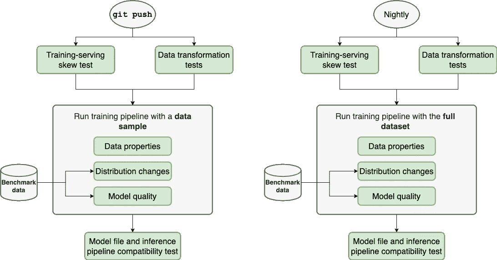
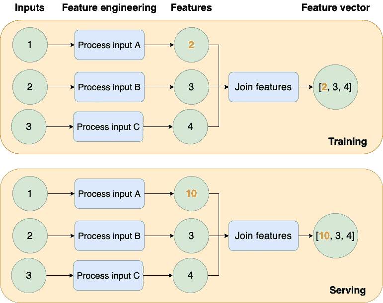

# 机器学习的有效测试(第三部分)

> 原文：<https://towardsdatascience.com/effective-testing-for-machine-learning-part-iii-7bdb557711ab>

## 测试 ML 系列

# 机器学习的有效测试(第三部分)

## 用于开发健壮的 ML 项目的渐进的、逐步的框架

图片作者。

在前两部分([第一部分](/effective-testing-for-machine-learning-part-i-e6b5aeb51421)和[第二部分](/effective-testing-for-machine-learning-part-ii-6ac7feb287a7)，我们描述了一个框架，通过逐步增加更全面的测试来增加我们项目的健壮性。从冒烟测试到集成测试，我们从一个基本项目过渡到一个确保生成高质量模型的项目。

这最后一部分总结了这个系列，有三个目标:

1.  定义一个策略来决定每当我们遇到问题时添加什么测试。
2.  描述加速测试执行的策略。
3.  为选择开发可测试 ML 管道的工具提供建议。

# 测试的分类

让我们回顾一下我们在前两部分中介绍的测试类型:

**1。集成(数据质量)测试**

1.1.检查数据属性(即`age`列中没有`NULL`值)。

1.2.分布变化(即，确保我们的目标变量的分布不会发生剧烈变化)。

1.3.模型质量(即检测模型性能的突然下降/上升)。

**2。单元测试**

2.1 检查训练和服务管道之间的一致性(又名*训练-服务偏斜*测试)。

2.2 检查数据转换的正确性(给定一些有代表性的输入，测试数据转换的输出)。

2.3.检查模型文件和推理管道的兼容性。

# 工作流摘要

我们希望我们的测试快速失败，所以我们将首先运行单元测试(训练服务偏斜和数据转换)。如果它们通过了，我们继续运行带有数据样本的管道(集成测试)；如果成功，我们使用生成的模型文件，并检查与推理管道的兼容性；我们在下图中描述了完整的流程:

图片作者。

请注意，我们建议每晚对整个数据集重复相同的过程；但是，时间间隔越短越好。

# 集成与单元测试

一个关键的区别是集成测试依赖于训练数据，因为它们评估其质量。相反，单元测试不会，因为它们评估我们代码的正确性。因此，我们可以用几个有代表性的例子来检验它们。

这种对训练数据的依赖对定义我们的测试策略有影响。理想情况下，我们希望我们的集成测试检查我们的整个数据集。然而，这是不可行的，所以我们求助于随机抽样(比如 1%)来快速测试数据质量。虽然有效，但这种随机抽样方法只是我们在整个数据集上测试所得的近似值。

另一方面，由于单元测试**不**依赖于我们的训练数据，我们可以使用一些有代表性的输入进行测试；因此，预期的运行时间应该很短(不超过几分钟)。此外，由于单元测试运行速度很快，它们应该是您测试的第一件事，所以如果单元测试有问题，您不必运行昂贵的集成测试。

因此，总的来说，我们应该把测试套件(带有随机样本的集成测试和单元测试)的运行时间控制在 20 分钟以内。

现在让我们描述一个策略，当我们遇到一个错误的时候，决定执行什么测试。

# 未来测试的策略

我们的策略取决于具体情况；让我们来看看每一个:

## 当集成测试崩溃时

**数据属性**

假设数据属性失败(例如，一列突然有了`NULL`值)。在这种情况下，有两个选择:更新您的代码以过滤掉违规的记录(这将导致测试通过)，或者放松测试(例如，删除测试以允许`NULL`值，或者允许某个百分比)。决定将取决于你的用例:也许你决定做数据插补，所以你决定允许一些`NULL`值；另一方面，您可能确定您不能估算数据，在这种情况下，更新代码以过滤掉违规记录。

**分布变化**

如果数据分布发生变化，您必须确定这种差异是由于数据生成过程中的实际变化，还是由于某些数据接收或数据转换错误。例如，假设您发现了`age`列中的差异:中位数`age`是 25，现在是 40。可能是目标人群变老了，你现在必须更新你的参考值。另一方面，也可能是上游数据转换发生了变化，它传递了您不应该使用的记录；如果是这种情况，您可能需要检查上游流程，以过滤掉改变数据分布的新记录。

**模型质量**

一旦你在生产中有了第一个模型，改进通常是小幅度的。因此，每当模型质量出现显著下降或上升时，调查它是很重要的。正如本系列的第二部分所提到的，您需要一个基准模型来评估当前模型的质量；这通常是生产中的当前模型。

性能的突然下降意味着丢失了一些集成测试(因为集成测试应该在进入模型训练任务之前检测低质量的数据)。相比之下，性能的突然显著提升可能表明存在[泄漏](https://en.wikipedia.org/wiki/Leakage_(machine_learning))等问题。

如果您的模型性能比基准差得多，请比较用于训练当前模型和基准的代码，以确定发生了什么变化(例如，删除了某个特征，更改了超参数)。另一方面，如果模型的性能比基准测试好得多，检查代码变更并确保没有任何问题，比如泄漏。如果您没有发现任何问题，那么恭喜您，您刚刚使您的模型变得更好了！接受变更并更新基准指标。

如果您在调查后发现培训管道有问题，请将其转化为集成测试。例如，如果您的模型变得更差，因为您在具有`NULL`值的列上对其进行了训练，那么为其添加一个集成测试。添加测试后，修复管道，并确保更改修复了性能问题。

请注意，我们建议使用数据样本在每个`git push`上测试您的管道，以使其切实可行；然而，这意味着输出训练集将变得更小，使得评估性能变得更具挑战性。如果可能的话，根据在相同样本大小上训练的基准模型，评估在数据样本上训练的模型的性能。然而，如果这样做很有挑战性(例如，不同实验之间的性能差异太大)，您可能会决定只在夜间运行模型质量测试。

## 当单元测试失败时

**训练-发球偏斜**

如果您的训练-服务偏斜测试失败，比较您的训练和服务管道的输出，直到您发现结果不同的第一步。一旦您发现了问题，修复它并继续运行测试，直到它通过所有的样本输入。这种一步一步的调试过程是我们需要构建模块化管道的原因:如果我们在单个笔记本/脚本中编写整个项目，将很难发现这些问题。

例如，下图显示了以不同方式处理输入的管道(它们生成不同的特征向量)。因此，一旦您检测到问题，请向后检查输出，直到您发现差异为止；在这种情况下，问题在于`Process input A`步骤，因为它在训练(`2`)和发球时间(`10`)产生不同的结果。

图片作者。

**数据转换**

如果一个数据转换(通常是一个单一的函数)测试失败了，那一定是由于转换的源代码发生了变化。有时，我们在优化一个转换时会犯错误(例如，为了更有效地利用内存)，单元测试允许我们检测它们。然而，其他时候，我们可能会改变转换的行为。因此，单元测试中的输入样本将不再具有代表性。在任何情况下，都要确保确定哪种场景适合您，并修复源代码或更改示例输入。

请记住，您的单元测试应该是不断发展的。因此，每当您发现一个边缘案例时，确保您添加了一个新的输入测试案例:单元测试应该覆盖您的转换应该考虑的所有代表性的输入案例。

**模型文件和推理管道**

您的推理管道捕获将原始数据转换为模型用作输入的特征向量所需的预处理逻辑；这两个元素可能会不同步。例如，你可能有一个特征训练的模型文件`[A, B, C]`(按此顺序)。尽管如此，如果您最近更新了您的推理逻辑，它可能会以不同的顺序生成要素(比如说，`[C, B, A]`)，这会中断您的推理过程。您通常可以通过使用相同的 git 提交生成模型文件来修复模型文件和推理管道之间的不兼容性；然而，有必要运行这个测试，以确保您不会部署不兼容的工件。

# 加速测试

单元测试应该运行得很快(几分钟),因为它们是用几个有代表性的输入运行的。然而，快速运行集成测试是具有挑战性的，因为它们依赖于训练数据。为了有助于这一点，我们用随机样本运行训练管道；但是，这可能无法检测出整个数据集中存在的问题。

例如，如果我们测试数据属性，比如没有`NULL`值，如果我们用 1%的数据对整个数据集进行测试，测试结果可能会改变。分发也受到影响；用较小的样本进行测试会增加假阳性的变化(在没有差异的情况下检测到差异)。此外，用数据样本评估模型性能几乎肯定会给出一个度量更差的模型。

为了平衡运行时间和测试健壮性，我建议如下:用最广泛的数据样本运行集成测试，这仍然给你一个合理的测试运行时间(我认为不超过 20 分钟)。最重要的是，尽可能频繁地安排完整数据集的运行。例如，如果使用整个数据集端到端地运行培训管道需要 2-3 个小时，则可以在夜间运行。

最重要的是，您可以利用增量构建:假设您已经计算并存储了来自管道的所有结果；如果只改变最后一步，就不需要从头重新运行一切。因此，相反，只执行自上次运行以来源代码已经更改的步骤。不幸的是，并不是所有的管道框架都支持这一点(但是 [Ploomber](https://github.com/ploomber/ploomber) 支持！).然而，增量构建极大地加快了开发和测试的速度。

## 处理昂贵的培训程序

在某些情况下，训练过程可能需要很长时间才能完成(例如，深度神经网络)。如果是这种情况，您可以使用代理模型进行测试(例如，如果您的神经网络有十个隐藏层，则使用其中三个的代理模型)。如果你的训练数据有问题，很有可能代理模型也会表现出较低的性能。

# 选择正确的工具

当测试我的 ML 项目时，我发现最大的挑战之一是缺少合适的工具。我们设计了 [Ploomber](https://github.com/ploomber/ploomber) 来支持这个测试工作流程(所以我们强烈建议您尝试一下！)，但是这里有一些选择框架时的一般建议。

## 本地执行

通常，被设计成分布式运行的框架(例如，在 Kubernetes 上)没有在单节点环境中执行管道的简单方法；依赖外部基础设施使测试变得复杂。因此，最好使用允许您在单节点环境中运行代码的框架。测试应该像启动一台机器并调用:

## 可输入管道

测试需要一些配置和准备；例如，您可能需要创建一个临时目录来运行带有示例的管道。像 [pytest](https://docs.pytest.org/) 这样的测试框架允许你这么做。测试的典型结构是这样的:

要使用测试框架，您应该能够使用 Python 导入和运行您的管道，因此确保您将使用的库允许您这样做。测试可能是这样的:

## 参数化

您的培训管道必须公开参数，以允许您使用不同的配置运行它们。测试时，您希望使用数据样本运行测试，并将任何结果存储在单独的文件夹中，以防止覆盖您的结果，因此请确保您使用的框架允许您对管道进行参数化:

# 最后的想法

测试 ML 管道是一项艰巨的任务:大型数据集和长训练周期为确保测试在合理的时间内运行带来了巨大的挑战。然而，简单的测试策略，比如冒烟测试和用小的随机样本进行测试是有回报的，所以确保你实现了那些基本的策略，并且随着你的项目的成熟而转向更高级的策略。

开发可测试项目的一个基本要求是模块化您的工作。在单个文件中包含整个数据处理逻辑的单块笔记本是测试和维护的噩梦，所以请确保您使用的框架允许您将逻辑分解为小步骤，以便您可以单独测试每个步骤。

我作为数据科学家的经历启发了这些指南；然而，这是一个不断发展的领域，所以如果你有任何问题或者想聊聊关于 ML 测试的所有事情，[加入我们的社区](https://ploomber.io/community/)！

发现错误？[点击这里让我们知道](https://github.com/ploomber/posts/issues/new?title=Issue%20in%20post%3A%20%22Effective%20Testing%20for%20Machine%20Learning%20%28Part%20III%29%22)。

*最初发布于*[*ploomber . io*](https://ploomber.io/blog/ml-testing-iii/)*。*