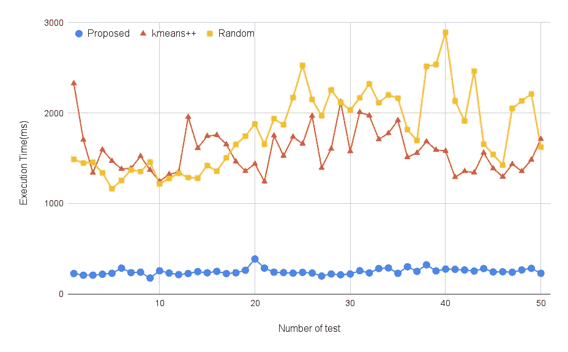
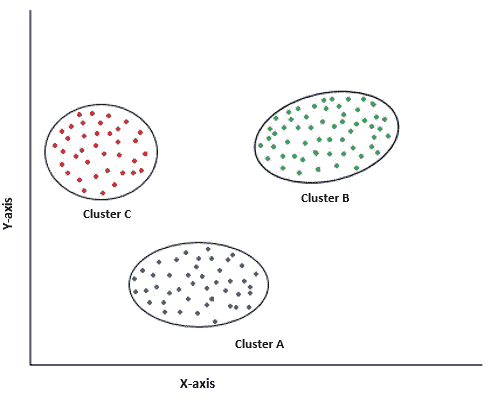
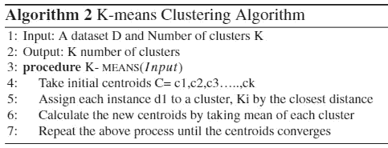
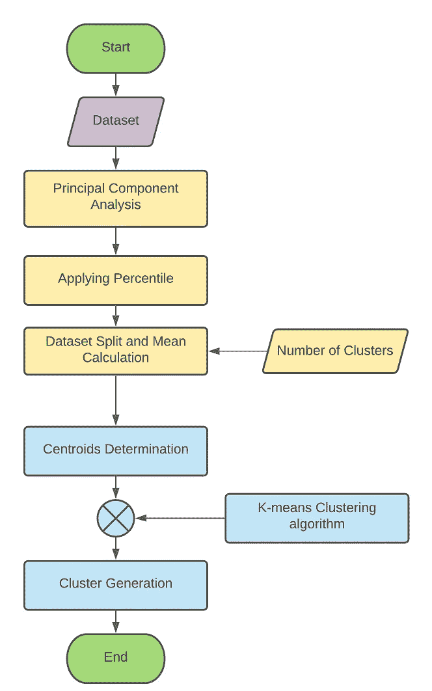
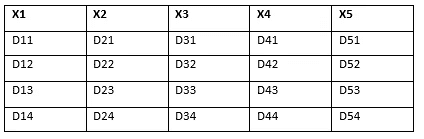
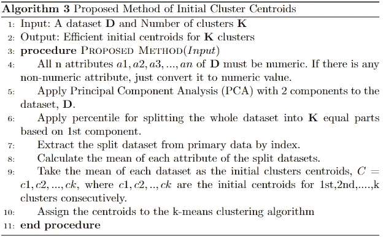
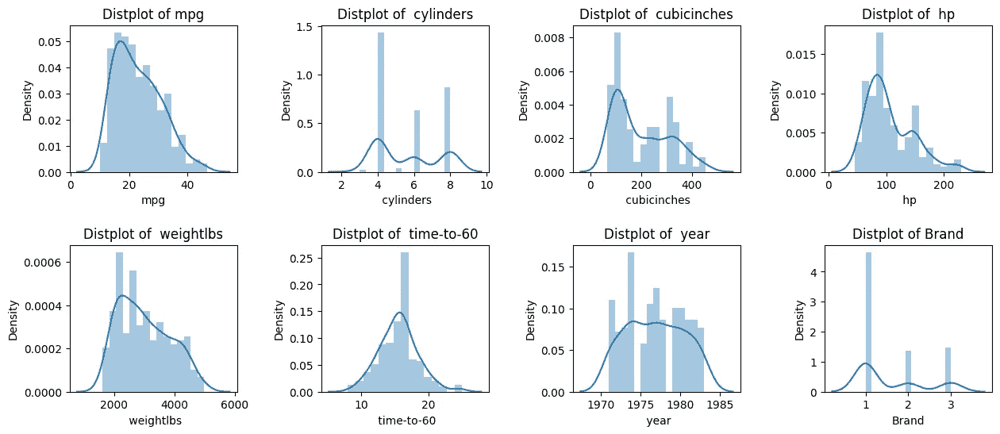

# 具有最优迭代和执行时间的高效 K-均值聚类算法

> 原文：<https://towardsdatascience.com/efficient-k-means-clustering-algorithm-with-optimum-iteration-and-execution-time-9358a794406c>

## 高效 K-means 聚类算法的实现:研究成果

改进的 K-means 聚类算法与其他现有方法的比较[1]

## **动机**

回到 2019 年，我在读研究生，教授 K-means 聚类算法，作为机器学习课程的一部分。我很快抓住了算法的基本主题。该算法很有趣，因为它为每个聚类随机假设质心，并迭代直到它收敛到最终的聚类。不管初始质心是什么！它总是落在同一个星团里。在常规过程中，迭代次数随机变化。从那时起，我开始思考，如果我能修正初始质心，算法的迭代和执行时间将大大减少。我做了很多探索来寻找一种方法来选择最佳的初始质心。我分析过很多类似的作品。并找到了一个名为 ***kmeans++的标准方法。不幸的是，n* 方法之一提供了最佳常数迭代。我和两个朋友以及我的主管一起，开始想出不同的点子来寻找可能的解决方案。我们还用现有的方法测试了我们产生的想法。经过一年的研究，我们提出了一个想法，即**在执行时间和迭代次数方面优于其他方法。**我们刚刚使用了**百分位和 PCA(主成分分析)**来确定最佳初始质心。在接下来的部分中，我将通过实际操作来讨论所提出的方法。**

****n . b .—****它已经由 **Springer Nature** 发表在* ***【数据科学年鉴】*** 期刊上。 [*全文在此处。*](https://link.springer.com/article/10.1007/s40745-022-00428-2) ]*

## *目录*

1.  *`[**Clustering Algorithm at a Glance**](#26c5)`*
2.  *`[**K-means Clustering Algorithm Overview**](#7bb5)`*
3.  *`[**How the Proposed Method Works**](#7382)`*
4.  *`[**Step By Step Implementation with Python**](#603e)`*
5.  *`[**Comparison with the Traditional Method**](#3e5b)`*
6.  *`[**Multidimensional Cluster Visualization with Parallel Coordinates**](#d0ac)`*

## *聚类算法一览*

*当“集群”这个词来的时候，让我想起了一件简单的事情:**“把*相似类型的物体组合在一起*”**它是无监督学习的一部分。聚类问题是无监督的学习问题，因为这些算法对未标记的数据(无目标值)起作用。算法的主要任务是“根据相似的特性或特征对数据进行分组”*

**

*作者图片*

*看看上图就知道了。这是一个二维图像。假设虚线表示具有两个特征的每个实例( *X，Y* )。它清楚地显示了聚类是基于最小距离(相似类型的要素)形成的。存在许多聚类技术，包括 K-means 聚类、DBSCAN、凝聚层次聚类、高斯混合模型算法等。其中，K-means 聚类被广泛应用。*

## *k-均值聚类算法概述*

*首先，k-means 聚类算法为每个聚类随机选择质心。然后计算每个点到质心的距离。基于最小距离创建聚类。然后计算每个聚类的平均点，并将其作为新的质心。重复相同的过程，直到质心收敛到一个固定点。*

**

*k 均值聚类算法[1]*

*我们来看看论文[1]中提到的算法。它非常精确地描述了整个过程。*

## *提议的方法如何工作*

*主算法我们什么都没修改。我们所做的只是提出了一种有效选择初始质心的方法。让我们看看下面给出的流程图。*

**

*让我一步一步地解释方法。*

1.  ***数据集读取:**对于每个机器学习模型，我们都需要读取数据集。所提出的方法需要相同的过程。当我们在下一步中应用 PCA 时，我们必须将所有的值转换成数字。*
2.  ***主成分分析(PCA)**步骤都是关于降维的。这些特征应该归纳为两个部分。将使用 PCA 来完成这项工作。有了这两个特性，我们可以轻松地对数据进行水平或垂直分段。这就是为什么我们使用两种成分的 PCA。*
3.  ***应用百分位数概念分离数据:**百分位数是一种统计技术，通过它我们可以将数据分成 100 个不同的部分。每个部分保存 1%的数据。要了解更多关于百分位的细节，你可以阅读以下文章— ( [***数据科学统计终极指南***](/ultimate-guide-to-statistics-for-data-science-a3d8f1fd69a7) )*
4.  ***数据集拆分和均值计算:**这一步是最重要的一步。在上一步中，我们只是应用了百分位数。现在，我们需要使用百分位数分割数据集。例如，我们希望使用 K-means 聚类算法创建 4 个聚类，因此 K=4。根据该方法，我们将根据第一部分 ***将数据集分成 4 等份(第一部分 0% — 25%，第二部分 25% — 50%，第三部分 50% — 75%，第四部分 75% — 100%)。*** 接下来我们将通过映射指标提取各部分的主要数据。之后，将计算每个部分的平均值。*

**

*作者图片*

*上图显示了一个 spit 零件的演示数据集。其中， ***X1，X2…代表特性，D11，D21…表示实例值。*** 意思是将计算如下——*

> *平均值 X1=(D11+D12+D13+D14)/4*
> 
> *平均 X2=(D21+D22+D23+D24)/4*
> 
> *平均 X3=(D31+D32+D33+D34)/4*
> 
> *平均值 X4=(D41+D42+D43+D44)/4*
> 
> *平均值 X5=(D51+D52+D53+D54)/4*

*聚类的初始质心将是 ***的值(平均 X1，平均 X2，平均 X3，平均 X4，平均 X5)。*** *用同样的过程，将确定另外 3 个质心。**

*5.**质心确定并馈入 K-means 算法:**我们在 ***数据集分割和均值计算*** 步骤中获得了最佳初始质心。是时候将质心提供给主 K-means 聚类算法了。其余的过程与传统的 K-means 聚类算法相同。为了方便起见，我还包括了该方法的算法。*

**

*高效 K 均值聚类的建议算法[1]*

## *用 Python 逐步实现*

*   ***导入必要的 Python 库。***

*   ***读取数据集和一些预处理***

*出于演示目的，我使用了 [**cars.csv**](https://www.kaggle.com/datasets/abineshkumark/carsdata) 数据集，可从[***Kaggle***](https://www.kaggle.com/datasets/abineshkumark/carsdata)获得。您也可以使用其他聚类数据集。*

**让我们看看数据集的整体信息。**

*上面的单元格清楚地显示了一些非数字列，如 ***cubicinches、heavy bs 和 brand。*****品牌**列保存分类值，如*美国、欧洲和日本。*我们将映射分类值以将其转换为数值。*

*现在，我们将删除包含分类值的`**brand**` 列。*

*关于数据的当前信息。*

*尽管如此，我们仍然有两个非数字的列***cubic inch 和 weightbs***，它们是数值，但被指定为字符串。让我们把它转换成数值。*

*数据集当前状态的概述。*

*我们可以看到所有的值都是数字，但是有一些丢失的值需要小心处理。*

*这段代码将处理丢失的值。*

*下图显示了数据的分布情况。*

*`***Output***`*

**

*   ***为数据集寻找 K 值的最佳数量***

*我已经用 ***肘法*** 找到了最佳 **K** 值。*

*最佳簇的数量是 3，因为肘部的弯曲从该点开始。*

**【注意——肘击法不是建议技术的一部分。我用它来寻找最佳聚类，因为我们正在处理一个随机数据集。而且我们不知道有多少个聚类适合这个数据集。】**

*   ***应用具有两种成分的主成分分析，并将数据可视化***

*   ***应用百分位数分离数据***

*我们将创建 3 个集群。因此，我们需要将数据集分成 3 个相等的部分。百分位计算在 100%以内。因此，每个群集中 100/3=33.3%的数据可能是相等的。值得一提的是，百分点将应用于第一个 PCA 成分 的 ***，因为它保存了最多的信息。****

*让我们看看我是如何分割数据集的。*

*   ***从主数据中提取分离的数据***

*在上面的代码中，我根据 PCA 的第一个组成部分将数据分成 3 个相等的部分。但是我们不会从 PCA 分量中计算质心，因为可能会有巨大的信息丢失的可能性。因此，我们将数据合并到预处理的`***car***` 数据框架中，以提取包含原始数据集所有特征的数值数据。上面代码的`first, second and third` 变量包含了每个分割的数据。*

*   ***平均值计算和质心选择***

*在这一步中，我们计算了每个数据分割部分的平均值，并将其视为质心。最后，我们在 K-means 聚类算法中加入了质心。出于测试目的，该过程已经执行了 10 次。我已经在 `iteration and time_execution`列表中记录了建议方法的迭代次数和执行时间。*

## *与传统方法的比较*

*用传统的 K-means 聚类算法训练模型。*

*我已经在`iteration_default` 和`execution_time_default`列表中记录了执行时间和迭代。*

**我们来画个对比图进行迭代。**

*它清楚地表明，我们提出的方法工作于常数迭代，因为我们的质心是固定的；另一方面，传统的 K-means 聚类算法表现出任意的迭代。并且在每种情况下，该方法的迭代次数都是最小的。*

**执行时间方面的比较。**

*实验结果表明，在大多数情况下，该模型的性能优于传统方法。*

## *具有平行坐标的多维集群可视化*

*我们的数据集中有超过 3 个维度。实际上我们无法想象它。这就是为什么我会用平行坐标来绘制这些簇。*

**【解释平行坐标的概念不在本文讨论范围内。如果你想了解一下，点击* [*这里*](https://www.analyticsvidhya.com/blog/2021/11/visualize-data-using-parallel-coordinates-plot/) *就知道了。】**

*这里，`***0, 1, 2***`代表单个集群。*

## *结论*

*机器学习模型很复杂，需要强大的计算能力。如果我们能找到任何方法来降低它的计算复杂性，它将发挥重要作用。由于所提出的方法优于其他方法，它也将节省计算成本。*

****【注意——你可以引用参考部分所示的方法。】****

*`***Full notebook is available here.***`*

*<https://deepnote.com/@md-zubair/Efficient-K-means-Clustering-for-data-driven-modelling-a6ca9f6e-5f62-4914-a16d-6ead5c57ae36>  

## 参考

1.  祖拜尔，m .，伊克巴尔，M.A .，希尔，A. *等*一种面向高效数据驱动建模的改进 K 均值聚类算法。*安。数据。Sci。* (2022)。[https://doi.org/10.1007/s40745-022-00428-2](https://doi.org/10.1007/s40745-022-00428-2)* *<https://mzh706.medium.com/subscribe>  <https://mzh706.medium.com/membership> *