# 在 Python 中训练深度学习模型时的高效内存管理

> 原文：<https://towardsdatascience.com/efficient-memory-management-when-training-a-deep-learning-model-in-python-fde9065782b7>

## 如何使用 Tensorflow、Python 和迭代器在小型计算机上使用大数据


西西弗斯的作品；由维基共享许可授权[https://commons . wikimedia . org/Wiki/File:Friedrich _ John _ nach _ Matth % C3 % A4us _ Loder _ Sisyphus _ UBS _ G _ 0825 _ ii . jpg](https://commons.wikimedia.org/wiki/File:Friedrich_John_nach_Matth%C3%A4us_Loder_Sisyphus_ubs_G_0825_II.jpg)

当前商业世界中的数据量每天都在增加。有新的数据源要合并，有更多的行要追加，有新的列要连接。

不幸的是，对于典型的数据科学家或机器学习工程师来说，购买新笔记本电脑或计算机或扩展云服务的速度通常赶不上新数据进入的速度。一个人的硬件可能感觉像西西弗斯:试图保持岩石不压碎他(计算机中的内存不会填满)，同时仍然保持他的工作(训练深度学习模型)。

在这篇文章中，我将提出一个关于如何考虑将大量数据放入少量 RAM 的逻辑。

所有的代码和例子都可以在我的回购中找到:

<https://github.com/Eligijus112/big-data-ml>  

我们将尝试解决的目标是创建一个模型，使用以下功能预测纽约市出租车司机的车费金额

*   拾取日期时间
*   出租车里的人数
*   上车点和目的地之间的距离

该数据已在 Kaggle 竞赛中提供，包含约 5500 万行。

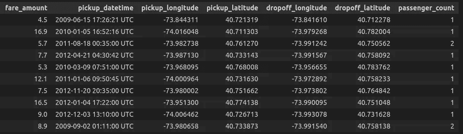

数据片段；作者照片

我们将使用以下函数对此数据集进行一些特征工程:

提货日期转换；作者代码

距离计算；作者代码

虚拟变量创建；作者代码

将这些函数应用于数据框后，我们将使用以下公式对票价金额进行建模:

*   **乘客数量**
*   **每周提货日的虚拟变量**
*   **行驶距离**
*   **拾取时一天中某小时的 Sin 和 Cos 循环转换**
*   **拾取时一年中某一天的 Sin 和 Cos 循环转换**

要了解更多关于周期性特征的信息，请访问以下资源:

<https://feature-engine.readthedocs.io/en/1.3.x/user_guide/creation/CyclicalFeatures.html>  

模型中共有 **18** 个特征。

顺便说一句，要更好地理解数据并向伟大的数据科学家社区致敬，请访问本笔记本:

<https://www.kaggle.com/code/breemen/nyc-taxi-fare-data-exploration>  

在这篇文章的标题中，有一个术语叫做*内存管理*。当谈到内存和深度学习时，人们要么指图形处理单元的内存( **GPU)** ，要么指随机存取存储器( **RAM)** 。我将探索 RAM 部分，以及如何使用大数据不堵塞计算机内存。

在使用 Tensorflow 的典型深度学习模型训练中，记忆方面的训练可以表示为:

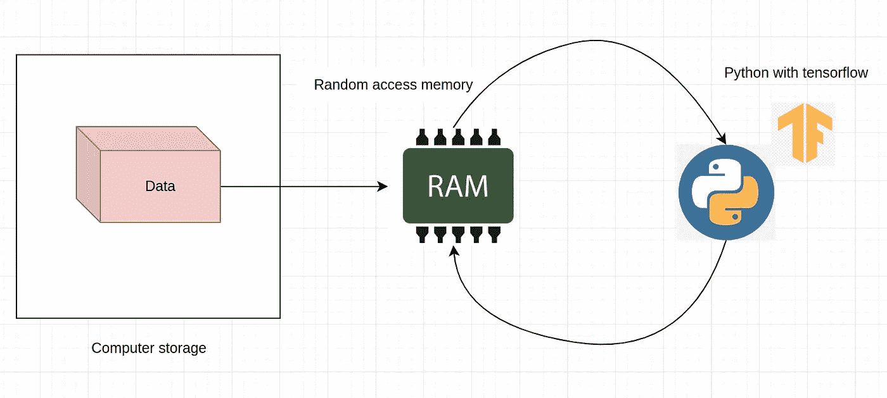

记忆和深度学习；作者照片

当我们启动一个 Python 脚本并使用 TensorFlow 定义一个模型时，我们会立即占用 RAM 中的一些空间。这是我们不能走捷径的部分，因为为了让训练程序工作，整个模型对象需要存在于内存中，并且可以被 Python 的运行进程快速访问。

纽约市数据的深度学习模型；作者代码

使用内存分析器，我们可以运行上面的脚本:

```
python -m model
```

并得到如下细分:

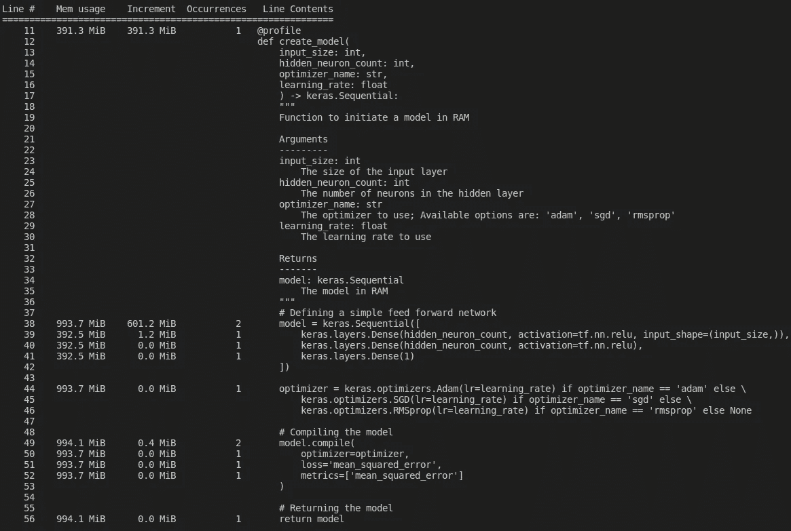

内存使用细分；作者照片

甚至在调用函数之前，Python 已经通过加载函数 ***(Keras，TensorFlow，memory_profiler)上面定义的包在我们的系统中预留了 391 MB 的 RAM。***

在第 38 行，当模型启动时，RAM 使用量增加了大约 600 MB。即使是这个简单的一个隐藏层模型也要占用超过半个 GB 的内存。

因此，即使在训练开始之前，没有数据被加载到存储器中，也需要至少 1 GB 的 RAM 来进行任何类型的训练。

让我们运行下面的代码，它将数据集的所需行加载到内存中，训练一个模型并返回它。运行包含 100k 行的脚本的命令是:

```
python -m train_whole_data --rows 100000
```

以直截了当的方式进行培训；作者代码

内存分析器返回以下结果:

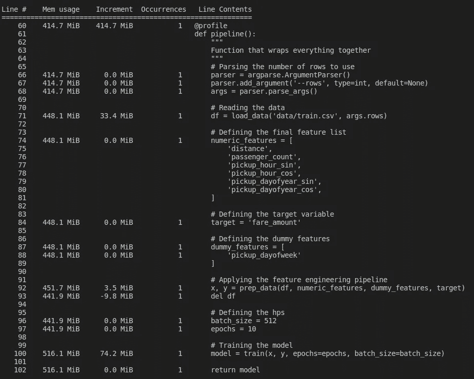

100k 行的内存使用情况；作者图片

正如我们从第 71 行看到的，数据占用了大约 33 MB 的 RAM。模型训练需要额外的 74 MB。所有其他 RAM 的使用都是由于加载了额外的包。让我们看看一百万行会发生什么:

```
python -m train_whole_data --rows 1000000
```

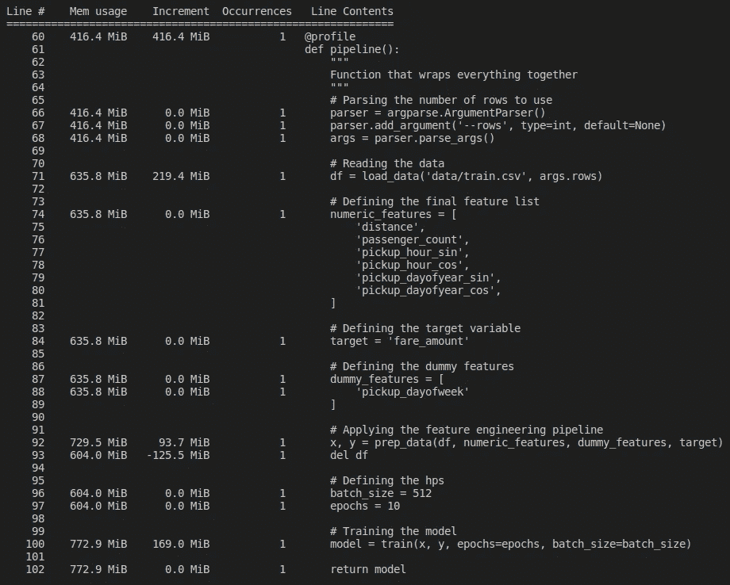

使用 1000 000 行的内存使用量；作者照片；

增加 10 倍的行数会使整体 RAM 使用量增加 1.5 倍。让我们分析一下下面的情节:

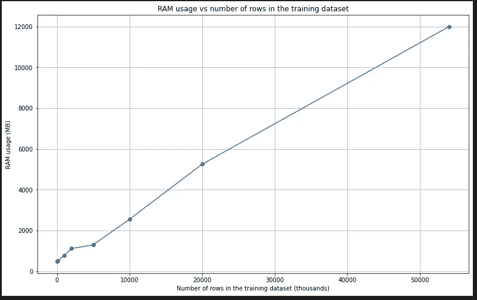

RAM 使用与行数的关系；作者照片

当行数增加时，内存使用量呈线性增长。试图用所有数据(大约 5400 万行)来拟合一个模型会导致代码使用超过 12GB 的 RAM！

到目前为止，我们所做的过程可以总结在下图中:


填满羊肉饼；作者照片

RAM 空间是有限的，取决于机器的规格。当行数增加时，加载到 RAM 的数据和用于模型定型的 RAM 使用量( **X** 和 **Y** 变大)都会增加。

把所有东西都存储在 RAM 里最大的好处就是训练的整体速度快。这是因为运行数据加载和训练模型的 Python 进程获得了它自己的专用 RAM 空间，并且从那里向训练加载数据只需要几分之一秒的时间。

可以看到，我们最终将达到一个阈值，在该阈值处，训练脚本将被终止，因为我们将使用系统中的每一位 RAM。

为了用几乎**任何**数量的数据训练一个模型，我们将使用**一个数据生成器序列(从这里开始，我将数据生成器序列简单地称为数据迭代器)**。

形式上，编程中的迭代器是一个有两种方法的对象:

*   **hasNext()** —返回一个布尔值，判断当前活动迭代项旁边是否有元素。*假*表示迭代应该停止。
*   **next()** —返回迭代中使用的下一项。

在为 TensorFlow 定义数据生成器时，我们需要使用以下类:

  

需要在类中定义的方法有:

*   **__init__()** —对象构造函数。
*   **__len__()** —我们迭代器中的总项数。
*   **__getitem__()** —获取迭代中的下一项。

__ **getitem__()** 方法等价于形式定义中的 **next()** 方法。

在每次迭代结束时调用 __ **len__()** 方法，一个单独的规则或者停止迭代器或者继续它。这模仿了 **hasNext()** 方法背后的逻辑。

下面是这个项目中使用的数据迭代器:

纽约市数据的数据生成器；作者代码

构造函数中的第一个参数是使用 Pandas 库中的**read _ CSV(iterator = True)**方法获得的。这是一种内部 Pandas 数据框方法，可以在读取具有分区的数据时使用。在读取到计算机内存时，CSV 文件可以被拆分为单独的行，而无需将整个数据集加载到 RAM 中。

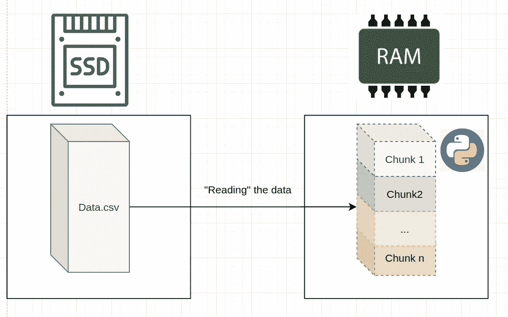

对块的引用保存在内存中；按作者分类的图表

每次调用 **__getitem__()** 方法时，都会从 csv_generator 对象中调用一个块到内存中。然后对块进行预处理，并从中创建用于深度学习的 **x** 和 **y** 矩阵。

x 和 y 矩阵被馈送到 TensorFlow 模型，并且在用它们完成所有训练之后，它们被从存储器中删除。

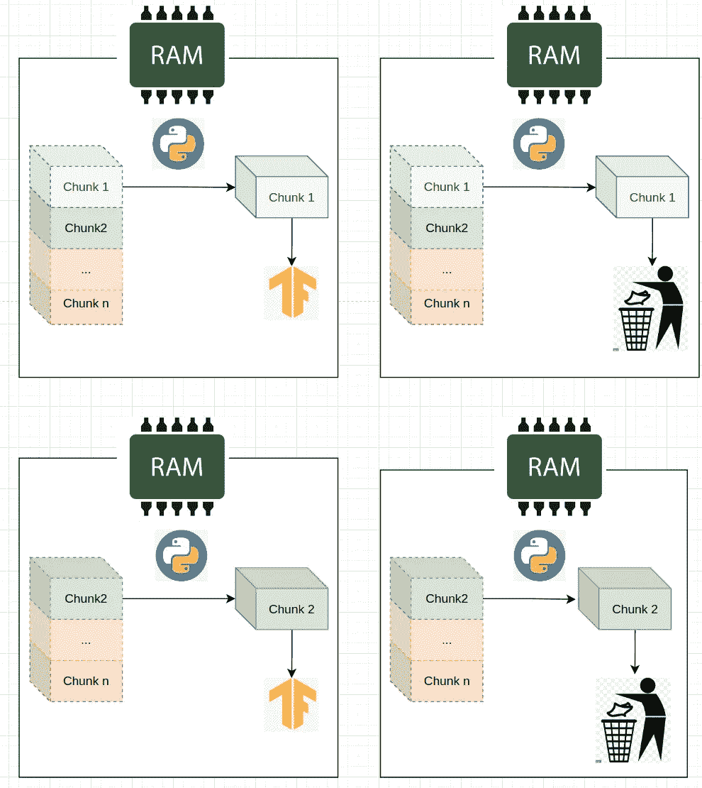

用迭代器模式训练；按作者分类的图表

当数据迭代器停止时，训练完成。

使用迭代器训练模型的完整 python 代码:

使用迭代器的完整管道；作者代码

现在让我们试着运行有一百万行的代码:

```
python -m train_iterator --rows 1000000
```

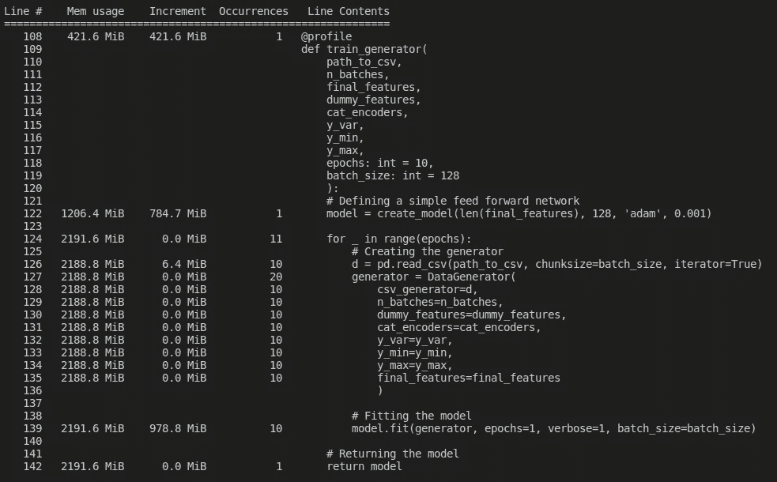

用迭代器 1 百万行；作者图片

正如我们从第 126 行看到的，创建一个 CSV 生成器来遍历整个数据集只需要 6.4 MB 的 RAM。回想一下，将整个数据集加载到内存需要大约 **12000 MB** 的内存。内存的总使用量大约为 2100 MB。

使用整个数据集运行脚本:

```
python -m train_iterator 
```

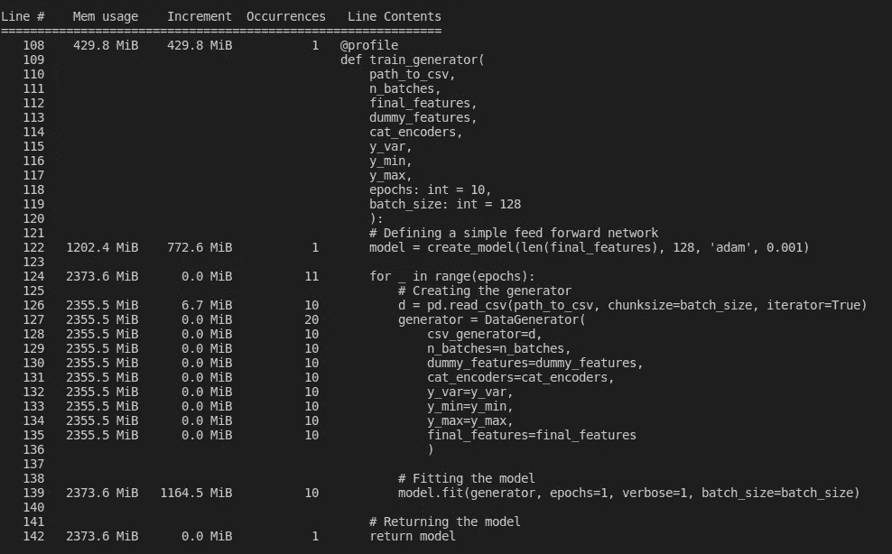

使用迭代器对完整数据集进行训练；作者照片

令人惊讶的是，即使添加了 54 倍的数据，整体 RAM 消耗几乎保持不变(从 2191MB 到 2373MB)！这可以用图表来解释:

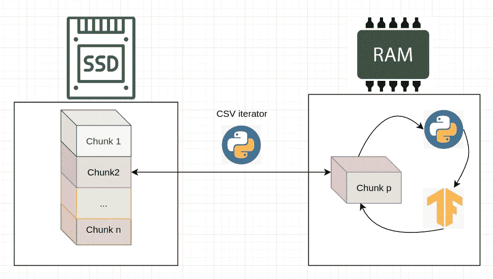

有效的语块训练；按作者分类的图表

SSD(或数据库或任何其他存储)中的数据需要分成分区(块)。有效的训练算法可以总结如下:

```
* Split the data into **M** chunks. * Initiate an empty model in memory. * For **m** in **M** chunks do: 1) Load the data of chunk **m** to memory  2) Train the model using that chunk 3) The model weights are saved and the chunk **m** is removed from memory. 
```

上面的算法让我们在相对低内存的设备上使用非常大的数据文件来训练模型。

这种方法的缺点是将数据块从本地存储转换到 RAM 会产生瓶颈，从而减慢整个训练过程。

总之，在训练神经网络的速度和将大量数据放入计算机内存的能力之间存在权衡:

*   RAM 中的数据越多，训练速度越快。
*   RAM 中的数据越少，训练模型所需的资源就越少。

在本文中，我展示了如何使用这两种方法，介绍了 TensorFlow 提供的数据迭代器的概念，并展示了所有代码示例。

编码快乐！

[1]纽约市出租车费用预测；
网址:[https://www . ka ggle . com/datasets/harlfoxem/housesales prediction？资源=下载](https://www.kaggle.com/competitions/new-york-city-taxi-fare-prediction/data)

执照:[https://creativecommons.org/publicdomain/zero/1.0/](https://creativecommons.org/publicdomain/zero/1.0/)