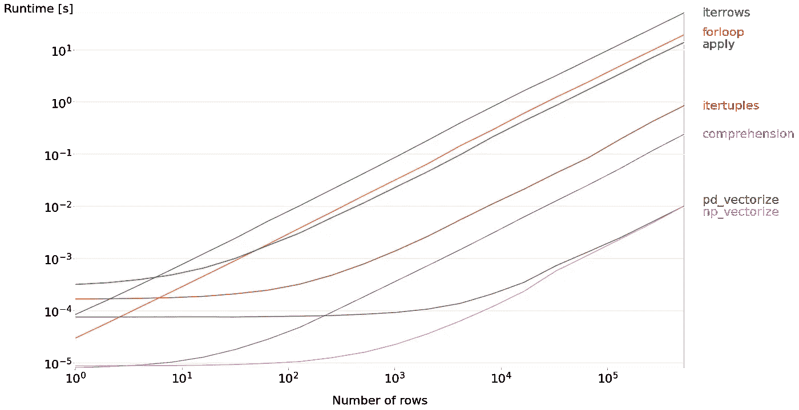

# 高效地迭代熊猫数据帧中的行

> 原文：<https://towardsdatascience.com/efficiently-iterating-over-rows-in-a-pandas-dataframe-7dd5f9992c01>

## 不再使用 iterrows 和 itertuples


图片由作者，表情符号由[open moji](https://openmoji.org/)([CC BY-SA 4.0](https://creativecommons.org/licenses/by-sa/4.0/#))。

当我开始机器学习时，我遵循这些准则，并通过组合我的数据集中的多个列来创建自己的特征。这一切都很好，但我做这件事的方式**非常低效**。我必须等几分钟才能完成最基本的操作。

我的问题很简单:我不知道在 Pandas 中迭代行的最快方法。

我经常在网上看到有人使用我曾经用过的技术。不优雅但是数据不多也还行。然而，如果您处理超过 10k 行的数据，这很快就会成为一个明显的性能问题。

在本文中，我将向您介绍在 Pandas DataFrame 中迭代行的**最佳方法，不需要额外的代码。这不仅仅是关于性能:这也是关于了解在引擎盖下发生了什么，以成为更好的数据科学家。**

让我们在 Pandas 中导入一个数据集。在这种情况下，我选择了我开始时所做的:是时候修正我过去的错误了！🩹

可以用下面的 [Google Colab 笔记本](https://colab.research.google.com/drive/1v9v4j1MnklaCd9eFcuGnB5x_5FoINmRe?usp=sharing)运行代码。

该数据集有 22k 行和 43 列，包含分类值和数值。每行描述两台计算机之间的连接。

假设我们想要创建一个新特性:连接中的**总字节数**。我们只要总结两个现有的特征:`src_bytes`和`dst_bytes`。让我们看看计算这个新特性的不同方法。

# ❌❌ 1.Iterrows

根据[官方文档](https://pandas.pydata.org/docs/reference/api/pandas.DataFrame.iterrows.html)，`iterrows()`迭代“熊猫数据帧的行作为(索引，序列)对”。它将每一行转换为一个系列对象，这导致了两个问题:

1.  它可以**改变你数据的类型**(dtypes)；
2.  转换**大大降低了性能**。

出于这些原因，不恰当的`iterrows()`是实际迭代行的最差方法。

```
10 loops, best of 5: **1.07 s** per loop
```

现在让我们看看稍微好一点的技术…

# ❌ 2.For 循环 with。loc 或。iloc(快 3 倍)

这是我开始时经常做的:一个循环的**基础，通过索引选择行(用`.loc`或`.iloc`)。**

为什么不好？因为数据帧不是为此目的而设计的。与前面的方法一样，行被转换成 Pandas 系列对象，这会降低性能。

有趣的是，`.iloc`比`.loc`更快。这很有意义，因为 Python 不必检查用户定义的标签，直接查看行在内存中的存储位置。

```
10 loops, best of 5: **600 ms** per loop
```

```
10 loops, best of 5: **377 ms** per loop
```

甚至这种用`.iloc`的基本 for 循环也比第一种方法快 3 倍！

# ❌ 3.应用(速度提高 4 倍)

`apply()`方法是另一种流行的行迭代方法。它创建了易于理解的代码，但这是有代价的:性能几乎和前面的 for 循环一样差。

这就是为什么我强烈建议您为了这个特定的目的**避免这个函数**(对于其他应用程序也可以)。

注意，我使用`to_list()`方法将 DataFrame 转换成一个列表，以获得相同的结果。

```
10 loops, best of 5: **282 ms** per loop
```

这个`apply()`方法是一个伪装的 for 循环，这就是为什么性能没有提高那么多的原因:它只比第一种方法快了 **4 倍**。

# ❌ 4.Itertuples(快 10 倍)

如果你知道`iterrows()`，你大概也知道`itertuples()`。根据官方文档，它“遍历数据帧的行，命名为值对”。实际上就是把**行转换成元组**，元组**是比熊猫系列**轻得多的对象。

这就是为什么`itertuples()`是`iterrows()`的更好版本。这一次，我们需要访问带有**属性**(或索引)的值。如果您想用一个**字符串**来访问它们(例如，如果字符串中有一个空格)，您可以使用`getattr()`函数来代替。

```
10 loops, best of 5: **99.3 ms** per loop
```

这开始变得更好了:现在**比`iterrows()`快 10 倍。**

# ❌ 5.列表理解(快 200 倍)

列表理解是作为一行程序迭代列表的一种奇特方式。

例如，`[print(i) for i in range(10)]`打印从 0 到 9 的数字**，而没有任何显式 For 循环**。我说“显式”是因为如果我们看字节码，Python 实际上将它作为 for 循环处理。

那么为什么会更快呢？很简单，因为在这个版本中我们不调用`.append()`方法。

```
100 loops, best of 5: **5.54 ms** per loop
```

的确，这种技术比第一种技术快 200 倍！但是我们仍然可以做得更好。

# ✅ 6.熊猫矢量化(速度提高 1500 倍)

到目前为止，所有使用的技术只是简单地将单个值相加。与其将单个值相加，为什么不**将它们组合成向量**来求和呢？两个数字或两个向量相加的差别对于 CPU 来说并不重要，这应该会加快速度。

最重要的是，Pandas 可以使用所有可用的 CPU 内核**并行处理系列对象**！

语法也是最简单的:这个解决方案非常直观。在引擎盖下，Pandas 使用连续的内存块，通过优化的 C 代码对我们的数据进行矢量化处理。

```
1000 loops, best of 5: **734 µs** per loop
```

这段代码比 T2 快 1500 倍，而且写起来更简单。

# ✅✅ 7.NumPy 矢量化(速度提高 1900 倍)

NumPy 被设计用来处理科学计算。它比 Pandas 方法有更少的开销，因为行和数据帧都变成了`np.array`。它依赖于与熊猫矢量化相同的优化。

有两种**方法**将一个系列转换成`np.array`:使用`.values`或`.to_numpy()`。前者已经被废弃多年，这就是我们在这个例子中使用`.to_numpy()`的原因。

```
1000 loops, best of 5: **575 µs** per loop
```

我们用比第一个竞争对手快 1900 倍的技术找到了我们的赢家！让我们把东西包起来。

# 🏆结论



数据集中的行数会极大地影响某些技术的性能(图片由作者提供)。

不要像我一样:如果您需要迭代数据帧中的行，那么**矢量化**是一个不错的选择！你可以在这个地址找到重现实验[的代码。矢量化不会更难阅读，也不会花费更长的时间来编写，而且性能提升令人难以置信。](https://mlabonne.github.io/blog/)

这不仅仅是关于性能:理解每个方法是如何工作的帮助我**写出更好的代码**。性能提升总是基于相同的技术:将数据转换成向量和矩阵，以利用并行处理。唉，这通常是以牺牲可读性为代价的。但不一定非要这样。

对行进行迭代**只是一个例子**，但它表明，有时，你可以拥有蛋糕并吃掉它。🎂

如果你喜欢这篇文章，**在 Twitter 上关注我**[**@ maxime labanne**](https://twitter.com/maximelabonne)**了解更多关于数据科学和机器学习的技巧！**