# EfficientNetV2:比视觉变压器更快、更小、精度更高

> 原文：<https://towardsdatascience.com/efficientnetv2-faster-smaller-and-higher-accuracy-than-vision-transformers-98e23587bf04>

## 关于 EfficientNetV2 模型的详细说明，及其架构和培训方法的开发

(图片来源:克里斯里德(Chris Ried)在[Unsplash](https://unsplash.com/s/photos/python-programming?utm_source=unsplash&utm_medium=referral&utm_content=creditCopyText)—[https://unsplash.com/photos/ieic5Tq8YMk](https://unsplash.com/photos/ieic5Tq8YMk)拍摄的照片)

EfficientNets 是目前最强大的卷积神经网络(CNN)模型之一。随着视觉变压器的兴起，它实现了比 EfficientNets 更高的精确度，出现了 CNN 是否正在消亡的问题。EfficientNetV2 不仅提高了准确性，还减少了训练时间和延迟，从而证明了这一点。

在这篇文章中，我已经详细讨论了这些 CNN 被开发出来，它们有多强大，以及它对 CNN 在计算机视觉中的未来意味着什么。

# 内容

1.  **简介**
2.  **EfficientNetV2**

………….2.1 efficient net(版本 1)的问题

………….2.2 EfficientNetV2 —为克服问题和进一步改进所做的更改

………….2.3 结果

**3。结论**

# 1.介绍

使用神经结构搜索来设计高效网络模型。第一个神经架构搜索是在 2016 年的论文中提出的—[‘具有强化学习的神经架构搜索](https://arxiv.org/abs/1611.01578)’。

其思想是使用一个控制器(一个网络，如 RNN)和来自概率为“p”的搜索空间的样本网络结构。然后，通过首先训练网络，然后在测试集上验证它以获得准确度“R”来评估该架构。“p”的梯度通过精度“R”计算和缩放。结果(奖励)被反馈给控制器 RNN。控制者充当代理，网络的训练和测试充当环境，结果充当报酬。这是常见的强化学习(RL)循环。这个循环运行多次，直到控制器找到给出高回报(高测试精度)的网络架构。这如图 1 所示。

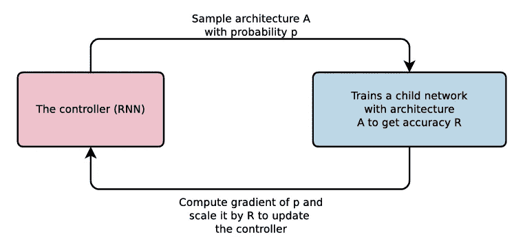

图一。神经架构搜索概述(来源:图片来自[神经架构搜索论文](https://arxiv.org/abs/1611.01578)

控制器 RNN 对各种网络架构参数进行采样，例如每层的过滤器数量、过滤器高度、过滤器宽度、步幅高度和步幅宽度。对于网络的每一层，这些参数可以是不同的。最后选择奖励最高的网络作为最终的网络架构。这如图 2 所示。

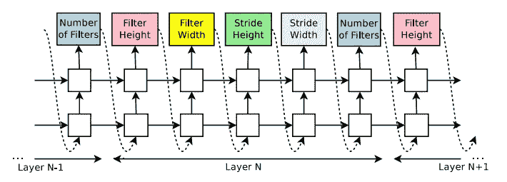

图二。控制器在网络的每一层中搜索的所有不同参数(来源:图片来自[神经架构搜索论文](https://arxiv.org/abs/1611.01578)

尽管这种方法效果很好，但这种方法的一个问题是需要大量的计算能力和时间。

为了克服这个问题，2017 年，论文中提出了一种新的方法——[‘学习可扩展图像识别的可转移架构’](https://arxiv.org/abs/1707.07012)。

在这篇论文中，作者研究了以前著名的卷积神经网络(CNN)架构，如 VGG 或 ResNet，并指出这些架构在每一层中没有不同的参数，而是有一个具有多个卷积和池层的块，并且在整个网络架构中，这些块被多次使用。作者利用这一想法，使用 RL 控制器找到这样的块，并重复这些块 N 次，以创建可扩展的 NASNet 架构。

这在 2018 年的“ [MnasNet:面向移动设备的平台感知神经架构搜索](https://arxiv.org/abs/1807.11626)”论文中得到进一步改进。

在这个网络中，作者选择了 7 个区块，并对每个区块的一层进行采样和重复。这如图 3 所示。

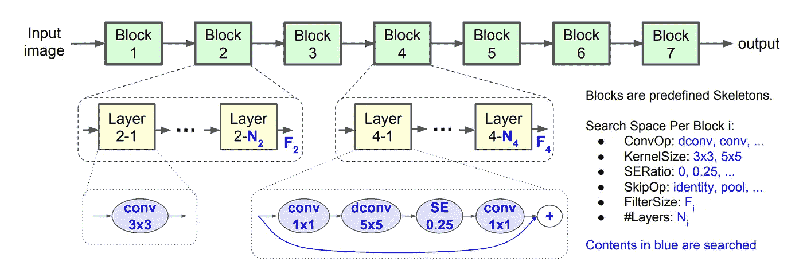

图 3。MnasNet 架构中的采样参数。所有用蓝色书写的内容都用 RL 搜索(来源:图片来自 [MnasNet 论文](https://arxiv.org/pdf/1807.11626.pdf))

除了这些参数之外，在决定进入控制器的奖励时，还要考虑一个非常重要的参数，那就是“等待时间”。因此，对于 MnasNet，作者同时考虑了准确性和延迟，以找到最佳的模型架构。这如图 4 所示。这使得架构很小，可以在移动或边缘设备上运行。

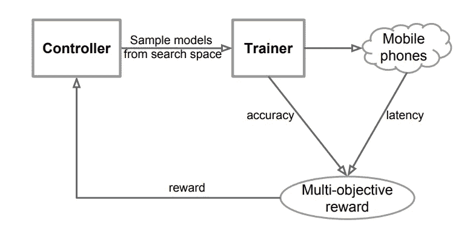

图 4。寻找模型架构的工作流，同时考虑准确性和延迟以决定对控制者的最终奖励(来源:图片来自 [MnasNet 论文](https://arxiv.org/pdf/1807.11626.pdf))

最后，在论文中提出了 EfficientNet 架构——2020 年[‘efficient net:反思卷积神经网络的模型缩放’](https://arxiv.org/abs/1905.11946)。

寻找 EfficientNet 架构的工作流程与 MnasNet 非常相似，但没有将“延迟”作为奖励参数，而是考虑了“FLOPs(每秒浮点运算次数)”。这个标准搜索给了作者一个基础模型，他们称之为 EfficientNetB0。接下来，他们扩大了基本模型的深度、宽度和图像分辨率(使用网格搜索)以创建另外 6 个模型，从 EfficientNetB1 到 EfficientNetB7。这种缩放如图 5 所示。

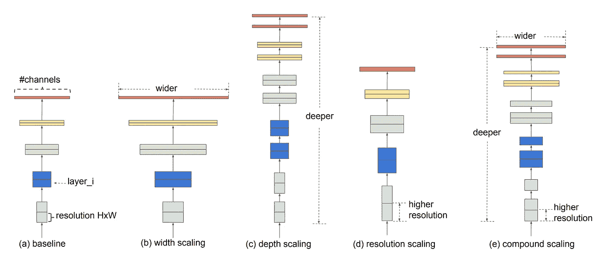

图 5。缩放深度、宽度和图像分辨率，以创建不同的 EfficientNet 模型(来源:图片来自 [EfficientNet 论文](https://arxiv.org/pdf/1905.11946.pdf))

我已经写了一篇关于 EfficientNet 版本 1 的文章。要详细了解这个版本，请点击下面的链接—

 [## 了解高效网络——最强大的 CNN 架构

### 了解目前最好和最有效的 CNN 模型 EfficientNet

medium.com](https://medium.com/mlearning-ai/understanding-efficientnet-the-most-powerful-cnn-architecture-eaeb40386fad) 

# 2.高效网络 V2

**论文-**[***efficient net v2:更小的模型和更快的训练***](https://arxiv.org/pdf/2104.00298.pdf)***(2021)***

EfficientNetV2 比 EfficientNet 更进一步，提高了训练速度和参数效率。该网络通过使用缩放(宽度、深度、分辨率)和神经架构搜索的组合来生成。主要目标是优化训练速度和参数效率。此外，这次搜索空间还包括新的卷积块，如 Fused-MBConv。最终，作者获得了 EfficientNetV2 架构，它比以前和更新的最新模型快得多，而且体积也小得多(高达 6.8 倍)。这如图 6 所示。

图 6(b)清楚地显示了 EfficientnetV2 有 2400 万个参数，而 Vision Transformer (ViT)有 8600 万个参数。V2 版本也有原始 EfficientNet 的将近一半的参数。虽然它确实显著减小了参数大小，但它在 ImageNet 数据集上保持了与其他模型相似或更高的精度。

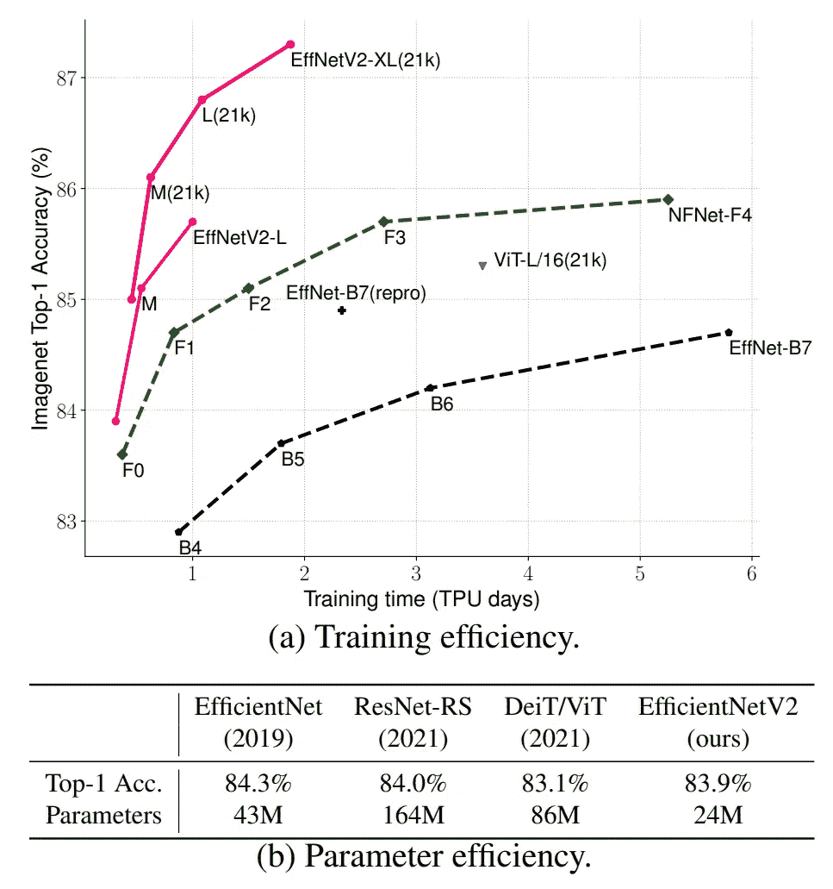

图 6。与其他先进模型相比，EfficientNetV2 模型的训练和参数效率(来源: [EfficientNetV2 论文](https://arxiv.org/pdf/2104.00298.pdf))

作者还进行了渐进式学习，即一种逐渐增加图像大小以及正则化(如删除和数据增加)的方法。这种方法进一步加快了训练速度。

## 2.1 efficient net(版本 1)的问题

EfficientNet(原始版本)有以下瓶颈—

a.效率网络通常比其他大型 CNN 模型训练得更快。但是，当使用大图像分辨率来训练模型(B6 或 B7 模型)时，训练是缓慢的。这是因为更大的 EfficientNet 模型需要更大的图像大小来获得最佳结果，当使用更大的图像时，需要降低批处理大小以适应 GPU/TPU 内存中的这些图像，从而使整个过程变慢。

b.在网络架构的早期，深度方向的卷积层(MBConv)速度很慢。深度方向卷积层通常比常规卷积层具有更少的参数，但问题是它们不能充分利用现代加速器。为了解决这个问题，EfficientNetV2 结合使用了 MBConv 和 Fused MBConv，在不增加参数的情况下加快了训练速度(本文稍后将对此进行讨论)。

c.从 B0 到 B7，高度、宽度和图像分辨率都采用了相同的比例来创建各种高效网络模型。所有层的这种等比例缩放并不是最佳的。例如，如果深度被缩放 2 倍，网络中的所有块被放大 2 倍，使得网络非常大/深。将一个块缩放两次，将另一个块缩放 1.5 倍(非均匀缩放)可能更好，这样可以在保持良好精度的同时减小模型大小。

## 2.2 EfficientNetV2 —为克服问题和进一步改进所做的更改

**a .添加 MBConv 和融合 MBConv 模块的组合**

如 2.1(b)中所述，MBConv block 通常无法充分利用现代加速器。融合 MBConv 层可以更好地利用服务器/移动加速器。

MBConv 层最初是在 MobileNets 中引入的。如图 7 所示，MBConv 和 Fused-MBConv 结构的唯一区别是最后两个模块。MBConv 使用深度方向卷积(3x3 ),后跟一个 1x1 卷积层，而 Fused-MBConv 用一个简单的 3x3 卷积层替换/融合这两层。

融合的 MBConv 层可以使训练速度更快，只需增加很少的参数，但如果使用许多这样的模块，就会因添加更多的参数而大大降低训练速度。为了克服这个问题，作者在神经架构搜索中通过了 MBConv 和 Fused-MBConv，该搜索自动决定这些块的最佳组合，以获得最佳性能和训练速度。

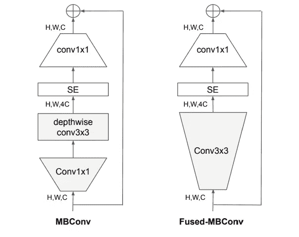

图 7。MBConv 和融合 MBConv 模块的结构(来源: [EfficientNetV2 paper](https://arxiv.org/pdf/2104.00298.pdf)

**b .优化准确性、参数效率和培训效率的 NAS 搜索**

*进行神经结构搜索是为了联合优化准确性、参数效率和训练效率。*efficient net 模型被用作主干，搜索是在各种设计选择下进行的，如卷积块、层数、过滤器尺寸、扩展比等。将近 1000 个模型作为样本，训练 10 个时期，并比较它们的结果。在准确性、训练步骤时间和参数大小方面优化得最好的模型被选为 EfficientNetV2 的最终基础模型。

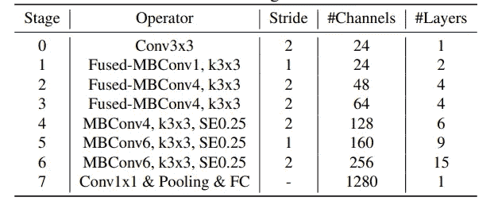

图 8。EfficientNetV2-S 的架构(来源: [EfficientNetV2 论文](https://arxiv.org/pdf/2104.00298.pdf))

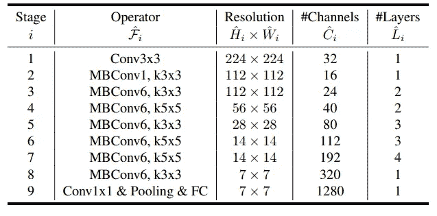

图 9。EfficientNet-B0 的架构(来源: [EfficientNet 论文](https://arxiv.org/pdf/1905.11946.pdf))

图 8 显示了 EfficientNetV2 模型(EfficientNetV2-S)的基本模型架构。该模型开始时包含融合 MBConv 层，但后来切换到 MBConv 层。为了比较，我还在图 9 中展示了之前 EfficientNet 论文的基本模型架构。以前的版本只有 MBConv 层，没有熔断 MBConv 层。

与 EfficientNet-B0 相比，EfficientNetV2-S 的膨胀率也较小。EfficeinetNetV2 不使用 5x5 滤镜，只使用 3x3 滤镜。

**c .智能模型缩放**

一旦获得了 EfficientNetV2-S 型号，就可以按比例增加以获得 EfficientNetV2-M 和 EfficientNetV2-L 型号。使用了一种复合缩放方法，类似于 EfficientNet，但是做了更多的改变，使模型更小更快——

I .最大图像大小被限制为 480x480 像素，以减少 GPU/TPU 内存的使用，从而提高训练速度。

二。更多的层被添加到后面的阶段(图 8 中的阶段 5 和阶段 6)，以在不增加太多运行时开销的情况下增加网络容量。

**d .渐进式学习**

较大的图像尺寸通常倾向于给出更好的训练结果，但是增加了训练时间。一些论文先前已经提出了动态改变图像尺寸，但是这经常导致训练准确性的损失。

EfficientNetV2 的作者表明，由于在训练网络时图像大小是动态变化的，因此正则化也应该相应地改变。改变图像尺寸，但保持相同的正则化会导致精度损失。此外，较大的模型比较小的模型需要更多的正则化。

作者使用不同的图像尺寸和不同的放大来测试他们的假设。如图 10 所示，当图像尺寸较小时，较弱的放大会产生较好的结果，但当图像尺寸较大时，较强的放大会产生较好的结果。

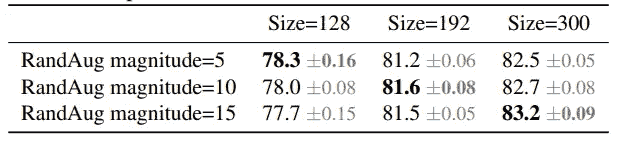

图 10。使用不同的图像大小和不同的增强参数测试 ImageNet top-1 准确性(来源: [EfficientNetV2 论文](https://arxiv.org/pdf/2104.00298.pdf)

考虑到这一假设，EfficientNetV2 的作者使用了带有自适应正则化的**渐进学习**。想法很简单。在前面的步骤中，网络在小图像和弱正则化上被训练。这允许网络快速学习特征。然后图像尺寸逐渐增大，正则化也是如此。这使得网络很难学习。总的来说，这种方法具有更高的精度、更快的训练速度和更少的过拟合。

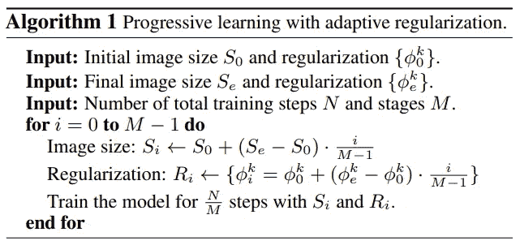

图 11。具有自适应正则化的渐进学习算法(来源: [EfficientNetV2 论文](https://arxiv.org/pdf/2104.00298.pdf))

初始图像尺寸和正则化参数是用户定义的。然后，在特定阶段(M)之后，应用线性插值来增加图像大小和正则化，如图 11 所示。这在图 12 中有更好的直观解释。随着历元数的增加，图像尺寸和放大倍数也逐渐增加。EfficicentNetV2 使用三种不同类型的正则化— Dropout、RandAugment 和 Mixup。

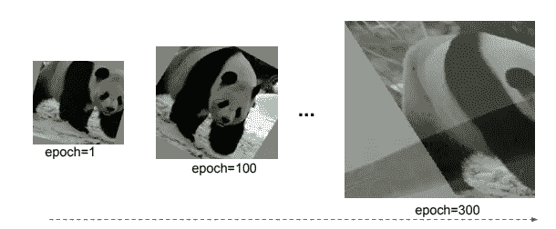

图 12。具有自适应正则化视觉解释的渐进学习(来源: [EfficientNetV2 论文](https://arxiv.org/pdf/2104.00298.pdf)

## 2.3 结果

i. EfficientNetV2-M 实现了与 EfficientNetB7(以前最好的 EfficientNet 型号)相似的精度。此外，EfficientNetV2-M 的训练速度比 EfficientNetB7 快近 11 倍。

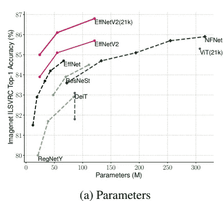

图 13 a .与其他先进模型的参数效率比较(来源: [EfficientNetV2 论文](https://arxiv.org/pdf/2104.00298.pdf))

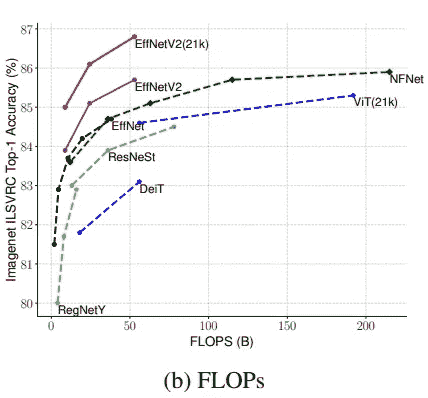

图 13 b. FLOPs 与其他先进模型的效率比较(来源: [EfficientNetV2 论文](https://arxiv.org/pdf/2104.00298.pdf))

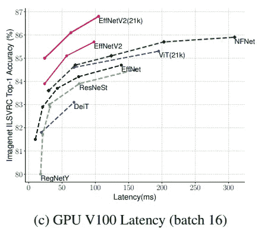

图 13 c .与其他先进模型的延迟比较(来源: [EfficientNetV2 论文](https://arxiv.org/pdf/2104.00298.pdf))

如图 13 a、13 b 和 13 c 所示，EfficientNetV2 模型优于所有其他最先进的计算机视觉模型，包括视觉变压器。

要了解更多关于视觉变形金刚的信息，请访问下面的链接

 [## 变形金刚在图像识别方面比 CNN 强吗？

towardsdatascience.com](/are-transformers-better-than-cnns-at-image-recognition-ced60ccc7c8) 

图 14 显示了在 ImageNet21k 上预训练有 1300 万张图像的 EfficientNetV2 模型和在 ImageNet ILSVRC2012 上预训练有 128 万张图像的一些模型与所有其他最先进的 CNN 和 transformer 模型的详细比较。除了 ImageNet 数据集，模型还在其他公共数据集上进行测试，如 CIFAR-10、CIFAR-100、Flowers 数据集和 Cars 数据集，在每种情况下，模型都显示出非常高的准确性。

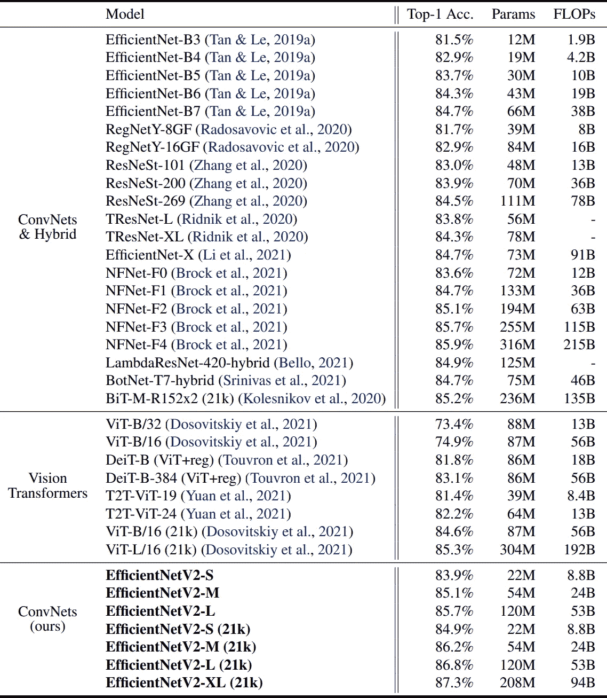

图 14。EfficientNetV2 模型与其他 CNN 和变压器模型在精度、参数和 FLOPs 方面的比较(来源: [EfficientNetV2 论文](https://arxiv.org/pdf/2104.00298.pdf)

# 3.结论

EfficientNetV2 型号比大多数最先进的型号更小、更快。这个 CNN 模型表明，即使视觉变形金刚已经席卷了计算机视觉世界，但通过获得比其他 CNN 更高的精度，具有改进训练方法的更好结构的 CNN 模型仍然可以获得比变形金刚更快更好的结果，这进一步证明了 CNN 将继续存在。

## 参考文献—

EfficientNetV2 纸张—

谭，明星&乐，郭。(2021).EfficientNetV2:更小的模型和更快的训练。arXiv，doi:10.48550/arXiv . 2104.00298 https://arxiv.org/abs/2104.00298