# 特征直觉:理解特征向量和特征值

> 原文：<https://towardsdatascience.com/eigen-intuitions-understanding-eigenvectors-and-eigenvalues-630e9ef1f719>

## 理解所有事物“本征”的直观基础

# 动机

我们通常希望转换数据以减少特征的数量，同时尽可能多地保留方差(即样本之间的差异)。通常，你会听到人们提到主成分分析(PCA)和奇异值分解(SVD)，但如果不首先了解什么是特征向量和特征值，我们就无法理解这些方法是如何工作的。

# 语源

“特征向量”是一个非常奇怪的词。就像很多怪异的词(想想幼儿园)一样，我们可以责怪德国人。我听过的最有用的翻译来自 Coursera 课程“[机器学习专业化的数学](https://www.coursera.org/specializations/mathematics-machine-learning?utm_source=gg&utm_medium=sem&utm_campaign=01-CourseraCatalog-DSA-US&utm_content=B2C&campaignid=9918777773&adgroupid=128025796489&device=c&keyword=&matchtype=&network=g&devicemodel=&adpostion=&creativeid=536102998481&hide_mobile_promo&gclid=Cj0KCQjwqPGUBhDwARIsANNwjV6fBy-ygiEp6GI17yQhyi_JW8NYJuJEvVrYf3KJcrhLsAg0GZZhYsUaAnUTEALw_wcB)”:“eigen”的意思是“特性”。

“特征向量”是“表征”线性变换的向量。

# 视觉直觉

让我们看看任意线性变换下的两个向量，如平移、缩放、旋转和剪切。我们的大部分矢量都被移动了。不过，有些在转换前后指向相同的方向。

让我们来看一个简单的水平缩放！我们可以用线性变换矩阵[[2，0]，[0，1]]来实现这一点。

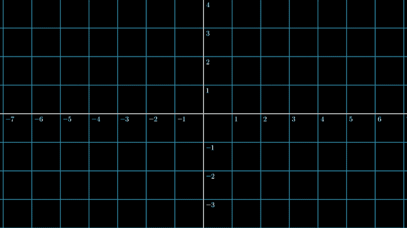

**图 1** :通过水平缩放可视化三个矢量。图片作者。

如果我们绘制三个单位长度向量——一个在 0 °,一个在 45 °,一个在 90°—并想象应用变换矩阵后会发生什么，我们会看到一些向量仍然指向与之前相同的方向(0°和 90 °),而其他向量则不指向相同的方向(45°)。有趣的是，这两个向量前后都指向同一个方向。在线性变换下，这些向量仅由一个标量项进行缩放。我们在 90°处的单位矢量没有改变，即缩放 1，而我们在 0°处的单位矢量加倍。这些向量就是我们的特征向量！

> 线性变换的特征向量是那些保持指向相同方向的向量。对于这些向量，变换矩阵的作用只是标量乘法。对于每个特征向量，特征值是向量在变换下缩放的标量。

# 数学

绘制一堆矢量并等待动画渲染并不是一个非常有效的方法。幸运的是，我们需要做的只是将我们已经建立的直觉形式化。有些方程式看起来有点吓人，但是一旦我们理解了它们的来源，它们就没那么糟糕了。

虽然数学可以扩展到任意维数的矩阵，但我们将坚持使用 2x2 矩阵进行演示。

让我们考虑一个线性变换矩阵 *A.* 如我们所见，矩阵的特征向量是刚刚缩放的向量。这些标量是特征值，我们称它们为 *λ* 。我们称我们的特征向量为 *x* 。

现在一起…特征向量 *x* 被我们的特征值 *λ* 缩放，被我们的矩阵 *A* 缩放。

我们可以用图 2 中的顶部等式来形式化。

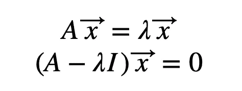

**图 2** :特征向量和特征值的基本形式化。图片作者。

让我们移动一些术语！减去 *λx* 并分解出 *x* 给出了一个很好的零值等式。为了从矩阵 *A* 中减去一个常数( *λ* ，我们需要将它乘以一个与 *A* 维数相同的单位矩阵。

让我们求解我们的特征向量和特征值！我们对这些方程的“琐碎”解不感兴趣，在这些解中, *x* 向量的值为零。相反，我们想知道什么时候项 *(A-λI* )等于零。我们可以通过检查行列式(*图 3* )的值为零来实现这一点！

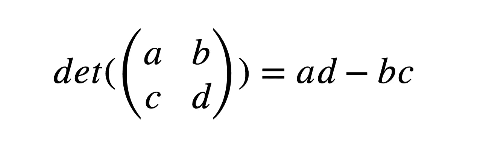

**图 3**:2 x2 矩阵行列式的定义。图片作者。

现在让我们展开我们的矩阵 *A* ，这样我们就可以看到矩阵中的每个值(*图 4* )。

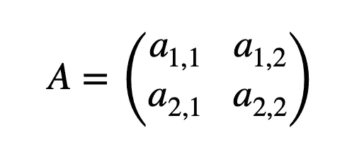

**图 4** :展开矩阵 a .作者图片。

将这些东西拼凑在一起，我们得到了图 5 所示的等式。

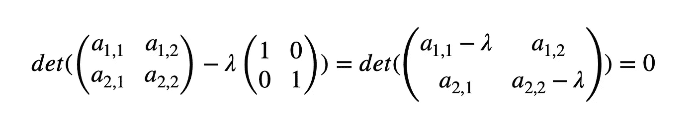

**图 5** :检查 det( *A-λI)=0。图片作者。*

使用我们从*图 3* 中定义的行列式，我们可以代入我们的值。

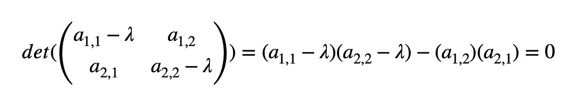

***图 6*** :将矩阵中的值代入行列式的定义中。图片作者。

最后，乘以各项，我们恢复出一种叫做“[特征多项式](https://en.wikipedia.org/wiki/Characteristic_polynomial)的形式

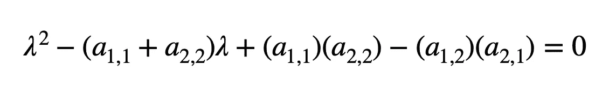

**图 7** :“特征多项式”的定义图片作者。

理论上我们只能做到这一步了！现在，让我们应用这个“特征多项式”，求解我们的特征值( *λ* )。

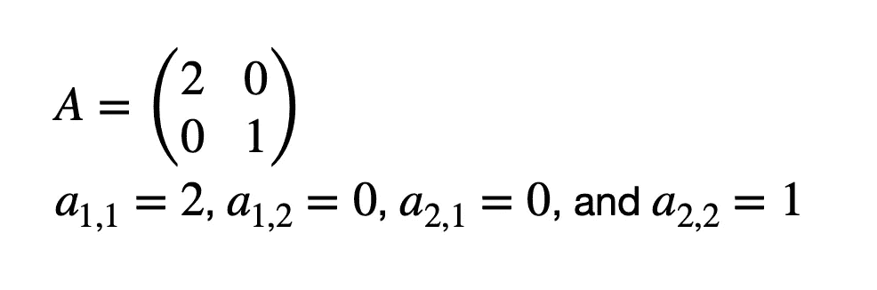

**图 8** :样本矩阵 a .作者图片。

将矩阵中的值代入我们的特征多项式…

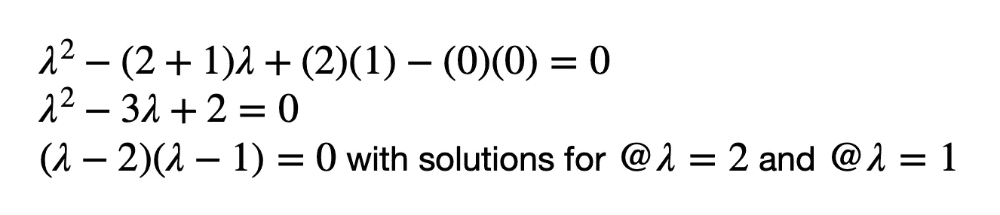

**图 9** :求解矩阵 a 的特征多项式，作者图片。

我们得到我们的特征值( *λ* )。现在，我们可以代入我们的特征值，来求解我们的特征向量。

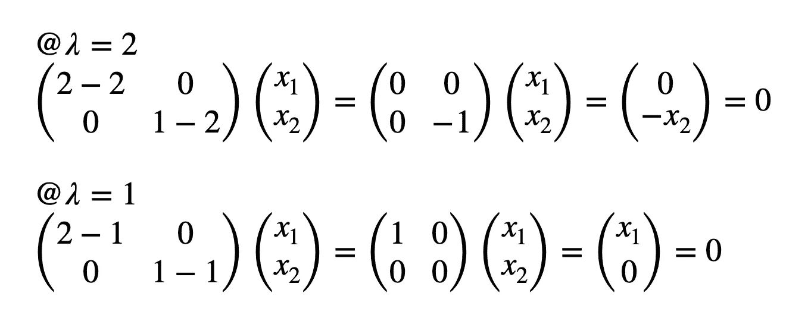

**图 10** :根据特征值确定我们的特征向量。图片作者。

这是一个古怪的结果……@*λ*= 2*，* [0，-x₂] = 0。我们的 x₁似乎已经消失了。这是什么意思？

这意味着对于 *λ* = 2，只要 x₂为零，x₁可以等于任何值。

*   例如[5，0]、[1，0]和[-3，0]

同样，对于 *λ* = 1，只要 x₁为零，x₂就可以等于任何东西。

*   例如，[0，2]，[0，-1]，[0，8]

我们通过用占位符变量 *t* 代替可以取任何值的项来表达这种不变性。

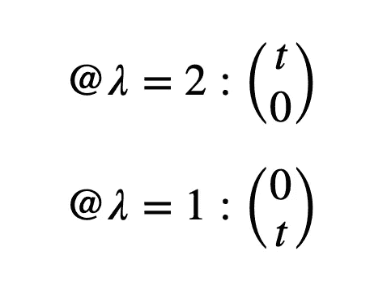

**图 11** :定义我们空间的特征向量。图片作者。

这正是我们的视觉直觉告诉我们的！我们空间的所有水平向量都是本征向量，它们由本征值 2 缩放。我们空间的所有垂直向量都是本征向量，它们由本征值 1 缩放。

# 自己图谋试试！

我发现为自己策划事情很有价值。如果你想试试，看看下面的来源！

# 承认

重要的是在最明确的地方给予信任！虽然文章中的代码是我的，但是用于可视化的包( [manim](https://docs.manim.community/) )肯定不是！可视化库和解释的方法都是无耻的从 [3blue1brown](https://www.youtube.com/c/3blue1brown) 偷来的。

文章前面提到过，但是我爱这个 Coursera 系列:[机器学习专精数学](https://www.coursera.org/specializations/mathematics-machine-learning?utm_source=gg&utm_medium=sem&utm_campaign=01-CourseraCatalog-DSA-US&utm_content=B2C&campaignid=9918777773&adgroupid=128025796489&device=c&keyword=&matchtype=&network=g&devicemodel=&adpostion=&creativeid=536102998481&hide_mobile_promo&gclid=Cj0KCQjwqPGUBhDwARIsANNwjV6fBy-ygiEp6GI17yQhyi_JW8NYJuJEvVrYf3KJcrhLsAg0GZZhYsUaAnUTEALw_wcB)！

我很欣赏你的阅读！我希望这有助于解释一个复杂的概念。如果我犯了什么错误或者有什么不清楚的地方，请告诉我！