# 弹性网回归:从 Sklearn 到 Tensorflow

> 原文：<https://towardsdatascience.com/elastic-net-regression-from-sklearn-to-tensorflow-3b48eee45e91>

## 如何在 Python 中进行 sklearn 和 Tensorflow 之间的等价弹性网回归


迈克·考克斯在 [Unsplash](https://unsplash.com?utm_source=medium&utm_medium=referral) 上的照片

这篇文章是为那些想要比较弹性网回归的 sklearn 和 Keras 实现的从业者准备的。主要是如何从 Sklearn 损失函数到 Keras (Tensorflow)损失函数。

文章的主要部分:

*   回归中的正则化简介。
*   弹性网的 Sklearn 实现。
*   弹性网的张量流实现。
*   从一个框架到另一个框架。
*   编写自定义损失函数。
*   比较结果。

所有的代码都在我的仓库里:【https://github.com/Eligijus112/regularization-python 

回归是机器学习中确定响应变量的平均值 **Y** 和特征 **X** 之间关系的过程。

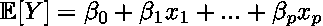

简单回归方程；作者图片

模型的预测用带帽的 y 表示，并通过从数据中估计系数β来计算:

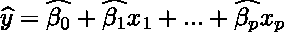

预测方程；作者图片

不带帽子的 beta 表示理论*模型*，带帽子的 beta 表示实际*模型*，使用可观测数据获得。我们如何计算系数β？

计算从定义一个**错误**开始。误差显示了预测值与真实值的差异。

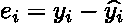

观察值 I 的误差；作者图片

很明显，我们希望误差尽可能小，因为这将表明我们找到的系数接近基本因变量 **Y** 给出我们的特征的最佳值。此外，我们希望对负误差和正误差(以及其他原因)给予相同的权重，因此我们将引入平方误差项:

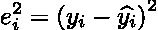

观察值 I 的平方误差；作者图片

在标准线性回归中，我们的目标是将所有观测值的平方误差降至最低。因此，我们可以定义一个称为均方误差的函数:

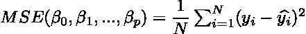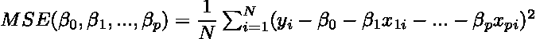

MSE 函数；作者图片

x 和 y 数据是固定的——我们不能改变我们观察到的东西。我们拥有的唯一杠杆是尝试将不同的贝塔系数与我们的数据相匹配，以获得尽可能低的 MSE 值。这是线性回归的总体目标— **仅使用β系数将定义的损失函数降至最低。**

为了最小化 MSE 值，我们可以使用各种优化算法。最流行的算法之一是**随机梯度下降**或者简称为 **SGD** 。

**梯度**部分是我们根据所有系数计算偏导数:

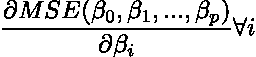

所有 I 的偏导数；作者照片

下降部分是我们迭代地更新每个系数β:

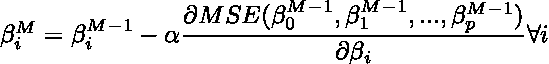

下降部分；作者照片

**M** 是迭代次数。

**α**常数是一个正值，称为学习率。

随机部分是我们不在一次迭代中使用数据集中的所有样本。当更新系数β时，我们使用数据的子集，也称为小批量。

**回归中的正则化**是一种避免建立更复杂模型的方法，以避免过拟合的风险。正规化有多种类型，但最受欢迎的有三种:

*   套索
*   山脉
*   弹性网

我们通过向我们优化的损失函数添加某些项来进行正则化。在 Lasso 回归的情况下，传统的 MSE 变为:

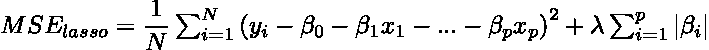

通用套索公式；作者图片

我们在新的损失函数中加入绝对系数值的和。系数的绝对和越大，损耗越高。因此，在优化时，算法因系数大而受到惩罚。

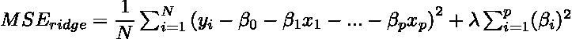

通用岭公式；作者图片

岭回归带来了更大的系数损失，因为幅度是平方的。岭回归的一个缺点是，这种类型的回归不会将任何系数设置为 0，而 lasso 可以用于特征约简，因为它可以将一些系数设置为零。

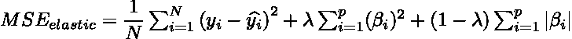

通用弹性网公式；作者照片

弹性网结合了脊和套索回归。λ值通常介于 1 和 0 之间。

既然我们已经有了一个简单的理论概述，我们可以继续讨论实际部分了。我们将使用的数据来自 Kaggle 关于 2014 年至 2015 年美国房屋销售的数据。

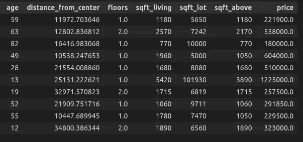

原始数据；按作者分类的表格

我们将尝试使用 6 个可用特征来解释房子的价格。

我们将标准化这些功能。在本文中，我想展示 TensorFlow 和 Sklearn 之间的可比性，因此我不会花太多时间对数据集进行特征工程。

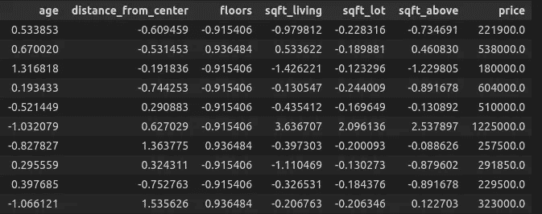

标准化数据集；按作者分类的表格

让我们试试弹性网的 Sklearn 实现

[https://sci kit-learn . org/stable/modules/generated/sk learn . linear _ model。ElasticNet.html](https://scikit-learn.org/stable/modules/generated/sklearn.linear_model.ElasticNet.html)

Sklearn 中使用的损失函数为:

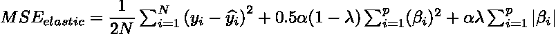

Scikit 学习弹性净损失函数；作者图片

让我们设置 alpha = 1，lambda(在 Sklearn 中称为 l1 比)为 0.02。

```
# Fitting the model to data using sklearn
el = ElasticNet(alpha=1.0, l1_ratio=0.02)
el.fit(d[features], d[y_var])# Extracting the coefs
coefs = el.coef_# Creating a dataframe with the coefs
coefs_df = pd.DataFrame({‘feature’: features, ‘coef_sk’: coefs})# Appending the intercept
coefs_df = coefs_df.append({‘feature’: ‘intercept’, ‘coef_sk’: el.intercept_[0]}, ignore_index=True)
```

得到的系数数据帧是:

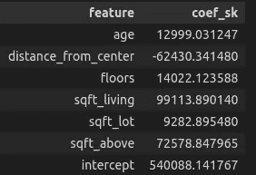

弹性净回归结果；按作者分类的表格

Tensorflow 是一个非常流行的深度学习网络。该框架允许我们使用弹性网络正则化，以及使用 L1L2 类[https://keras.io/api/layers/regularizers/#l1l2-class](https://keras.io/api/layers/regularizers/#l1l2-class)。

让我们比较两个公式 sklearn one 和 TensorFlow。
**Scikit 学:**

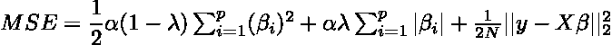

Scikit 学习弹性网

**张量流:**

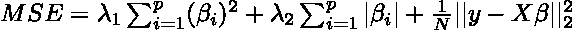

正如我们所见，TensorFlow 没有将等式的 MSE 部分除以 2。为了获得可比较的结果，我们需要为 TensorFlow 创建自己的自定义 MSE 函数:

模仿 sklearn 的自定义 MSE 作者代码

写完这个自定义损失函数后，我们现在有以下等式:

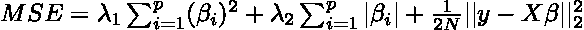

张量流的自定义损失；作者方程式

现在，我们可以均衡这两个方程，并尝试根据 sklearn 的 alpha 和 lambda，在 TensorFlow 中创建 lambda 1 和 lambda 2 的公式。

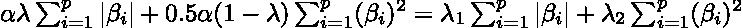

左手边:sklearn，右手边:TensorFlow 作者方程式

因此，我们只剩下:

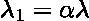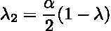

将 sklearn 正则化转换为张量流正则化参数的函数:

从 sklearn 到 TensorFlow 作者代码

现在，让我们将所有内容放在一起，通过正则化训练一个张量流模型:

```
# Defining the original constants
alpha = 1.0
l1_ratio = 0.02# Infering the l1 and l2 params
**l1, l2 = elastic_net_to_keras(alpha, l1_ratio)**# Defining a simple regression neural net
numeric_input = Input(shape=(len(features), ))
output = Dense(1, activation=’linear’, kernel_regularizer=L1L2(l1, l2))(numeric_input)model = Model(inputs=numeric_input, outputs=output)
optimizer = tf.keras.optimizers.SGD(learning_rate=0.0001)# Compiling the model
model.compile(optimizer=optimizer, loss=**NMSE()**, metrics=[‘mse’])# Fitting the model to data using keras
history = model.fit(
  d[features].values, 
  d[y_var].values, 
  epochs=100, 
  batch_size=64
)
```

当**α= 1.0，l1 比值为 0.02** 时，张量流正则化的常数为 **0.02 和 0.49。**

训练看起来很顺利:

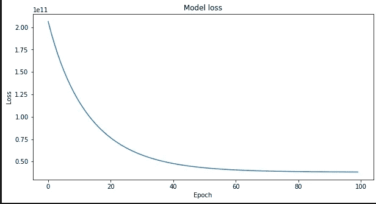

模特培训；作者照片

张量流和 sklearn 回归系数:

```
# Creating the coef frame for TF
coefs_df_tf = pd.DataFrame({
  ‘feature’: features + [‘intercept’],
  ‘coef_tf’: np.append(model.get_weights()[0], model.get_weights()[1])
})## Merging the two dataframes
coefs_df_merged = coefs_df.merge(coefs_df_tf, on='feature')coefs_df_merged['percent_diff'] = (coefs_df_merged['coef_sk'] - coefs_df_merged['coef_tf']) / coefs_df_merged['coef_sk'] * 100
```

生成的数据帧为:

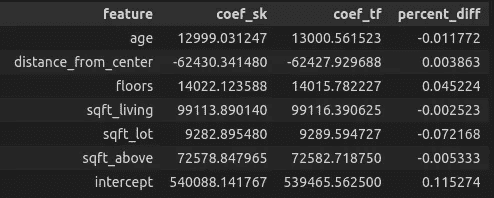

系数比较；按作者分类的表格

系数相差很小。这是因为在引擎盖下，sklearn 和 TensorFlow 用不同的函数初始化系数，涉及到一些随机性，我们总是可以调整时期和批量大小以获得越来越接近的结果。

在本文中，我们:

*   简单介绍了一下正规化。
*   创建了自定义张量流损失函数。
*   在 TensorFlow 中创建了一个模仿 sklearn 正则化的函数。
*   创建并比较了两个模型。

快乐学习编码！

完整代码:

[https://gist . github . com/eligijus 112/5309 d9dd 037236 B1 a 95 a7b 906 f 2406 cf](https://gist.github.com/Eligijus112/5309d9dd037236b1a95a7b906f2406cf)

[1]
美国金县房屋销售；
网址:[https://www . ka ggle . com/datasets/harlfoxem/housesales prediction？资源=下载](https://www.kaggle.com/datasets/harlfoxem/housesalesprediction?resource=download)

执照:[https://creativecommons.org/publicdomain/zero/1.0/](https://creativecommons.org/publicdomain/zero/1.0/)