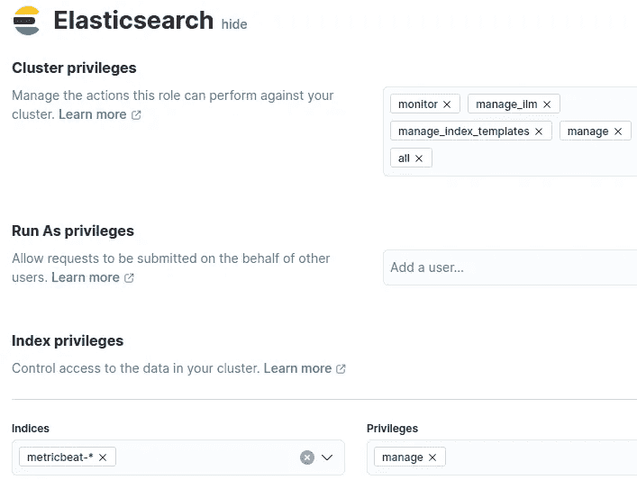
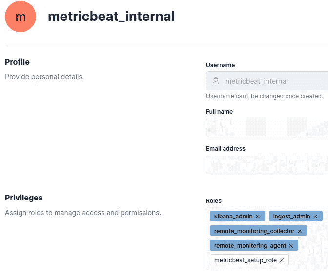
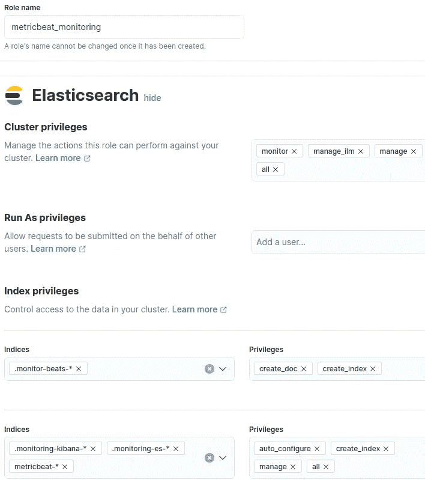

# Elasticsearch Beats 研讨会#1

> 原文：<https://towardsdatascience.com/elasticsearch-beats-workshop-1-c73189069793>

## 安全 Metricbeat


托姆·米尔科维奇在 [Unsplash](https://unsplash.com?utm_source=medium&utm_medium=referral) 上拍摄的照片

欢迎来到 Beats 工作坊的第一部分。像往常一样，为了使每篇文章尽可能紧凑，我将把查询简化为片段。如果你想看到完整的代码，配置，或查询，请咨询我的 [GitHub 页面。如果谷歌把你带到这里，你可能想检查一下](https://github.com/PascalThalmann/ElasticBeatWorkshop/tree/master/1_secured_metricbeat)[系列](https://medium.com/@pascalth/list/elasticsearch-beats-workshop-fbe5332d03e1)的其他部分。

今天，我们将为 Metricbeat 配置安全通信。使用 Elasticsearch Stack 8，默认情况下启用 SSL 通信。官方的[文档](https://www.elastic.co/guide/en/beats/metricbeat/current/index.html)可能会让人不知所措，你可能很难找到具体的参数。除了 SSL 之外，我们还将了解需要为 Metricbeat 授予的特定权限。最后但同样重要的是，应该如何安全地调用这个用户的凭证。一如既往:让我们直接开始吧！

# 本次研讨会的系统拓扑

Elasticsearch 和 Kibana 的 YAML 文件全文在我的 GitHub 页面上。设置非常简单:Elasticsearch 节点作为 srvelk8 暴露给网络。本次研讨会的 Elasticsearch 版本为 8.0.1。Elasticsearch、Kibana 和 Metricbeat 都运行在同一个 VM 上。下面是我的/etc/hosts 的样子:

```
192.168.1.68   srvelk8      srvelk8.local.ch
```

# 根 CA 指纹

为了安全通信，您需要根证书或根 CA 十六进制编码指纹。我将向您展示这两个选项，现在，我们来看看如何获取指纹。你的 kibana.yml 里可能有指纹:

```
grep fingerprint /etc/kibana/kibana.ymlca_trusted_fingerprint: a2929842b8920e5c0ebd91ea157c159f16b62df7e3b6998de93ad56ff2693b59}]
```

如果您可以访问 http_ca.crt，也可以使用 OpenSSL 提取指纹:

```
openssl x509 -fingerprint -sha256 \ 
  -in /etc/elasticsearch/certs/http_ca.crt| \
  grep Fingerprint|cut -d  '=' -f2| tr -d ':'|tr A-Z a-z

a2929842b8920e5c0ebd91ea157c159f16b62df7e3b6998de93ad56ff2693b59
```

# 装置

安装 Metricbeat 与:

```
curl -L -O [https://artifacts.elastic.co/downloads/beats/metricbeat/metricbeat-8.0.1-amd64.deb](https://artifacts.elastic.co/downloads/beats/metricbeat/metricbeat-8.0.1-amd64.deb)
sudo dpkg -i metricbeat-8.0.1-amd64.deb
apt-mark hold metricbeat
```

如果想在 Ubuntu 使用 APT，请看一下[官方文档](https://www.elastic.co/guide/en/beats/metricbeat/8.0/setup-repositories.html)。

# 创建必要的角色和用户

首先，我们需要一个角色在 Kibana/Elasticsearch 中设置 Metricbeat。初始设置后，您将删除该角色，因为它不再是必需的。现在创建角色“metricbeat_setup_role ”,并授予这些权限:



作者图片

现在为 Metricbeat 创建用户。我现在使用 metricbeat_internal:



作者图片

# 创建密钥库

因为您不想将用户名/密码存储在 yml 文件中，所以我们需要一个密钥库来加密凭证并将它们存储在一个安全的地方:

```
metricbeat keystore create
metricbeat keystore add MB_USER
metricbeat keystore add MB_PW
```

我们现在可以在 YAML 文件中将用户名和密码定义为“${MB_USER}”和“${MB_PW}”。keystone 本身存储在与“path.data”中定义的文件夹相同的文件夹中，在 Ubuntu 中默认为/var/lib/metricbeat。使用运行 metricbeat 的同一用户运行 keystone 命令。

重要事项:定义至少包含一个字母的密码。否则，密码将被存储为一个 int，而不是一个字符串，这将导致以后的问题。

# 配置

您现在可以启用您需要的所有模块。因为我使用 Metricbeat 进行堆栈监控，所以我启用了 Elasticsearch、Kibana 和 beat 模块:

```
metricbeat modules enable elasticsearch-xpack
metricbeat modules enable kibana-xpack
metricbeat modules enable beat-xpack
```

# metricbeat.yml

例如，Kibana 设置的部分:

```
setup.kibana:
  host: "[http://srvelk8.local.ch:5601](http://srvelk8.local.ch:5601)"
  username: "${MB_USER}"
  password: "${MB_PW}"
  ssl:
    #certificate_authorities: /etc/elasticsearch/certs/http_ca.crt
    enabled: true
    ca_trusted_fingerprint: "a2929842b8920e5c0ebd91ea157c159f16b62df7e3b6998de93ad56ff2693b59"
```

如您所见，我禁用了 certificate_authorities。因为我使用指纹，所以不需要 certificate _ authorities。我们还避免将用户名和密码定义为明文。

# 模块配置

模块也是如此。以下是 elasticsearch-xpack.yml 的一个例子:

```
- module: elasticsearch
  xpack.enabled: true
  period: 10s
  hosts: ["[https://192.168.1.68:9200](https://192.168.1.68:9200)"]
  protocol: "https"
  username: "${MB_USER}"
  password: "${MB_PW}"
  #api_key: "TxDLW38BJmYfkUzINFEF:0foLANnlS-qMNgx_jEXhGw"
  ssl:
    #certificate_authorities: /etc/elasticsearch/certs/http_ca.crt
    enabled: true
    ca_trusted_fingerprint: "a2929842b8920e5c0ebd91ea157c159f16b62df7e3b6998de93ad56ff2693b59"
```

由于每个模块与其他模块略有不同，请查看 GitHub 页面上的示例。

# 设置 Metricbeat

现在运行“metricbeat setup -e”。过一会儿，您应该会看到这些消息:

```
metricbeat setup -eIndex setup finished.
Loading dashboards (Kibana must be running and reachable)
Loaded dashboards
```

# 创建监控角色

现在为 Metricbeat 创建监视角色。添加角色“metricbeat_monitoring”后，您可以删除角色“metricbeat_setup_role”:



作者图片

用此角色更新用户。

# 启用并运行 metricbeat

好了，就这样。您现在可以运行 Metricbeat:

```
systemctl enable metricbeat
systemctl start metricbeat
```

# 结论

如果你成功了:祝贺你！现在，您应该能够通过安全通信运行 Metricbeat 了。如果您遗漏了某个特定的配置，那么 [metricbeat reference](https://www.elastic.co/guide/en/beats/metricbeat/8.0/metricbeat-reference-yml.html) 有更多的示例，请查看。

如果您有任何问题，请在 [LinkedIn](https://www.linkedin.com/in/pascal-thalmann/) 上留言、联系或关注我

*原发布于*[*https://cdax . ch*](https://cdax.ch/2022/03/05/elasticsearch-beat-workshop-1-secured-metricbeat/)*。*