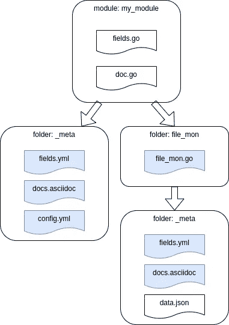
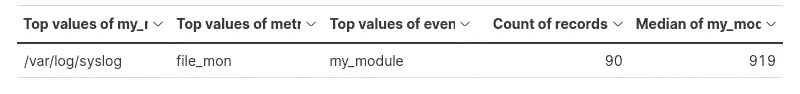

# Elasticsearch Beats 研讨会#2

> 原文：<https://towardsdatascience.com/elasticsearch-beats-workshop-2-ea07d7bb4b00>

## 创建您的 Metricbeat 发货人


在 [Unsplash](https://unsplash.com?utm_source=medium&utm_medium=referral) 上 [Launde Morel](https://unsplash.com/@laundemrl?utm_source=medium&utm_medium=referral) 拍摄的照片

欢迎来到 Beats 工作坊的第二部分。这里可以找到第一家作坊[。像往常一样，为了使每篇文章尽可能简洁，我将代码简化为片段。如果你想看完整的代码，请查阅我的](/elasticsearch-beats-workshop-1-c73189069793) [GitHub 页面。如果谷歌把你带到这里，你可能还会检查](https://github.com/PascalThalmann/ElasticBeatWorkshop/tree/master/2_create_a_module_1)[系列](https://medium.com/@pascalth/list/elasticsearch-beats-workshop-fbe5332d03e1)的其他部分。

今天，我们创建了第一个 Metricbeat 模块和 metricset。虽然[官方文档](https://www.elastic.co/guide/en/beats/devguide/current/metricbeat-dev-overview.html)很好地解释了如何设置您的开发环境，但是弄清楚如何编写 Metricbeat 模块可能是相当具有挑战性的。虽然本研讨会不要求更深入的 Go 语言知识，但我推荐 Stephen Grider 的 Udemy 课程[“Go:完整的开发人员指南(Golang)”](https://www.udemy.com/course/go-the-complete-developers-guide/)来获得一些该语言的基础知识。老实说:在我写这篇文章的两周前，我对 Go 一无所知——但是这个课程帮助我理解了幕后发生的事情，并理解了默认安装中提供的 Metricbeat 模块的源代码(因此也理解了其机制)。

我们的第一个 Metricbeat 模块将使用一个非常简单的配置作为数据收集的输入—进行预热。然而:在本系列的第三部分中，我们将深入研究并开发一个基于更实际用例的度量集。今天，我们将讨论以下主题:

*   设置 Go 和开发环境
*   定义用例
*   定义数据结构
*   定义模块和度量集的配置
*   编码矩阵集
*   编译和配置 metricbeat
*   测试矩阵集

如你所见，有很多工作要做——请给自己拿杯茶，系好安全带准备上路。说够了:让我们直接开始吧！

# 设置 Go 和开发环境

## 安装 Go

请记住，我们将克隆几个 Git Repos，因此需要千兆字节的磁盘空间。有了 10GB 的自由空间，你就好了。

在您设置 Go 之前，请通过以下方式检查您的 Go 版本:

```
go version
```

如果你的版本低于 1.17.8，你需要从官方回购安装 Go。官方文档会引导你完成这个过程，不过，我会为你简化它。我们需要安装 python 3.7 和 Go 1.17.8:

```
sudo apt install python3.7
sudo apt-get install python3-venv
sudo mkdir -p /usr/local/go
wget [https://go.dev/dl/go1.17.8.linux-amd64.tar.gz](https://go.dev/dl/go1.17.8.linux-amd64.tar.gz)
sudo tar -C /usr/local/ -xzf go1.17.8.linux-amd64.tar.gz
export PATH=/usr/local/go/bin:$PATH
```

再次查看 go 版本，应该会看到类似“go 版本 go1.17.8 linux/amd64”的内容。

## 克隆官方 Beats 回购

通过设置$GOPATH 环境变量并克隆官方的 beats Git Repo，现在安装 dev env:

```
mkdir ~/go
export GOPATH=~/go
mkdir -p ${GOPATH}/src/github.com/elastic
git clone [https://github.com/elastic/beats](https://github.com/elastic/beats) ${GOPATH}/src/github.com/elastic/beats
```

## 安装 Mage

安装 mage，它是 Go 构建所需要的，并将设置开发环境的其余部分:

```
cd ~
git clone [https://github.com/magefile/mage](https://github.com/magefile/mage)
cd mage
go run bootstrap.go
sudo cp $GOPATH/bin/mage /usr/local/bin
cd ${GOPATH}/src/github.com/elastic/beats
make update
```

## 模和度规集的区别

首先:模和度规集之间有什么区别？该模块包含一个或多个公制集合。虽然模块是顶层文件夹，但它为每个 metricset 保存一个文件夹和一个“_meta”文件夹。下图显示了该结构:



作者图片

我们不会修改顶层文件夹“my_module”中的文件。生成“fields.go”和“doc.go”。我们将只使用文件“fields.yml”、“docs.asciidoc”、“config.yml”和“file_mon.go”。或者换句话说:图中蓝色标记的方框。

## 创建模块和度量集框架文件

设置开发环境后，我们为新的 Metricbeat 模块和 metricset 创建一个框架:

```
cd ${GOPATH}/src/github.com/elastic/beats/metricbeat
make create-metricset
```

我们将输入以下值:

```
Module name: my_module 
Metricset name: file_mon
```

make 应该以下列结尾:

```
Module my_module created. 
Metricset file_mon created.
```

为了测试一切是否正常，我们现在将编译 Metricbeat:

```
mage update
mage build
chmod go-w ~/go/src/github.com/elastic/beats/metricbeat/metricbeat.yml
/metricbeat -e -d "*"
```

# 定义用例

我们将做一些相当简单的事情:我们将检查一个文件是否经常被修改，因此是否有实际的数据。

我们通过每 10 秒检查一次修改时间戳来监控这些文件，并将修改时间和实际时间之间的差异发送给 Elasticsearch —我们将该差异称为“delta”。我们不为警报设置阈值，这是下一个研讨会的使用案例。我们只想在 my_module.yml 的配置中添加一个文件列表，并将文件名和增量发送给 Elasticsearch。

## 在 my_module/_meta/config.yml 中定义数据结构

第一:路径

```
~/go/src/github.com/elastic/beats/metricbeat/module/my_module
```

将从这一点缩短为 just my_module。

在这种情况下，数据结构非常简单:它只是一个文件名列表。由于“make metric-set”已经创建了我们将需要的所有文件，我们可以在 my_module 文件夹中的一个文件中实现所需的结构，该文件将用作我们未来模块 my_module 的默认配置文件。请打开文件“my_module/_meta/config.yml”。您应该会看到类似这样的内容:

```
- module: my_module
  metricsets: ["file_mon"]
  enabled: false
  period: 10s
  hosts: ["localhost"]
```

替换为:

```
- module: my_module
  metricsets: ["file_mon"]
  enabled: true
  period: 10s
  hosts: ["localhost"]
  files:
  - "/var/log/syslog"
```

现在，正如您可能猜到的，定义了“var/log/syslog ”,只是为了让未来的用户了解文件名必须如何放置在我们未来的配置文件 my_module.yml 中。该配置文件将是生成的文件 my_module.yml 的蓝图，该文件将在我们在过程结束时编译和构建 Metricbeat 后创建。

配置文件 config.yml 的重要之处在于，它包含了所有指标集的配置。如果添加多个指标集，请确保将它们都添加到 config.yml 中。

# 定义模块和指标集的配置

## my_module/_meta/docs.asciidoc

我们一步一步地首先定义我们的配置文件。作为第一步，我们向 my_module 文档添加一个描述。您可以随意向文件 my_module/_meta/docs.asciidoc 添加这样的注释:

```
This is the my_module module.
You can find the sourcecode in [https://github.com/PascalThalmann/ElasticBeatWorkshop/tree/master/2_create_a_module_1](https://github.com/PascalThalmann/ElasticBeatWorkshop/tree/master/2_create_a_module_1)
```

## my_module/_meta/fields.yml

my_module/_meta/fields.yml 文件包含关于模块的顶级信息。我们只改变描述，因为其余的都很好:

```
- key: my_module
  title: "my_module"
  release: beta
  description: >
    my_module module is part of the metricbeat workshop 2
  fields:
    - name: my_module
      type: group
      description: >
      fields:
```

## my _ module/file _ mon/_ meta/docs . asciidoc

正如您可能猜到的，文件 my _ module/file _ mon/_ meta/docs . asciidoc 包含了描述。随意添加类似这样的内容:

```
This is the file_mon metricset of the module my_module.
The metricset reads the last modicfication time and subtracts it from the current time. The result will be a field delta wich will be send to the Elasticsearch cluster
```

## my _ module/file _ mon/_ meta/fields . yml

my _ module/file _ mon/_ meta/fields . yml 文件包含我们的 metricset 的字段定义。它将用于在 metricbeat 的弹性搜索索引中创建正确的映射。在这里设置正确的结构和核心数据类型至关重要。如果您不确定您需要哪种核心数据类型，请查看[官方文档](https://www.elastic.co/guide/en/elasticsearch/reference/master/mapping-types.html#_core_datatypes)中的数据类型。我们将添加一个字段“文件名”键入“关键字”:

```
- name: file_mon
  type: group
  release: beta
  description: >
    file_mon
  fields:
    - name: files
      type: object
      description: >
        the filenames with full path of the files that will monitored
```

# 编码矩阵集

好了，我们定义了所有的配置文件。现在让我们对 metricset 进行编码，代码位于文件 my_module/file_mon/file_mon.go 中

## 为指标集定义所需的数据结构

我们现在定义对象矩阵集的结构。虽然 Go 不是面向对象的语言，但结构可以被看作是对象的属性集合。每个属性必须由一个数据类型定义，如果数据被添加到该结构，字段的数据类型必须与您添加到该字段的数据相匹配。因此，当我们处理一个结构时，我们处理的数据必须被分配给正确的字段并具有正确的数据类型。因为我们只读取文件列表，所以使用 string 类型的值列表就可以了:

```
type MetricSet struct {
        mb.BaseMetricSet
        files           []string
}
```

你可能已经看到在这个结构中定义了另一个东西:mb.BaseMetricSet。这就是神奇之处:这是一个接口，实现了读取 my_module.yml 中的配置选项所需的所有方法。长话短说:接口 mb。MetricSet 让我们以一种非常方便的、近乎懒惰的方式读取配置文件。

## 创建度量集实例

我们接下来要看的是“新”函数。此函数将读取配置，并将使用 struct MetricSet 作为从配置文件 my_module.yml 中读取的值的存储:

```
func New(base mb.BaseMetricSet) (mb.MetricSet, error) {
  cfgwarn.Beta("The my_module file_mon metricset is beta.")type Config struct {
 Files      []string `config:"files"`
  }

  config := Config{}if err := base.Module().UnpackConfig(&config); err != nil {
    return nil, err
  }return &MetricSet{
    BaseMetricSet:  base,
    files:          config.Files,
    }, nil
}
```

你可能会问自己，阅读部分在哪里？它在这里:

```
Files      []string `config:"files"`
```

我们在这里定义命名文件列表，并分配在“文件”字段下定义的配置中的所有内容。我们的配置文件如下所示:

```
- module: my_module
...
  files:
  - "/var/log/syslog"
```

我们可以看一下&MetricSet 对象:

```
return &MetricSet{
    BaseMetricSet:  base,
    files:          config.Files,
    }, nil
```

我们在这里返回的是对 struct MetricSet 的引用。与号代表引用 MetricSet 的内存地址。稍后，您将了解更多关于结构以及如何将它们传递给函数的知识。

## 获取数据并发送给 Elasticsearch

我们现在遍历我们的文件列表，读取修改时间并从实际时间中减去它。为此，我们需要我们的 MetricSet、库“os”以及“time”和“math”。这个函数很简单，但是要理解细节，您需要更深入地了解语言 Go:

```
func (m *MetricSet) Fetch(report mb.ReporterV2) error {
 files := m.filesfor _, file_name := range files{act_time := time.Now()
  f, _ := os.Open(file_name)
  out, _ := f.Stat()
  mod_time := out.ModTime()
  difference := act_time.Sub(mod_time).Seconds()
  delta := int(math.Round(difference))
```

让我们来看看第一行:

```
func (m *MetricSet) Fetch(report mb.ReporterV2) error {
```

调用“Fetch”方法时使用了一个带 mb 的参数。ReporterV2 方法。mb。ReporterV2 方法向 Elasticsearch 发送数据。Fetch 方法最终返回一个错误对象。所以不管发生什么，Fetch 方法总是会返回一些东西。

“m *MetricSet”是一个“接收器”:这意味着，我们可以用点的概念访问和操作结构 MetricSet。星号告诉我们，我们通过引用访问 struct MetricSet，这非常重要，因为传递给函数的结构是复制的。因此，如果要操作原始结构，应该始终向函数传递结构的引用，否则，只能操作该结构的副本。

```
files := m.files
```

为了方便起见，我复制了存储在 struct MetricSet 中的文件列表。“:=”概念意味着变量“文件”被初始化。

```
for _, file_name := range files{
```

这里唯一要提到的是循环调用的“_”部分。在 Go 中用“range”循环数组会返回两个值:键和值——因此需要定义两个变量。但是如果不需要元素键呢？如果没有使用变量，Go 将报告一个错误。但是如果你不需要这个变量，你可以通过使用一个“_”来超越它。

```
act_time := time.Now()
```

我正在访问时间包。请查看[官方围棋文档](https://pkg.go.dev/time)了解更多用例。

让我们来看看循环中进行一些系统调用的部分:

```
f, _ := os.Open(file_name)
out, _ := f.Stat()
mod_time := out.ModTime()
```

我正在访问 Go os 软件包并使用“[操作系统。打开方法](https://pkg.go.dev/os#Open)来访问文件。然后，我使用该文件对象上的“Stat”接口来收集统计信息，比如修改时间。尽管 Go 不是面向对象的，但接口是 Go 使用方法的一种非常强大的方式。简而言之:接口为同类对象提供方法，比如这个文件对象。

```
difference := act_time.Sub(mod_time).Seconds()
delta := int(math.Round(difference))
```

好，我们再次调用时间库，从实际时间中减去修改时间。由于对象的类型是 float，所以我使用数学库和 round 方法来获得正确的值，最终将 float 类型转换为 int。

最后，我们发送带有文件名和增量的报告:

```
report.Event(mb.Event{
 MetricSetFields: common.MapStr{
   "delta": delta,
   "file": file_name,
 },
})
```

我们从 ReporterV2 方法调用事件函数，并将我们要发送的值放入要返回的结构中。

就是这样！如需完整代码，请查看本次研讨会的 GitHub Repo。

# 编译和配置 metricbeat

如果您正确设置了您的开发环境，您应该能够切换到 metricbeat 的根文件夹，并使用 mage 编译新的模块和 metricset:

```
cd ~/go/src/github.com/elastic/beats/metricbeat
mage update 
mage build
```

在我们用新编译的 Metricbeat 二进制文件测试我们的模块之前，您需要设置 metricbeat.yml 配置文件以连接到 Elasticsearch 集群。因为您可能从 GitHub 克隆了最新的 metricbeat 版本，所以您需要向我们的 metricbeat.yml 添加以下选项:

```
output.elasticsearch.allow_older_versions: true
```

如果您只想查看新模块中的条目，您还需要禁用系统模块—默认情况下它是启用的:

```
./metricbeat modules disable system 
./metricbeat modules enable my_module
```

# 测试矩阵集

您可以使用详细日志记录来启动 Mericbeat:

```
./metricbeat -e -d "*"
```

这些文档应该出现在您的 metricbeat 索引中:



作者图片

# 结论

如果你成功了:祝贺你！现在，您应该能够创建 Metricbeat 模块和 metricset 了。这是一个相当简单的配置示例，需要在 Elasticsearch/Kibana 端做一些不必要的调整。下一个研讨会将向您展示如何创建和读取更复杂的配置，这将为 metricset 增加一些智能。

如果您有任何问题，请发表评论，联系或关注我在 LinkedIn 上的

*原载于*[*https://cdax . ch*](https://cdax.ch/2022/03/26/elasticsearch-beats-workshop-2-create-your-own-metricbeat-shipper/)*。*