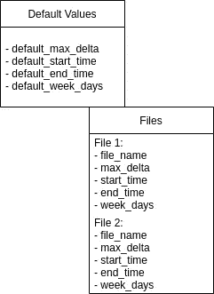
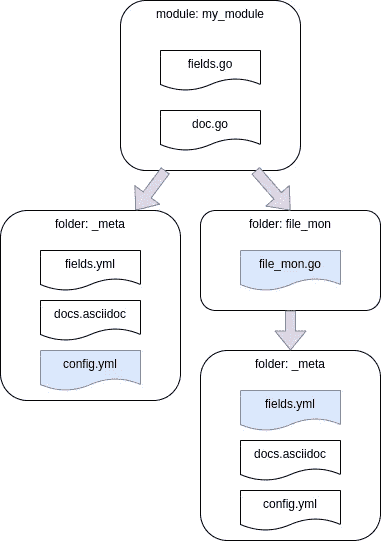
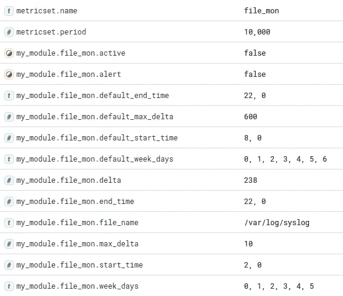
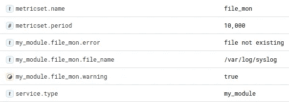
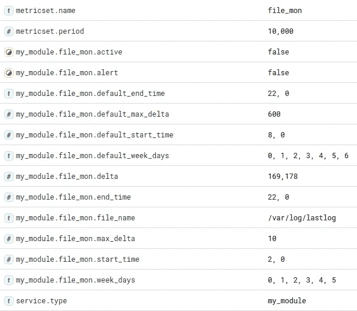

# Elasticsearch Beats 研讨会#3

> 原文：<https://towardsdatascience.com/elasticsearch-beats-workshop-3-c47054367a80>

## 适用于您的 Metricset 的更复杂的配置


约书亚·索蒂诺在 [Unsplash](https://unsplash.com?utm_source=medium&utm_medium=referral) 上拍摄的照片

欢迎来到 Beats 工作坊的第三部分。这里可以找到第一家作坊[。像往常一样，为了使每篇文章尽可能简洁，我将代码简化为片段。如果你想看完整的代码，请查阅我的](/elasticsearch-beats-workshop-1-c73189069793) [GitHub 页面。如果谷歌把你带到这里，你可能还会检查](https://github.com/PascalThalmann/ElasticBeatWorkshop/tree/master/3_create_a_module_2)[系列](https://medium.com/@pascalth/list/elasticsearch-beats-workshop-fbe5332d03e1)的其他部分。

这个工作坊是在上一个工作坊的基础上建立的，你可以在这里找到[。](/elasticsearch-beats-workshop-2-ea07d7bb4b00)所有的准备工作、开发环境的创建以及定制 metricbeat 框架的创建都在这里。如果您想加快进程并跳过阅读那篇文章，按照文章中描述的那样设置开发环境，克隆存储 workshop 2 的[文件的 GitHub repo，您就拥有了这个 workshop 所需的一切。](https://github.com/PascalThalmann/ElasticBeatWorkshop/tree/master/2_create_a_module_1)

今天，我们创建了一个更加复杂的 metricset，其配置为您提供了更多选项，并为您的托运人增加了更多智能。在本模块结束时，您将能够创建各种指标，只需了解一点 Go 知识。你会惊讶于创建一个专业的 Metricbeat 模块是多么容易。

但是:研讨会的一部分还包括部署您的 Metricbeat 模块。在[第二次研讨会](/elasticsearch-beats-workshop-2-ea07d7bb4b00)中，我们完全忽略了一件事，那就是你新创作的节拍的包装。剧透警告:Docker 会参与！

这是游戏计划:

*   定义用例
*   定义数据结构
*   定义模块和度量集的配置
*   编码矩阵集
*   编译和配置 Metricbeat
*   测试矩阵集
*   创建 Dockerfile 文件
*   建立形象
*   运行容器并检查输出

如你所见，有很多工作要做——请给自己拿杯茶，系好安全带准备上路。说够了:让我们直接开始吧！

# 定义用例

在最后一部分中，我们只对监控文件列表感兴趣。我们没有为警报定义任何阈值——我们只将文件名和上次修改时间之间的差异发送到 Elasticsearch 集群。

# 我们需要的输入

这一次，我们为每个文件添加了四个选项。我们甚至为默认值定义了选项。这使用户能够保持 YAML 配置文件尽可能的精简。让我们确定所需的选项:

*   文件名(必填)
*   以秒为单位的最大增量(可选)
*   警报的开始时间(可选)
*   警报的结束时间(可选)
*   一周中应发出警报的日期(可选)
*   除文件名外，以上所有选项的默认值

配置文件的结构如下:



作者图片—图表 1:输入字段

# 我们所做的处理

使用来自 YML 配置文件的输入(我们设置的选项),我们的处理将如下所示:

1.  读取每个文件名(字段文件名)
2.  读取每个定义的选项(最大增量、开始时间、周天数)
3.  我们做了一些检查:

*   我们检查文件名是否存在。如果没有，我们将向群集发送一条警告消息，其中包含文件名和特定消息。
*   如果设置了可选字段，我们会检查每个可选字段。如果不是:我们使用特定字段的默认值
*   我们检查实际工作日和实际时间。我们将它与工作日以及定义实际一天的监控时间窗口的开始和结束时间进行比较。如果我们在时间窗口中，并且实际工作日是要监控的一天:我们的字段“active”被设置为 true。否则，我们的字段“活动”将被设置为假。
*   我们读取文件统计信息，并用文件最后一次修改的时间戳计算实际时间的增量。我们将它存储在字段“delta”中。
*   最后，我们将 delta 与 max_delta 进行比较，如果 delta 超过 max_delta 中定义的值，则将 alter 设置为 true

# 我们发送的输出

如果文件名存在，我建议将所有输入值和处理步骤中计算出的值一起发送给 Elasticsearch。这使得调试更加容易。如果没有，我们只需要一个特定的错误消息，我们可以在 ELassticsearch 中监控它，以查找不再存在的文件(因此要么不再需要监控，要么存在更深层次的问题)。我们将发回的数据结构如下所示:


作者提供的图片—图表 2:输出字段

# 可能与输出有关的事情

监控框架可以是:在 Elasticsearch 集群中有一个观察者，它向您最喜欢的工具(电子邮件、Slack、Nagios 等)发出警报。)在警报为真且监视器激活的情况下。

# 定义模块和度量集的配置

因为我们已经在上一个研讨会中创建了数据结构，所以我们只需要更改配置文件的一个子集。在这里，您可以看到文件夹结构的概述，我们将更改的文件标记为蓝色:



作者图片—图表 3:文件夹结构

与第二次研讨会一样，路径

```
~/go/src/github.com/elastic/beats/metricbeat/module/my_module
```

将从这一点简称为“我的 _ 模块”。

# my_module/_meta/config.yml

首先，我们定义模板，该模板将用于生成文件 my_module.yml，该文件将在 metricbeat 安装期间在/etc/metricbeat/modules.d 中创建。my_module/_meta 中 config.yml 的缩写版本需要这样放置:

```
- module: my_module
  metricsets: ["file_mon"]
...
  default_max_delta: 600
  default_start_time: [8,0]
  default_end_time: [22, 0]
  default_week_days: [0, 1, 2, 3, 4, 5, 6]
  files:
  - file_name: "/var/log/syslog"
    max_delta: 1200
    start_time: [7, 0]
    end_time: [22, 0]
    week_days: [1, 2, 3, 4, 5]
```

# my _ module/file _ mon/_ meta/fields . yml

我们现在设置 config.yml 中定义的结构的字段定义。这需要正确的数据类型，因为 metricbeat 需要它来在 Elasticsearch 的索引中创建正确的映射:

```
- name: file_mon
  type: group
  release: beta
  fields:
    - name: default_max_delta
      type: object
      object_type: long
    - name: default_start_time
      type: object
    - name: default_end_time
      type: object
    - name: default_monitoring_week_days
      type: object
    - name: files
      type: object
      fields:
        - name: file_name 
          type: keyword
        - name: max_delta
          type: object
          object_type: long
        - name: monitorin_start_time
          type: object
        - name: monitoring_end_time
          type: object
        - name: monitoring_week_days
          type: object
```

在这里设置正确的结构和核心数据类型至关重要。如果您不确定您需要哪种核心数据类型，请查看[官方文档](https://www.elastic.co/guide/en/elasticsearch/reference/master/mapping-types.html#_core_datatypes)中的数据类型。

# 编码矩阵集

这就是配置文件。我们现在可以在我们的度量集中实现规范。

# 为指标集定义所需的数据结构

我们现在定义对象矩阵集的结构。虽然 Go 不是面向对象的语言，但结构可以被看作是对象的属性集合。每个属性必须由一个数据类型定义，如果数据被添加到该结构，字段的数据类型必须与您添加到该字段的数据相匹配。因此，当我们处理一个结构时，我们处理的数据必须被分配给正确的字段并具有正确的数据类型。因为我们的缺省值都是整数列表，所以我们在 MetricSet 结构中定义它们，如下所示:

```
type MetricSet struct {
 mb.BaseMetricSet
 DefaultMaxDelta  int          `config:"default_max_delta"`
 DefaultStartTime []int        `config:"default_start_time"`
 DefaultEndTime   []int        `config:"default_end_time"`
 DefaultWeekDays  []int        `config:"default_week_days"`
 FileConfig       []FileConfig `config:"files"`
}
```

标签 config:“XXX”将用于匹配我们在配置中定义的字段。功能“New”将读取配置，并在标签的帮助下进行匹配。

如您所见，在该结构的最底部，有一个数据类型为 FileConfig 的 list FileConfig。这只不过是我们需要定义的另一个具有数据类型的结构。结构 FileConfig 将保存我们为每个文件名定义的特定值:

```
type FileConfig struct {
 FileName  string `config:"file_name"`
 MaxDelta  int    `config:"max_delta"`
 StartTime []int  `config:"start_time"`
 EndTime   []int  `config:"end_time"`
 WeekDays  []int  `config:"week_days"`
}
```

在我们深入研究“新”方法之前，我们先用一个函数来返回 MetricSet 和 FileConfig 结构:

```
func returnConfig() MetricSet {
 return MetricSet{}
}
```

# 创建度量集实例

New-method 将调用函数 returnConfig()并接收 my_module.yml 中的值:

```
func New(base mb.BaseMetricSet) (mb.MetricSet, error) {
  ...
  config := returnConfig()
  ...
  return &MetricSet{
    BaseMetricSet:    base,
    FileConfig:       config.FileConfig,
    DefaultMaxDelta:  config.DefaultMaxDelta,
    DefaultStartTime: config.DefaultStartTime,
    DefaultEndTime:   config.DefaultEndTime,
    DefaultWeekDays:  config.DefaultWeekDays,
  }, nil
}
```

我们现在正在填充我们定义的结构矩阵集。如果在配置中发现了什么，New()将解包数据并用它填充我们的 MetricSet 结构。

# 获取数据并发送给 Elasticsearch

我们的 fetch 方法读取存储在 MetricSet 中的数据，并将其保存在变量 FileConfig 中。它保存了我们之前定义为 struct MetricSet 的特定文件配置。我们用引用 m.FileConfig 来调用它。

```
func (m *MetricSet) Fetch(report mb.ReporterV2) error {
      FileConfig := m.FileConfig
```

现在，让我们来读一下实际的时间、年份和月份。这是以后需要的:

```
act_time := time.Now()
year := act_time.Year()
month := act_time.Month()
```

现在让我们遍历文件 config，看看循环中的前几行:

```
for _, file_config := range FileConfig {
   f, err := os.Open(file_config.FileName)
```

调用标准 Go 库的一个好处是，它们中的许多会返回一个错误对象。在我们的例子中，确保我们打开的文件是存在的是非常重要的。否则，您将得到一个非常糟糕的异常，如下所示:

```
log.origin":{
     "file.name":"runtime/panic.go",
     "file.line":221 },
"message":
     "recovered from panic while fetching 
     'my_module/file_mon' for host 'localhost'. 
     Recovering, but please report this.",
"error":{
     "message":"runtime error: invalid memory 
     address or nil pointer dereference" }
```

因此，我们评估 err 对象，如果它不为零，让 metricbeat 向 Elasticsearch 发送一个报告——正如我们在图 2 中定义的那样:

```
if err != nil {
   report.Event(mb.Event{
       MetricSetFields: common.MapStr{
           "error":     "file not existing",
           "file_name": file_config.FileName,
           "warning":   true,
           },
       })
       continue
 }
```

我们现在读取下一个块中的统计数据，并计算增量:

```
out, _ := f.Stat()
mod_time := out.ModTime()
difference := act_time.Sub(mod_time).Seconds()
delta := int(math.Round(difference))
```

从那时起。Sub()。Seconds()方法以 float 形式返回秒数，我们对其进行舍入并将其转换为 int。

我们现在为变量 alert 和 active 设置默认值——没什么特别的或值得解释的:

```
alert := false
active := false
```

接下来的几行得到实际的工作日。我们首先测试 file_config。工作日切片有实际数据。如果没有，我们采用默认配置。此外，我们测试实际的工作日是否在 file_config 中。工作日切片:

```
if len(file_config.WeekDays) == 0 {
    file_config.WeekDays = m.DefaultWeekDays
}
for _, x := range file_config.WeekDays {
    if act_weekday == x {
        active = true
    }
}
```

我们现在测试所有其他的 file_config 值。如果它们是空的，我们设置默认值。默认值必须由引用“m”调用，因为我们没有将它们赋给变量:

```
if file_config.MaxDelta == 0 {
   file_config.MaxDelta = m.DefaultMaxDelta
}
if len(file_config.StartTime) == 0 {
   file_config.StartTime = m.DefaultStartTime
}
if len(file_config.EndTime) == 0 {
   file_config.EndTime = m.DefaultEndTime
}
```

我们现在检查我们现在是否在监视器应该被激活的时间窗口中。如果是，我们检查增量是否超过阈值，如果是，则发出警报:

```
window_start := time.Date(year, month, file_config.StartTime[0],           
                file_config.StartTime[1], 0, 0, 0, time.UTC)window_end := time.Date(year, month, file_config.EndTime[0],
              file_config.EndTime[1], 0, 0, 0, time.UTC)if window_start.Before(act_time) && window_end.After(act_time) && active {
   if file_config.MaxDelta < delta {
      alert = true
      }
   } else {
      active = false
}
```

最后但同样重要的是，我们正在发送数据，如图 2 所示:

```
report.Event(mb.Event{
   MetricSetFields: common.MapStr{
      "delta":      delta,
      "max_delta":  file_config.MaxDelta,
      "file_name":  file_config.FileName,
      "alert":      alert,
      "active":     active,
      "start_time": file_config.StartTime,
      "end_time":   file_config.EndTime,
      "week_days":  file_config.WeekDays,"default_max_delta":  m.DefaultMaxDelta,
      "default_start_time": m.DefaultStartTime,
      "default_end_time":   m.DefaultEndTime,
      "default_week_days":  m.DefaultWeekDays,
   },
})
```

就是这样。是时候测试我们的矩阵集了。

# 编译和配置 Metricbeat

如果您正确设置了您的开发环境，您应该能够切换到 metricbeat 的根文件夹，并使用 mage 编译新的模块和 metricset:

```
cd ~/go/src/github.com/elastic/beats/metricbeat
mage update
mage build
```

在我们用新编译的 Metricbeat 二进制文件测试我们的模块之前，您需要设置 metricbeat.yml 配置文件以连接到 Elasticsearch 集群。因为您可能从 GitHub 克隆了最新的 metricbeat 版本，所以您需要向我们的 metricbeat.yml 添加以下选项:

output . elastic search . allow _ older _ versions:true

如果您只想查看新模块中的条目，您还需要禁用系统模块—默认情况下它是启用的:

```
./metricbeat modules disable system
./metricbeat modules enable my_module
```

# 测试矩阵集

您可以使用详细日志记录来启动 Mericbeat:

```
./metricbeat -e -d "*"
```

如果您在 metricbeat 索引中看到数据，请检查您的群集。现在，默认的 my_module.yml 文件应该是这样的:



作者图片

警报和活动可以是真或假。如果运行 Metricbeat，您应该会看到一个具有上述结构并包含上述数据的文档。当我们稍后在 Docker 容器中运行相同的配置时，这看起来会有所不同。

# 构建和部署

如果您还没有找到，请转到 metricbeat 根文件夹，创建一个归档文件，将我们需要的所有内容打包到 my_module.tar.gz 中，并将所有内容复制到新创建的文件夹~/workspace 中:

```
cd ~/go/src/github.com/elastic/beats/metricbeat/
./metricbeat modules enable my_module
tar zcvf my_module.tar.gz \
   module/my_module \
   fields.yml \
   metricbeat.reference.yml \
   metricbeat.yml \
   modules.d/my_module.yml \
   metricbeat
mkdir ~/workspace
cp my_module.tar.gz ~/workspace
cd ~/workspace
```

有了那个包裹，你现在就没事了。你可以用 sftp 或者 Ansible 之类的工具把它复制到你想要的每一台机器上。或者你可以用它创建一个 rpm。或者创建一个 Docker 映像并将其上传到您选择的 Docker 注册表。我们采用后者，让我们解压缩 tar.gz-archive:

```
tar zxvf my_module.tar.gz
```

# 创建 Dockerfile 文件

我们创建的映像将包含我们编译的二进制 metricbeat、metricbeat.yml 配置文件，以自动连接到我们的 Elasticsearch 集群，并且该过程使用用户 metricbeat 运行:

```
FROM ubuntu:18.04RUN useradd -rm -d /metricbeat -s /bin/bash -g root -G sudo -u 1000 metricbeat \
    && mkdir /metricbeat/modules.d \
    && chown metricbeat:root /metricbeat/modules.d \
    && apt update \
    && apt -y upgradeUSER metricbeat
WORKDIR /metricbeatCOPY metricbeat /metricbeatEXPOSE 9200CMD cd /metricbeat && ./metricbeat -e -d "*"
```

# 建立形象

我们现在使用 Dockerfile 文件构建映像，并将其标记为 my _ module 版:

```
docker build -f Dockerfile . -t my_module:1.0
```

# 将图像上传到您的注册表

这里是一个新版本 1.1 的整个过程。不要混淆，我使用 Nexus 3 作为 Docker 图像的本地注册表，但它与 Harbor 的过程相同:

```
docker login -u xxx -p yyy srvnexus:8082
docker build -f Dockerfile . -t my_module:1.1
docker image tag my_module:1.1 srvnexus:8082/repository/dh/my_module:1.1
docker image push srvnexus:8082/repository/dh/my_module:1.1
```

现在，您可以在每台运行 docker 的服务器上获取您定制的 Metricbeat:

```
docker pull srvnexus:8082/repository/dh/my_module:1.1
```

# 创建 Docker 图像的 tar.gz 档案

可以使用“docker 图像保存”将 docker 图像保存为 tar.gz-archive:

```
docker image save -o my_module.tar.gz [image id]
```

# 运行并测试 Docker 映像

运行容器的时间到了。因为我们不想构建新的映像，所以每次我们更改 my_module.yml 或 metricbeat.yml 文件时，我们都直接从本地文件系统挂载它。您可以通过 Puppet、Ansible 或任何其他部署工具分发这些配置文件:

```
METRICPATH=$HOME/workspace/metricbeat.yml
MODULEPATH=$HOME/workspace/modules.ddocker run \
--mount type=bind,source=$MODULEPATH,target=/metricbeat/modules.d \
--mount type=bind,source=$METRICPATH,target=/metricbeat/metricbeat.yml \
-it [image id]
```

检查在 Kibana 中创建的文档，您会感到惊讶:



作者图片

是的，文件/var/log/syslog 不存在。就像大多数码头集装箱一样。好了，让我们更改我们的文件~/modules.d/my_module.yml 并添加/var/log/lastlog 作为第二个要监视的文件:

```
- file_name: "/var/log/lastlog"
    max_delta: 10
    start_time: [2, 0]
    end_time: [22, 0]
    week_days: [0, 1, 2, 3, 4, 5]
```

再次启动容器:

```
docker container start $(docker container ls -lq)
```

您应该会看到 lastlog 的统计数据:



作者图片

# 从 docker.com 下载图片

最后一个命令:如果你想下载 Docker 镜像并随便玩玩，可以在[docker.com](https://hub.docker.com/layers/workshop/cdax75/workshop/my_module/images/sha256-4c1fbcc33ccccd4ed179438a11fc56ce155f5cdc8a8c118f88ce80d87452d497?context=repo)上找到。

```
docker pull cdax75/workshop:my_module
```

按照我们在“运行并测试 Docker 映像”中所做的那样运行容器。

# 结论

如果你成功了:祝贺你！现在，您应该能够创建 Metricbeat 模块和 metricset，并将其部署为 docker 映像。这是一个比第一个例子更聪明的例子。如果您使用 file_mon.go 中的结构作为蓝本，您应该能够创建更复杂的 metricsets。

如果您有任何问题，请在 [LinkedIn](https://www.linkedin.com/in/pascal-thalmann/) 上留言、联系或关注我。

玩得开心！

*最初发布于*[*https://cdax . ch*](https://cdax.ch/2022/04/09/elasticsearch-beats-workshop-3-a-more-sophisticated-configuration-for-your-metricset/)*。*