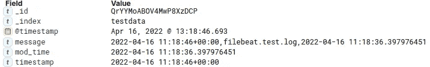
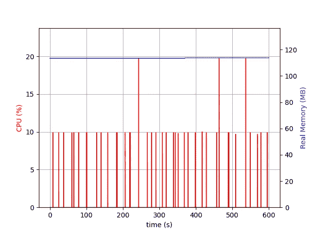
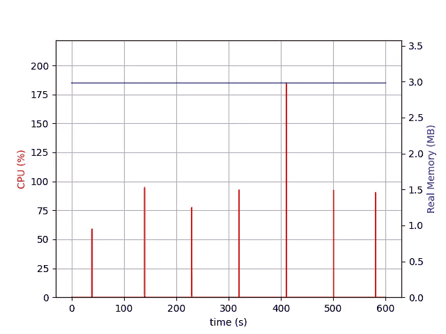
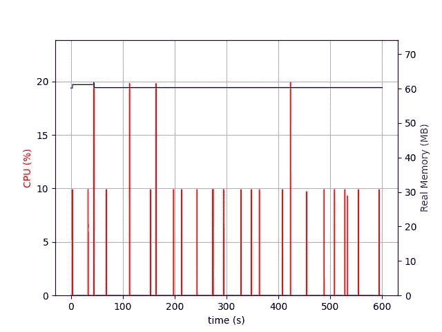

# Elasticsearch Beats 研讨会#4

> 原文：<https://towardsdatascience.com/elasticsearch-beats-workshop-4-609bf10ce3e7>

## Metricbeat 与 Filebeat


[翁贝托](https://unsplash.com/@umby?utm_source=medium&utm_medium=referral)在 [Unsplash](https://unsplash.com?utm_source=medium&utm_medium=referral) 上拍摄的照片

欢迎来到 Beats 工作坊的第四部分。这里可以找到第一家作坊[。像往常一样，为了使每篇文章尽可能简洁，我将代码简化为片段。如果你想看完整的代码，请查阅我的](/elasticsearch-beats-workshop-1-c73189069793) [GitHub 页面。如果谷歌把你带到这里，你可能还会检查](https://github.com/PascalThalmann/ElasticBeatWorkshop/tree/master/4_metricbeat_vs_filebeat)[系列](https://medium.com/@pascalth/list/elasticsearch-beats-workshop-fbe5332d03e1)的其他部分。

今天，我们来看看可能是最流行的节拍:Metricbeat 和 Filebeat。两者都是 Beats 家族的成员，都是开源和社区项目，都是用 Go 编写的。

这次研讨会的技术性将不如其他研讨会。技术方面的东西，比如安装 Metric-和 Filebeat，将完全放在 GitHub repo 中。我们将仔细看看这些节拍的预期目的，以及它们如何最好地用于你的项目。

这是游戏计划:

*   我将在一小段中描述每个节拍
*   我将描述测试场景和两个 Beats 需要达到的目标
*   我们将看看在每一拍中需要多少努力才能达到目标
*   我们将看看不同的节拍分配了多少系统资源
*   我们将经历每一拍的正面和负面
*   在结论中，我将描述，什么时候顶用哪个节拍

话虽如此，我们还是开始吧！

# 关于度量的一些话

此时，我需要澄清 Metricbeat 中的度量是什么。指标是从 Metricbeat 到 Elasticsearch 以固定间隔报告的值。这些值可以是各种类型的，从长整型到布尔型，甚至是字符串。重要的是要知道 Metricbeat 不是由一个事件触发的，而是由一个定义的间隔触发的—例如，每 5 秒。即使在创建指标时没有发生任何事情，Metricbeat 也会发送一份报告。在这种情况下，度量将是一个空字符串、零、假或任何定义为“什么都没有发生”的值。如果发生了一些事情，例如，CPU 1 以 75%的负载运行，那么 CPU 1 的指标可能是 0.75。

# Metricbeat 的简要描述

Metricbeat 自带许多模块，适用于最常用的应用。Nginx、Mysql、MongoDB、Prometheus 和许多其他软件在基本安装中都有一个模块，可以轻松配置。然而:如果您的应用程序或您的度量标准不是基本安装的一部分，您需要额外的努力。最好的情况是，在 Metricbeat GitHub repo 中找到所需的模块，然后设置开发环境，并用新模块编译 Metricbeat。如何做到这一点在我的第二次研讨会中有所描述。但是在大多数情况下，你可能需要编写你的模块和矩阵集。为此，你至少需要对围棋有一个基本的了解，你甚至可能会雇佣一名围棋开发者，或者让一家[专业公司](https://cdax.ch/about-cdax-gmbh/)为你开发这个模块。

# 关于日志的几句话

此时，我需要澄清一下 Filebeat 的日志是什么:它是一个由事件提供的文件。事件可以是应用程序崩溃、用户登录或其他足以写入记录的重要事件。当然，守护程序可以定期发送应用程序的统计数据(这将与指标的定义相匹配),并每 5 秒钟将测量结果记录到日志文件中。但是如果这个守护进程停止了，并且没有向日志文件发送任何数据，那么对于 Filebeat 来说，没有事件发生，因此不会向 Elasticsearch 发送任何数据。或者简而言之，Filebeat 并不关心记录是以间隔存储还是完全任意存储:只要有新记录出现，它就会拾取它们。

日志记录通常带有时间戳。虽然没有时间戳的日志条目几乎没有意义，但是即使没有时间戳，Filebeat 也会发送拾取的记录。每条记录都有一个自动添加的字段@timestamp，它表示 Filebeat 选择记录时的时间戳。

# Filebeat 的简要描述

Filebeat，顾名思义，是一个跟踪日志文件并将新记录发送到 Elasticsearch 集群或 Logstash 的 beat。如果 Filebeat 停止了——可能是因为升级——那么只要 Filebeat 再次运行，它就会从最后一个位置继续跟踪日志文件。内存机制保证了随时重启的能力，而不会丢失数据或发送副本。这使得 Filebeat 成为跟踪和分析日志的一个非常健壮的工具。

Filebeat 8.1.0 自带 71 个模块。它附带了用于本地存储日志(如 Log、Syslog、filestream 和 journald)的模块，但也支持网络协议和端点(如 TCP、UDP、Kafka、MQTT 和 Google Workspace)。

Filebeat 具有非常灵活的给定模块。它可以配置为任何类型的输入，基于文件或通过网络地址。添加新字段可以通过在配置文件中定义它们来完成。但它不止于此:Filebeat 配备了许多处理器。在将数据发送到 Elasticsearch 之前，可以使用它们来转换数据。Logstash 中的许多处理器都在 Filebeat 中实现，减少了 Logstash 或 Elasticsearch 集群上所需的处理。

最后但同样重要的是:如果需要，Filebeat 还配有手刹。它可以防止您的摄取管道过载。背压敏感协议与 Elasticsearch 或 Logstash 对话，并在需要时减慢 Filebeat。

# 测试场景

在我们的简单场景中，我们监控文件 filebeat.log 的修改时间。目标是每 10 秒发送一个包含 filebeat.log 的最新修改日期的报告。该报告如下所示:



一个示例文档——按作者排序的图像

# 使用 Metricbeat 向 Elasticsearch 发送指标

作为 Metricbeat 模块，我将使用我们在 [workshop 3](https://cdax.ch/2022/04/09/elasticsearch-beats-workshop-3-a-more-sophisticated-configuration-for-your-metricset/) 中创建的模块。它有一点额外的计算，但没有什么会有任何不同。

# 使用 Filebeat 向 Elasticsearch 发送指标

由于 Filebeat 从日志中读取事件，因此该任务需要两个步骤:一个简单的 shell 脚本——称为 Filebeat _ logger . sh——每隔 10 秒从 filebeat.log 中读取修改时间，并将其写入自身。以及跟踪日志文件并将事件发送给 Elasticsearch 的 Filebeat 实例。

# Filebeat 的简单配置

我将使用 Filebeat 的一个非常基本的配置:

```
filebeat.inputs:
- type: log
  enabled: true
  paths:
    - /logs/filebeat.log
  exclude_lines: ["^\"\""]
  processors:
  - decode_csv_fields:
      fields:
        message: decoded.csv
      separator: ","
  - extract_array:
        field: decoded.csv
        mappings:
          timestamp: 0
          file_name: 1
          mod_time: 2
  - drop_fields:
        fields: ["decoded"]
```

# 性能比较

我们来看看 Filebeat 的内存和 CPU 消耗:



*超过 10 分钟的 Filebeat CPU 和实际内存使用情况——图片由作者提供*

Filebeat 使用 120MB 内存。CPU 仅在非常短的峰值中使用。10%的峰值占大多数，也有 3 个峰值达到 20% —在 10 分钟内。



*filebeat_logger.sh 超过 10 分钟的 CPU 和实际内存使用情况——图片由作者提供*

记录器需要大约 3MB 的内存，并且这里那里有一些奇怪的尖峰。我不清楚为什么，但我也没有进一步研究它。sh 是一个 Bash 脚本，出于性能原因，我不建议使用 Bash 来编写守护进程。对于这个例子，这无关紧要，因为这只是一个测试。

Metricbeat 只需要 60MB 内存，是 Filebeat 所需内存的一半。有趣的是，它和 Filebeat 有相同的 CPU 峰值。可以说，Metricbeat 消耗的 CPU 和 Filebeat 一样多。



*超过 10 分钟的 CPU 和实际内存使用度量——图片由作者提供*

# Filebeat 的优缺点

Filebeat 的巨大优势是它的灵活性:几乎没有限制。如果对磁盘的 I/O 是一个问题，Filebeat 可以从网络地址读取。有了处理器，Filebeat 提供了一个非常强大的工具来转换数据，并在摄取之前丰富它们。通过对背压敏感的协议，Filebeat 实现了一种安全机制，可以防止集群过载。而且 Filebeat 不会丢失一条日志记录，即使 Filebeat 暂时没有运行。

最后但同样重要的一点是:如果出现问题，您可以在本地保存日志文件。这可能是一种祝福，也可能是一种诅咒。如果您的 Elasticsearch 集群无法访问，您可以使用 grep 和其他工具来分析您的日志。另一方面，您需要管理您的日志。

然而:Filebeat 是事件驱动的。如果 logger 守护进程停止了，没有新的数据进来，Filebeat 不会在意。记录器守护进程将增加 CPU 和内存消耗。如果资源很少或者 logger 守护进程触发了大量的请求，那么您可能希望用 Go、C++或者至少 Perl 或 Python 编写守护进程，而不是 Bash。

# Metricbeat 的优缺点

Metricbeat 的优势似乎很明显:它只需要 Filebeat 一半的内存。Metricbeat 将每 10 秒向 Elasticsearch 发送一份报告，即使什么也没发生。有了 Go 中的知识，就可以创建内存占用非常少并且几乎有无限可能的托运人。

缺点是 Metricbeat 模块和 metricsets 高度专门化，具有特定的字段和数据类型。您可能能够创建某种通用模块，但是灵活性不是 Metricbeat 的优势，并且在某一点上，您将被迫为其他类型的指标创建另一个模块或 metricset 这将带来一个价格标签，它肯定比使用将数据发送到 Filebeat 或 Logstash 的自行编写的守护程序进行测量要高。

# 结论

只要您对 Metricbeat 8.1.2 提供的 73 个模块满意，您就拥有了一个监视最流行的应用程序的好工具。到目前为止，我遇到的模块配置起来非常简单。通常，每个模块都有 Kibana 仪表板。

如果您的物联网设备内存和存储有限，应该运行数量严格受限的进程，并且指标是预先定义的，那么定制指标集可能是正确的选择。

另一方面，Filebeat 与 logger 守护程序相结合，为您提供了很大的灵活性，并且能够非常容易地扩展您的监控框架。Filebeat 仍然是一个事件驱动的工具，但是您的记录器确保事件基于记录的指标。这在不断出现新的监控需求的动态环境中非常有用。

所以最后，这真的取决于，你的重点在哪里。灵活性与性能。在一个交付时间至关重要的世界里，当谈到标准安装之外的指标时，我在大多数情况下会选择 Filebeat。

*最初发布于*[*https://cdax . ch*](https://cdax.ch/2022/04/17/elasticsearch-beats-workshop-4-metricbeat-versus-filebeat/)*。*