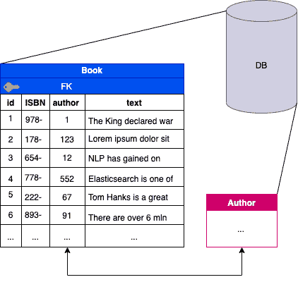
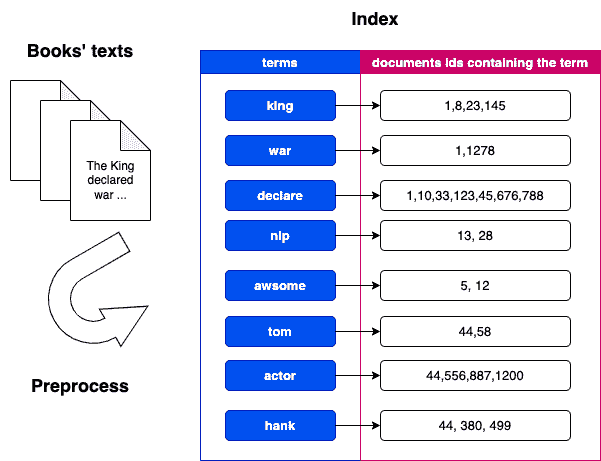
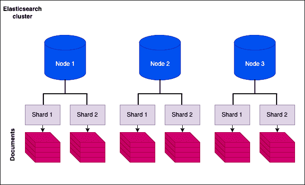
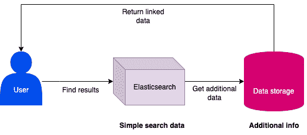
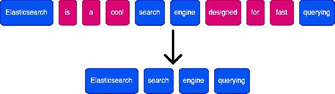
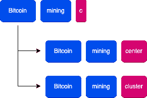
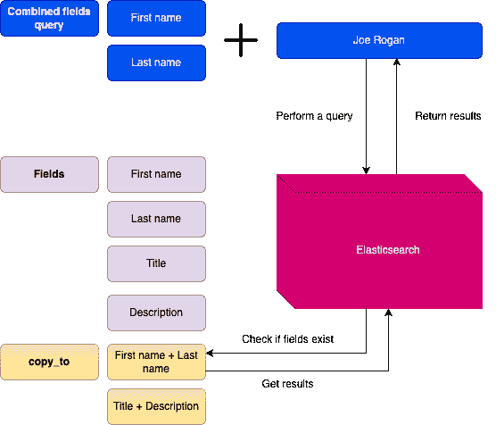
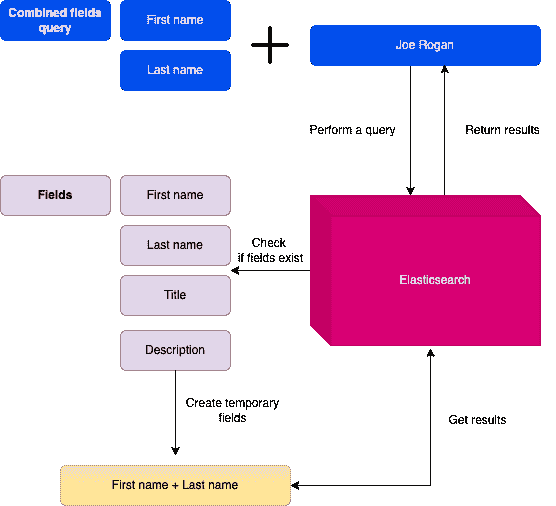

# 弹性搜索:关键概念介绍

> 原文：<https://towardsdatascience.com/elasticsearch-introduction-to-key-concepts-928816046440>

## 开始使用 Elasticsearch for NLP 的 5 个基本步骤

*作者*[*pawemielniczuk*](https://medium.com/@p.mielniczuk)*和* [*丹尼尔·波佩克*](https://medium.com/@daniel.popek) *。*

照片由[格伦·凯莉](https://unsplash.com/@glencarrie?utm_source=medium&utm_medium=referral)在 [Unsplash](https://unsplash.com?utm_source=medium&utm_medium=referral) 上拍摄

# 这篇文章背后的野心

在我们在 [**NeuroSYS**](https://neurosys.com/) 工作期间，我们处理了自然语言处理中的各种问题，包括信息检索。我们主要关注基于[变形金刚](https://arxiv.org/pdf/1706.03762.pdf)的深度学习模型。然而, **Elasticsearch 经常为我们提供一个很好的基线。我们一直在广泛使用这个搜索引擎；因此，我们希望与您分享我们的发现。**

但是如果你能直接找到 Elasticsearch 文档，为什么还要读这个呢？不要误解我们，文档是我们每天依赖的极好的信息来源。然而，正如文档所做的那样，它们需要是彻底的，并且**包括关于该工具已经提供了什么的每一点信息**。

相反，我们将更加关注 NLP 和**elastic search**的实际方面。我们还决定将这篇文章分成两部分:

1.  介绍部分
    —解释主要概念，
    —指出我们认为最重要的东西，
    —识别可能导致错误或不当使用的不明显的东西。
2.  实验部分
    —提供现成的代码，
    —提出一些优化技巧，
    —展示不同策略使用的结果。

即使你对后者更感兴趣，我们仍然强烈建议你阅读介绍。

在下面的**五个步骤中，**我们揭示了我们发现对开始尝试搜索结果质量改进最重要的是什么。

**注:**本文使用的 Elasticsearch 服务器是开源的，可以在 [Elasticsearch Github](https://github.com/elastic/elasticsearch) 上获得。在第二篇文章中，我们将提供 GitHub 链接到我们的 dockerized 环境，以便于使用。但是，如果您不希望自己设置一切，云中有现成的设置，包括安全性、监控或复制等功能。所有定价选项均可在[这里](https://www.elastic.co/pricing/)获得。

# 第一步:理解什么是 Elasticsearch，什么是搜索引擎

Elasticsearch 是一个搜索引擎，数百万人使用它来迅速找到查询结果。弹性有许多用途；然而，我们将主要**关注自然语言处理**中对我们最重要的方面——所谓的**全文搜索**的功能。

> **注意:**本文主要关注 Elasticsearch 的第七个版本，在撰写本文时，一个更新的版本 8 已经发布了，它提供了一些额外的特性。

# 数据库与弹性搜索

但是等等，一个常用的数据库不就是为了快速存储和搜索信息而设计的吗？我们真的需要 Elastic 或其他搜索引擎吗？是也不是。数据库非常适合快速和频繁的插入、更新或删除，**不像数据仓库或弹性搜索**。

数据存储互不相同。作者图片

对，没错，说到没完没了的插入，Elasticsearch 并不是一个好的选择。通常建议将弹性视为"**一旦建立，就不要再修改。**“这主要是由于倒排索引的工作方式——它们是为搜索而优化的，而不是为修改而优化的。

此外，数据库和 Elastic 在搜索用例上有所不同。让我们用一个例子来更好地说明；想象一下，你有一个图书馆，藏书很多。每本书可以有许多与之相关的属性，例如，*标题、文本、作者、ISBN(唯一图书标识符)*等。这些都必须存储在某个地方，很可能是某种数据库中。

标准数据库中的图书表示示例。作者图片

当试图在查询中查找给定作者的特定书籍时，这种搜索可能会很快。如果在这个字段上创建一个**数据库索引**，可能会更快。然后，它以排序的方式保存在磁盘上，这大大加快了查找过程。

但是，如果您想要查找包含某个文本片段的所有书籍，该怎么办呢？在数据库中，我们可能会把 SQL *看做*语句，可能还带有一些通配符 *%* 。

很快，进一步的问题出现了:

*   如果您想根据文本与您查询的内容的紧密程度对行进行排序，该怎么办呢？
*   如果您有**多个字段**，例如*标题*和*文本*，您希望将它们包含在您的搜索中，该怎么办？
*   如果您不想搜索整个短语，但是**将查询**分成单独的单词，并且只接受包含其中一些单词的匹配结果，该怎么办？
*   如果您想**拒绝语言中经常出现的单词**并只考虑查询的相关部分，该怎么办？

您可能会看到，当使用类似 SQL 的查询和标准数据库时，处理更复杂的搜索是多么困难。这就是搜索引擎的确切用例。

简而言之，如果你想通过 *ISBN、书名、*或*作者*进行搜索，那就去用数据库吧。然而，如果你打算基于长文本中的段落来搜索文档，同时关注单词的相关性，搜索引擎，尤其是 Elasticsearch，将是更好的选择。

Elasticsearch 设法通过多种不同的查询类型**来处理匹配的查询和文档文本，我们将进一步展开讨论。然而，它最重要的特性是**一个倒排索引**，它是基于来自经过标记化和预处理的原始文本的术语创建的。**

Elasticsearch 中的图书表示示例。作者图片

倒排索引可以被认为是一本字典:我们查找某个单词并得到匹配的描述。所以，这里它基本上是从单个单词到整个文档的映射。

给定一本书的前一个例子，我们将通过从一本书的内容中提取关键字或最能描述它的关键字来创建一个反向索引，并将它们映射为一个**集合/向量**，从现在开始它将代表这本书。

所以通常情况下，当查询时，我们必须遍历数据库的每一行并检查一些条件。相反，我们可以将查询分解成一个**标记化的表示**(一个标记向量)，并且只将这个向量与数据库中已经存储的标记向量进行比较。由于这一点，我们还可以轻松地实现一个评分机制来衡量所有对象与该查询的相关程度。

> **作为旁注**，还值得补充的是，每个 Elasticsearch 集群包含许多索引，这些索引又包含许多碎片，也称为 [Apache Lucene 索引](https://lucene.apache.org/core/3_0_3/fileformats.html)。在实践中，它一次使用几个这样的碎片来划分数据子集，以加快查询速度。

弹性搜索的组成部分。作者图片

# 第二步:了解何时不使用 Elasticsearch

Elasticsearch 是一个很棒的工具；然而，就像许多工具一样，如果使用不当，可能会导致与实际解决的问题一样多的问题。我们希望你从这篇文章中领会到的是, **Elasticsearch 不是一个数据库，而是一个搜索引擎**,并且应该被如此对待。意思是，**不要把它当成你唯一拥有的数据存储**。原因有很多，但我们认为最重要的是:

1.  搜索引擎应该只关心他们实际用于搜索的数据。
2.  使用搜索引擎时，应该避免频繁更新和插入。

**Re 1)**

不要用你不打算用来搜索的东西污染搜索引擎。我们知道数据库如何增长，模式如何随着时间变化。新数据的加入导致更复杂的结构形成。Elasticsearch 用了也不会好；因此，建立一个单独的数据库，将一些额外的信息链接到您的搜索结果可能是一个好主意。除此之外，额外的数据也可能影响搜索结果，你会在 BM25 一节中发现。

**Re 2)**

创建和修改倒排索引的成本很高。**elastic search 中的新条目强制改变倒排索引**。Elastic 的创建者也考虑到了这一点，并不是每次更新时都重建整个索引(例如每秒 10 次)，而是创建一个单独的小 Lucene 索引(Elastic 建立在较低级别的机制上)。然后将它与主索引合并(重新索引操作)。默认情况下，该过程每秒发生**次**，但也需要一些时间来完成重新索引。**处理更多的副本和分片会花费更多的时间**。

搜索结果如何与附加数据链接。作者图片

任何额外的数据都会导致该过程花费更长的时间。由于这个原因，你应该只在你的索引中保存重要的搜索数据。此外，不要期望数据立即可用，因为 Elastic 不符合 [ACID](https://en.wikipedia.org/wiki/ACID) 标准，因为它更像是一个主要关注 [BASE](https://en.wikipedia.org/wiki/Eventual_consistency) 属性的 NoSQL 数据存储库。

# 第三步:理解评分机制

# Okapi BM25

存储在索引中的术语影响评分机制。 [**BM25**](https://en.wikipedia.org/wiki/Okapi_BM25) 是 Elasticsearch 中默认的评分/关联算法，**是** [**TF-IDF**](https://pl.wikipedia.org/wiki/TFIDF) 的继承者。我们不会在这里过多地钻研数学，因为这会占用整篇文章的篇幅。然而，我们将挑选出最重要的部分，并试图让你对它的工作原理有一个基本的了解。

BM25 配方。图片来源 [Elasticsearch 文档](https://www.elastic.co/blog/practical-bm25-part-2-the-bm25-algorithm-and-its-variables)

这个等式一开始可能有点混乱，但是当单独看每个组件时，它变得非常直观。

*   第一个功能是 **IDF(qi)** —如果你对 IDF(逆文档频率)比较熟悉，这个功能你可能很熟悉。 *qi* 代表来自查询的每个术语。它本质上做的是**通过计算它们总共出现的次数来惩罚在所有文档中更频繁出现的术语**。我们宁愿只考虑查询中最具描述性的词，而丢弃其他的词。

例如:

只选择文档表示的描述性词语。作者图片

如果我们把这个句子符号化，我们会期望像 **Elasticsearch，search，engine，query**这样的词比 ***更有价值，因为后者**对这个句子的本质贡献较少**。***

*   另一个相关因素是函数 **f( *qi* ，D)** 或术语 ***qi*** 在文档 **D** 中的出现频率，对其进行评分。直觉上，特定文档中查询词的频率越高，该文档就越相关。
*   最后但并非最不重要的是***field len/avgFieldLen***比率。它计算给定文档的长度与存储的所有文档的平均长度的比较。因为它被放在分母中，我们可以观察到**分数会随着文档长度的增加而减少**，反之亦然。所以，如果你经历的短结果比长结果多，那只是因为这个因素**促进了短文本**。

# 第四步:理解文本预处理的机制

# 分析器

当考虑优化时，你需要提出的第一个问题可能是:如何在你的倒排索引中预处理和表示文本。Elasticsearch 中有很多**现成的**概念，取自自然语言处理。它们被封装在所谓的分析器中，分析器将连续的文本转换成单独的术语，这些术语被编入索引。在“外行人的术语”中，**分析器既是一个记号赋予器，它把文本分成记号(术语)，又是一个过滤器集合，它做额外的处理。**

我们可以使用 Elastic 提供的内置分析器或定义自己的分析器。为了创建一个自定义的，我们应该确定我们想要使用哪个标记器，并提供一组过滤器。

我们可以将三种可能的分析器类型应用于给定的字段，这些类型根据它们处理文本的方式和时间而有所不同:

*   **索引分析器** —用于文档索引阶段，
*   **搜索分析器** —用于在搜索过程中映射查询术语，以便可以将它们与字段中的索引术语进行比较。**注意:**如果我们没有明确定义搜索分析器，默认情况下，将使用该字段的**索引分析器**
*   **搜索引用分析器** —用于**全短语的严格搜索**

通常，应用不同于索引分析器的搜索分析器是没有意义的。此外，如果您想自己测试它们，可以通过**内置 API** 或直接从**库**中选择语言来轻松完成。

内置分析仪应能涵盖步进期间最常用的操作。如果需要，你可以使用专门为特定语言设计的分析器，叫做**语言分析器**。

# 过滤

不管名字如何，过滤器不仅执行标记选择，还负责大量常见的 NLP 预处理任务。它们还可用于多种操作，例如:

*   词干，
*   停用字词过滤，
*   下/上壳体，
*   在字符或单词上创建 n 元语法。

但是，它们不能执行[词汇化](https://en.wikipedia.org/wiki/Lemmatisation)。下面，我们列出了一些最常见的。然而，如果你对可用过滤器的完整列表感兴趣，你可以在这里找到它。

*   *带状疱疹* —创建 n 个单词，
*   *n-gram* —创建 n-gram 字符，
*   *停用词* —删除停用词，
*   *词干分析器*(波特/洛文斯)——根据波特/洛文斯算法执行词干分析，
*   *remove_duplicate* —删除重复的令牌。

# 标记化者

他们的目标是根据选定的策略将文本划分为标记，例如:

*   *standard_tokenizer* —删除标点符号并根据单词边界断开文本，
*   *letter_tokenizer* —在每个非字母字符上断开文本，
*   *whitespace_tokenizer* —在任何空白上断开文本，
*   *pattern_tokenizer* —在指定的分隔符上断开文本，如分号或逗号。

在下面的图表中，我们展示了一些示例性的分析器及其对句子**“汤姆·汉克斯是个好演员，因为他热爱表演。”**

不同的分析器应用于同一个句子。作者图片

每个记号赋予器都有不同的操作方式，所以选择最适合您的数据的一个。然而，*标准分析器*通常很适合许多情况。

# 步骤 5:理解不同类型的查询

# 问题

Elasticsearch 支持各种不同的查询类型。**我们可以做出的基本区分是我们是否关心相关性分数。**考虑到这一点，我们有两个上下文可供选择:

*   查询上下文— **计算分数**，文档是否匹配查询，**以及匹配程度**，
*   过滤上下文— **不计算得分**，它只识别**是否匹配查询的文档。**

因此，**使用一个查询上下文来判断文档与查询的匹配程度**和**一个过滤上下文来过滤掉不匹配的文档，这些文档在计算分数**时不会被考虑。

## 布尔查询

尽管我们已经声明我们将主要关注文本查询，但至少理解 Bool 查询的基础是很重要的，因为匹配查询归结于它们。最重要的方面是我们决定使用的**运算符**。当创建查询时，我们通常喜欢使用逻辑表达式，如 **AND、OR、NOR** 。它们在 Elasticsearch DSL(特定领域语言)中分别作为 ***必须*、*应该、*和*必须 _ 不、*** 可用。使用它们，我们可以很容易地描述所需的逻辑关系。

## 全文查询

这些是我们最感兴趣的，因为它们非常适合包含应用了分析器的文本的字段。值得注意的是，当在搜索期间查询每个字段时，查询文本也将由用于索引字段的同一分析器处理。

有几种类型的 FTS 查询:

*   **区间** —使用匹配术语的规则，并允许它们的排序。该查询擅长的是**邻近搜索**。我们可以定义一个区间(从查询名称开始)，在这个区间中我们可以查找一些术语。这很有用，尤其是当我们知道搜索的术语不一定会同时出现，但可能会以预定的**距离出现**。或者相反，我们希望它们靠得很近。
*   **匹配**——FTS 的首选，子类型有:
*   **match_phrase** —设计用于“精确短语”和单词邻近匹配，
*   **multi_match** —允许以首选方式查询多个字段的匹配类型。
*   **combined_fields** —此类型允许查询多个字段，并将其视为组合字段。例如:当查询名字和姓氏时，我们可能想要配对。
*   **query_string** —较低级别的查询语法。它允许使用 AND、or、NOT 等操作符创建复杂的查询，以及多个字段查询或多个附加操作符，如通配符操作符。
*   **simple_query_string** —它是 query_string 的高级包装器，对最终用户更加友好。

我们现在将重点更详细地解释基于匹配的查询，因为我们发现它们足够通用，可以做我们需要的任何事情，同时编写和修改速度也相当快。

**匹配查询** —这是全文搜索的标准，其中每个查询都以与其匹配的字段相同的方式进行分析。我们发现以下参数是最重要的参数:

*   模糊性— 当搜索一些短语时，用户可能会打错字。模糊性使人能够通过同时搜索相似的单词来快速处理这种拼写错误。**定义了每个单词**可接受的错误率，解释为 [Levenstein 编辑距离](https://en.wikipedia.org/wiki/Levenshtein_distance)。模糊度是一个可选参数，可以取值为 0、1、2 或 AUTO。**我们建议将参数设为 AUTO** ，因为它会根据单词的长度自动调整每个单词的错误数量。对于 2、3–5 和超过 5 个字符的单词长度，误差距离分别为 0、1 和 2。如果你决定在一个领域中使用同义词，模糊性就不能再用了。
*   **操作符** —如上所述，基于分析的搜索文本构建布尔查询。此参数定义将使用哪个运算符 AND 或 or，默认为 or。例如，or 运算符的文本*“超级比特币挖矿”*构造为“*超级或比特币或挖矿*”，而对于 AND，则构造为“*超级和比特币及挖矿*”
*   **Minimum_should_match** —这定义了布尔查询中有多少项应该被匹配以使文档被接受。它非常通用，因为它接受整数、百分比，甚至它们的组合。

**匹配短语查询** —它是**匹配查询**的变体，其中所有术语都必须出现在查询字段中，**以相同的顺序，彼此相邻**。当使用删除停用词的分析器时，可以稍微修改一下序列。

**匹配前缀查询** —它将查询中的最后一个术语转换为前缀术语，前缀术语充当后跟通配符的术语。此查询有两种类型:

*   **匹配布尔前缀** —从术语中构建布尔查询，
*   **匹配短语前缀** —术语被视为短语；它们需要按照特定的顺序排列。

匹配短语前缀查询示例。作者图片

当使用 ***匹配短语前缀*** 查询时，*比特币挖矿 c* 将与两个文档*“比特币挖矿中心”*以及*“比特币挖矿集群”*匹配，因为前两个单词构成了**短语，**而最后一个单词被认为是**前缀**。

**组合字段查询** —允许在多个字段**中进行搜索，如同它们被组合成一个字段**。清晰是组合字段查询的一个巨大优势，因为当创建这种类型的查询时，它被转换为布尔查询，并使用选择的逻辑运算符。然而，对于组合字段查询有一个重要的假设；**所有被查询的字段需要相同的分析器。**

这个查询的缺点是增加了搜索时间，因为它必须动态地组合字段。这就是为什么在索引文档时使用 **copy_to** 可能更明智。

左边:在索引期间使用 copy_to 时执行查询。右边:当 Elastic 需要动态组合字段时执行查询。作者图片

**Copy_to** 允许创建单独的字段，将其他字段的数据组合起来。这意味着在搜索过程中没有额外的开销。

**多匹配查询** —它不同于组合字段，因为它允许**查询应用了不同分析器甚至不同类型**的多个字段。最重要的参数是查询的类型:

*   **best_fields** —默认值，它**计算每个指定字段**的分数。当我们希望答案只出现在一个给定的字段中，而不是出现在多个字段中时，这很有用。
*   **most_fields** — **不同字段中可以找到相同文本时的最佳选择**。在这些字段中可能会使用不同的分析器，其中一个可以使用词干和同义词，而第二个可以使用 n 元语法，最后一个是原始文本。**相关性分数合并所有字段的分数，然后除以每个字段中的匹配数。**

**注意:best_fields** 和 **most_fields** 被视为以字段为中心，这意味着查询中的匹配是按字段而不是按术语应用的。例如，使用操作符 AND 查询 *"Search Engine"* 意味着所有术语必须出现在一个字段中，这可能不是我们的意图。

*   **cross_fields** —被认为是以术语为中心的，当我们期望在多个字段中找到答案**到**时，这是一个很好的选择。例如，当查询名字和姓氏时，我们会期望在不同的字段中找到它们。相比于*最*和*最佳*字段，其中术语**必须在**相同字段**中找到，这里，所有术语**必须在**至少一个字段**中。关于 *cross_fields* 更酷的一点是，它可以用同一个分析器将字段分组，而不是按组计算分数。更多细节可以在[官方文档](https://www.elastic.co/guide/en/elasticsearch/reference/current/query-dsl-multi-match-query.html#type-cross-fields)中找到。****

## 助推

我们还想强调的是查询可以被提升。我们每天都广泛地使用这个特性。

查询字段提升示例。作者图片

该查询会将字段*标题的分数乘以* 2 倍，将*作者的分数乘以*4 倍，而*描述的分数将保持不变。Boost 可以是整数，也可以是浮点数；但是，它**必须大于或等于 1.0** 。*

# 结论

总而言之，我们提出了五个我们认为对开始使用 Elastic 至关重要的步骤。我们已经讨论了什么是 Elasticsearch，什么不是，以及如何使用和不使用它。我们还描述了评分机制和各种类型的查询和分析器。

我们相信，本文中收集的知识对于开始优化您的搜索结果至关重要。本文旨在介绍一些关键概念，但也是下一篇文章的基础，在下一篇文章中，我们将为您提供值得尝试的示例，并将共享代码。

我们希望这篇博文能让你对不同搜索机制的工作原理有所了解。我们希望你已经学到了一些新的或有用的东西，有一天你可能会发现这些东西对你的项目有用。

第 2 部分—即将推出。