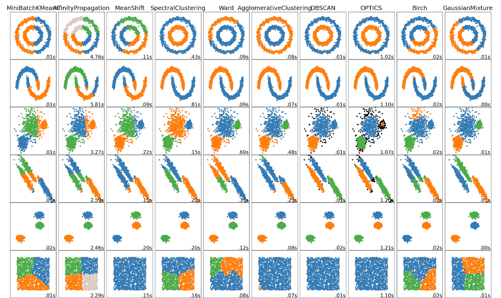
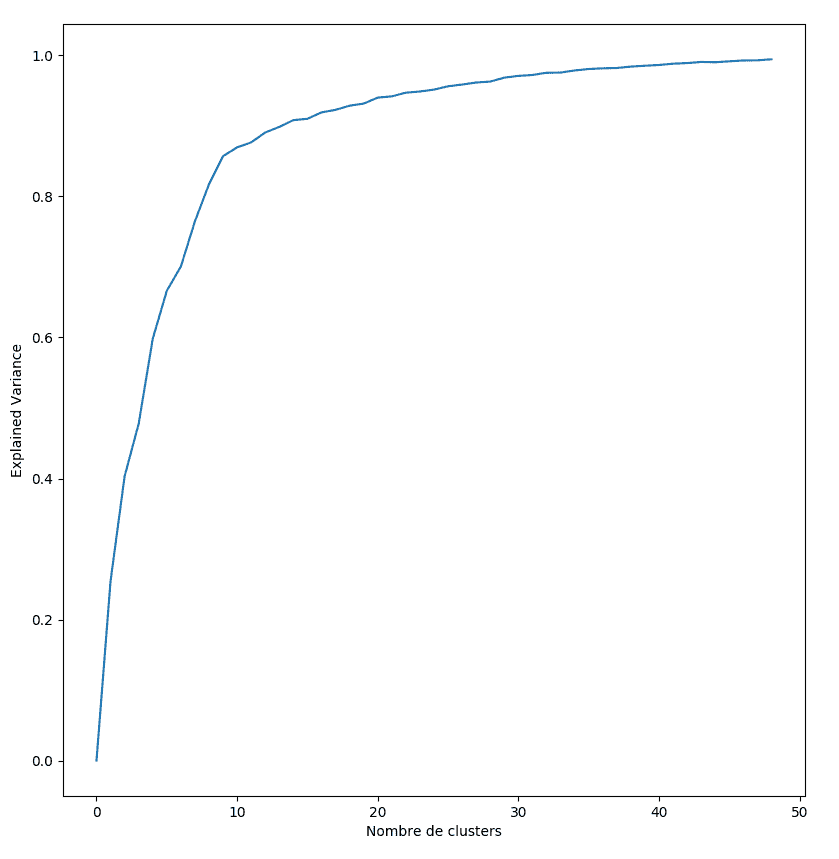
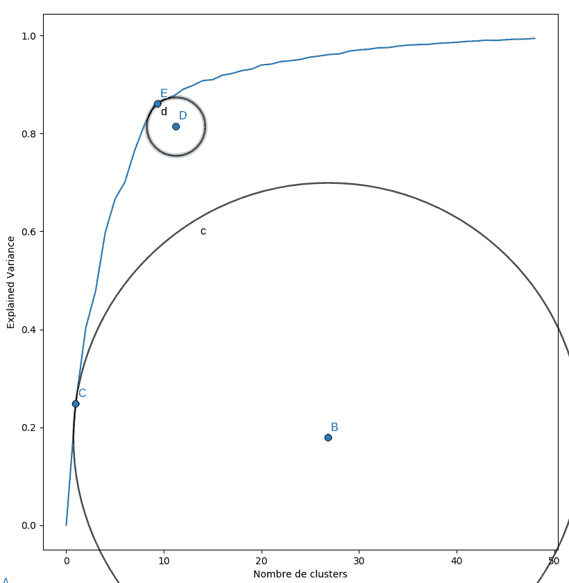
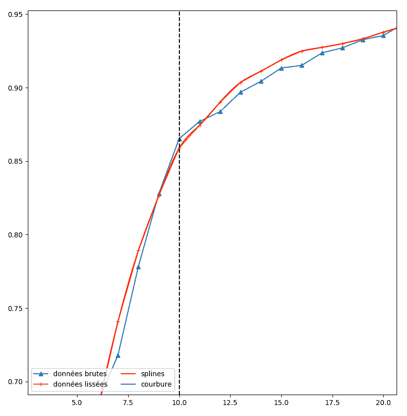
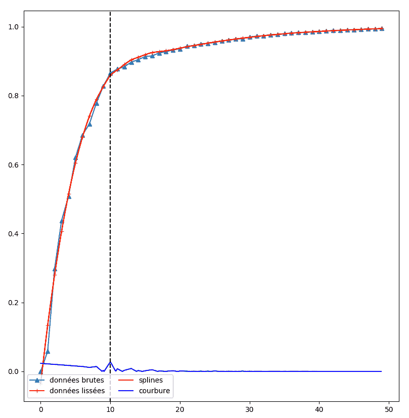

# 基于样条聚类的肘部检测

> 原文：<https://towardsdatascience.com/elbow-detection-for-clustering-using-splines-3b26894f9229>

## 用样条函数优化聚类数

照片由[欧内斯特·波尔兹](https://unsplash.com/@ernestporzi?utm_source=medium&utm_medium=referral)在 [Unsplash](https://unsplash.com?utm_source=medium&utm_medium=referral) 拍摄

***要定义智力，我们通常指的是在不同知识或学科之间编织联系的能力。接下来的问题是，大脑将自己从具体事物中抽象出来，以便后退一步，突出连接这些不同元素的共性。***

***这种能力在人工智能中当然是受追捧的，而这也恰恰是我们这里要讨论的聚类方法的目的。***

在机器学习和人工智能提供的方法中，聚类方法是最有趣的方法之一。这些方法属于无监督方法的类别，因此不会遭受偏见或预设，因为它们不寻求学习已知的规则，而是识别未知的链接。因此，它们的吸引力在于它们能够理解那些数量和/或基数超过人类处理能力的数据。

## 监督和非监督学习

在人工智能领域，有两大类方法:有监督的方法和无监督的方法。

它们通过提交给机器学习的问题的形式来区分。

在监督学习的情况下，我们有一个数据集，其中每个元素，通常是包含几列的一行数据，都是合格的。例如，这些行中的每一行都可以包含蛋白质的物理和化学特征，并通过其空间构型来限定。学习过程然后将识别哪些物理或化学特征允许推断 3D 配置。因此，我们对我们试图预测的性质有上游知识。

相比之下，在无监督学习的情况下，我们不知道集合中每个元素的特定属性。训练的目的是在没有任何先入之见的情况下，自动对相似的元素进行分组。让我们再次以蛋白质分析为例:在处理的最后，具有相似性的蛋白质被分组在一起，而没有提供任何先验知识。

监督方法非常有效，但是需要对数据进行上游鉴定，因此提出了两个问题，这两个问题与标记阶段的人工干预有关:

*   标签类别的选择是人类的决定，因此会导致偏差的引入。
*   人类参与标记阶段对人工智能的标记提出了质疑，因为标记的部分智能工作实际上是手工完成的。我们接着讲*人工人工智能* ***。***

# 聚类的应用

聚类方法有许多用途。当面对高维数据时，不管它们的基数是多少，它们都特别有趣。换句话说，这些方法非常适用于每个元素都有许多属性的数据，不管收集的数据中有多少个元素。

因此，它们经常用于医疗应用，其中与患者相关的样本很少，但具有高度的特征:生命常数、血液学、药理学数据…

仍然是在健康领域，它们是在分析由几十个颅内或颅外传感器记录的脑电图(EEG)信号中发现的。基于这些数据，它们提供了自动检测与不同大脑功能相对应的记录段落的可能性:活跃期、睡眠期、肌肉活动、眼球运动、癫痫发作…

在零售领域，它们的使用允许将具有相似销售行为的产品分组在一起，从而允许开发利用它们的相似性的更精确的销售预测模型。以稍微不同的方式使用，它们也允许捕捉联合销售或自相残杀的影响。

# 计算过程

聚类方法有很多种，根据以下情况而有所不同:

*   它们沿着非线性边界聚集的能力；
*   它们在计算时间方面的效率；
*   它们在内存消耗方面的效率；
*   他们处理大量数据的能力；
*   他们处理大量维度的能力；

下面的截图摘自著名的 Scikit-learn 库**，**的文档，展示了这种多样性:

Scikit-learn 库实现集群的例子。开源内容。

尽管种类繁多，但每种方法都遵循下面详述的主要步骤。

# 特征计算

任何聚类的基本前提是计算属性的最大值。如果我们处理时间数据，它可以是信号的频率、傅立叶级数或小波分解的系数、能量、振幅…

如果我们处理文本数据，就有可能使用给定语料库中单词的频率、它们的长度、它们以向量形式使用的编码，如 Word2Vec…

在此阶段，有必要尽可能地发挥创造力，并使训练集中包含的特征数量最大化，以便为算法提供最大量的材料。许多特征过于有限，或者更糟，受到人类干预的限制，将会破坏集群的所有好处:在人类察觉不到的地方形成一个结构。

# 粉碎

矛盾的是，一旦我们的集合被尽可能多的特征所充实，聚类方法通常会经历一个减少维数的阶段。也就是说，它们将限制特征的数量，要么通过消除它们，要么通过重新组合它们。

理查德·贝尔曼在 1961 年引入的一个概念从数学上证明了这种减少，这个概念被命名为维度的*瘟疫。潜在的观察结果是，工作空间的维度越高，信息密度越低，提取相关统计信息就变得越困难。*

您可能会问，既然我们会在之后立即减少功能，为什么要在前一步中增加功能的数量呢？兴趣在于还原方法的客观性，它不像人类那样没有偏见或预设。

在此阶段使用的方法本质上是对一个或多个特征所携带的能量的分析。对此最常用的方法无疑是主成分分析(PCA)。然后排除携带少量能量的特征的组合。

# 分组

上面的图 1 很好地说明了我们在集群阶段要做的事情。在这个图中，我们面对的是 2D 数据的小例子。

对于肉眼来说，在前四行中可以很好地看到相关的分组。

该图中所示的不同方法本质上使用了几何方法。从预定数量的 *n* 个聚类开始，他们随机创建 *n* 个点，这些点在包含点集的空间中有规律地分布。这些 *n* 点就是我们星团的初始重心。

然后以迭代的方式，在更新聚类中心的同时合并最近的点。

当新的聚类中心没有从旧的聚类中心显著移动时，迭代停止。

这两种方法的区别在于初始化第一个重心的方式，以及可能应用于点的坐标变化。重心的初始化可以例如通过考虑点密度的分布来改进。

特定方法的选择通常由聚类的几何形状、数据集的大小和计算时间决定。

# 最佳聚类数

正如我们刚刚看到的，有几种方法可以用来识别具有高基数和/或维度的数据中的一致组。

这些方法绝大多数都不能确定最佳的聚类数。为了理解这一点，让我们回到大脑活动分析的案例，尤其是在睡眠期间。

有四个主要阶段:

*   N1:清醒-睡眠转换
*   N2:浅睡眠
*   N3:深度睡眠
*   快速眼动睡眠

如果我们对错误数量的聚类应用我们的聚类方法，聚类将是不相关的。如果簇太少，不同的相将会混淆。如果簇太多，相同的相位会出现在不同的簇中。

这是聚类方法的一个非常严格的限制。幸运的是，存在克服这些问题的方法。我们将提出一个结果良好的方案。

# 用样条曲线确定最佳聚类数

## 评估聚类的相关性

首先，需要一个标准来评估一个聚类的有效性。通常使用的标准是解释方差，它表示有多少方差是由聚类解释的。当它为零时，聚类不考虑任何逻辑，而当它为 1 时，它指示数据结构已被完美捕获。

聚类的问题是，我们添加的聚类越多，我们解释的差异就越多，因为如果我们将练习推向极端，我们得到的聚类和点一样多，差异就可以得到充分的解释。然后，我们面临一个过度拟合的情况。这些指标似乎表明分裂很好地解释了数据，但实际上，它只对训练数据有效，不会很好地概括。

为了避免过度拟合，我们通常使用所谓的“肘方法”，即在绘制解释的方差与聚类数的曲线中寻找弯曲。

这样生成的曲线与图 2 中绘制的曲线非常相似。

图 2:解释方差作为集群数量的函数。作者的情节。

从该曲线可以清楚地看出，最佳值大约是 10 个集群。在此之下，聚类很难解释这种差异。除此之外，曲线的斜率明显降低，表明过度学习。

我们将尝试自动确定这个弯曲的位置。

# 微分几何和弯头

我们在这篇文章中提出的方法是基于微分几何的概念，正如它的名字所示，微分几何是数学的一个分支，将微分学应用于几何。

它方便地提供了一系列工具来表征曲线或曲面。在我们的例子中，我们将使用曲线曲率的计算。

你会注意到我们的曲线的肘部对应于曲率最显著的区域。

## 曲线的曲率

曲线某一点的曲率定义为该点最大切圆半径的倒数。

对于一条直线，这个半径可以无限大，它永远不会穿过曲线。因此曲率为零。

对于像我们这样的曲线，尤其是在肘部，最大圆的半径仍然很小。半径的倒数，曲率，是很重要的。

图 3 显示了这种曲率:

图 3:曲线两点处的曲率及其相关圆。

然而，实际上，我们并不是通过在一个点上找到最大的切圆来计算曲率的。有一种更直接的方法来获得这个值:通过使用曲线的二阶导数，这在数学上被证明可以给出曲线的曲率。这是我们上面提到的*微分几何的贡献之一。*

然而，这种方法并不直接适用于我们的数据。我们处理离散数据，每个聚类数都有一个值。

直接计算离散曲线上的二阶导数是可能的，但是会受到数值不稳定性的影响，这通常会导致对曲率的不良估计，从而导致对最佳聚类数的不良估计。

# 样条函数

为了绕过这一限制，我们将回到我们有一个连续曲线的情况，用一个数学表达式，我们可以得到。

本文选择的可能性是由样条函数提供的。

我们将使用三次样条，这是一个分段定义的曲线，每一段都是 3 阶多项式。由于是三阶，我们可以推导它们两次。

首先，输入数据是致命的噪声，我们将使用 Savitzky-Golay 型滤波器对其进行降噪。该滤波器根据滑动窗口的原理工作，并且通过由阶为 *k* 的多项式提供的插值来替换该窗口中的值，调整到窗口的点。

对我们示例的数据实施，放大噪声部分，我们得到图 4。

图 4:放大平滑的数据和它们的样条逼近。

我们的曲线平滑得很好，消除了由于离散化造成的假象。

要确定弯曲的位置，没有什么比这更容易的了，因为我们已经对曲线的曲率有了准确的估计。取横坐标上二阶导数，即曲率最大的地方。

图 5 显示我们确实得到了预期的结果，因为对于 10 个集群的数量确实发现了峰值曲率。

图 5:对于等于 10 的集群数，峰值曲率达到很好。

# 结论

我们以提出确定最佳聚类数的方法为借口，回到聚类的众多应用中来。我们还简要回顾了这些方法的构建方式，以及为给定用例选择最合适的方法时要考虑的标准。

所提出的用于确定最佳尺寸的方法是非常通用的，并且可以容易地应用于其他设置，例如特征选择。

聚类仍然是人工智能应用的核心工具，特别是因为它有能力理解人类可能忽略的地方。如果使用得当，它是一个非常强大的工具，适用于许多情况。