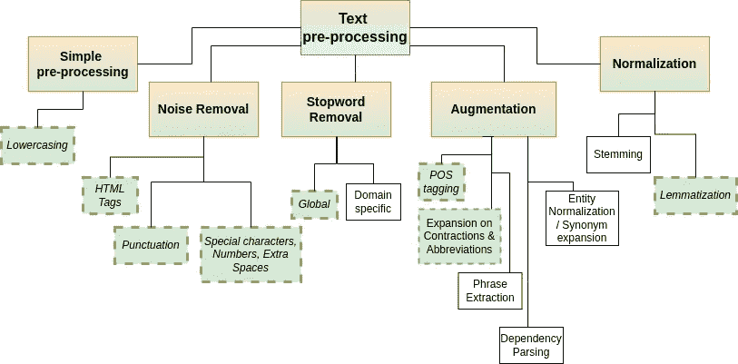
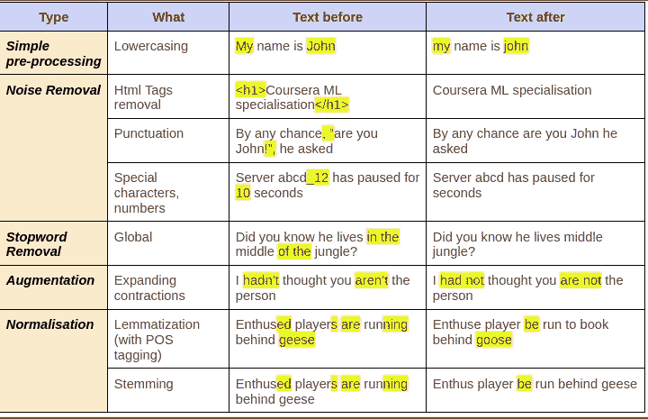
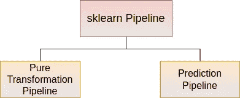
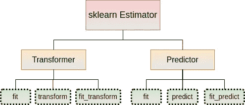

# sklearn 管道中使用 NLTK 的优雅文本预处理

> 原文：<https://towardsdatascience.com/elegant-text-pre-processing-with-nltk-in-sklearn-pipeline-d6fe18b91eb8>

## 使用组件架构快速启动您的 NLP 代码


Max 陈在 [Unsplash](https://unsplash.com?utm_source=medium&utm_medium=referral) 上的照片

典型的 NLP 预测管道从摄取文本数据开始。来自不同来源的文本数据具有不同的特征，在对它们应用任何模型之前，需要进行一定量的预处理。

在本文中，我们将首先回顾预处理的原因，并讨论不同类型的预处理。然后，我们将通过 python 代码了解各种文本清理和预处理技术。出于教学目的，本文中提供的所有代码片段都按其对应的类别进行了分组。由于库的独特性，预处理步骤中存在固有的顺序依赖性，所以请不要忘记参考本文中关于建议执行顺序的部分，以避免大量的痛苦和错误。

虽然代码片段可以在 Jupyter 笔记本中执行和测试，但通过使用统一和定义良好的 API 将它们重构为 python 类(或模块),以便在类似生产的 sklearn 管道中轻松使用和重用，可以实现它们的全部好处。本着这种精神，本文以一个 sklearn 转换器作为结尾，它包含了本文中概述的所有文本预处理技术和一个管道调用示例。

## 为什么要预处理？

NLP 中的所有技术，从简单的单词包到花哨的 BERT，都需要一个共同的东西来表示文本——单词向量。而 BERT 及其同类产品不需要文本预处理，尤其是在使用预训练模型时(例如，它们依赖于单词块算法或其变体，从而消除了对词干提取和词条化等的需要。)，更简单的 NLP 模型极大地受益于文本预处理。

从单词向量的角度来看，每个单词都只是一个数字向量。因此，足球这个词不同于橄榄球。所以踢，被踢和踢是完全不同的。在非常大的语料库上的训练理论上可以为足球/橄榄球以及踢/被踢/踢产生类似的向量表示。但是我们可以马上大大缩短词汇，因为我们知道从我们的角度来看，这些不仅仅是相似的单词，而是相同的单词。类似地，助动词(in，was 是 as 等。)连接词(and since)几乎出现在每个句子中，从 NLP 的角度来看，它对句子没有任何意义。砍掉这些将减少句子/文档的向量维数。

## 文本预处理的类型

下图列出了一长串(但不是全部)非正式的文本处理技术。本文只实现了带虚线边框的绿框中的那些。其中一些不需要介绍，而其他的如实体规范化、依赖解析都是高级的，它们本身就包含某些词法/ML 算法。



图一。文本预处理技术(图片由作者提供)

下表 1 总结了受这些预处理影响的变化。由特定处理引起的更改在“之前”和“之后”列中突出显示。“之后”列中没有突出显示意味着“之前”中突出显示的文本由于预处理而被移除。



表 1。每种文本预处理的影响

## 亲眼目睹这一切

好了，理论到此为止。让我们写一些代码让它做一些有用的事情。与其一次进行一类预处理，不如按顺序进行某些操作。例如，删除 html 标签(如果有的话)作为第一个预处理步骤，然后是与小写结合的词汇化，然后是其他清理

1.  **所需库**

在 Python 3.5+上，除了 numpy 和 pandas 之外，还应该安装以下模块。

```
pip install nltk
pip install beautifulsoup4 
pip install contractions
pip install Unidecode
pip install textblob
pip install pyspellchecker
```

**2。用熊猫加载数据帧**

```
import pandas as pddf = pd.read_csv(“…..”)
text_col = df[“tweets”] #tweets is text column to pre-process
```

**3。下壳体**

```
text_col = text_col.apply(lambda x: x.lower())
```

**4。扩张收缩**

```
text_col = text_col.apply(
    lambda x: " ".join([contractions.fix(expanded_word) for expanded_word in x.split()]))
```

**5。噪声消除**

5.1 删除 html 标签

```
from bs4 import BeautifulSoup
text_col = text_col.apply(
    lambda x: BeautifulSoup(x, 'html.parser').get_text())
```

5.2 删除号码

```
text_col = text_col.apply(lambda x: re.sub(r'\d+', '', x))
```

5.3 用空格替换点

有时文本包含 IP，这样的句点应该替换为空格。在这种情况下，请使用下面的代码。然而，如果需要将句子拆分成标记，那么首先使用带有 punkt 的 nltk 标记化。它理解句号的出现并不总是意味着句子的结束(如 Mr. Mrs. e.g .)，因此会标记化。

```
text_col = text_col.apply(lambda x: re.sub("[.]", " ", x))
```

5.4 删除标点符号

```
# '!"#$%&'()*+,-./:;<=>?@[\]^_`{|}~' 32 punctuations in python string module
text_col = text_col.apply(lambda x: re.sub('[%s]' % re.escape(string.punctuation), '' , x))
```

5.5 去掉双空格

```
text_col = text_col.apply(lambda x: re.sub(' +', ' ', x))
```

**6。替换音调符号(重音字符)**

音调符号被替换为最接近的字符。如果找不到兼容的，默认情况下会在它的位置放一个空格。或者，如果指定了 errors="preserve ",则字符将保持原样

```
from unidecode import unidecode
text_col = text_col.apply(lambda x: unidecode(x, errors="preserve"))
```

**7。错别字纠正**

它有助于在应用许多关键步骤之前纠正拼写，如停用词删除、词条化等。为此，我们将使用 textblob 和 pyspellchecker。使用这些就像 123 一样简单

```
from textblob import TextBlob
text_col = text_col.apply(lambda x: str(TextBlob(x).correct()))
```

**8。移除停用词**

我们将使用 NLTK 来移除停用字词。NLTK 停用词必须通过下载功能下载(与 pip 安装无关)。该下载功能在随后的时间内被忽略。这些文件在 Linux 上通常下载到/use/local/share/nltk_data 或/ <user_home>/local/nltk_data 的适当子文件夹中。在 windows 上一般下载到 C:\ Users \<user_id>\ AppData \ Roaming \ nltk _ data。下载后，它们也会被解压缩</user_id></user_home>

```
import nltk
nltk.download("stopwords")
sw_nltk = stopwords.words('english')# stopwords customaization: Add custom stopwords
new_stopwords = ['cowboy']
sw_nltk.extend(new_stopwords)# stopwords customaization: Remove already existing stopwords
sw_nltk.remove('not')text_col = text_col.apply(
    lambda x: " ".join([ word for word in x.split() if word not in sw_nltk]) )
```

您可以看到停用字词资源必须下载一次。每个资源都有一个名称，并存储在子文件夹 base nltk_data 中。例如，特定于语言的停用词作为单独的文件存储在 corpora 子文件夹下。POS tagger 资源存储在 taggers 子文件夹下，依此类推。本质上，每个资源都有一个资源名称和一个用于存储的子文件夹。我们只能用这个代码片段第一次自动下载

```
def download_if_non_existent(res_path, res_name):
    try:
        nltk.data.find(res_path)
    except LookupError:
        print(f'resource {res_name} not found in {res_path}")
        print("Downloading now ...')
        nltk.download(res_name)download_if_non_existent('corpora/stopwords', 'stopwords')
download_if_non_existent('taggers/averaged_perceptron_tagger', 'averaged_perceptron_tagger')
download_if_non_existent('corpora/wordnet', 'wordnet')
```

当第一次查找某个资源时，它的缺失会触发一个错误，这个错误会被及时捕获并采取适当的措施。

**9。引理化**

词干化和词汇化都将 word 转换为其基本形式。词干是一种快速的基于规则的技术，有时会不准确地截断(词干不足和词干过多)。你可能没有注意到 NLTK 提供了 PorterStemmer 和稍微改进的雪球斯特梅尔。

词汇化是基于词典的技术，比词干法更精确，但稍慢。我们将使用 NLTK 的 WordnetLemmatizer。为此，我们将下载 wordnet 资源。

```
import nltk
nltk.download("wordnet")
from nltk.stem import WordNetLemmatizerlemmatizer = WordNetLemmatizer()
text_col = text_col.apply(lambda x: lemmatizer.lemmatize(x))
```

上面的代码是有效的。但是有一个小问题。WordnetLemmatizer 假设每个单词都是名词。然而有时词性会改变引理。如果不考虑的话，我们会得到有趣的结果

```
lemmatizer.lemmatize("leaves") # outputs 'leaf'
```

“leaves”这个词在词性=名词时变成 leaf，在词性=动词时变成 leave。因此，我们必须为 Lemmatizer 指定词性。下面是我们的做法

```
from nltk.corpus import wordnet
lemmatizer.lemmatize("leaves", wordnet.VERB) # outputs 'leave'
```

太好了！但是我们如何获得一个单词在句子中的词性呢？幸运的是，NLTK 在 pos_tag 函数中内置了这个功能

```
nltk.pos_tag(["leaves"]) # outputs [('leaves', 'NNS')]
```

NLTK 已经将 POS 输出为上面的名词。在 NLTK 行话中，NNS 代表复数名词。然而，NLTK 足够聪明，可以识别出这个单词在正确的上下文中作为句子的一部分出现时是动词，如下所示。

```
sentence = "He leaves for England"
pos_list_of_tuples = nltk.pos_tag(nltk.word_tokenize(sentence))
pos_list_of_tuples
```

上面的代码输出适当的位置，如下所示。

```
[('He', 'PRP'), ('leaves', 'VBZ'), ('for', 'IN'), ('England', 'NNP')]
```

现在，我们可以制定一个策略来使 lemmatize。我们首先使用 NLTK pos_tag()函数来识别词性。然后，我们将 POS 作为参数显式提供给 WordnetLemmatizer.lemmatize()函数。听起来不错。但是有一个小问题。

NLTK pos 标签由 2-3 个字母组成。例如，在 NLTK 中，NN、NNS、NNP 分别代表单数、复数和专有名词，而在 WordNet 中，所有这些名词都用一个由变量 nltk.corpus.wordnet.NOUN 指定的总括词性“n”来表示

我们通过创建一个查找字典来解决这个问题。一个查看来自 NLTK 的细粒度 POS 并映射到 Wordnet 的。实际上，查看 NLTK POS 的第一个字符就足以确定 Wordnet 的等价字符。我们的字典查出来的是这样一些东西:

```
pos_tag_dict = {"J": wordnet.ADJ,
                "N": wordnet.NOUN,
                "V": wordnet.VERB,
                "R": wordnet.ADV}
```

现在让我们使用查找字典进行词汇化

```
sentence = "He leaves for England"
pos_list_of_tuples = nltk.pos_tag(nltk.word_tokenize(sentence))new_sentence_words = []
for word_idx, word in enumerate(nltk.word_tokenize(sentence)):
    nltk_word_pos = pos_list_of_tuples[word_idx][1]
    wordnet_word_pos = tag_dict.get(nltk_word_pos[0].upper(), None)
    if wordnet_word_pos is not None:
        new_word = lemmatizer.lemmatize(word, wordnet_word_pos)
    else:
        new_word = lemmatizer.lemmatize(word)

    new_sentence_words.append(new_word)new_sentence = " ".join(new_sentence_words)
print(new_sentence)
```

您会注意到我们的 pos 标签查找字典非常简单。我们根本不提供到许多 POS 标签的映射。在这种情况下，如果键不存在，我们可能会得到一个 KeyError。我们在 dictionary 上使用 get 方法，如果缺少 pos 键，则返回默认值(None)。然后，我们将相应的 wordnet pos 传递给 lemmatize 函数。最终输出将是:

```
He leave for England tomorrow
```

那太好了。让我们试试另一个句子，比如“蝙蝠在夜间飞行”。惊喜惊喜！我们得到“**蝙蝠**正在夜间飞行”。显然，当单词以大写字母开头时，lemmatizer 不会删除复数。如果我们将其小写为“bats”，那么我们将得到“bat”作为 lemmatize 过程的输出。有时需要这种功能。因为我们的例子很简单，所以在词汇化之前，让我们把每个句子都小写。

**关于引理化的一个注记**

词汇化不是一个强制性的过程。我们可以使用这些经验法则来决定我们是否需要术语化

1.  TF-IDF、Word2Vec 等简单的单词矢量化技术受益于词汇化。
2.  主题建模受益于术语化
3.  情感分析有时会受到词条泛化的影响，当然也会因为删除某些停用词而受到影响
4.  经验表明，对句子进行词汇化会降低 BERT 等中预先训练的大型语言模型的准确性。

## 建议的执行顺序

预处理没有固定的顺序。但是对于许多简单的场景，这里有一个建议的执行顺序。这必须在语料库中的每个文档上完成。回想一下，一个语料库由许多文档组成。反过来，每个文档是一个或多个句子的集合。例如，df['tweets']是熊猫数据帧中的一列。每一行 df['tweets']本身可以有很多句子。

1.  删除 HTML 标签
2.  替换音调符号
3.  扩大收缩
4.  删除号码
5.  错别字纠正
6.  复合词汇化过程
7.  停用词移除

**前&后**步骤的复合符号化过程

对每个文档中的每个句子执行以下步骤:

1.  删除除句点以外的特殊字符
2.  小写字母盘
3.  把…按屈折变化形式进行归类
4.  删除每个文档中的句点和双空格

## 类中的完整代码

既然我们已经完整地介绍了所有部分，让我们把它们放在一起，为文本预处理创建一个单独的完整的类。

首先是进口

```
import string
import re
import contractions

import nltk
from nltk.corpus import stopwords
from nltk.tokenize import word_tokenize
from nltk.corpus import wordnet
from nltk.stem import WordNetLemmatizer

from bs4 import BeautifulSoup
from textblob import TextBlob
from unidecode import unidecode
```

接下来，是对文本进行词汇化的独立函数

```
def lemmatize_pos_tagged_text(text, lemmatizer, post_tag_dict):
  sentences = nltk.sent_tokenize(text)
  new_sentences = []

  for sentence in sentences:
    sentence = sentence.lower()
    new_sentence_words = [] #one pos_tuple for sentence
    pos_tuples = nltk.pos_tag(nltk.word_tokenize(sentence)) 

    for word_idx, word in enumerate(nltk.word_tokenize(sentence)):
      nltk_word_pos = pos_tuples[word_idx][1]
      wordnet_word_pos = pos_tag_dict.get(
                          nltk_word_pos[0].upper(), None)
      if wordnet_word_pos is not None:
        new_word = lemmatizer.lemmatize(word, wordnet_word_pos)
      else:
        new_word = lemmatizer.lemmatize(word)

      new_sentence_words.append(new_word)

    new_sentence = " ".join(new_sentence_words)
    new_sentences.append(new_sentence)

  return " ".join(new_sentences)
```

最后是一个做所有文本预处理的类

```
def download_if_non_existent(res_path, res_name):
  try:
    nltk.data.find(res_path)
  except LookupError:
    print(f'resource {res_path} not found. Downloading now...')
    nltk.download(res_name)class NltkPreprocessingSteps:
  def __init__(self, X):
    self.X = X
    download_if_non_existent('corpora/stopwords', 'stopwords')
    download_if_non_existent('tokenizers/punkt', 'punkt')
    download_if_non_existent('taggers/averaged_perceptron_tagger',
                             'averaged_perceptron_tagger')
    download_if_non_existent('corpora/wordnet', 'wordnet')
    download_if_non_existent('corpora/omw-1.4', 'omw-1.4')

    self.sw_nltk = stopwords.words('english')
    new_stopwords = ['<*>']
    self.sw_nltk.extend(new_stopwords)
    self.sw_nltk.remove('not')

    self.pos_tag_dict = {"J": wordnet.ADJ,
                    "N": wordnet.NOUN,
                    "V": wordnet.VERB,
                    "R": wordnet.ADV}

    # '!"#$%&'()*+,-./:;<=>?@[\]^_`{|}~' 32 punctuations in python
    # we dont want to replace . first time around
    self.remove_punctuations = string.punctuation.replace('.','')

  def remove_html_tags(self):
    self.X = self.X.apply(
            lambda x: BeautifulSoup(x, 'html.parser').get_text())
    return self

  def replace_diacritics(self):
    self.X = self.X.apply(
            lambda x: unidecode(x, errors="preserve"))
    return self

  def to_lower(self):
    self.X = np.apply_along_axis(lambda x: x.lower(), self.X)
    return self

  def expand_contractions(self):
    self.X = self.X.apply(
            lambda x: " ".join([contractions.fix(expanded_word) 
                        for expanded_word in x.split()]))
    return self

  def remove_numbers(self):
    self.X = self.X.apply(lambda x: re.sub(r'\d+', '', x))
    return self

  def replace_dots_with_spaces(self):
    self.X = self.X.apply(lambda x: re.sub("[.]", " ", x))
    return self

  def remove_punctuations_except_periods(self):
    self.X = self.X.apply(
                 lambda x: re.sub('[%s]' %
                  re.escape(self.remove_punctuations), '' , x))
    return self

  def remove_all_punctuations(self):
    self.X = self.X.apply(lambda x: re.sub('[%s]' %
                          re.escape(string.punctuation), '' , x))
    return self

  def remove_double_spaces(self):
    self.X = self.X.apply(lambda x: re.sub(' +', ' ', x))
    return self

  def fix_typos(self):
    self.X = self.X.apply(lambda x: str(TextBlob(x).correct()))
    return self

  def remove_stopwords(self):
    # remove stop words from token list in each column
    self.X = self.X.apply(
            lambda x: " ".join([ word for word in x.split() 
                     if word not in self.sw_nltk]) )
    return self

  def lemmatize(self):
    lemmatizer = WordNetLemmatizer()
    self.X = self.X.apply(lambda x: lemmatize_pos_tagged_text(
                           x, lemmatizer, self.post_tag_dict))
    return self

  def get_processed_text(self):
    return self.X
```

上面的类只不过是以前编写的函数的集合。注意，每个方法都返回对 self 的引用。这是为了以流畅的方式实现方法的无缝链接。通过查看下面的用法，您将会很欣赏它:

```
txt_preproc = NltkPreprocessingSteps(df['tweets'])
processed_text = \
    txt_preproc \
    .remove_html_tags()\
    .replace_diacritics()\
    .expand_contractions()\
    .remove_numbers()\
    .fix_typos()\
    .remove_punctuations_except_periods()\
    .lemmatize()\
    .remove_double_spaces()\
    .remove_all_punctuations()\
    .remove_stopwords()\
    .get_processed_text()
```

## 将代码转换到 sklearn 转换器

现在，我们已经看到了最常用的文本预处理步骤的代码片段，是时候将它们放入 sklearn 转换器中了。

sklearn 转换器旨在执行数据转换，无论是插补、操作还是其他处理，可选地(并且最好)作为复合 ML 管道框架的一部分，具有其熟悉的 fit()、transform()和 predict()生命周期范例，这是一种非常适合我们的文本预处理和精度生命周期的结构。但是在我们到达那里之前，一个快速的 sklearn 生命周期初级读本是合适的。开始了。

## 世界上最短的 sklearn 生命周期入门

在 sklearn 行话中，管道是一组连续的执行步骤。这些步骤可以属于两个类别之一——转换、ML 预测。管道可以是纯转换管道或预测管道。

一个纯转换管道只有为顺序执行设置的转换器。预测管道可以在其末端包含可选的转换器和强制的单个预测器。



图二。两种类型的管道(图片由作者提供)

一个转换有三个主要操作——*拟合*、*转换*和*拟合 _ 转换*。预测器拟合方法也有三个类似的操作——*拟合*、*预测*和*拟合 _ 预测*。在这两种情况下，*适合*的方法就是学习发生的地方。学习是根据类属性来捕获的，这些类属性可以分别由变换器和预测器用于*变换*和*预测*。



图 3。转换器和预测器操作(图片由作者提供)

典型的监督学习场景包括两个步骤——训练和推理。在训练阶段，用户在管道上调用 fit()。在推断阶段，用户在管道上调用 predict()。

> sklearn 在训练和推理阶段的两个最重要的翻译:
> 
> 1.管道上的 fit()调用被转换为管道中所有转换器组件上的顺序 fit()和 transform()调用，以及最终预测器组件(如果存在)上的单个 fit()。
> 
> 2.predict()调用被转换为管道中所有转换器上的顺序 transform()调用(当转换器存在时)，最后是管道中最后一个组件上的单个 predict()，如果调用预测，该组件必须是预测器。

呜哇！恭喜你不费吹灰之力走了这么远。我们已经准备好向成熟的文本预处理转换器迈出最后一步。它来了。

## 使 NLTK 预处理步骤适应 sklearn 转换器 API

这最后一节将是小菜一碟，因为在前面关于 sklearn 生命周期的章节中有足够的关于 sklearn 生命周期的背景知识。我们现在要做的就是将 NLTK 预处理步骤包装成 *TransformerMixin* 的 sklearn 的子类。

```
from sklearn.base import BaseEstimator, TransformerMixin
class NltkTextPreprocessor(TransformerMixin, BaseEstimator):
  def __init__(self):
    pass

  def fit(self, X):
    return self

  def transform(self, X):
    txt_preproc = NltkPreprocessingSteps(X.copy())
    processed_text = \
            txt_preproc \
            .remove_html_tags()\
            .replace_diacritics()\
            .expand_contractions()\
            .remove_numbers()\
            .fix_typos()\
            .remove_punctuations_except_periods()\
            .lemmatize()\
            .remove_double_spaces()\
            .remove_all_punctuations()\
            .remove_stopwords()\
            .get_processed_text()

    return processed_text
```

现在，您可以用熟悉的标准方式在任何 sklearn 管道中定制 NLTK 预处理转换器。下面是它在纯转换管道和预测管道中的两个用法示例

```
from sklearn.model_selection import train_test_split
from sklearn.pipeline import Pipeline
from sklearn.feature_extraction.text import TfidfTransformer
from sklearn.naive_bayes import BernoulliNBX = pd.read_csv("....")X_train, X_test, y_train, y_test = train_test_split(X['tweets'], y, random_state=0)pure_transformation_pipeline = Pipeline(steps=[
           ('text_preproc', NltkTextPreprocessor()), 
           ('tfidf', TfidfTransformer())])
pure_transformation_pipeline.fit(X_train)# Call fit_transform if we only wanted to get transformed data
tfidf_data = pure_transformation_pipeline.fit_transform(X_train)prediction_pipeline = Pipeline(steps=[
           ('text_preproc', NltkTextPreprocessor()), 
           ('tfidf', TfidfTransformer()),
           ('bernoulli', BernoulliNB())])
prediction_pipeline.fit(X_train)y_pred = prediction_pipeline.predict(X_test)
```

就是这样，伙计们！我们的 sklearn 集成已经完成。现在我们可以获得管道的全部好处——交叉验证、防止数据泄露、代码重用等等。

在本文中，我们开始以通常的方式处理基于 NLTK 的文本预处理——通过编写通常在 Jupyter Notebook 单元中执行的小代码片段，将它们重构为函数，过渡到可重用的类，并使我们的代码适应行业标准的可重用 API 和组件。

为什么我们要做这一切？原因其实很简单；由数据科学家编写的代码终究是代码，并且在维护、修订生命周期中伴随着价格标签(拥有成本)。引用马丁·福勒的话——“任何人都可以编写计算机能够理解的代码。优秀的程序员编写人类能够理解的代码”。具有标准使用模式的好代码使数据科学家(人类)容易理解和维护 ML 管道，从而降低拥有成本。有了适用于我们代码的标准 API 适配器，即使没有 ML 背景的软件工程师也可以轻松地使用它，推动了我们刚刚编写的基于 NLTK 的文本预处理代码在公司范围内的采用，更不用说 ROI 了。欢迎来到架构优雅的文本预处理世界。