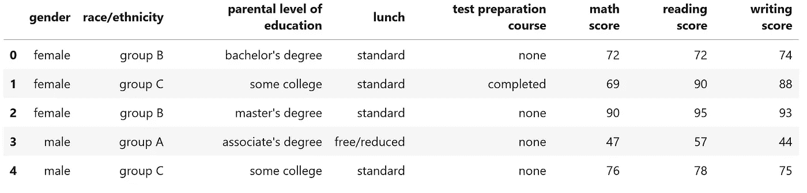

# 在 Web 上嵌入交互式 Python 绘图

> 原文：<https://towardsdatascience.com/embedding-interactive-python-plots-on-the-web-84ceab57e417>

## 关于如何使用 Plotly Chart Studio 和 Datapane 在 web 上共享 Python 绘图的指南


杰森·库德里特在 [Unsplash](https://unsplash.com?utm_source=medium&utm_medium=referral) 上拍摄的照片

# 介绍

数据科学管道中最重要的步骤之一是数据可视化。事实上，由于数据可视化，数据科学家能够快速收集关于他们可用的数据和任何可能的异常的见解。

传统上，数据可视化包括创建静态图像和汇总统计数据，然后使用 Python 和 Matplotlib 等库将其导出为图像(如 PNG、JPG、SVG)。虽然，由于 Plotly、Bokeh 或 Altair 等库的发展，现在可以创建更多的[交互式可视化](/interactive-data-visualization-167ae26016e8)甚至[在线仪表盘](/interactive-dashboards-for-data-science-51aa038279e5)，可以与同事和股东共享。

一旦完成一个项目，通常有两种不同的方法可以用来与任何感兴趣的人分享您的可视化和结果:

*   创建某种形式的[数据驱动演示](/creating-online-data-driven-presentations-6b25fc626072)。
*   创建一个项目摘要内部网页，其中嵌入了所创建的任何交互式绘图。

在本文中，我们现在将探索第二种方法，提出两种可能的解决方案: **Plotly Chart Studio** 和 **Datapane** 。本文使用的所有代码都可以在我的 GitHub 账户上公开获得，网址是[这个链接](https://github.com/pierpaolo28/Data-Visualization/blob/master/Online%20Python%20Embeds/online-python-plots.ipynb)。

# Plotly 图表工作室

[Plotly](https://github.com/plotly) 是一个基于 plotly.js 构建的开源 Python 库，使用 Plotly，你可以使用 Python、R、Julia 和 Javascript 等编程语言创建交互式图形和仪表盘。

为了创建易于共享的图表，Plotly 提供了一个[图表工作室服务](https://chart-studio.plotly.com/create/#/)。使用此服务，您可以像往常一样通过编程创建一个图，然后将其添加到您的在线集合中，或者您可以通过在线用户界面上传您的数据，然后从那里创建您的图表(完全不需要编码)。使用 Plotly Chart Studio 创建的一些绘图示例可在[链接获得。](https://chart-studio.plotly.com/feed/#/)

对于这个例子，我们将使用 Python 和免费提供的 [Kaggle 学生考试成绩数据集](https://www.kaggle.com/datasets/satwikverma/students-performance-in-exams) [1]的编程选项。如果您也有兴趣探索用户界面来创建您的图表，Plotly 在[此链接提供了一个指南教程列表。](https://plotly.com/chart-studio-help/tutorials/)

为了开始使用 Plotly Chart Studio，我们需要首先[创建一个帐户](https://chart-studio.plotly.com/Auth/login/?action=signin#/)，然后使用以下命令安装 Python 库:

```
pip install chart_studio
```

在这一点上，我们需要保存我们的帐户 API 密钥，以便能够将使用 Python 创建的图表共享到我们的在线帐户中。这可以通过登录你的账户，进入*设置*，然后 *API 键*找到。我们现在准备开始我们的数据探索性分析。

## 数据可视化

首先，我们需要导入所有必要的依赖项，并检查头部的[学生在考试数据集](https://www.kaggle.com/datasets/satwikverma/students-performance-in-exams)中的表现(图 1)。



图 1:学生在考试数据集中的表现(图片由作者提供)。

使用下面的代码片段，我们可以创建一个 3D 散点图，并将其保存到我们的在线集合中，命名为 ***3d_embed_ex*** (记得添加您之前从您的帐户设置中复制的 Plotly Chart Studio 用户名和 API 密钥)。

进入你的 Plotly Chart Studio 账户和你的*我的文件*部分，你应该能够看到你刚刚用 Python 创建的图表。点击 *Share* 然后点击 *Embed* 标签，你就能看到 ***iframe*** 和 ***HTML*** 代码，你可以用它们在网络上的任何地方分享你的互动情节(如下图 2 所示)。

图 2: 3D 散点图 Plotly Chart Studio Embed(图片由作者提供)。

# 数据面板

Datapane 是一个 Python 库，旨在通过 web 嵌入、自动生成的 HTML 文件等更容易地共享任何形式的数据分析。使用 Datapane 的主要优势之一是它支持许多数据可视化库，例如:*【matplotlib】**【plotly】**bokeh**pandas*等等。此外，使用 Datapane，不仅可以共享单个图形，还可以共享图形集合和 *Latex/Markdown* 文本。

为了开始使用 Datapane，我们首先需要[创建一个免费帐户](https://datapane.com/accounts/signup/)并以与 Plotly Chart Studio 相同的方式获取我们的 API 密钥。然后可以使用以下命令安装 Python 库:

```
pip install datapane
```

## 数据可视化

为了演示如何使用 Datapane，将再次使用[学生在考试数据集](https://www.kaggle.com/datasets/satwikverma/students-performance-in-exams)中的表现(如图 1 所示)。然后使用下面的代码片段，可以创建一个 Datapane 嵌入(记得添加您之前从您的帐户设置中复制的 Datapane API 密钥)。此外，使用 ***保存*** 选项，还可以创建您的报告的 HTML 文件版本，然后您可以与任何您想要的人共享，而不必在网络上公开您的报告。

为了分享你新创建的报告，你可以进入你的数据面板账户，点击*我的报告*，选择你感兴趣的报告，点击*分享*(图 3)。

图 3:嵌入 3D 散点图数据面板(图片由作者提供)。

通过添加更多的页面和可视化，可以创建更复杂的报告(图 4)。在下面的示例中，创建了一个两页报表:一页显示数据集的前五行，另一页显示三维散点图。

图 4: 2 页数据面板嵌入(图片由作者提供)。

# 结论

在本文中，我们探讨了 Plotly Chart Studio 和 Datapane 作为在 web 上嵌入交互式图表的两种可能的选择。创建交互式图表不仅可以用于准备和探索数据，还可以用于创建关于机器学习模型的可视化和界面。用于这类任务的两个最常见的库是 Streamlit 和 [Gradio。](/gradio-graphical-interfaces-for-machine-learning-models-fd4880964f8f)关于这个话题的更多信息，可以在我的[“机器学习可视化”文章](/machine-learning-visualization-fcc39a1e376a)中找到。

# 联系人

如果你想了解我最新的文章和项目[，请通过媒体](https://pierpaoloippolito28.medium.com/subscribe)关注我，并订阅我的[邮件列表](http://eepurl.com/gwO-Dr?source=post_page---------------------------)。以下是我的一些联系人详细信息:

*   [领英](https://uk.linkedin.com/in/pier-paolo-ippolito-202917146?source=post_page---------------------------)
*   [个人网站](https://pierpaolo28.github.io/?source=post_page---------------------------)
*   [中等轮廓](https://towardsdatascience.com/@pierpaoloippolito28?source=post_page---------------------------)
*   [GitHub](https://github.com/pierpaolo28?source=post_page---------------------------)
*   [卡格尔](https://www.kaggle.com/pierpaolo28?source=post_page---------------------------)

# 文献学

[1]“学生在考试中的表现”(SATWIK VERMA，License[CC0:Public Domain](https://creativecommons.org/publicdomain/zero/1.0/))。访问:[https://www . ka ggle . com/datasets/satwikverma/students-performance-in-examings](https://www.kaggle.com/datasets/satwikverma/students-performance-in-exams)