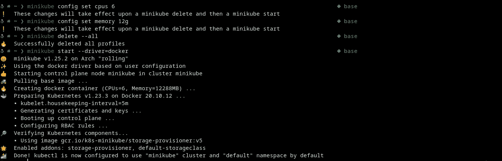
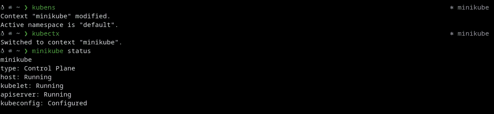
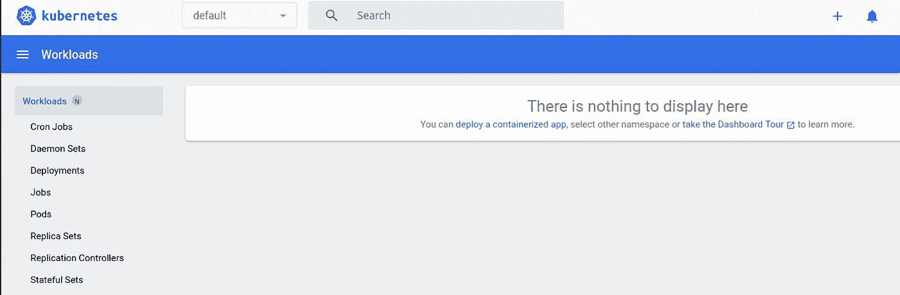
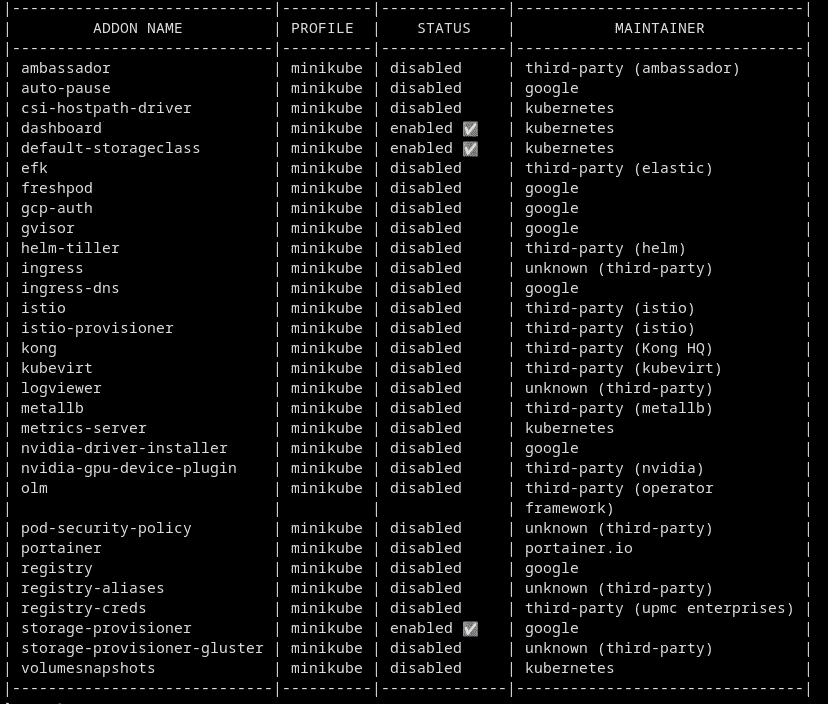
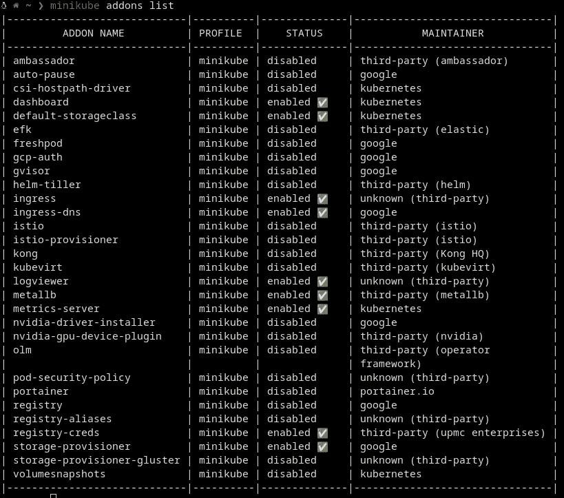
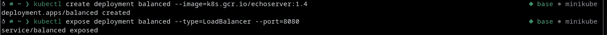
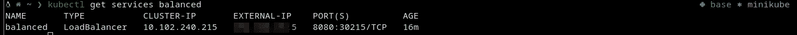
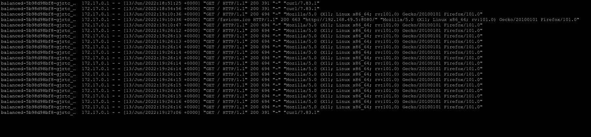
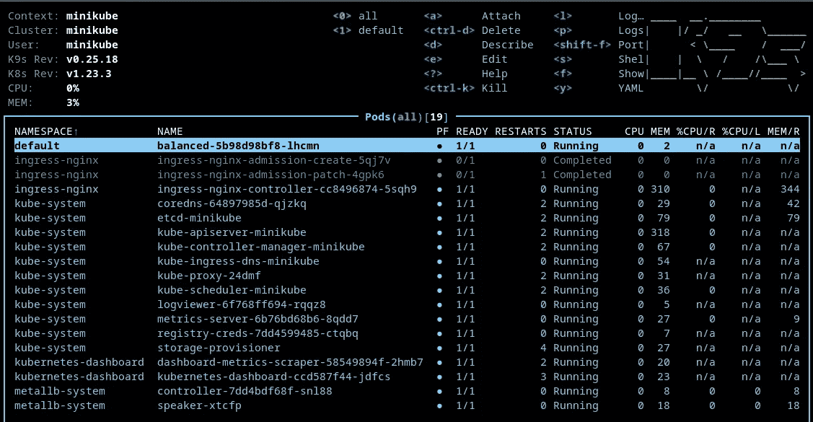
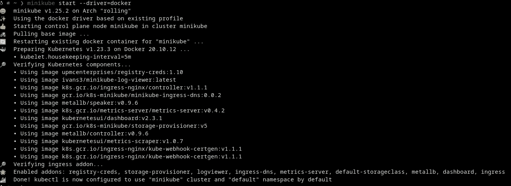

# 拥抱用于机器学习的 Kubernetes:设置[1/3]

> 原文：<https://towardsdatascience.com/embracing-kubernetes-for-machine-learning-setup-1-3-51c02686edfb>

## 通过 Minikube 为本地开发设置 Kubernetes

害怕它，逃避它，库伯内特还是来了。熟悉最流行的容器编排工具在任何现代机器学习环境(或任何软件开发环境)中都是不可避免的。


图片来源: [Pixabay](https://pixabay.com/photos/container-ship-container-transport-6631117/)

众所周知，Kubernetes 是一种大多数开发人员都厌恶的工具，并且很难理解和利用。不管它值不值得，它真的会让人感到无法抗拒——最大限度地发挥 Kubernetes 潜力的体验。世界上能够真正称得上“*驯服库伯内特*的人”的开发者并不多。然而，人们不需要了解 Kubernetes 或任何工具的每一件事情，就可以有效地使用它。掌握任何工具都是需要时间，练习和坚持的。这篇文章(*3 部分系列*的一部分)从在 Kubernetes 集群上部署机器学习模型的角度对 Kubernetes 的世界进行了实际介绍。

> **NB** :虽然重点可能是从模型部署的角度来看，但是这篇文章中探索的概念是如此的通用，以至于没有理由为什么这个逻辑不能应用于任何容器化应用程序的部署。本系列的先决条件是对通过 Docker 实现 app 容器化有一些基本的了解。这篇[关于应用容器化的早期文章](https://medium.com/python-data/how-to-deploy-tensorflow-2-0-models-as-an-api-service-with-fastapi-docker-128b177e81f3)推荐给很少或没有 Docker 经验的读者。

以下部分的攻击计划是:

1.  概述一下为什么需要 Kubernetes
2.  安装 Minikube 作为我们的本地 Kubernetes 集群
3.  部署一个基本应用程序来测试新集群

## Kubernetes (K8s)到底有什么模糊之处？

Kubernetes 是 Google 的开源产品，用于容器化应用的自动化部署和扩展。在容器中运输应用程序是目前软件部署的黄金标准，Kubernetes 提供了一种非常有趣的方式，以可伸缩和健壮的方式自动化容器。

> 名字 **Kubernetes** 源自希腊语，意为舵手或领航员。 **K8s** 是对“ **K** ”和“ **s** ”之间的八个字母进行计数得到的缩写。

在当前的容器部署时代，持续监控容器以便采取必要的措施来避免停机是至关重要的。例如，一个容器一旦死亡，就需要立即启动新的容器。有人可能会说，一种幼稚的方法是编写某种形式的自动化脚本来完成这类操作。然而，这些应用程序中的大多数都有如此多的移动微型部件，这样的方法只会导致大量的麻烦，最终会失败。

Kubernetes 通过消除对编排的需求，为自动管理和运行分布式应用程序或系统提供了一个更健壮、更有弹性的框架。Kubernetes 提供了一些令人兴奋的功能，如；

*   自动自愈
*   负载平衡
*   秘密管理
*   自动化推出和回滚
*   存储编排
*   自动装箱

让我们深入 Kubernetes 的一些高级组件，了解可伸缩性的概念是从哪里来的？

## 库伯内特斯的基本成分

最核心的是，使用 Kubernetes 的部署会导致 Kubernetes 集群的创建。但是在这个合成的集群中有什么呢？

这个集群由运行容器化应用程序的 ***节点*** (一组工作机)组成。每个 Kubernetes 集群至少有一个节点。这些节点主要托管***pod***，它们本质上是一组运行的容器。这些节点和单元由 ***控制平面*** 管理，该控制平面负责以这样的方式管理节点和单元，即实现并保持用户定义的期望状态。实际上，人们可以将 Kubernetes 视为一个系统，其中用户提供一些所需的配置，控制平面调度各种节点，容器 pod 在这些节点上旋转以运行各种工作负载，从而以自动化的方式实现和维护预期的状态。这里的卖点是，用户可以拥有无限数量的运行各种应用程序的节点，所有这些应用程序都由群集自动管理。某个应用程序的实例在某个节点上崩溃了？没问题！另一个会自动启动以取代死去的那个。这个神奇的工具有这么多，但我希望你现在明白了。现在，让我们进入有趣的部分，在本地设置一个！

## 通过 Minikube 在本地设置 Kubernetes

Minikube 是一个工具，它能够以一种简单的方式在本地创建 Kubernetes 集群。顾名思义，Minikube 只是一个轻量级版本，其中部署的集群是一台个人计算机上的单个节点。

> 本系列假设读者将在类似 UNIX 的系统上安装 Minikube，如 Linux 发行版或 Apple Macs。只能访问 Windows 系统的读者应该使用 **WSL 2** 来跟进。本系列是在一个 Linux 发行版上完成的，使用 VSCode 作为 IDE。所有的包都很容易从[**【AUR】**(ARCH 用户库)](https://aur.archlinux.org/packages)安装。

## 安装必备工具

*   安装[*Docker CLI*](https://docs.docker.com/engine/install/#server)*(Mac 用户可以使用 [*自制*](https://formulae.brew.sh/formula/docker) )*
*   *安装 [*kubectl*](https://kubernetes.io/docs/tasks/tools/)*
*   *安装 [minikube](https://minikube.sigs.k8s.io/docs/start/) (Mac 用户可以使用 [*自制*](https://formulae.brew.sh/formula/minikube#default) *)**
*   *安装 [*kubectx*](https://github.com/ahmetb/kubectx)*
*   **加成*:为 Kubernetes 安装值得注意的 VS 代码扩展( [*Kubernetes*](https://marketplace.visualstudio.com/items?itemName=ms-kubernetes-tools.vscode-kubernetes-tools) ，[*Kubernetes*](https://marketplace.visualstudio.com/items?itemName=kubescape.kubescape))。*

## *配置 Minikube 集群*

*成功安装 Minikube 后，就可以配置集群了。让我们首先为这个 Minikube 集群将要驻留的虚拟机定义一些内存和 CPU 分配。这些分配是任意的，因此根据与您的可用资源相匹配的任何所需配置进行分配:*

```
***minikube config set cpus** **6** 
**minikube config set memory 12g
minikube delete --all***
```

*由于我们选择 docker 作为我们集群的驱动程序，因为我们将构建一些 docker 容器，所以我们可以用以下内容启动我们的 Minikube 集群:*

```
***minikube start --driver=docker***
```

**

*设置 minikube 集群配置并启动它(来源:作者)*

*日志显示一切正常，Minikube 集群已经启动并运行。现在是检查先前安装的`kubectx`和`kubens`是否能与新集群交互的好时机。对于名称空间来说，默认选项现在很好，因为我们还没有配置任何名称空间。我们只有一个集群，因此切换集群上下文仅限于创建的 Minikube 集群。*

**

*通过 kubens 选择名称空间(来源:作者)*

*Minikube 还部署了一个仪表板，用于可视化地概述所部署的集群。用户可以使用以下命令签出该仪表板:*

```
***minikube dashboard***
```

**

*Kubernetes 仪表板(来源:作者)*

## *启用 Minikube 加载项*

*一切正常后，现在让我们启用一些附加组件来改善我们的用户 Kubernetes 的本地开发体验。该命令提供了许多附加组件:*

```
***minikube addons list***
```

**

*可用加载项(来源:作者)*

*大多数用例并不需要每个插件，所以让我们启用并配置一些我认为非常有用和实用的插件。我鼓励读者深入探究它们，并启用他们喜欢的内容。启用 Minikube 附加组件也很简单；*

```
***minikube addons enable <NAME OF ADDON>***
```

*   ****日志查看器*** :日志对于监控部署至关重要。有一个漂亮的插件，允许用户在一个网页上显示集群中的所有实时日志(部署在`http:**<YOUR_MINIKUBE_IP>**:32000`)和许多其他日志相关的实用程序。*

```
*❯ **minikube addons enable logviewer**▪ Using image ivans3/minikube-log-viewer:latest*
```

*   ****metrics-server* :** 这个附加组件提供了度量仪表板，有助于可视化已部署应用程序的资源消耗。它还可以很好地与 Kubernetes 仪表板集成。*

```
*❯ **minikube addons enable metrics-server **                                                                                                
    ▪ Using image k8s.gcr.io/metrics-server/metrics-server:v0.4.2
🌟  The 'metrics-server' addon is enabled*
```

*   ****入口* :** 在某种形式的入口控制器上部署应用是很常见的。这个插件也支持入口控制器。它只是部署一个 Nginx 入口控制器，通过一个`Nodeport`服务将分配给集群的 IP 指向这个控制器。*

```
*❯ **minikube addons enable ingress**       
    ▪ Using image k8s.gcr.io/ingress-nginx/kube-webhook-certgen:v1.1.1
    ▪ Using image k8s.gcr.io/ingress-nginx/controller:v1.1.1
    ▪ Using image k8s.gcr.io/ingress-nginx/kube-webhook-certgen:v1.1.1
🔎  Verifying ingress addon...
🌟  The 'ingress' addon is enabled*
```

*   ****ingress-dns*:**Nginx Ingress 控制器现在将流量定向到新集群的 IP，让我们启用此插件，因为 Ingress 在 DNS 上工作，它将解析为分配给 Minikube 的 IP，并在 Kubernetes 集群中充当 DNS 服务。如果没有这个附加组件，任何针对每个服务的*DNS 调用都将失败，除非显式添加到主机上的`/etc/hosts`文件中。对于不喜欢篡改主机文件的读者来说，通过遵循[官方指南](https://minikube.sigs.k8s.io/docs/handbook/addons/ingress-dns/)，可以很容易地设置任何想要的 DNS 配置。**

```
*❯ **minikube addons enable ingress-dns **                                                                                                                                            
    ▪ Using image gcr.io/k8s-minikube/minikube-ingress-dns:0.0.2
🌟  The 'ingress-dns' addon is enabled*
```

*   ****registry-creds***:在主流云提供商的私有容器注册表中托管应用程序是相当常见的。该插件允许用户配置本地 Minikube 集群，以访问来自这些云提供商的私有注册表中的映像。目前，AWS、GCP、Docker、Azure 的容器注册中心都得到支持，这对于大多数用例来说已经足够了。使用以下命令配置任何选择注册表(本系列将使用 Docker 注册表):*

```
*❯ **minikube addons configure registry-creds**Do you want to enable AWS Elastic Container Registry? [y/n]: nDo you want to enable Google Container Registry? [y/n]: nDo you want to enable Docker Registry? [y/n]: y
-- Enter docker registry server url: [https://hub.docker.com/](https://hub.docker.com/)
-- Enter docker registry username: **<YOUR USERNAME>**
-- Enter docker registry password: **<YOUR PASSWORD>**Do you want to enable Azure Container Registry? [y/n]: n
✅  registry-creds was successfully configured*
```

*设置正确的注册表后，启用附加组件本身:*

```
*❯ **minikube addons enable registry-creds**
    ▪ Using image upmcenterprises/registry-creds:1.10
🌟  The 'registry-creds' addon is enabled*
```

*   ***metallb:** 云提供商为*负载平衡器*服务(来自外界的网络访问)分配 IP，但是我们的私有和本地集群呢？这就是这个漂亮的附加组件的用武之地。它将负责为集群中各种定义的服务分配 IP。让我们通过这个命令来启用它；*

```
*❯ **minikube addons enable metallb**       
    ▪ Using image metallb/speaker:v0.9.6
    ▪ Using image metallb/controller:v0.9.6
🌟  The 'metallb' addon is enabled*
```

*即使启用了 metallb，它也无法找到可以分配给服务的 IP 范围。我们需要给它这个范围的 IP。首先，检查群集的 IP，通过以下方式了解一个合适的范围:*

```
*❯ **echo $(minikube ip)**                                                                                                                                                            
XXX.XXX.XX.2*
```

*有了这个 IP 地址，我决定从`XXX.xxx.xx.5`到`xxx.xxx.xx.55`给出一个 50 的范围，作为负载平衡器服务应该分配到的范围*。该范围是任意的，因此指定任何所需的范围。**

```
*❯ **minikube addons configure metallb **                                                                                                                                             
-- Enter Load Balancer Start IP: XXX.XXX.XX.5
-- Enter Load Balancer End IP: XXX.XXX.XX.55                                                                                                                             
    ▪ Using image metallb/controller:v0.9.6
    ▪ Using image metallb/speaker:v0.9.6
✅  metallb was successfully configured*
```

*砍！我知道设置这些东西可能是乏味和机械的，但我们现在已经完成了设置我们新的闪亮 Minikube 集群的所有螺栓和螺母。最后看一下附加组件列表，现在应该会显示已经成功启用的附加组件。是时候开始在这个新集群上进行一些部署了！*

**

*Minikube 插件启用的最终状态(来源:作者)*

## *在新集群上测试延迟*

*我们经历的这些麻烦没有白费。让我们对一些基本应用程序进行一些快速部署，以检查我们的新系统是否如预期那样工作。*

```
***kubectl create deployment balanced --image=k8s.gcr.io/echoserver:1.4**
**kubectl expose deployment balanced --type=LoadBalancer --port=8080***
```

**

*使用 kubectl 在默认名称空间中创建名为“balanced”的部署(来源:作者)*

*根据日志，echoserver 演示应用程序被部署(部署名为" *balanced"* )并在 8080 上作为"*负载平衡器*"类型的服务公开。要获得分配的 IP，只需检查此部署的服务*

```
***kubectl get services balanced***
```

**

*正在检查为公开的平衡负载平衡器服务分配的外部 IP(来源:作者)*

*从给定的信息中，请注意`EXTERNAL-IP`部分是为此部署分配的 IP。与公开部署的端口相结合，给出了与部署的应用程序进行外部交互的完整 URL。让我们通过发出 get 请求来查询这个应用程序。我使用了`curl`，但是任何请求工具甚至浏览器都可以正常工作。记住`**EXTERNAL-IP:PORT**`发送外部 URL！*

```
*❯ **curl <YOUR-ASSIGNED-EXTERNAL-IP>:8080**
CLIENT VALUES:
client_address=172.17.0.1
command=GET
real path=/
query=nil
request_version=1.1
request_uri=[http://](http://192.168.49.2:8080/)**<YOUR-ASSIGNED-EXTERNAL-IP>**[:8080/](http://192.168.49.2:8080/)SERVER VALUES:
server_version=nginx: 1.10.0 - lua: 10001HEADERS RECEIVED:
accept=*/*
host=**<YOUR-ASSIGNED-EXTERNAL-IP>**:8080
user-agent=curl/7.83.1
BODY:
-no body in request-%*
```

*部署的应用程序似乎正在完成它的工作，因为它只是将发送到该服务器的所有内容回显给用户。*

*此外，可以在浏览器中从所有名称空间或所选名称空间的实时网页访问先前启用的日志附加组件。*

```
*[http://](http://192.168.49.2:32000/)**<YOUR-****MINIKUBE****-IP>**[:32000/](http://192.168.49.2:32000/)*
```

**

*从日志查看器插件检查日志(来源:作者)*

*另一个与 Minikube 配合得非常好的实用程序是`[K9s](https://k9scli.io/)`。它只是终端中用于管理集群的一个交互式仪表板。只需通过命令`k9s`启动它，并尝试在`default`名称空间中杀死(`*ctrl+d*`)我们名为`balanced-xxxxxx`的部署，看看会发生什么。*

**

*来自 K9s 的交互 UI(来源:作者)*

*让我们清理为这个初始演示创建的部署和服务。*

```
*❯ **kubectl delete services balanced  **                                         
service "balanced" deleted
❯ **kubectl delete deployment balanced  **                                       
deployment.apps "balanced" deleted*
```

*正如您可能已经注意到的那样，仅仅使用这些单一的`kubectl`命令，复杂应用程序的部署将会非常繁琐。标准的做法是将东西整齐地打包到`yaml`文件中，以保证健壮性和紧凑性。在本系列的下一篇文章中，我们将讨论类似真实世界中使用`yaml`文件的部署。*

*最后，重新启动计算机不会删除群集或启用的附加组件及其配置。此外，群集上的所有部署也将重新启动。*

**

*重启现有的日志(来源:作者)*

*我们将在随后的帖子中讨论适当的部署，所以如果现在一切都有点模糊，不要太担心。很多信息都被扔给你了。只是玩玩这个部署，回顾一下最初的概念。Kubernetes 的世界是巨大的！幸运的是，你现在有了 Minikube，可以按照自己的速度探索它。在本系列的下一篇文章中，我们将通过在新集群上部署机器学习模型来更深入地探索 Kubernetes 的世界。在此之前，请继续阅读关于您可能刚刚读到的一些概念的大量文档，并尝试一些基本的部署！*