# 经验累积分布函数:数据科学家需要的唯一绘图工具

> 原文：<https://towardsdatascience.com/empirical-cumulative-distribution-function-the-only-plotting-tool-a-data-scientist-needs-a9976f86c718>

## ***看完这篇文章，你就再也不会用直方图了***

现代数据科学家在绘图技术的海洋中遨游。从 matplotlib 到 ggplot2 从 plotly 到 d3.js 从直方图，到箱线图，到散点图，到 seaborn 接下来想出的任何疯狂的图表；数据科学家很难理解这一切！

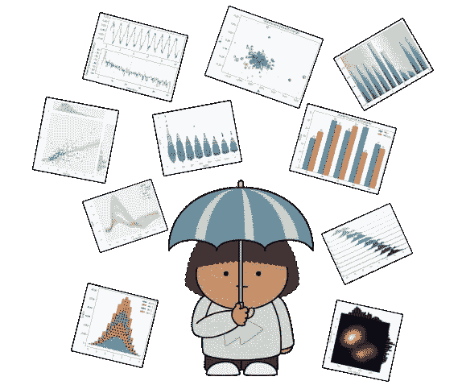

图片由作者提供，修改自[公共领域矢量图片](https://publicdomainvectors.org/en/free-clipart/Umbrella-kid/83011.html)

但是不用担心了。[经验累积分布函数(ecdf)](https://en.wikipedia.org/wiki/Empirical_distribution_function)将带你去你需要去的任何地方；它们是你真正需要的探索性数据分析伴侣；穿过所有噪音的那个；它将永远在那里可靠地照亮你尚未理解的数据的黑暗的统计世界。

# 什么是经验累积分布函数？

我现在已经在数据科学领域工作了 4+年，我可以告诉你:我很少看到[经验累积分布函数(ecdf)](https://en.wikipedia.org/wiki/Empirical_distribution_function)，除了在我自己的屏幕上。所以，如果你不熟悉，让我们花点时间解释一下。来自[维基百科](https://en.wikipedia.org/wiki/Empirical_distribution_function)(转述):

> 经验累积分布函数(eCDF)是与样本的经验测量相关的分布函数。这个累积分布函数是一个阶跃函数，在 n 个数据点中的每一个上跳 1/n。它在被测变量的任何指定值处的值是被测变量的观测值中小于或等于指定值的部分。

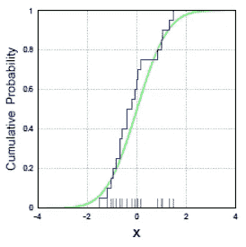

来自[维基百科](https://en.wikipedia.org/wiki/Empirical_distribution_function) : *“绿色曲线，渐近接近 0 和 1 的高度而没有达到它们，是* [*标准正态分布*](https://en.wikipedia.org/wiki/Standard_normal_distribution) *的真实累积分布函数。灰色散列标记代表从该分布中抽取的特定* [*样本*](https://en.wikipedia.org/wiki/Sample_(statistics)) *中的观察值，蓝色阶跃函数的水平阶跃形成该样本*的经验分布函数

在进一步讨论 ecdf 以及它们与直方图的关系之前，我们必须首先讨论直方图和 ecdf 旨在逼近的函数:pdf 和 CDFs。

## pdf 和 CDF

当[概率密度函数(PDF)](https://en.wikipedia.org/wiki/Probability_density_function) 测量从某个支持`X`上的某个概率函数`P`中随机抽取`x`的`P(x=X)`时，[累积分布函数(CDF)](https://en.wikipedia.org/wiki/Cumulative_distribution_function) 测量同一支持`X`上的同一概率函数`P`的`P(x<=X)`。

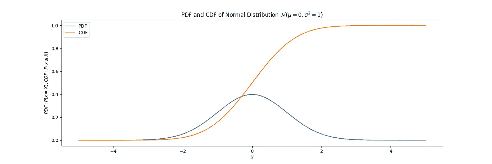

对于台下的微积分爱好者来说，CDF 就是 PDF 的积分。

## 直方图和 ECDFs

上面的那些曲线是理论上的，通过绘制[正态分布](https://en.wikipedia.org/wiki/Normal_distribution)的方程来显示。

然而，当我们对现实世界的数据进行探索性的数据分析时，并没有一个显式的等式生成我们的数据；相反，它是由我们想要理解、利用甚至影响的复杂过程产生的。

为了开始这一理解过程，我们通常绘制数据的经验分布图；这通常通过绘制直方图来完成。正如直方图提供了对潜在 PDF 的估计，ECDF 提供了对潜在 CDF 的估计。

为了演示直方图和 ECDF 之间的区别，我使用它们来可视化来自正态分布的相同的 10000 个绘图:

```
# Import.
import numpy as np
import matplotlib.pyplot as plt

# Create data.
mean = 0
std = 1
gaussian_draws = np.random.normal(mean, std, size=n_draws)

# Plot histogram.
plt.hist(gaussian_draws, bins=25, density=True)
plt.show()

# Plot ECDF.
x = np.sort(gaussian_draws)
y = np.linspace(0, 1, len(gaussian_draws))
plt.plot(x, y)
plt.show()
```

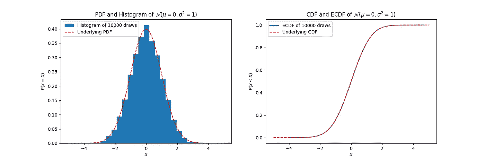

直方图在直观的可理解性方面可能很好，但它们的好处仅此而已。学会热爱 ECDFs 是值得的，我可以用 5 个理由说服你。

# ECDFs 渲染直方图过时的 5 个原因

## 1.关键的四分位值变得非常明显

我说的“关键四分位值”是什么意思？我的意思是:

*   数据的第 0 百分位值(即最小值)；
*   数据的第 25 个百分位数；
*   数据的第 50 百分位值(即中值)；
*   数据的第 75 百分位值；
*   数据的第 100 个百分位数(即最大值)。

这些信息很容易编入箱线图和 ECDFs 中，但在直方图中却很模糊。

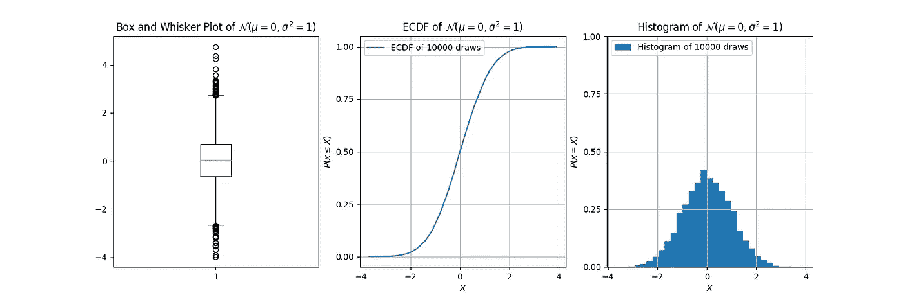

这就是了。我们可以看到:

*   从箱线图来看，第 25 百分位约为`-0.6`，中位数约为`0`，第 75 百分位约为`0.6`；
*   从 ECDF 来看，第 25 百分位约为`-0.6`，中位数约为`0`，第 75 百分位约为`0.6`；
*   从直方图来看…嗯，我们真的看不到太多。我们可以猜测中位数大概在`0`左右，但也仅此而已；而且，由于数据的对称性，我们只能猜测中位数。

没错，伙计们！关于直方图的所有讨论，我忘了提到:方框图显然是多余的！虽然它确实能做直方图做不到的事情，但它只是 ECDF 的影子。

## 2.ECDFs 在低数据量下保持相对高的完整性

在上一节中，我们考虑了来自正态分布的`10,000`数据。当我们减少数据量时，事情会变得怎样？让我们来看看:

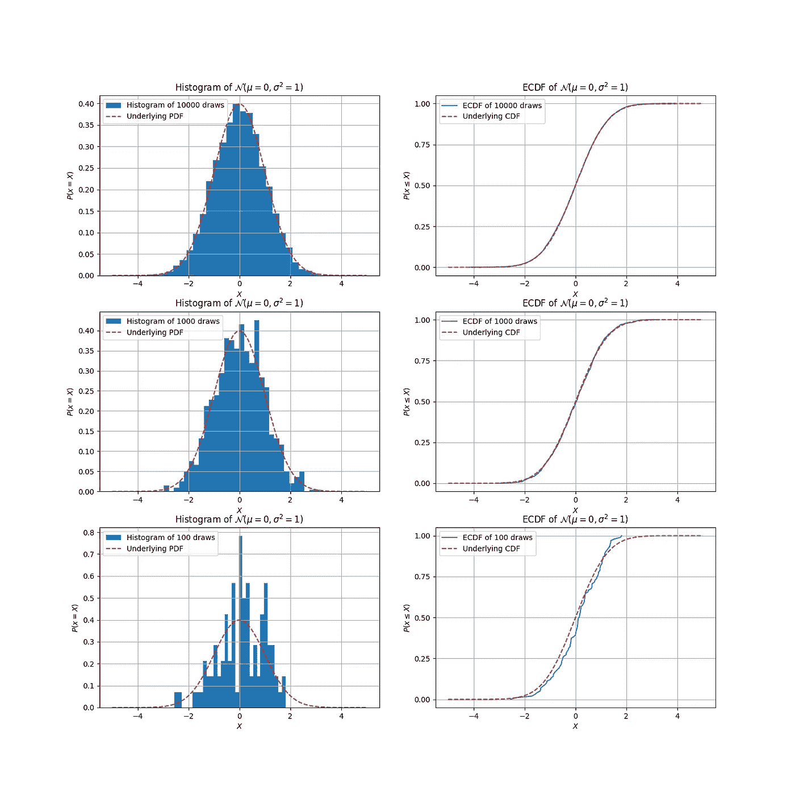

直方图很好地估计了`10000`绘图的潜在 PDF，甚至是`1000`绘图的潜在 PDF 但是在`100`抽签时，情况开始变得有点可疑。事实上，如果我不知道这些数据是如何产生的，我就不能很有把握地说这是一个正态分布！然而，即使在`100`提款时，ecdf 仍然更加牢固地附着在基础 CDF 上。

你现在可能会问自己，“但是本，我们为什么不增加箱子的尺寸呢？这难道不会使直方图变得平滑，然后它看起来又像我们的潜在正态分布了吗？”是的，它会，但它回避了问题:我们如何决定使用多少箱？

## 3.对于直方图，您永远不知道要使用多少个箱

让我们放纵一下:如果我们减少容器的数量，上面的直方图会是什么样子？

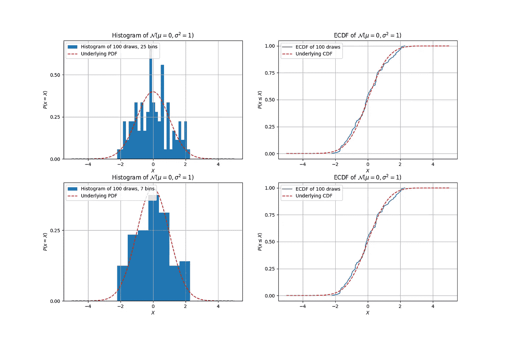

虽然 7 柱直方图仍然不是我们所知道的令人信服的正态分布，但它比 25 柱直方图更令人信服。但是事情是这样的:不管直方图*看起来有多好*如果你得到了正确的数量，ECDF 根本不需要这个猜谜游戏！


作者图片

在这种意义上，“箱数”或“箱大小”成为一种超参数。探索性数据分析是尽可能快速有效地了解数据的所有丰富性的时间；现在不是调整超参数的时候。

## 4.宁滨偏见的危险，或者“你是我的局外人吗？”

假设您仍然想使用直方图。因此，您只需减小容器大小，以适应您的数据量，直到它看起来完美。


图片由作者提供，修改自[公共领域矢量图片](https://publicdomainvectors.org/en/free-clipart/Chef-vector-clip-art/67108.html)

如果这是你的方法，那么请注意:如果你的数据有异常值，那么你的直方图可能在骗你。

在下面的图表中，我采用了与上面相同的高斯采样数据，但是手动添加了一个异常值。让我们看看异常值在直方图中的样子，这取决于我们使用的箱数:

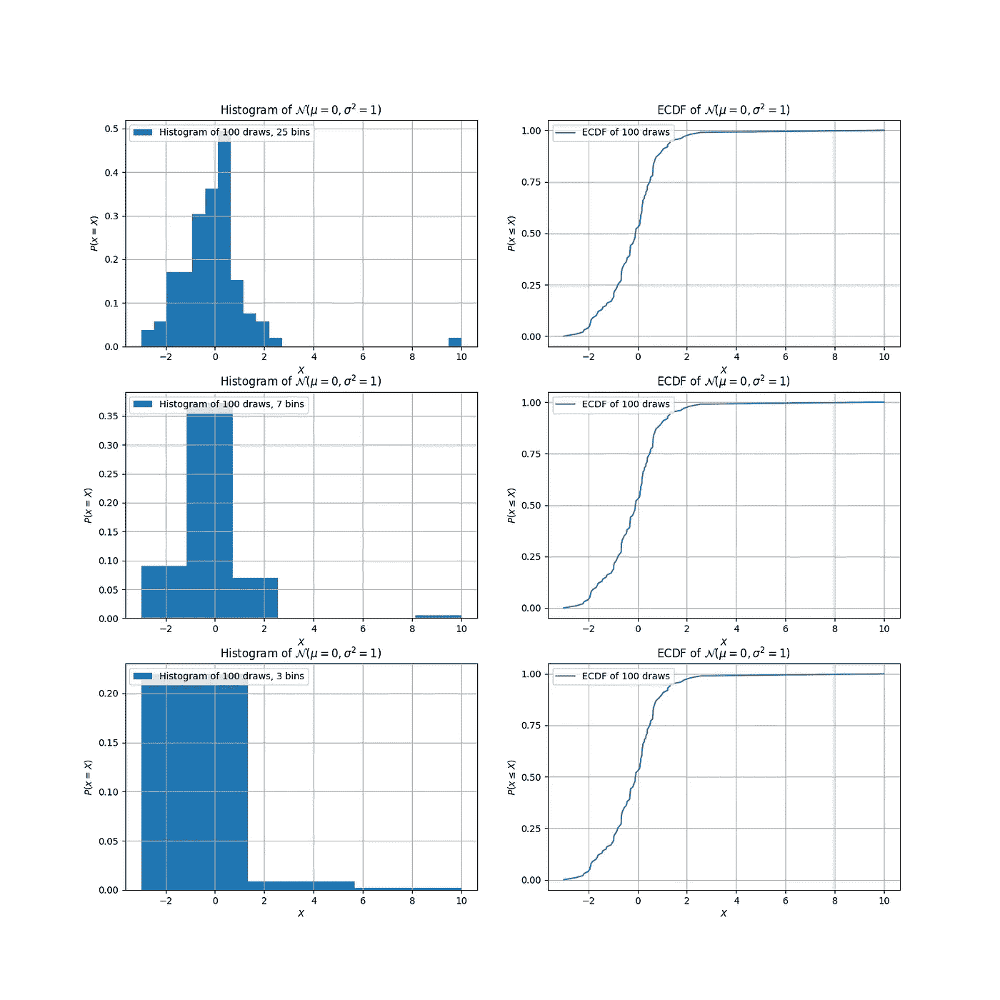

根据箱的数量，异常值的感知性质和数据的潜在分布会完全改变:

*   当我们使用`25`箱时，我们在`X = 10`看到一个异常值。但是，垃圾箱显得有点嘈杂，所以我们减少到`7`垃圾箱。
*   当我们使用`7`箱时，假设的 PDF 是平滑的，但是现在离群值在`X = 9`处。发生了什么事？异常值在箱子中的确切位置？甚至是离群值吗？
*   当我们减少到`3`条时，异常值扭曲了整个分布，以至于它看起来不再像异常值了！这也变得令人生疑:这可能不是正态分布吗？是指数型还是对数正态型？

通过直方图，我们可以看到，随着箱数的减少，异常值越来越接近分布的主体。然而，如果我们查看相应的 ECDFs，就不会有任何歧义:到`X = 2.5`时，我们已经看到了 99%的数据；然后，CDF 描绘出一条长的、几乎水平的线，得到值为`X = 10`的奇异异常值。瞧啊。

## 5.比较经验分布在数学和视觉上都变得更加简单

…但是不要从我这里拿走它；以安德雷·柯尔莫哥洛夫和尼古拉·斯米尔诺夫为例，他们是科尔莫戈罗夫-斯米尔诺夫检验(K-S 检验)的创始人，这是比较两个经验分布最常用的检验之一。来自[维基百科](https://en.wikipedia.org/wiki/Kolmogorov%E2%80%93Smirnov_test):

> 在统计学中，Kolmogorov-Smirnov 检验(K-S 检验或 KS 检验)是连续一维概率分布相等的非参数检验，可用于比较样本与参考概率分布(单样本 K-S 检验)，或比较两个样本(双样本 K-S 检验)…
> 
> …Kolmogorov-Smirnov 统计量化了样本的[ECDF]和参考分布的[CDF]之间的距离，或者两个样本的[ecdf]之间的距离…
> 
> …直观地说，[K-S]统计取所有 x 值的两个分布函数之间的最大绝对差值，[在下图中用黑色箭头表示]…

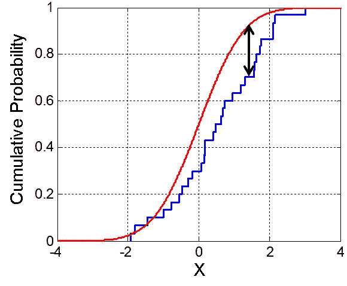

图片来自[维基百科](https://upload.wikimedia.org/wikipedia/commons/c/cf/KS_Example.png)

ECDFs 不仅对视觉比较有用；它们对于统计比较也很有用。然而，由于需要通过宁滨进行聚合，直方图是严格的可视化工具。

但是，即使作为可视化比较工具，ECDFs 的性能也和直方图一样好，甚至更好。

举个例子，从 Kaggle 上托管的 2016 年里约奥运会所有运动员的[数据集中获取关于人们身高和性别的数据。具体来说，让我们看看男性和女性的身高是如何比较的，使用 Seaborn 的四种不同方法来比较两个直方图](https://www.kaggle.com/datasets/rio2016/olympic-games):

```
# Import and load.
import seaborn as sns
import pandas as pd
import matplotlib.pyplot as plt
athlete_df = pd.read_csv("athletes.csv")

# Create figure.
fig, axs = plt.subplots(1, 4, figsize=(20, 5))

# Plot a separate distribution for each sex.
for i, hist_type in enumerate(["layer", "dodge", "stack", "fill"]):
    sns.histplot(athlete_df, x="height", hue="sex", multiple=hist_type,
        shrink=.75, ax=axs[i], bins=25, stat="probability")

# Display.
plt.show()
```

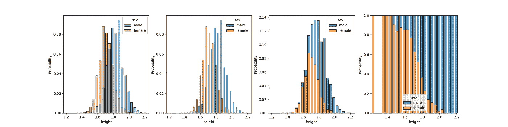

哪一个看起来最好:并排显示条，重叠条，堆叠条，或者令人作呕的“填充”方法一直在右边？使用 ECDFs，有一个明确的方法:

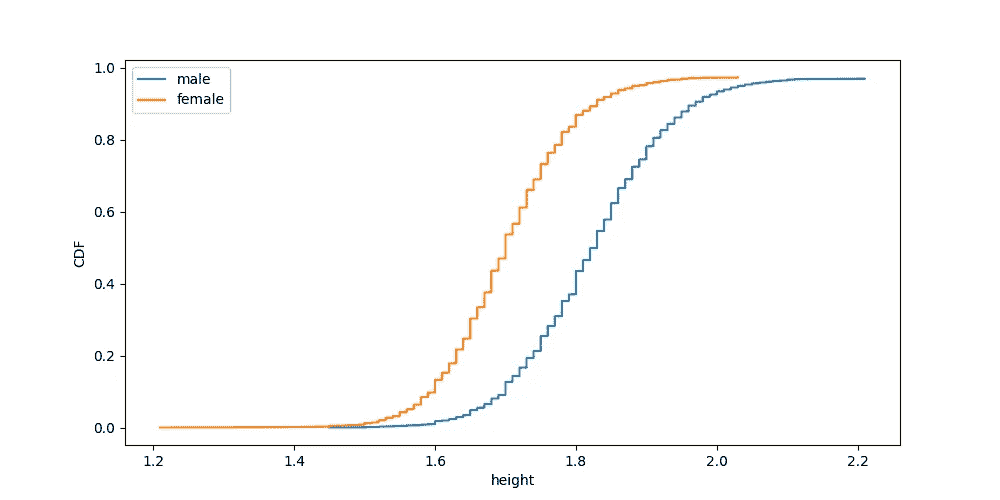

这很简单。

# 结论

当我们将所有这些都包括在内时，ECDF 会告诉您关于数据集分布的所有信息:

*   关键四分位值；
*   分布形状；
*   任何异常值的精确位置；
*   数据如何与其他数据或理论分布进行比较；

…它表现出无与伦比的清晰度和美感。

有了所有这些，ECDF 就是一面镜子，通过它数据集可以向您揭示其所有秘密，不会被任何宁滨混淆。

当然，ECDFs 和直方图仍然有许多兄弟和 sistograms:还有其他绘图工具，其中许多服务于非常不同的功能。仅举一个例子，散点图主要用于初步了解两个联合数据列之间的相关性，这是直方图和 ECDFs 无法做到的。也就是说，如果您的目标是全面了解一列数据的所有特性，或者比较两列数据的经验分布，那么 ECDF 根本不适合。

仍然计划使用直方图吗？在评论里让我知道为什么；)

PS:创建这个帖子时使用的所有代码都可以在这里找到[。](https://github.com/bfeif/personal-website/blob/main/code/notebooks/why-i-always-use-cdfs.ipynb)

PPS:所有图片，除非特别注明，均为作者所有。

*喜欢你读的书吗？随时联系我:*

[*LinkedIn*](https://www.linkedin.com/in/benjamin-feifke/)*|*[*Twitter*](https://twitter.com/normanrookwell)*|*[*benfeifke.com*](https://benfeifke.com/)*|*[*insta gram*](https://www.instagram.com/benfeifke/)*|*[*YouTube*](https://www.youtube.com/channel/UClsmEGubpjn_oY9N7sjrIbg)

*在* [*我的网站*](https://benfeifke.com/posts/ecdf-the-only-plotting-tool-a-data-scientist-needs/) *查看这篇博文！*