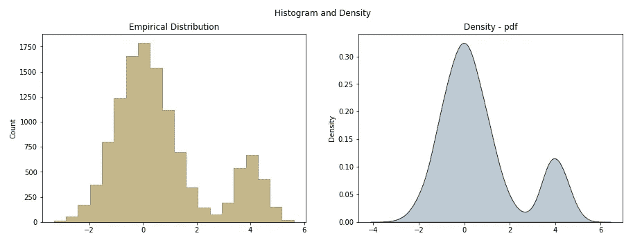
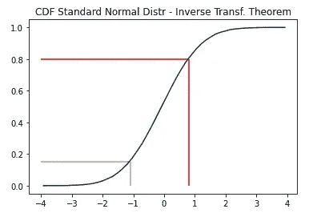
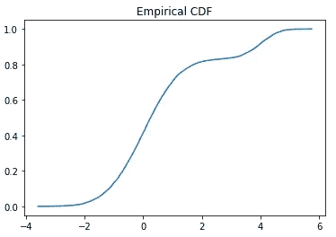
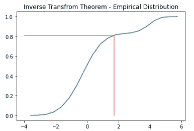
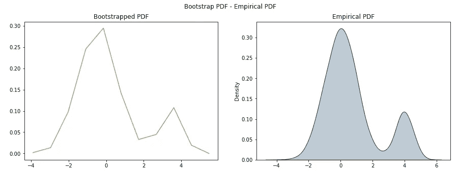

# 如何使用你的数据的经验分布

> 原文：<https://towardsdatascience.com/empirical-distribution-6af5142eed09>

## 通过从数据的经验分布中提取的随机变量来改进模拟建模

根据机器学习和统计学，我们主要建立模型和理论，这些模型和理论假设数据的基本分布。这可能并不总是合适的，但是如何利用数据的经验分布来解决分析问题呢？

## 动机

概率分布是**统计**、**机器学习、**的核心元素，在**模拟**中**随机数生成**的过程中也起着非常关键的作用。虽然现代统计库和软件完全能够从期望的分布中抽取随机数，如正态分布、指数分布或均匀分布(仅举几个例子)，但当基础数据**不符合任何这些分布**时，这项任务就变得更加复杂。为了预测核心信息**，逆变换定理**在这一切中扮演了巨大的角色。

> 本文要回答的主要问题是:“**如何从任何经验分布中生成随机变量(RV)？**

为了激发你的兴趣，让我给你提供一个实际的问题:假设你经营自己的餐馆，你想模拟顾客到达的数量。正如你在《统计学 101》一书中所述，为了模拟这样的问题，你可以从**泊松分布**(比率为λ)中提取到达次数，而到达间隔时间则通过**指数分布**(1/λ)来建模。然而，在实践中，**你观察到这几乎从来都不是真的**——不管出于什么原因，你的客人只是以一种你所研究的任何分布都无法捕捉的方式来来去去，留给你的是到达数据的经验分布——或者换句话说，你通过查看手头的数据直接推断出的**分布**。

为了模拟真实的游客到达，您希望直接从给定的底层分布中对随机事件进行采样，但是如何做到这一点呢？


我们将在这篇文章中讨论什么

本文探讨了任意**经验分布的作用以及逆变换定理**的作用，逆变换定理允许我们从给定的数据分布中生成随机变量:

1.  [经验数据分布](#df69)
2.  [逆变换定理](#cca3)
3.  [从经验分布中抽取随机变量](#7ca9)(证明为什么所有这些真的有效)
4.  [结论](#dcd1)

## 经验数据分布

经验示例数据是通过具有不同参数(均值、方差)和不同抽取样本数量的两个正态分布生成的。这给我们留下了一个双峰正态分布。现在，假设对于我们的分析问题，我们感兴趣的是通过从 N(0，1)分布中抽取来初始化权重矩阵。这可能很简单，但导致的问题是我们不会考虑**沉重的右尾巴**。因此，我们将从右尾提取很少的值，但是在平均值 0 附近的值要多得多。

换句话说，我们会取消**对经验分布右侧的低估**，并比我们应该看到的更少看到 4 左右的值。



数据的直方图和密度

上面的直方图被分成 20 个区间。每个箱代表一个值范围，对于每个范围，我们计算落入其中的值的数量。

变量“bin”说明了每个值存储桶的边界，因此，为了找到直方图中第一个条形的高度，我们需要对落入范围从-3.310 到-2.863 的存储桶中的所有值进行计数。在经验数据中，有 12 个值可以分配到该范围。自然地，给定用于生成数据的基本分布，大多数出现在 0 和 4 均值附近。

```
bins =
array([-3.310 , -2.863, -2.417, -1.971, -1.524, -1.078, -0.632, -0.186, 0.261, 0.707, 1.153, 1.599, 2.046, 2.492, 2.938, 3.384, 3.831, 4.277, 4.723, 5.169, 5.616])
```

```
# bold: 0.707/1.153
# The bold printed numbers are used for explanation later on
```

变量“counts”简单地计算落入每个相应仓中的事件的数量。

```
counts = 
```

```
[  12,   52,  172,  374,  801, 1237, 1657, 1788, 1540, 1117,  697,
        343,  145,   73,  193,  535,  666,  430,  148,   20]
```

```
# value related to bin [0.707, 1.153]: 1117
```

**概率密度函数**

使用从直方图获得的值，我们可以直接推断出经验数据的**概率密度函数** ( **PDF** )。为此，我们只需将每个计数除以值的总数:

```
pdf = 
array([0.001, 0.004, 0.014, 0.031, 0.067, 0.103, 0.138, 0.149, 0.128, 0.093, 0.058, 0.029, 0.012, 0.006, 0.016, 0.045, 0.056, 0.036, 0.012, 0.002])
```

```
# p for value 1117: 0.093
```

如果你观察 PDF 值，你会发现它们先增加，然后减少，再稍微增加(大约是 x=4 的值)，然后再减少到接近初始值。根据我们的直觉，这与我们之前看到的直方图/密度图非常吻合。

当然，不需要手动进行拆分和计数；Numpy 的 *histogram()* 函数就是这样做的。

```
values, bins = np.histogram(data, bins=20)
```

**累积分布函数**

到目前为止，我们已经**能够给一个给定的输入值**分配一个概率。例如，如果我们定义我们的示例 X=0.8，我们可以将它分配给边界为 ***0.707* 到 *1.153*** 的 bin。有 **1117** 个值落入此区间，假设总共有 **12000 个观察值**，在该区间中看到值的概率约为 1117 / 12000 = 0.093 或 **9.3%** 。

```
"bounds: [0.707, 1.153]" : {"counts" : 1117, "probability" : 0.093}
```

累积分布函数(CDF)基于从 PDF 获得的知识。参考上面的例子，CDF 表示 **X ≤0.8** 的概率。这意味着我们不仅要查看函数在 **X=0.8** 的精确值，还要查看到该点为止的所有值。

为了用简单的代码片段来表达这一点，我们可以直接从 PDF 获取 CDF:

```
np.cumsum( counts / np.sum(counts) ) # counts-> no of values per bin
```

为了查看从已知分布计算 **PDF 值的上下文中的一个示例，**我可以参考下面的帖子(它使用超几何分布作为基础分布，并将其放在 A/B 测试的上下文中):

[](/fishers-exact-fb49432e55b5)  

**基本情况:正态分布**

我们先来看看标准正态分布。如您所见，CDF 中的值范围是从 0 到 1——从 PDF 的左侧开始移动，将所有值添加到右侧。考虑到 CDF 总是随着我们从左向右移动而累加值，我们可以确信 CDF 是严格单调递增的。


标准正态分布的直方图和 CDF(模拟 10，000 个随机变量)

> **为什么我们关心经验分布的 CDF？**

这个有限的范围对于进一步的考虑非常有价值，因为它允许我们在我们的经验 CDF 中的这个值上画出范围[0，1]中的任何随机均匀数**点，并且**将其“反向”映射到它在经验 PDF** 中各自的 X 值——这个过程通常被称为逆变换定理(ITT)。**

## 逆变换定理

正如刚才所描述的，ITT 允许我们使用 CDF 来将聚合概率映射到其各自的 X 值(PDF 的)。这意味着我们可以选择任何随机的统一值，在 CDF 的垂直线上找到它的点，并在水平轴上找到 X 的对应值——这个映射值对应于我们的 PDF 中感兴趣的变量。

```
Uniform(0,1) -> CDF (y-axis) -> PDF (x-axis) # done
```

在下面的图表中，我们对两个不同的均匀随机变量进行了采样，并试图找到我们的基本分布的各自的 X 值。



**红线对应 U=0.8** ，而**金线对应 U=0.15** (将 y 轴视为 U 的范围)。我们现在来看看 CDF 函数的截取。通过观察，我们已经可以假设红线的 X 值大约是 0.9，而金线的 X 值似乎是-1 左右。

为了检查这一观察结果，我们可以将百分比值插入**百分点函数(ppf)** 。这将为我们插入的总概率提供 X 的精确值。正如我们可以看到的，随机采样数据及其观察到的映射与标准正常 CDF 的**精确值非常一致:**

```
norm.ppf(0.8) = **0.8416212**, norm.ppf(0.15) = **-1.0364334**
```

除了我们刚刚研究的，我们的**主要兴趣**是如何从**经验分布**中抽取随机数。为了回答这个问题，我们可以利用与 ITT 完全相同的想法。在前面的步骤中，我已经导出了数据的经验 PDF。这些 PDF 值的累积和将产生**经验 CDF** ，如下所示:



显然，经验 CDF 偏离了标准正态分布过程中所讨论的内容。然而，应用 ITT 来获得 X 值的想法也是适用的。

在不使用外部包/库的情况下，可以查看 CDF 并识别累积概率小于或等于给定均匀随机变量(U)的索引:

```
idx=np.argmin(mycdf <= 0.5) # provides the first index where "True"
pdf[idx] # desired bin which is ≈ X
```

使用该索引，我们可以找到相应的感兴趣的容器，并将值 U 映射到该容器。这当然不是很准确，实际上需要在面元内进行插值，以使分布足够连续。

找到对应于我们的统一 U 的 X 的更好和更准确的方法是使用 *statmodels 的 experimental _ distribution*。 *ECDF()* 为您提供了 x 和 y 属性，使索引变得非常简单。

```
from statsmodels.distributions.empirical_distribution import ECDF
ecdf = ECDF( data )
```

```
# ecdf.x, ecdf.y
```

参考我们之前用于标准正常 CDF 的例子，我们寻找对应于 U=0.8 的 X 值。



U=0.8 ≈ X=1.73

与 U=0.8 导致 X 约为 0.84 的标准正态分布的结果相反，经验分布指定了一个大得多的值 X 约为 1.73。这是有意义的，因为我们**知道经验分布有一个很大的右尾**，或者更确切地说是在 X=4 的值周围添加了一个“附加正态分布**。**

## 从经验分布中提取随机变量

为了结束这个话题，我想说明 ITT 的概念确实提供了**一致和正确的结果**。这个绘制 U 并找到其正确 bin 位置的迭代过程称为“**自举。**”

为此，我将采用经验 CDF 并抽取 5000 个独立的随机均匀分布(U)。对于每个 U，我将找到 CDF ≤ U 为真的第一个索引，并且**递增该索引位置的 bin 计数**。最终，绝对出现次数将根据总值的数量进行归一化，从而获得 PDF。

回想一下，对于这个总结步骤，我们只有经验 CDF，我们使用 bootstrapping 来导出 PDF，它应该看起来与我们开始时的经验 PDF 相似。

```
pdf = np.zeros_like(bins)
```

```
for step in np.arange(1000):
    u = np.random.uniform()
    p = np.argmin(mycdf <= u) # p is the index
    # Increment the counter at bin position of index
    pdf[p-1]+=1
```

```
# Calculating the PDF
pdf = pdf / np.sum(pdf)
```

通过使用经验 CDF 和 1000 个随机抽取的均匀随机变量，我们能够近似我们在这篇文章的第一步[中创建的经验 PDF。这个总结性实验表明，应用 ITT 是从任意经验分布中生成**随机变量的一种直接方式。**](#df69)



## 结论

虽然统计和机器学习课程主要关注众所周知的概率分布的推导和应用，但使用经验分布似乎超出了范围。

然而，在现实世界中，尤其是在模拟领域，我们可能会观察到无法映射到标准、指数、均匀或其他分布的数据分布。对于这些情况，从观察到的经验数据分布中简单地提取随机变量是非常方便的。

如果你觉得这篇文章有趣，我会很感激“关注”🫀，直到那时:

*照顾好自己，如果可以的话，也照顾好别人。*

*—借用史蒂芬·都伯纳*

以上所有图片均由作者创作。这篇文章的灵感来自于佐治亚理工学院教授戴夫·戈德曼杰出的 IYSE 6644“模拟”课程。

标题图片由 Ruben Gutierrez 在 Unsplash 上提供:


照片由[鲁本·古铁雷斯](https://unsplash.com/@collectivecreatorsco?utm_source=medium&utm_medium=referral)在 [Unsplash](https://unsplash.com?utm_source=medium&utm_medium=referral) 上拍摄