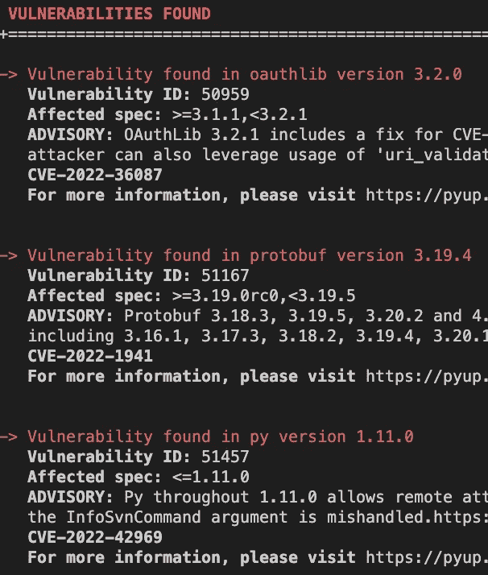
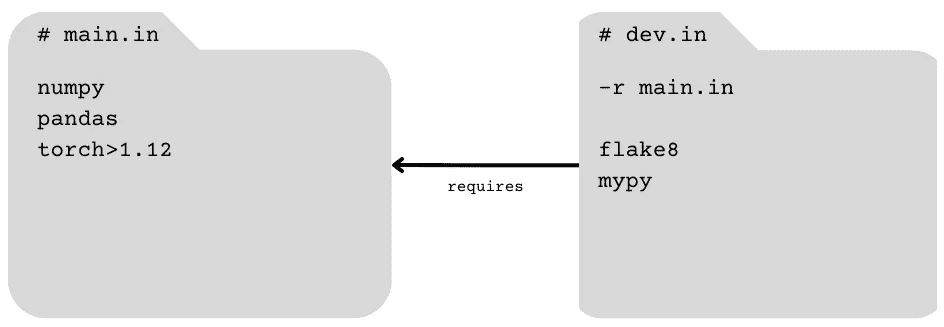
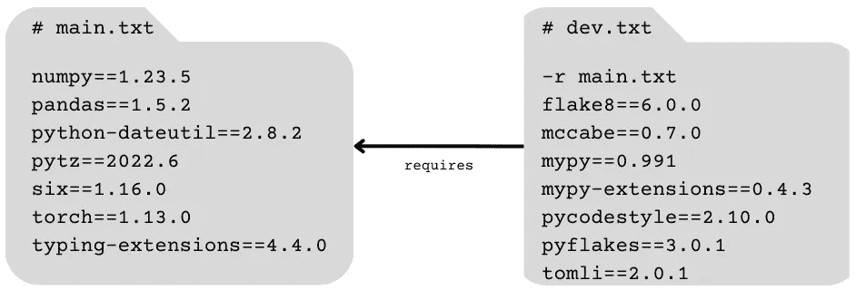
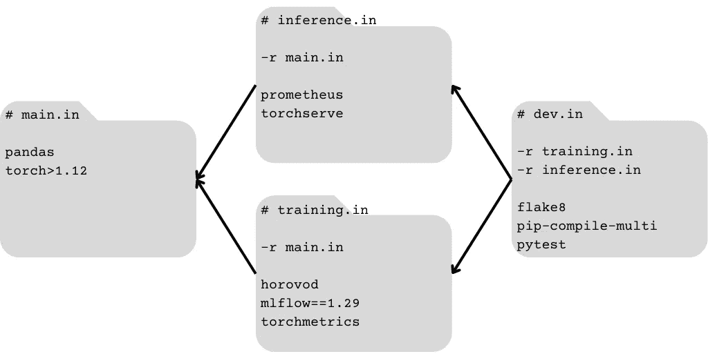

# 用 pip-compile-multi 结束 Python 依赖地狱

> 原文：<https://towardsdatascience.com/end-python-dependency-hell-with-pip-compile-multi-56eea0c55ffe>

## 保持项目的可复制性和复杂的 Python 依赖关系的组织性


约翰·巴克利普在 [Unsplash](https://unsplash.com/s/photos/complex?utm_source=unsplash&utm_medium=referral&utm_content=creditCopyText) 上的照片

大多数重要的 Python 项目都有复杂的依赖关系管理需求，普通的开源解决方案不足以解决这些需求。一些工具试图解决整个打包体验，而另一些工具旨在解决一两个狭窄的子问题。尽管有无数的解决方案，开发人员仍然面临着相同的依赖关系管理挑战:

1.  新用户和贡献者如何轻松正确地安装依赖项？
2.  我如何知道我的依赖项都是兼容的？
3.  我如何使构建具有确定性和可重复性？
4.  我如何确保我的部署工件使用一致和兼容的依赖关系？
5.  我如何避免依赖性膨胀？

这篇文章将主要使用`[pip-compile-multi](https://pip-compile-multi.readthedocs.io/en/latest/)`来回答这些问题，这是一个开源命令行工具，它扩展了流行的`[pip-tools](https://pip-tools.readthedocs.io/en/latest/)`的功能，以满足具有复杂依赖关系的项目的需求。

# 锁定文件的问题是

部分解决方案是维护一个依赖关系[锁文件](https://blog.shalvah.me/posts/understanding-lockfiles)，像`[poetry](https://python-poetry.org/docs/cli/#lock)`和`[pip-tools](https://pip-tools.readthedocs.io/en/latest/#example-usage-for-pip-compile)`这样的工具可以实现这一点。我们可以把 lockfile 想象成一个“依赖接口”:一个告诉项目需要什么外部依赖才能正常工作的抽象概念。为你的整个项目拥有一个单一的整体锁文件的问题是，作为一个接口，它不是[良好分离的](https://en.wikipedia.org/wiki/Interface_segregation_principle):为了确保兼容性、确定性和可再现性，*代码的每个*消费者(用户、开发人员、打包系统、构建工件、部署目标)将需要安装*锁文件枚举的每个*单一依赖项——无论他们实际上是否使用它。例如，如果您曾经努力将您的林挺和测试库从您的产品构建中分离出来，您就会遇到这个问题。

由此导致的依赖性膨胀可能是一个真正的问题。除了不必要的膨胀的构建时间和包/工件大小之外，它还增加了您的项目或应用程序中安全漏洞的表面积。



我在一个使用[安全](https://pyup.io/safety/)的项目中发现的漏洞。

# 更好的解决方案

理想情况下，我们可以将依赖接口重组为多个更窄的接口——多个锁文件:

*   按功能分组相关性
*   可以互相组合
*   可以独立消费
*   是相互兼容的

如果我们能做到这一点，事情就会变得简单:

*   了解在哪里使用哪些依赖项
*   包装变型(例如定义 pip [附加](https://packaging.python.org/en/latest/tutorials/installing-packages/#installing-extras)
*   多阶段构建(例如 [Docker 多阶段](https://docs.docker.com/build/building/multi-stage/)

幸运的是，`[pip-compile-multi](https://pip-compile-multi.readthedocs.io/en/latest/)`做到了以上几点！这是一个轻量级的、`pip`可安装的 CLI，构建在优秀的`[pip-tools](https://pip-tools.readthedocs.io/en/latest/)`项目之上。您只需将您的`requirements.txt`文件分割成一个或多个 [pip 需求文件](https://pip.pypa.io/en/stable/reference/requirements-file-format/)(通常带有后缀`.in`)。每个文件可能包含一个或`-r` / `--requirement`选项，这些选项将文件链接成一个有向无环图(DAG)。依赖关系的 DAG 表示是`pip-compile-multi`的核心。

## 例子

比方说你的`requirements.txt`长这样:

```
# requirements.txt

flake8
mypy
numpy
pandas
torch>1.12
```

第一步是将这些依赖项分成功能组。我们将一组写到`main.in`，另一组写到`dev.in`。我们现在应该删除我们的`requirements.txt`。我们的两个新的`.in`文件可能看起来像这样，形成一个简单的双节点依赖 DAG:



一个简单的双节点依赖 DAG。主项目依赖项放在“main.in”中，我们的代码链接和相关的开发工具放在“dev.in”中。这使我们的依赖项保持逻辑分组。

每个节点是一个定义依赖组的`.in`文件。每个有向边代表一个组对另一个组的需求。每个节点用一个或多个`-r` / `--requirement`选项定义自己的入边。

一旦我们定义了这个依赖 DAG，运行`pip-compile-multi`将生成一个等价的 lockfile DAG。该工具将为 DAG 中的每个`.in`输出一个`.txt` pip 需求文件。



pip-compile-multi 编译的锁文件 DAG。我已经删除了这些锁文件中自动生成的行内注释，但实际上您永远不需要手动编辑它们。

默认情况下，生成的锁文件将创建在与`.in`文件相同的目录中，并镜像它们的名称。

## 自动解决跨文件冲突

将`pip-compile-multi`与其他 lockfiles 工具如`pip-tools`区分开来的杀手级特性是[自动解决跨文件冲突](https://pip-compile-multi.readthedocs.io/en/latest/features.html#autoresolve-cross-file-conflicts)，使用`--autoresolve`标志可以轻松实现。在自动解决模式下，`pip-compile-multi`将首先预解决所有依赖关系，然后使用该解决方案来约束每个节点的单个解决方案。这通过防止临时依赖关系中的任何冲突来确保每个锁文件保持相互兼容。为了使用自动解析，您的 DAG 必须正好有一个源节点(请注意，pip-compile-multi 文档反转了 DAG 边的方向，因此当我说 source 时，它们将指 sink 节点，反之亦然)。

## 锁定文件验证

另一个有用的命令是`[pip-compile-multi verify](https://pip-compile-multi.readthedocs.io/en/latest/features.html#check-that-pip-compile-multi-was-run-after-changes-in-in-file)`，它检查您的锁文件是否与您的`.in`文件中指定的相匹配。这是一个简单而有价值的检查，您可以轻松地将其合并到您的 CICD 管道中，以防止错误的依赖关系更新。它甚至可以作为[预提交钩子](https://pip-compile-multi.readthedocs.io/en/latest/precommit.html)使用！

# 充分利用 pip-compile-multi 的技巧

## 适当地组织依赖关系

如果你把你的依赖关系分组的很差，你就是在为失败做准备。尝试基于代码中依赖项的预期功能来定义组:不要将`flake8`(一个代码 linter)与`torch`(一个深度学习框架)放在一个组中。

## 具有单个源节点和单个接收器节点

我发现，当您可以将最普遍的依赖项组织成一个所有其他节点*都需要*(一个汇聚节点)的单一“核心”依赖项集，并将所有开发依赖项组织成一个节点*需要*所有其他节点(直接或间接)都需要(一个源)的节点时，效果最好。这种模式使您的 DAG 相对简单，并确保您可以使用 pip-compile-multi 强大的自动解析功能。

## 启用画中画缓存

设置`[--use-cache](https://pip-compile-multi.readthedocs.io/en/latest/features.html#use-cache)`标志可以显著提高`pip-compile-multi`的速度，因为它支持在对`pip-compile`的底层调用中进行缓存。

# 真实世界的例子

为了让事情更清楚，我们来看一个机器学习领域的例子。

一个典型的机器学习系统将至少有两个组件:一个训练工作负载，它在一些数据上创建一个模型，以及一个推理服务器，它为模型预测提供服务。

这两个组件都有一些共同的依赖项，比如用于数据处理和建模的库。我们可以在一个名为`main.in`的文本文件中列出这些，它只是一个 [pip 需求文件](https://pip.pypa.io/en/stable/reference/requirements-file-format/):

```
# requirements/main.in

pandas
torch>1.12
```

训练组件可能对分布式通信、实验跟踪和度量计算有一些特殊的依赖性。我们会把这些放在`training.in`:

```
# requirements/training.in

-r main.in

horovod
mlflow==1.29
torchmetrics
```

注意我们添加了`-r`标志，它告诉 pip-compile-multi`training.in`需要来自`main.in`的依赖项。

推理组件将有一些服务和监控的专有依赖项，我们将其添加到`inference.in`:

```
# requirements/inference.in

-r main.in

prometheus
torchserve
```

最后，整个代码库共享相同的开发工具链。这些开发工具，比如 linters、单元测试模块，甚至`pip-compile-multi`本身都在`dev.in`中:

```
# requirements/dev.in

-r inference.in
-r training.in

flake8
pip-compile-multi
pytest
```

再次注意，指示`dev.in`的`-r`标志依赖于`training.in`和`inference.in`。我们不需要一个`-r main.in`，因为`training.in`和`inference.in`已经有了。

总的来说，我们的依赖 DAG 如下所示:



一个四节点依赖 DAG。

假设我们的`.in`文件位于名为`requirements/`的目录中，我们可以使用以下命令来解析我们的 DAG 并生成锁文件:

```
pip-compile-multi --autoresolve --use-cache --directory=requirements
```

该命令成功后，您会在`requirements/`中看到四个新文件:`main.txt`、`training.txt`、`inference.txt`和`dev.txt`。这些是我们的锁档。我们可以像使用有效的`requirements.txt`文件一样使用它们。也许我们可以用它们来构建高效的 Docker 多级图像目标:

或者，我们可能是安装环境的新项目贡献者。我们可以简单地运行`pip install -r requirements/dev.txt`(或者更好:`pip-sync requirements/dev.txt`)在“开发”模式下安装项目，包括所有的开发依赖项。

# 结论

用于管理 Python 依赖关系的工具选项数量惊人。很少有工具能够很好地支持按功能划分依赖关系，我认为这已经成为一个常见的项目需求。虽然`pip-compile-multi`不是灵丹妙药，但是它支持优雅的依赖分离，并且将它添加到您的项目中非常简单！

除非另有说明，所有图片均为作者所有。