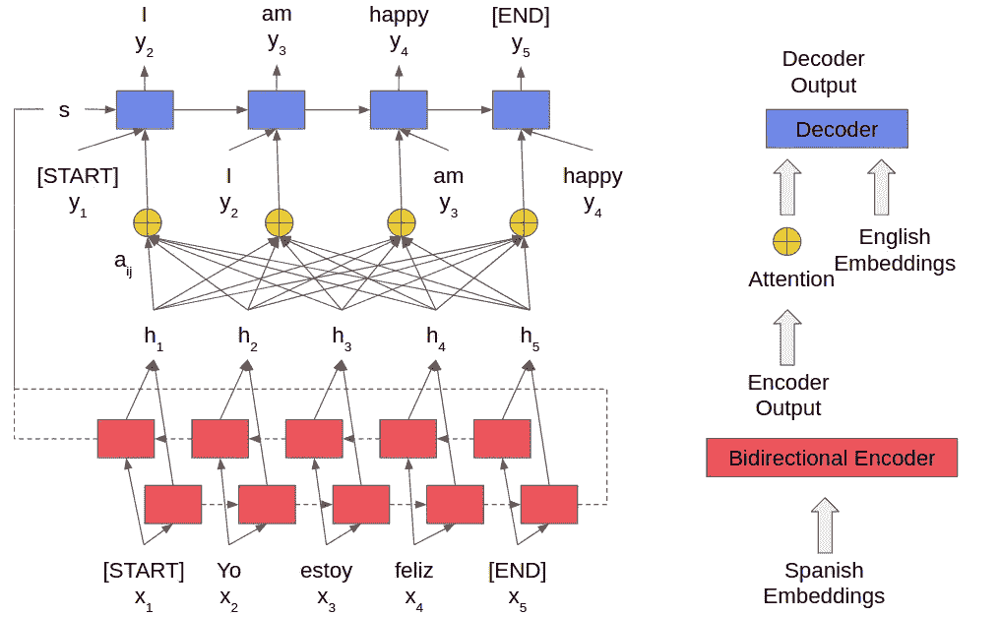
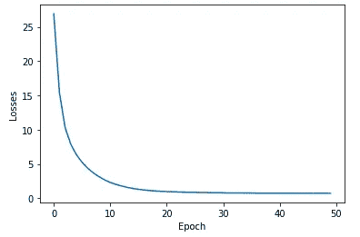
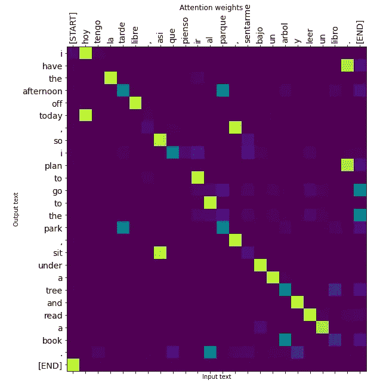

# 基于端到端注意力的最小张量流代码机器翻译模型

> 原文：<https://towardsdatascience.com/end-to-end-attention-based-machine-translation-model-with-minimum-tensorflow-code-ae2f08cc8218>

这篇博文介绍了仅使用高级 Tensorflow API 的基于注意力的机器翻译的训练和推理。这是一个简化的端到端教程，旨在减少代码行。

关于这个话题有很多在线教程。但大多数都是包含大量样板代码的 [Tensorflow 官方教程](https://www.tensorflow.org/text/tutorials/nmt_with_attention)的变种。虽然理解它是如何使用低级 API 实现的是有帮助的，但是容易获得和简化的实现通常是受欢迎的——初学者可以使用它来快速形成对主题的直觉；从业者可以很容易地借用自包含的代码片段。这篇博文提供了一个简化的基于注意力的机器翻译代码的端到端实现，仅使用高级 Tensorflow Keras 层实现。

> **翻译任务**

我们将执行的翻译任务与 Tensorflow 官方教程中的任务相同。我们要把西班牙语翻译成英语。我们将重用与 Tensorflow 官方教程中相同的数据集，它是西班牙语和英语对的列表，存储在一个文本文档中，每对一行。我们下载数据集并解压。注意，我们还需要用于文本处理的`tensorflow_text`包。

```
$ curl [http://storage.googleapis.com/download.tensorflow.org/data/spa-eng.zip](http://storage.googleapis.com/download.tensorflow.org/data/spa-eng.zip) –output spa-eng.zip
$ unzip spa-eng.zip
$ pip install –user tensorflow-text
```

> **预处理**

文本预处理是任何自然语言文章中不可或缺的一步。如果您有兴趣了解各种文本预处理技术的影响，请随意查看这篇[博客文章](https://levelup.gitconnected.com/does-text-preprocessing-affect-natural-language-processing-performance-ccadaaaab39b)了解更多细节。我们利用`TextLineDataset` API 直接构建数据集，避免了 Tensorflow 官方教程中的大量样板代码。

数据加载

现在数据集已经可以使用了，我们使用`TextVectorization`层来索引文本中的记号。这部分和 Tensorflow 官方教程几乎一模一样。目标是为西班牙语和英语构建各自的词汇集，这样我们就可以将标记映射到索引，稍后将使用索引进行嵌入。

文本预处理

> **模型架构**

这篇博文的核心是:模型。在进入模型代码之前，让我们看看模型架构的高级视图。该模型是典型的序列对序列模型。西班牙语输入被送入双向递归神经网络，我们称之为双向编码器。双向编码器的最终状态`s`成为解码器的初始状态。双向编码器`h`的输出由[注意](https://en.wikipedia.org/wiki/Attention_(machine_learning))层`aij`加权，并与英文输入组合。我们使用[教师强制](https://en.wikipedia.org/wiki/Teacher_forcing)机制来训练解码器，即解码器的英语输入来自上一步的预期(而不是实际)解码器输出。众所周知，这种机制可以加快训练速度，因为各个步骤可以通过正确的输入独立学习，而不是依赖于来自其先前步骤的潜在虚假输入。这也使得实现更加容易。解码器输出最终的英语。请参见下图进行概述。



模型架构

注意，解码器的英语输入具有`[START]`标记，解码器的英语输出具有`[END]`标记。一个用于启动文本生成，另一个用于终止文本生成。英语输入/输出内容也移动一步。双向编码器的西班牙语输入具有`[START]`和`[END]`标记。这仅仅是因为我们为两种语言重用了相同的`standardize`函数。理论上，西班牙语输入不需要这两个标记。

在推理时间，我们不再有预期的英语作为输入。因此，我们必须使用上一步中解码器的输出，一步一步地生成输出序列。

> **型号代码**

模型代码实现为 Tensorflow Keras 模型的子类。请参见接口的以下代码片段。

模型界面

在初始化过程中，我们为模型构建了必要的层，包括西班牙语和英语的`TextVectorization`层、西班牙语和英语的`Embedding`层、西班牙语编码器的`Bidirectional`层、英语解码器的`LSTM`层、编码器和解码器之间的`Attention`层，以及将解码器的输出映射到英语词汇索引的最终`Dense`层。参见下面初始化函数的代码片段。

模型初始化

几个值得注意的点:`Bidirectional`层的内部`LSTM`有其他层的一半单元，因为`Bidirectional`层将连接向前和向后输出。`Bidirectional`编码器和`LSTM`解码器都设置为返回序列和状态，因为它们将在训练/推断过程中使用。两个`Embedding`层都将`mask_zero`设置为`True`，因为由于句子长度可变，我们将依靠蒙版来忽略 0 填充。

模型调用调用这些层并返回输出。请参见以下调用函数的代码片段。

模型调用

同样，有几点值得注意:`Bidirectional`层单独返回状态。所以我们需要把它们连接起来。解码器的英语输入是没有终止符`[END]`的英语句子。来自解码器的预期英语输出是没有起始标记`[START]`的英语句子。解码器的输出形状为`(batch, Te-1, rnn_output_dim)`。`eng_vocab_size`单元的最终输出`Dense`层足够智能以产生形状`(batch, Te-1, eng_vocab_size)`的输出。最初由嵌入层创建的掩码通过所有层传递，有时是隐式的(在递归神经网络中)，有时是显式的(在注意层和最终函数返回中)。

> **训练代码**

训练代码遍历成批的句子对，收集模型的输出，计算损失，并应用梯度下降。有关培训部分，请参见下面的代码片段。最重要的一点是，在损失计算中，我们需要屏蔽掉不相关的元素——因为它们只是可变长度句子的填充。

模特培训

经过 50 个时期后，我们可以看到模型损耗接近于零。这意味着我们的模型有能力过度拟合数据，这是模型能力的一个很好的指标。这里可以应用许多正则化技术来保证模型的泛化能力。但是这超出了这篇博文的范围。



培训损失

> **推理代码**

推理代码与模型调用代码非常相似。关键的区别在于，我们需要在推理过程中一步一步地生成英语输出，而不是一次生成全部，因为我们需要上一步的解码器输出。有关推理代码，请参见以下代码片段。注意，推理代码还返回注意力矩阵，我们可以用它来可视化西班牙语输入和英语输出之间的模型注意力。

模型推理

最后，让我们为随机选取的西班牙语输入`“Hoy tengo la tarde libre, así que pienso ir al parque, sentarme bajo un árbol y leer un libro.”`调用`translate`推理函数。输出是`“i have the afternoon off today , so i plan to go to the park , sit under a tree and read a book .”`，它与数据集中的英文输出完全相同，只是由于我们的文本预处理，去掉了字母大小写和标点符号空间。不奇怪。正如我们上面讨论的，模型是过度拟合的。让我们也使用一个类似于 Tensorflow 官方教程中的 helper 函数的`plot_attention`函数来可视化注意力。

注意力绘图



注意力图