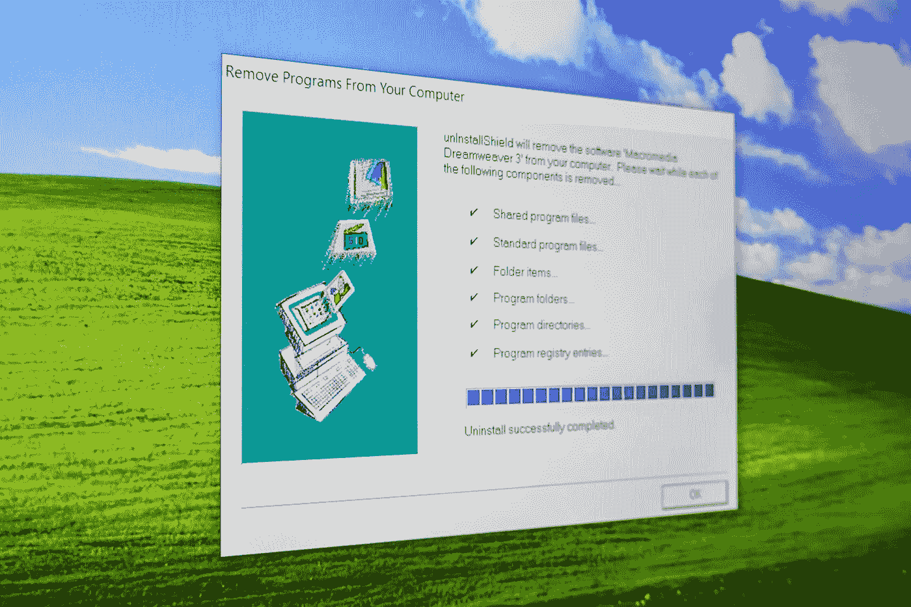
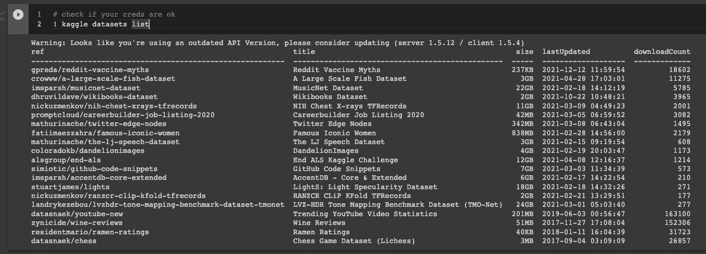
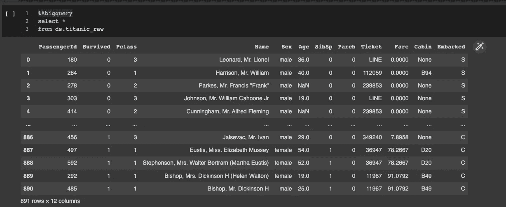
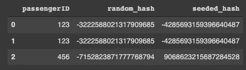
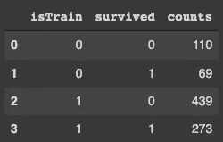
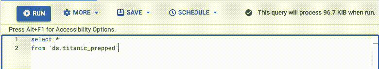
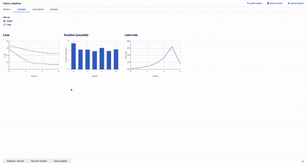
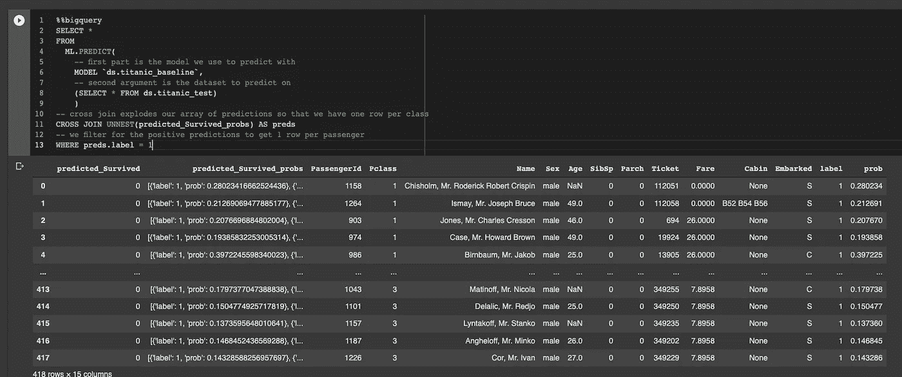
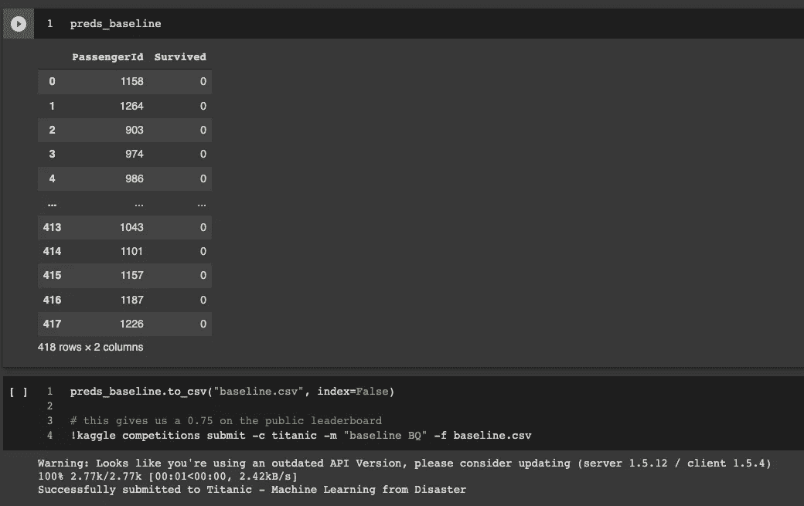

# 端到端 BigQuery 机器学习

> 原文：<https://towardsdatascience.com/end-to-end-bigquery-machine-learning-e7e6e2e83b34>

## 使用 Google Cloud BigQuery 参加 Kaggle 竞赛

我将向您展示如何仅使用 BigQuery 和 Kaggle API 来预测泰坦尼克号灾难**的幸存者。自从我遇到 BigQuery，我就成了它的粉丝。它很容易使用，超级快，超级便宜——如果你用得好的话…**

它不仅可以进行 Pb 级的复杂分析，还可以运行一些机器学习模型，所有这些都来自 SQL。我不建议你对所有的工作都这样做，但对于某些任务， **BigQuery 是机器学习的理想选择，因为它的语法简单，成本低**，而且因为它是一个**完全托管的服务**，你不需要担心它在哪里运行或者如何运行。

我们将执行以下操作:

1.  使用 CLI 工具从 Kaggle 下载数据集
2.  将其作为 BigQuery 表上传
3.  将数据分为训练和测试
4.  训练逻辑回归模型
5.  向 Kaggle 提交预测
6.  在竞争中获得第一名——可能不会😅

> 要获得所有媒体文章的完整信息，包括我的文章，请考虑在此订阅。

# 准备好

杰里米·贝赞格在 [Unsplash](https://unsplash.com/s/photos/install?utm_source=unsplash&utm_medium=referral&utm_content=creditCopyText) 上的照片

既然我们将使用 BigQuery，为什么需要安装任何东西呢？你所需要的只是一个**浏览器和一个谷歌账户**——哦，还有鼠标和键盘，你仍然需要做一些打字工作！

第一步是登录 [Google Colab](https://colab.research.google.com) 。这是谷歌的一项免费服务，你可以在云端运行一些笔记本。我们将使用它从 Kaggle 获取数据——是的，您需要一个帐户——并调用 Google Cloud APIs 与 BigQuery 进行交互。

接下来，您需要 Kaggle API 密钥。查看文档[的`Authentication`部分，这里是](https://www.kaggle.com/docs/api)关于如何获得带有密钥的 json 文件。我们会将这些上传到 collab:

在 Colab 中运行这段代码后，您会看到一个弹出按钮，要求上传文件。确保选择从 Kaggle 下载的`kaggle.json`文件。

嘿，很快，你可以使用 Kaggle 命令行界面:

作者截图

我们还需要**向 Google Cloud** 认证我们的 Google Colab 会话。如果我们想使用 BigQuery，这是必要的。幸运的是，已经预装了一个超级简单的助手库:

请按照屏幕上的指示操作

如果我们能够调用一些 BigQuery 神奇的函数并引用正确的项目 id，那也是很有帮助的:

> ❗️如果你不确定如何在 BigQuery 中创建数据集，请查看这篇文章。

安装完成！✅

# 获取一些数据

现在我们在云端有了一台电脑，接入了 Google Cloud，还有 Kaggle 的 API，但是我们**在 BigQuery 里还是没有数据。**我们如何将 Kaggle 的数据导入 BigQuery？当然是通过调用 Kaggle API。下面几行代码将下载`titanic`数据集，并将其作为 csv 文件保存在我们的 Colab 机器上。有关数据集的更多信息，请查看 Kaggle 上的[细节。我们还可以使用 Pandas 的`to_gbq()`将文件作为表格上传到 BigQuery。](https://www.kaggle.com/c/titanic/data)

我们可以使用`%%bigquery` ipython 魔术直接从 Colab 查询 BigQuery。

作者截图

不要忘记**也保存测试数据**，这是我们将要做的预测:

# 分割数据集

照片由[乔·科恩拍摄——工作室在](https://unsplash.com/@jo_coenen?utm_source=unsplash&utm_medium=referral&utm_content=creditCopyText) [Unsplash](https://unsplash.com/s/photos/split?utm_source=unsplash&utm_medium=referral&utm_content=creditCopyText) 上干燥 2.6

任何像样的 ML 书籍或课程都会告诉你应该将数据分成训练和测试数据集(你也可以为超参数调整做一个评估集)。用 Python 做到这一点很容易。你抓取 sklearn，然后做一个`train_test_split()`，它甚至保持两个数据集的类标签分布相同。为了在 BigQuery 中做到这一点，我们需要一些技巧，但不要太复杂。

首先，我们需要创建一个**可重复的随机排序**。我已经写了[关于这个](/advanced-random-sampling-in-bigquery-sql-7d4483b580bb)，但是主要结论是`FARM_FINGERPRINT`是你的朋友。如果你需要一个不同的种子，在把它们传递给函数之前，先把你的字符串加盐，也就是说，给你散列的每个 id 添加一个字符串。这里有一个例子:

作者截图

正如您所看到的，对于相同的输入，我们得到相同的散列，并且我们可以通过添加不同的 salt 字符串来得到新的散列。这对我们的乘客点餐来说再好不过了。

❗️如果您需要复习 BigQuery 中的采样，请查看这篇文章:

</advanced-random-sampling-in-bigquery-sql-7d4483b580bb>  

接下来，我们需要挑选 80%的幸存乘客和 80%的死亡乘客进入我们的训练集。其他人都将在测试集中结束。我们可以通过使用`PERCENTILE_CONT`分析功能来实现。这个**将我们的散列整数转换成百分位数**，所以如果这个百分位数小于 0.80，那么就意味着你是前 80%乘客中的一员。

以下是完整的问题，包括两个步骤——如果有不清楚的地方，请在评论中提问:

作者截图

感觉检查:110 / (110 + 439) ≈ 0.2 ✅

接下来，我们将新数据集保存到两个分区中，一个用于训练，一个用于测试:

> 请注意，我们可以为 [BigQuery magic](https://googleapis.dev/python/bigquery/latest/magics.html#module-google.cloud.bigquery.magics.magics) 使用`--destination_table`参数，但是我们不能指定分区范围。或者，我们可以使用 [BigQuery Python SDK](https://googleapis.dev/python/bigquery/latest/generated/google.cloud.bigquery.job.QueryJob.html#google-cloud-bigquery-job-queryjob) 将结果保存为表格。

`partition by`子句是一个巧妙的技巧，它将我们的训练集从测试集中分离出来并节省资金。基本上，如果你通过过滤`isTrain`来查询这个表，那么 BigQuery 会知道不同分区的确切位置，并且你只需要为你选择的分区付费。您可以通过跳转到 BigQuery UI 并查看查询大小估计来确认这一点:

注意右上角不断变化的 KiBs 作者截屏

> 💰对于较大的数据集，这个技巧可以让你在较小的数据集上进行训练，而不需要两个不同的表，从而为你节省很多钱。

# 逻辑回归

训练时间到了！—[karst en wine geart](https://unsplash.com/@karsten116?utm_source=unsplash&utm_medium=referral&utm_content=creditCopyText)在 [Unsplash](https://unsplash.com/s/photos/training?utm_source=unsplash&utm_medium=referral&utm_content=creditCopyText) 上的照片

现在是时候训练一些模型了。我们将从训练一个逻辑回归模型开始，我将尽力解释所有的参数。由于这仍然是 BQ，我们**需要一些 SQL 来创建一个新的模型对象**:

下面是一步步发生的事情:

*   我们的模型将被称为`ds.titanic_baseline`。请注意，这看起来与任何其他表名完全一样
*   `OPTIONS`会告诉 BQ 创建什么模型，标签是什么等。
*   `SELECT`将告诉 BQ 从哪个数据集训练模型。我们基本上是从准备好的表中选择所有的东西，减去`passengerid`，并且我们也将`isTrain`转换为布尔值，因为我们将在该列上分割我们的训练集和测试集。

在`OPTIONS`里面发生了很多事情:

*   `MODEL_TYPE`告诉 BQ 使用什么型号系列。这可以是逻辑回归、线性回归、k 均值聚类、时间序列模型、提升树甚至 AutoML。[此处阅读更多内容](https://cloud.google.com/bigquery-ml/docs/reference/standard-sql/bigqueryml-syntax-e2e-journey)。
*   `INPUT_LABEL_COLS`是包含我们标签的列的列表。在我们的例子中，这告诉我们谁幸存，谁没有。
*   `DATA_SPLIT_METHOD`和`DATA_SPLIT_COLS`齐头并进。我们想自己拆分数据，为此我们使用了`isTrain`列。
*   `EARLY_STOP`如果测试集(isTrain = 0)误差没有减少，告诉 BQ 停止训练。
*   `L2_REG`是我们模型的 L2 正则化参数。这有助于我们不过度拟合数据。随意尝试不同的值，找到最适合自己的模型。

训练完模型后，您可以**进入 BigQuery UI** 并检查模型训练的情况:

BigQuery UI 模型训练—作者截屏

> 一定要四处看看，因为那里有相当多的信息！

# 臣服于 Kaggle

我们有了一个模型和一套测试设备，现在是**打分的时候了，享受我们 Kaggle 提交的荣耀**。

为了给我们的测试集打分，我们需要`ML.PREDICT`方法。这将为数据集的每一行提供一个结构数组。是的，我知道**结构数组**，那是什么鬼东西，对吧？

这是为多类模型设计的，所以数组中每个标签有一个元素，然后标签作为结构的第一部分，预测概率作为第二部分。为了解开所有这些，我们需要在数组列上使用`CROSS JOIN`和`UNNEST`:

请务必阅读上面的评论，因为它们解释了正在发生的事情

如果一切顺利，我们应该会在最后得到一堆预测的“问题”——作者截图

Kaggle 希望我们**提交一个包含两列的 csv 文件**——一列用于乘客 id，一列用于预测类别(1 或 0)。因此，我们将选择一个阈值，我使用 0.4，并将 1 分配给所有乘客，分配给高于该阈值的所有乘客，将 0 分配给其他所有人。我们可以使用 Python 的 BigQuery 客户端 SDK 来完成这项工作:

您还可以使用 [%%bigquery 魔法来保存结果](https://googleapis.dev/python/bigquery/2.0.0/magics.html)

剩下的就是把这个数据帧保存为 csv 格式，然后上传到 Kaggle:

作者截图

以上给了我一个扎实的 0.75 作为比赛中的分数。这不是很好，但这是一个好的开始！

# 越来越花哨

加布里埃拉·克莱尔·马里诺在 [Unsplash](https://unsplash.com/s/photos/fancy?utm_source=unsplash&utm_medium=referral&utm_content=creditCopyText) 上拍摄的照片

本教程到此结束，但是**我邀请您尝试**Google Cloud big query 的更多特性。例如:

*   如果我们把 L2 正则化参数改成别的什么呢？
*   我们能不能用`TRANSFORM`从这些栏目中创造出更多的特色，也许年龄应该分时段，或者票价应该有所不同？([文档此处](https://cloud.google.com/bigquery-ml/docs/reference/standard-sql/bigqueryml-preprocessing-functions))
*   如果我们用**助推树** : `MODEL_TYPE='BOOSTED_TREE_CLASSIFIER’`会怎么样？

对于其中的一些代码，请查看用于本文的[笔记本。](https://github.com/niczky12/medium/blob/master/tech/bigquery/ML_with_Google_BigQuery_Kaggle_Titanic_end_to_end.ipynb)

> 感谢您花时间阅读本文！我主要写的是数据科学工具和 Julia，所以如果你喜欢这篇文章，请随意订阅！

</loops-in-bigquery-db137e128d2d>  </load-files-faster-into-bigquery-94355c4c086a>  </advanced-random-sampling-in-bigquery-sql-7d4483b580bb> 