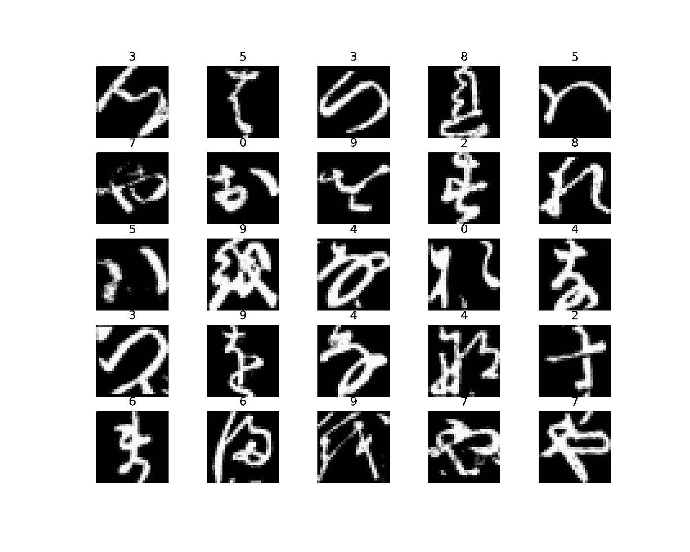

# 五分钟内完成端到端 Pytorch 模型

> 原文：<https://towardsdatascience.com/end-to-end-pytorch-model-in-five-minutes-a72da7bd4ebb>

## 标准化数据加载器、模型、培训和验证——因此您不必

照片由 [Ocean Ng](https://unsplash.com/@oceanng?utm_source=medium&utm_medium=referral) 在 [Unsplash](https://unsplash.com?utm_source=medium&utm_medium=referral) 上拍摄

如果您想在五分钟内编写一个 Pytorch 模型，需要经历四个步骤:

1.  导入和预处理(数据集)数据，并对其进行批处理(数据加载器)
2.  使用`nn.Module`建立模型
3.  编写一个训练循环并运行它
4.  在验证集上验证

因为 MNIST 已经被做死了，我们将介绍如何导入火炬视觉数据集，并在五分钟内编写一些代码。由于这个原因，它不会很漂亮，但它会工作。

# 下载和导入数据

因为 MNIST 已经被做死了，我们将搜索标准的[火炬视觉数据集](https://pytorch.org/vision/stable/datasets.html)，看看是否有其他我们想要尝试和预测的东西。让我们来看看 Kuzushiji-MNIST，它是 MNIST 数据集的平假名(日语)替代物，由 70，000 幅图像组成。你可以在论文 [*日本古典文学的深度学习*](https://arxiv.org/abs/1812.01718) *中了解创建数据集背后的动机。*

首先，我们找到每个通道的均值和标准差。这背后的原因是，我们显然希望归一化我们的训练数据，但 Pytorch 变换需要预先给定归一化均值和标准差。因此，我们将使用数据集来查找这些值，然后重新导入它，并传递带有预定义值的规范化转换。

注意,`kmnist`是一个数据集，所以循环遍历它会在每个实例上给我们一个图像和一个标签。因此，如果我们循环遍历数据集中的每一幅图像，并沿着额外的第四维堆叠它们，我们将得到所有图像的张量。

我们现在计算每个通道的平均值。请注意，调用`imgs.view(1,-1)`会将所有张量挤入第二维，导致我们有一个尾随的第一维。因此，我们取第二维像素值的平均值(因此为`dim=1`)。我们也对标准差做同样的事情。

我们现在可以重新导入我们的数据，使用一个`Normalize`变换以及一个将数组转换为张量的变换。请注意，`Normalize`转换将像素值的平均值和标准偏差作为参数。

现在我们有了数据集，我们需要将这些数据输入到`DataLoader`中进行批量处理。如果你在 CPU 上，一定要设置小一点的批量，设置`num_workers=1`(这是 GPU 的事情，不用太在意)。

我们可以查看数据集中的一些样本。我不打算在这里遍历代码，它应该是不言自明的。

图片作者。

# 构建模型

这不是一个关于如何从理论上构建深度学习模型的教程。因此，我们将在这里展示这个模型，并且只评论三件事。首先，您需要将您的模型实例化为`nn.Module`的实例，方法是将其传递给该类。第二，你需要通过通常的 Python 方法初始化超类(教程[这里](https://realpython.com/python-super/))。最后，你需要一个模型初始化，在这里我们定义所有的模型层，然后是一个正向方法，告诉模型如何接受输入并通过这些层传递。仅此而已。

在这个阶段，通过从数据加载器中给模型一个例子来调试模型总是很重要的。然后，我们将这个图像传递给模型，并检查它是否输出了正确大小的东西。

完美。我们构建了一个模型，该模型采用 K-MNIST 图像，并输出 10 个类别，代表从 0 到 9 的每个可能数字的 10 种不同概率。

# 编写和运行训练循环

像往常一样，我们的训练步骤是老一套。向前传球。计算损失。重置梯度(Pytorch 专业)。反向传播计算相对于损失的梯度。用这些梯度更新我们的权重。仅此而已(记得将模型设置为`train`模式)。

然后，我们实例化我们的模型，设置 Adam 优化器，并使用交叉熵损失(因为这是一个多类分类问题)。如果你的问题需要你改变这些，优化器和损失函数分别在`torch.optim`和`torch.nn`中。

然后将这些参数传递给训练循环，让它运行。

# 验证模型

我们希望事情尽可能简单，所以我们要让我们的验证循环的结构反映训练循环。迭代验证数据加载器中的图像和标签。向前传递，通过找到输出张量中值最高的索引来获得预测(记住，我们输出 10 个概率的向量)。记住使用`.data.squeeze()`来获得实际的标量本身。最后，通过对预测等于标签的所有时间求和(使用`np.sum()`和`.item()`来避开梯度)，除以标签的总数，打印出准确度。

验证集准确率为 95%。对于五分钟的编码来说还不错。

# 结论和进一步措施

您可以为自己做几件事来使您的模型变得更好:

*   *在模型训练时打印验证集指标:*显然，很高兴看到训练损失随着每个时期而减少。但是在我们训练后验证它之前，我们真的不知道模型的表现如何。如果您打印验证准确性，您将对模型的成功有更好的了解。
*   *实施提前停止:*一旦验证准确度在一定数量的时期内未能提高(称为耐心)，则返回到最佳执行时期并使用这些权重。
*   *看看其他指标:*另一个真正强大的指标是曲线下面积(AUC)，通过对所有类使用加权平均精确召回率，可以从二进制到多类分类采用该指标(有关这方面的介绍，请参见此处的)。
*   *实现剩余网络架构:*自从引入 CNN 以来，计算机视觉已经走过了漫长的道路。您可以尝试其他架构来提高性能。你甚至可能想试一试计算机视觉转换器。

仅此而已。希望这篇文章能够消除大多数 Pytorch 入门教程中包含的许多不必要的排场。我发现，一旦我知道了深度学习的理论基础，我真的希望有一种资源来帮助我自己构建这些模型的纯端到端过程。我希望这能为你提供这样的资源。