# 使用实时非侵入式负载监控的能量管理

> 原文：<https://towardsdatascience.com/energy-management-using-real-time-non-intrusive-load-monitoring-3c9b0b4c8291>

## 如何在边缘使用机器学习构建可持续清洁能源的关键组成部分

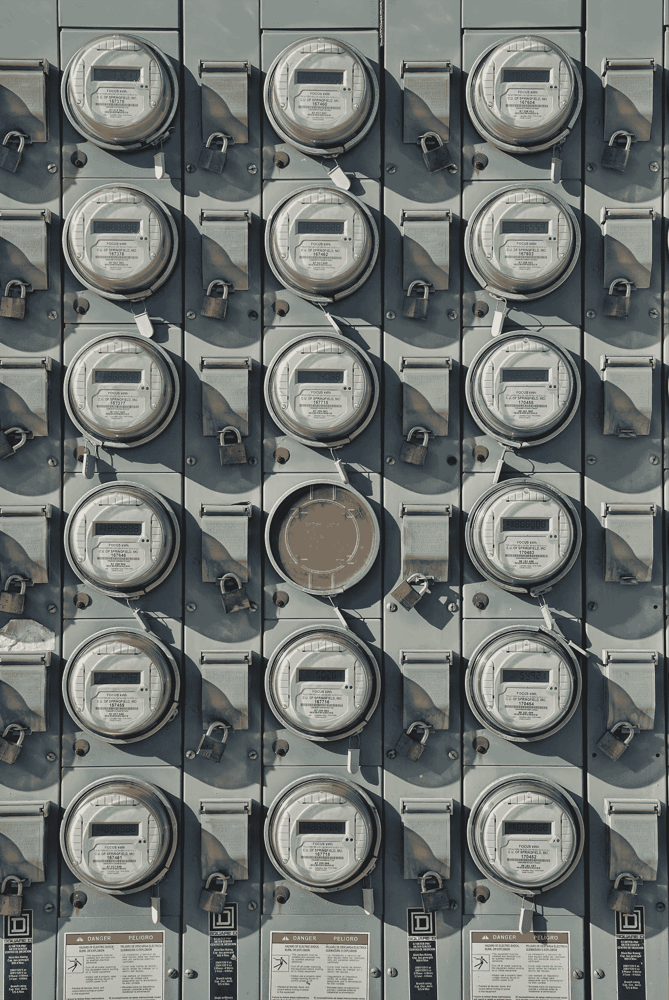

罗伯特·林德在 [Unsplash](https://unsplash.com?utm_source=medium&utm_medium=referral) 上的照片

# 介绍

非侵入式负载监测(NILM)的目标是从总电源信号中恢复单个设备的能耗，总电源信号是建筑物或房屋总耗电量的一种度量。NILM 也被称为能量分解，这两个术语将在本文中互换使用。

R.Gopinath 等人在论文*中很好地总结了 NILM 背后的理性:使用非侵入式负载监控技术的能源管理——最新技术和未来研究方向:*

> 近年来，发展智能可持续城市已成为城市规划者和决策者负责任地利用资源、保护环境和改善社会福祉的首要重点。能源管理是智能可持续城市发展方案的一个组成部分，该方案涉及有意识和有效地利用现有能源资源，以实现能源系统的可持续性和自力更生。建筑行业是使用能源较多的关键行业之一。因此，人们正在努力有效地监控和管理住宅和商业建筑中的能源消耗。近年来，非侵入式负荷监测(NILM)技术已成为一种流行的新兴方法，用于使用单个电能表来监测建筑物中电器/电力设施的事件(开/关)和能耗。关于电器级别的能量消耗的信息将帮助消费者了解他们的电器使用行为，并采取必要的步骤来减少能量消耗。

通过使用在公开可用的数据集上训练的深度学习模型，现在可以通过利用商用硬件和开源软件以非常经济高效的方式实现 NILM。在电网的边缘，即建筑物层，部署训练模型导致额外的成本节约，因为它消除了对总是连接的互联网云服务的需要，这在规模上可能是昂贵的，并且实时运行算法提供了低延迟操作。

这篇文章将向你展示 NILM 是如何工作的，带你完成我在家里实现一个原型系统的步骤。

# 体系结构

下面的前两个图表从较高的层面说明了 NILM 的概念和流程步骤。最后一张图展示了我的原型系统，它基于这些概念，并使用基于 Arduino 和 Raspberry Pi 的计算来实现。

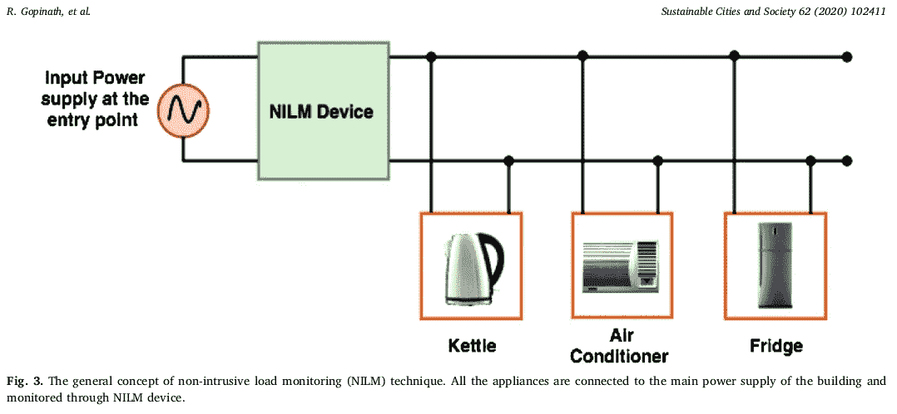

一般 NILM 概念(R. Gopinath 等人)

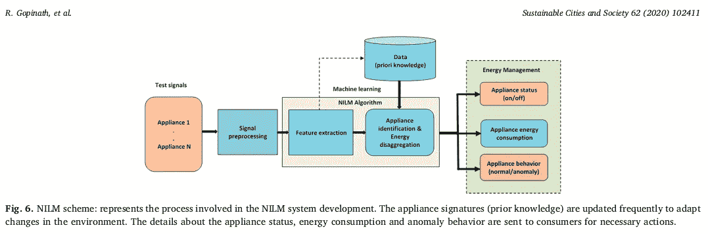

NILM 过程步骤(R. Gopinath 等人)

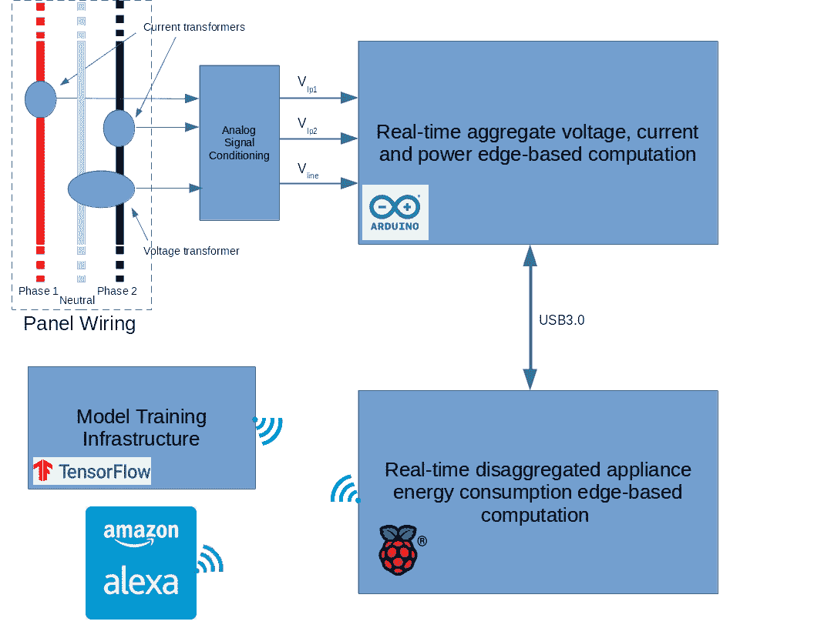

NILM 原型系统框图

# NILM 算法选择和模型训练

## 算法选择

能量分解是一个非常欠定的单通道盲源分离(BSS)问题，这使得很难获得准确的预测。您需要从单个观察中提取多个来源。过去的方法包括因子隐马尔可夫模型(FHMM)和具有一些 success⁶.的各种基于事件的方法

您还可以通过使用神经网络的序列到序列(seq2seq)学习来解决单通道 BSS 问题，并且可以使用卷积和递归神经网络将其应用于 NILM 问题。Seq2seq 学习涉及训练一个深度网络，以在输入时间序列(如 NILM 的总电力读数)和输出序列(如单台设备的估计能耗)之间进行映射。滑动输入窗口通常用于训练网络，该网络产生相应的输出窗口。此方法为输出中的每个设备生成多个预测，因此预测的平均值用于最终结果。有些预测会比其他预测更准确，尤其是那些接近输入滑动窗口中点的预测。平均会降低预测的整体准确度。

对于单通道 BSS⁴.，seq2seq 学习的一些缺点可以通过序列到点学习(seq2point)来减轻在这种方法中还使用滑动输入信号窗口，但是网络被训练为仅在窗口的中点预测输出信号，这使得网络上的预测问题更容易，从而导致更准确的结果。

我为我的原型系统选择了 seq2point 学习方法，我的实现受到了 Michele DIncecco、Stefano Squartini 和 Mingjun Zhong⁵.描述的工作的启发和指导

## 数据集

有许多专门为解决 NILM 问题而设计的大规模公开可用数据集，这些数据集是在不同国家的家庭建筑中捕获的。下面的 table⁷展示了几种最广泛使用的。

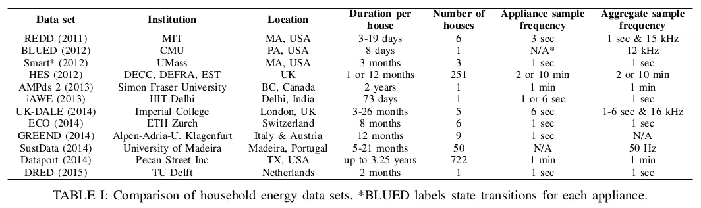

NILM 数据集(奥利弗·帕森和 al.⁷)

数据集通常包括数百万个有功功率、无功功率、电流和电压样本，但采样频率不同，需要在使用前对数据进行预处理。大多数 NILM 算法仅利用有功或视在功率数据。能源分解研究通常考虑五种电器，它们是水壶、微波炉、冰箱、洗碗机和洗衣机。这些是我根据 Michele DIncecco 等人的工作为原型考虑的设备。 ⁵，我主要关注 REFIT⁸数据 et，但最终将包括 UK-DALE 和 REDD。

## 模特培训

我使用 TensorFlow 2 和 Keras APIs 来训练和测试模型。与这部分相关的所有代码都可以在该项目的 GitHub， [NILM](https://github.com/goruck/nilm/tree/main/ml) ⁹.的机器学习部分找到

用于器具的 seq2point 学习模型在 z 归一化改装数据上被单独训练。我使用以下四个指标来评估模型的性能。你可以在这里查看计算这些指标[的代码。](https://github.com/goruck/nilm/blob/main/ml/nilm_metric.py)

*   平均绝对误差(MAE ),用于评估每个时间点的预测值与实际值之间的绝对差值，并计算平均值。
*   归一化信号总误差(SAE)，表示总能量的相对误差。
*   每日能量(EpD ),用于测量一天中使用的预测能量的绝对误差，当家庭用户对一段时间内消耗的总能量感兴趣时非常有用。
*   标准化分解误差(NDE ),用于测量预测值和设备实际值之间的平方差的标准化误差。

我使用 Keras Functional API 创建了 seq2point 学习模型，如下面的 Python 函数所示。您可以在该项目的 GitHub 中找到替代的模型架构，但是这个目前给出了最好的结果。

seq2point 学习模型

集合表观功耗信号的 599 个样本的滑动窗口被用作 seq2point 模型的输入，并且电器的相应窗口的中点被用作目标。您可以在下面的代码片段中看到示例和目标是如何生成的。

窗口生成器

你可以在下面看到我用来训练模型的代码片段和完整的程序[这里](https://github.com/goruck/nilm/blob/main/ml/train.py)。为了训练，我使用了 Keras [Adam](https://www.tensorflow.org/api_docs/python/tf/keras/optimizers/Adam) 优化器，为了减少过度拟合，我使用了[提前停止](https://www.tensorflow.org/api_docs/python/tf/keras/callbacks/EarlyStopping)和 [InverseTimeDecay](https://www.tensorflow.org/api_docs/python/tf/keras/optimizers/schedules/InverseTimeDecay) 。训练代码可以配置为从头开始训练 seq2point 模型，或者给定一个拟合的模型，用量化感知训练(QAT)对其进行修剪或微调，这两种方法都可以提高推理性能，尤其是在边缘硬件上。

主要培训代码

训练和优化程序的超参数总结如下。

*   输入窗口大小:599 个样本
*   批量:1000 个样品。
*   从零开始学习率:0.001，具有逆时间衰减。
*   QAT 和剪枝学习率:0.0001。
*   优化器:beta_1=0.9，beta_2=0.999，ε= 1e-08。
*   从无到有的早期停止标准:6 个时代。

训练程序监控训练和验证数据的均方误差(MSE)损失和验证数据的平均绝对误差(MAE ),并及早停止以减少过度拟合。数据集包含大量具有重复模式的样本(数以百万计);对于一些器具来说，仅在一个时期之后就出现过度适配的情况并不罕见。为了缓解这种情况，我使用了训练数据的子集，通常在 500 万到 1000 万个样本之间。

微波设备的典型从头训练运行的 MSE 和 MAE 结果如下所示。您可以看到，最小验证损失发生在第 10 个时期左右，此时训练程序保存为最终训练模型，并在第 16 个时期后提前停止。

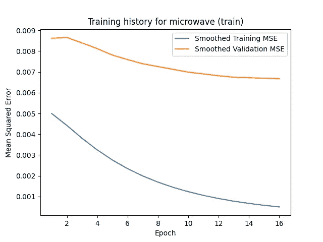

微波训练和验证损失

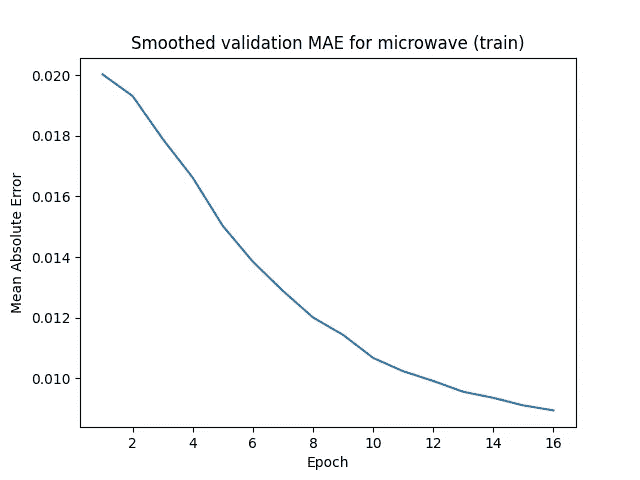

微波验证

按照上述指标得出的典型模型性能结果可在附录中找到。我达到或超过了 Michele DIncecco 等人在工作中报告的结果。 ⁵

## 模型量化

我使用 [TensorFlow Lite](https://www.tensorflow.org/lite) 将模型的权重和激活函数从 Float32 量化到 INT8，以提高边缘硬件上的推理性能，包括 Raspberry Pi 和 Google Edge TPU。量化后，您可能会观察到性能略有下降，但这对于大多数用例来说是可以接受的。典型结果如下所示，请注意，浮点模型在 INT8 转换之前既没有使用 QAT 进行微调，也没有进行修剪。

```
### Fridge Float32 vs INT8 Model Performance ###Float32 tflite Model (Running on x86 w/XNNPACK):
MAE 17.10(Watts)
NDE 0.373
SAE 0.283
Inference Rate 701.0 HzINT8 tflite Model (running on Raspberry Pi 4):
MAE: 12.75 (Watts)
NDE 0.461
SAE 0.120
Inference Rate 163.5 Hz
```

与此部分相关的所有代码都可以在该项目的 GitHub、 [NILM](https://github.com/goruck/nilm/tree/main/ml) ⁹的机器学习部分找到，特别是参见下面的模块[convert _ keras _ to _ TF lite . py](https://github.com/goruck/nilm/blob/main/ml/convert_keras_to_tflite.py)及其代码片段。

Keras 到 tflite 转换函数

# NILM 原型系统组件

我在家里建造了一个 NILM 原型，在真实世界条件下测试能量分解算法，并了解它们可以改进的地方。原型由以下主要子系统组成。你可以在附录中看到原型的照片。

## 模拟信号调理

我在家里的一个子面板上使用了两个夹式电流互感器来感测流经每个分压相位的电流，并在断路器面板附近的插座上插入了一个电压互感器，以提供其中一个相位的电压。这些信号由该子系统进行电平转换、放大和低通滤波，然后传递给执行总指标计算的 [Arduino MEGA 2560](https://docs.arduino.cc/hardware/mega-2560) 内部的模数转换器。您可以在附录中看到模拟信号调理子系统的原理图。

## 聚合指标计算

我使用 Arduino MEGA 2560 来托管信号处理算法，该算法从模拟信号调理子系统获取电压信号，并实时产生总均方根电压、均方根电流、有功功率和视在功率指标。目前，在下游处理中仅使用有功功率。我利用了⁰的 emonLibCM 来实现这些信号处理算法。emonLibCM 在后台持续运行，对 Arduino 的模拟输入通道进行数字化处理，计算这些指标，然后通知 Arduino 草图测量可用，应由下游处理读取和处理。草图配置为每八秒更新一次指标，每次更新后执行模拟前端的自动增益控制，以优化信噪比。

你可以在下面和项目的 GitHub 中看到 Arduino 草图， [NILM](https://github.com/goruck/nilm/blob/main/ard/ard.ino) ⁹

Arduino 草图

## 分项能耗计算

实际的能源分解计算在一个 [Raspberry Pi 4](https://www.raspberrypi.com/products/raspberry-pi-4-model-b/) 上进行，它通过 USB 连接到 Arduino 以获取聚合指标。计算包括运行 tflite 设备推理模型，按照上述步骤进行训练和量化，以及预处理和后处理步骤。推理模型从集合实际功率输入信号的 599 个样本大小的窗口中输出每个设备的预测能量。这些预测存储在本地 CSV 文件中，可用于下游报告和分析。

下图显示了我家的典型分类能源预测结果，使用的是在另一台机器上根据上述数据集训练的 tflite 模型。

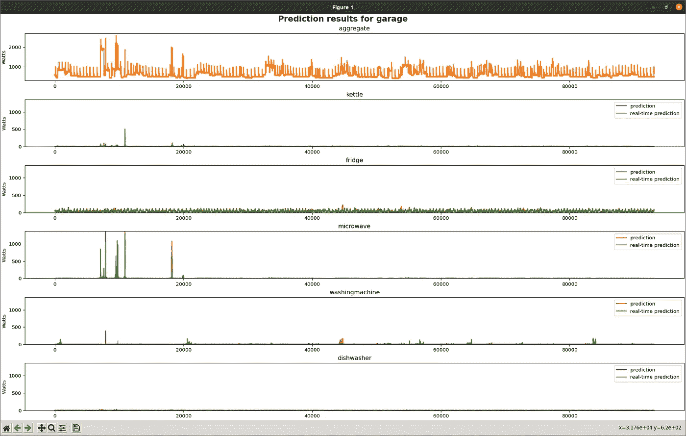

Float32 和 tflite 设备型号预测

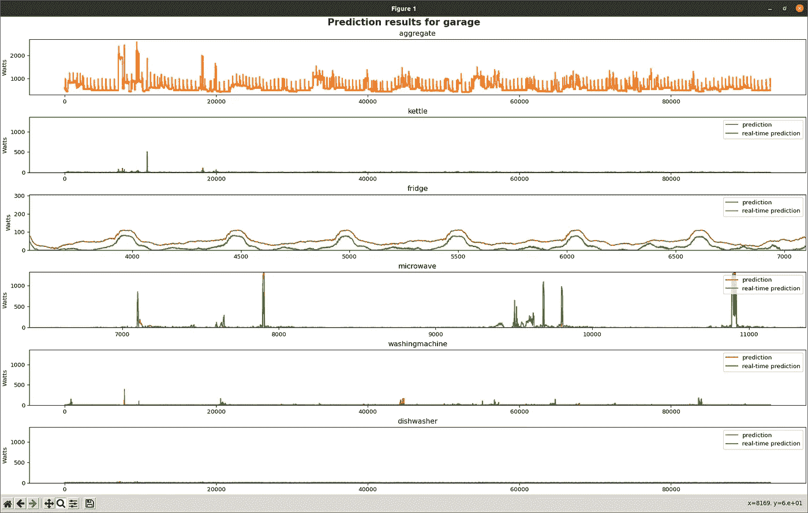

放大冰箱和微波炉

没有对本地数据进行微调。水平轴是由八秒样本数(采样间隔是八秒)测量的时间，在本例中，它跨越了大约八天半。纵轴是以瓦特为单位的能耗。顶部曲线是总(两相)市电视在功率。以下轨迹是每个设备的预测能量。在此期间，参考设备组中只有一台冰箱和一台微波炉在使用，尽管同一子面板还提供了其他设备，如计算机和加热器。

可以看到，Float32 和 tflite 版本的算法都检测冰箱和微波炉，但两者之间存在能量偏移，这可能表明需要更好的校准。我用功率表计算了冰箱和微波炉的均方根功耗；它与 Float32 预测的误差在+/- 15%以内。

与此部分相关的所有代码都可以在该项目的 GitHub、 [NILM](https://github.com/goruck/nilm/tree/main/rpi) ⁹的机器学习部分找到，特别是参见模块 [infer.py](https://github.com/goruck/nilm/blob/main/rpi/infer.py) 和下面来自它的执行实时预测的代码片段。

infer.py 主要

## 亚马逊 Alexa

我计划使用亚马逊 Alexa 作为设备能源数据的用户界面，但这项工作尚未开始。

# 结论

通过使用大型公开可用数据集来训练 seq2point 学习模型，执行相当准确的能量分解是非常可行的，而无需用本地数据微调模型。这些模型大小适中，精度损失很小，可以量化以在商用边缘硬件(如 Raspberry Pi 4)上有效运行。需要做更多的工作来进一步提高模型的准确性，并使用更多的设备类型进行测试。该项目表明，可持续和可扩展的电网的一个关键组成部分是大众消费市场所能达到的。

# 参考

1.  可持续的城市和社会 62 (2020) 102411 |使用非侵入式负荷监测技术的能源管理 R. Gopinath、Mukesh Kumar、C. Prakash Chandra Joshua 和 Kota Srinivas 的最新技术和未来研究方向。
2.  维基| [信号分离](https://en.wikipedia.org/wiki/Signal_separation)。
3.  arXiv:1507.06594 | [神经 NILM:应用于能量分解的深度神经网络](https://arxiv.org/pdf/1507.06594.pdf)作者:Jack Kelly 和 William Knottenbelt。
4.  arXiv:1612.09106 | [用于非侵入式负荷监控的神经网络序列点到点学习](https://arxiv.org/pdf/1612.09106.pdf)作者:、钟明军、王宗佐、Nigel Goddard 和 Charles Sutton。
5.  arXiv:1902.08835 |[Michele DIncecco、Stefano Squartini 和 Mingjun Zhong 的《非侵入式负载监控的迁移学习》](https://arxiv.org/pdf/1902.08835.pdf)。
6.  可扩展能源转换的人工智能技术第 109–131 页|基于机器学习的非侵入式负荷监控方法综述。
7.  在第三届 IEEE 信号与信息处理全球会议上召开的第一届智能建筑信号处理应用国际研讨会| [Dataport 和 NILMTK:专为非侵入式负载监控设计的建筑数据集](https://www.researchgate.net/profile/Nipun-Batra/publication/281538210_Dataport_and_NILMTK_A_Building_Data_Set_Designed_for_Non-intrusive_Load_Monitoring/links/55ed13e208aeb6516268cffc/Dataport-and-NILMTK-A-Building-Data-Set-Designed-for-Non-intrusive-Load-Monitoring.pdf?origin=publication_detail)作者:Oliver Parson、Grant Fisher、April Hersey、Nipun Batra、Jack Kelly、Amarjeet Singh、William Knottenbelt 和 Alex Rogers。
8.  第八届国际家用电器和照明能效会议论文集| [个性化实时能源反馈数据管理平台](https://pure.strath.ac.uk/ws/portalfiles/portal/45214811/Murray_etal_EEDAL_2015_A_data_management_platform_for_personalised_real_time.pdf)作者:大卫·穆雷、廖婧、莉娜·斯坦科维奇、弗拉基米尔·斯坦科维奇、理查德·豪克斯韦尔·鲍德温、查理·威尔森、迈克尔·科尔曼、Tom Kane 和史蒂文·弗斯。本项目中使用的改装数据集是在知识共享署名 4.0 国际公共许可证下许可的。
9.  GitHub | [NILM](https://github.com/goruck/nilm) 作者林多·圣·安吉尔
10.  Trystan Lea，Glyn Hudson，Brian Orpin 和 Ivan 克拉韦茨。

# 附录

## 原型照片

下面是我的原型系统的早期版本的照片。

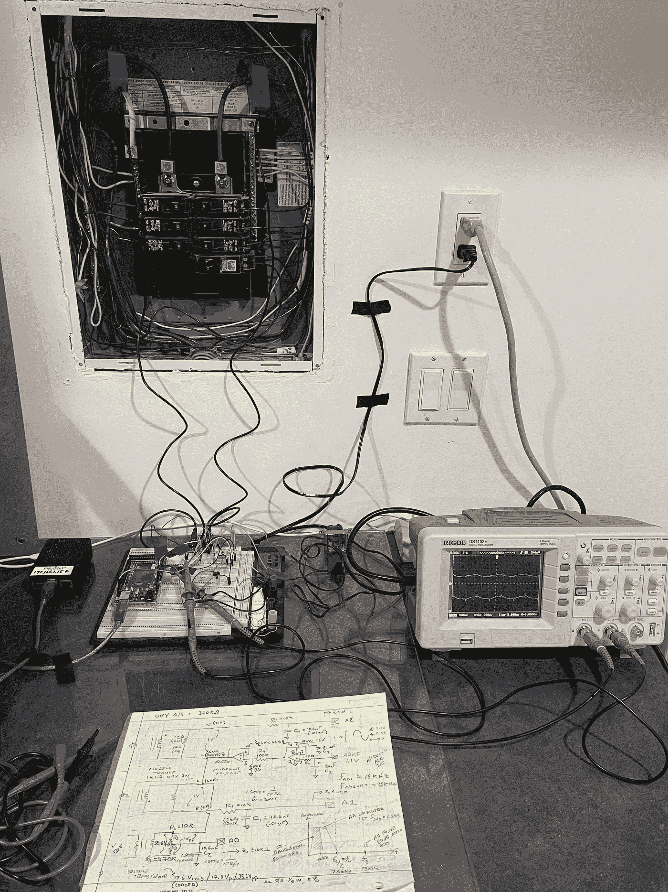

早期原型

## 模拟信号调理原理图

模拟信号调理电路原理图如下所示。

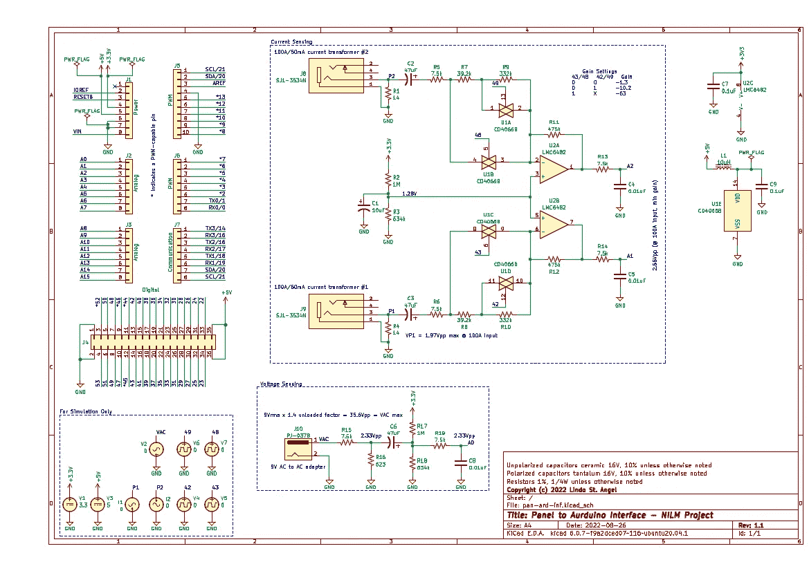

模拟信号调理原理图

## 模型训练结果

根据上述指标评估的典型模型性能如下。

```
### Dishwasher ###2022–06–05 12:48:09,322 [INFO ] Appliance target is: dishwasher
2022–06–05 12:48:09,322 [INFO ] File for test: dishwasher_test_H20.csv
2022–06–05 12:48:09,322 [INFO ] Loading from: ./dataset_management/refit/dishwasher/dishwasher_test_H20.csv
2022–06–05 12:48:10,010 [INFO ] There are 5.169M test samples.
2022–06–05 12:48:10,015 [INFO ] Loading saved model from ./models/dishwasher/checkpoints.
2022–06–05 12:48:35,045 [INFO ] aggregate_mean: 522
2022–06–05 12:48:35,046 [INFO ] aggregate_std: 814
2022–06–05 12:48:35,046 [INFO ] appliance_mean: 700
2022–06–05 12:48:35,046 [INFO ] appliance_std: 1000
2022–06–05 12:48:35,121 [INFO ] true positives=5168007.0
2022–06–05 12:48:35,121 [INFO ] false negatives=0.0
2022–06–05 12:48:35,121 [INFO ] recall=1.0
2022–06–05 12:48:35,173 [INFO ] true positives=5168007.0
2022–06–05 12:48:35,173 [INFO ] false positives=0.0
2022–06–05 12:48:35,173 [INFO ] precision=1.0
2022–06–05 12:48:35,173 [INFO ] F1:1.0
2022–06–05 12:48:35,184 [INFO ] NDE:0.45971032977104187
2022–06–05 12:48:35,657 [INFO ] 
MAE: 10.477645874023438
 -std: 104.59112548828125
 -min: 0.0
 -max: 3588.0
 -q1: 0.0
 -median: 0.0
 -q2: 0.78582763671875
2022–06–05 12:48:35,675 [INFO ] SAE: 0.1882956475019455
2022–06–05 12:48:35,691 [INFO ] Energy per Day: 145.72999548734632### Microwave ###2022-06-05 18:14:05,471 [INFO ]  Appliance target is: microwave
2022-06-05 18:14:05,471 [INFO ]  File for test: microwave_test_H4.csv
2022-06-05 18:14:05,471 [INFO ]  Loading from: ./dataset_management/refit/microwave/microwave_test_H4.csv
2022-06-05 18:14:06,476 [INFO ]  There are 6.761M test samples.
2022-06-05 18:14:06,482 [INFO ]  Loading saved model from ./models/microwave/checkpoints.
2022-06-05 18:14:38,385 [INFO ]  aggregate_mean: 522
2022-06-05 18:14:38,385 [INFO ]  aggregate_std: 814
2022-06-05 18:14:38,385 [INFO ]  appliance_mean: 500
2022-06-05 18:14:38,385 [INFO ]  appliance_std: 800
2022-06-05 18:14:38,478 [INFO ]  true positives=6759913.0
2022-06-05 18:14:38,478 [INFO ]  false negatives=0.0
2022-06-05 18:14:38,478 [INFO ]  recall=1.0
2022-06-05 18:14:38,549 [INFO ]  true positives=6759913.0
2022-06-05 18:14:38,549 [INFO ]  false positives=0.0
2022-06-05 18:14:38,549 [INFO ]  precision=1.0
2022-06-05 18:14:38,549 [INFO ]  F1:1.0
2022-06-05 18:14:38,568 [INFO ]  NDE:0.6228251457214355
2022-06-05 18:14:39,469 [INFO ]  
MAE: 7.6666789054870605
    -std: 73.37799835205078
    -min: 0.0
    -max: 3591.474365234375
    -q1: 0.757080078125
    -median: 1.178070068359375
    -q2: 1.459686279296875
2022-06-05 18:14:39,493 [INFO ]  SAE: 0.2528369128704071
2022-06-05 18:14:39,512 [INFO ]  Energy per Day: 99.00535584592438### Fridge ###2022-06-06 05:14:39,830 [INFO ]  Appliance target is: fridge
2022-06-06 05:14:39,830 [INFO ]  File for test: fridge_test_H15.csv
2022-06-06 05:14:39,830 [INFO ]  Loading from: ./dataset_management/refit/fridge/fridge_test_H15.csv
2022-06-06 05:14:40,671 [INFO ]  There are 6.226M test samples.
2022-06-06 05:14:40,677 [INFO ]  Loading saved model from ./models/fridge/checkpoints.
2022-06-06 05:15:11,539 [INFO ]  aggregate_mean: 522
2022-06-06 05:15:11,539 [INFO ]  aggregate_std: 814
2022-06-06 05:15:11,539 [INFO ]  appliance_mean: 200
2022-06-06 05:15:11,539 [INFO ]  appliance_std: 400
2022-06-06 05:15:11,649 [INFO ]  true positives=6225098.0
2022-06-06 05:15:11,649 [INFO ]  false negatives=0.0
2022-06-06 05:15:11,649 [INFO ]  recall=1.0
2022-06-06 05:15:11,713 [INFO ]  true positives=6225098.0
2022-06-06 05:15:11,713 [INFO ]  false positives=0.0
2022-06-06 05:15:11,713 [INFO ]  precision=1.0
2022-06-06 05:15:11,713 [INFO ]  F1:1.0
2022-06-06 05:15:11,728 [INFO ]  NDE:0.390367716550827
2022-06-06 05:15:12,732 [INFO ]  
MAE: 18.173030853271484
    -std: 22.19791030883789
    -min: 0.0
    -max: 2045.119873046875
    -q1: 5.2667236328125
    -median: 12.299388885498047
    -q2: 24.688186645507812
2022-06-06 05:15:12,754 [INFO ]  SAE: 0.3662513792514801
2022-06-06 05:15:12,774 [INFO ]  Energy per Day: 219.63657335193759### Washing Machine ###2022-06-05 05:49:17,614 [INFO ]  Appliance target is: washingmachine
2022-06-05 05:49:17,614 [INFO ]  File for test: washingmachine_test_H8.csv
2022-06-05 05:49:17,614 [INFO ]  Loading from: ./dataset_management/refit/washingmachine/washingmachine_test_H8.csv
2022-06-05 05:49:18,762 [INFO ]  There are 6.118M test samples.
2022-06-05 05:49:18,767 [INFO ]  Loading saved model from ./models/washingmachine/checkpoints.
2022-06-05 05:49:47,965 [INFO ]  aggregate_mean: 522
2022-06-05 05:49:47,965 [INFO ]  aggregate_std: 814
2022-06-05 05:49:47,965 [INFO ]  appliance_mean: 400
2022-06-05 05:49:47,965 [INFO ]  appliance_std: 700
2022-06-05 05:49:48,054 [INFO ]  true positives=6117871.0
2022-06-05 05:49:48,055 [INFO ]  false negatives=0.0
2022-06-05 05:49:48,055 [INFO ]  recall=1.0
2022-06-05 05:49:48,115 [INFO ]  true positives=6117871.0
2022-06-05 05:49:48,115 [INFO ]  false positives=0.0
2022-06-05 05:49:48,115 [INFO ]  precision=1.0
2022-06-05 05:49:48,115 [INFO ]  F1:1.0
2022-06-05 05:49:48,128 [INFO ]  NDE:0.4052383601665497
2022-06-05 05:49:48,835 [INFO ]  
MAE: 20.846961975097656
    -std: 155.17930603027344
    -min: 0.0
    -max: 3972.0
    -q1: 3.0517578125e-05
    -median: 0.25152587890625
    -q2: 1.6888427734375
2022-06-05 05:49:48,856 [INFO ]  SAE: 0.3226347267627716
2022-06-05 05:49:48,876 [INFO ]  Energy per Day: 346.94591079354274### Kettle ###2022-05-25 15:19:15,366 [INFO ]  Appliance target is: kettle
2022-05-25 15:19:15,366 [INFO ]  File for test: kettle_test_H2.csv
2022-05-25 15:19:15,366 [INFO ]  Loading from: ./dataset_management/refit/kettle/kettle_test_H2.csv
2022-05-25 15:19:16,109 [INFO ]  There are 5.734M test samples.
2022-05-25 15:19:16,115 [INFO ]  Loading saved model from ./models/kettle/checkpoints.
2022-05-25 15:19:44,459 [INFO ]  aggregate_mean: 522
2022-05-25 15:19:44,459 [INFO ]  aggregate_std: 814
2022-05-25 15:19:44,459 [INFO ]  appliance_mean: 700
2022-05-25 15:19:44,459 [INFO ]  appliance_std: 1000
2022-05-25 15:19:44,540 [INFO ]  true positives=5732928.0
2022-05-25 15:19:44,540 [INFO ]  false negatives=0.0
2022-05-25 15:19:44,540 [INFO ]  recall=1.0
2022-05-25 15:19:44,597 [INFO ]  true positives=5732928.0
2022-05-25 15:19:44,597 [INFO ]  false positives=0.0
2022-05-25 15:19:44,597 [INFO ]  precision=1.0
2022-05-25 15:19:44,597 [INFO ]  F1:1.0
2022-05-25 15:19:44,610 [INFO ]  NDE:0.2578023374080658
2022-05-25 15:19:45,204 [INFO ]  
MAE: 18.681659698486328
    -std: 125.82673645019531
    -min: 0.0
    -max: 3734.59228515625
    -q1: 0.0
    -median: 0.20867919921875
    -q2: 1.63885498046875
2022-05-25 15:19:45,224 [INFO ]  SAE: 0.2403179109096527
2022-05-25 15:19:45,243 [INFO ]  Energy per Day: 155.25137268110353
```