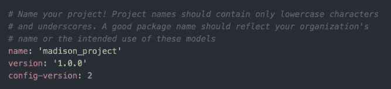
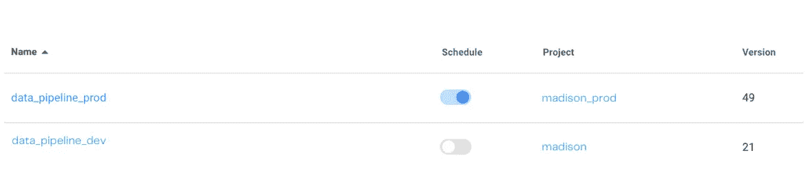

# 工程最佳实践应用于您的分析工作流程

> 原文：<https://towardsdatascience.com/engineering-best-practices-to-apply-to-your-analytics-workflow-75ea7ab8ae90>

## 如何利用 Github、版本控制和数据质量测试为您带来优势

由[埃斯特迪奥·布鲁姆](https://unsplash.com/@estudiobloom?utm_source=unsplash&utm_medium=referral&utm_content=creditCopyText)在 [Unsplash](https://unsplash.com/s/photos/best-practice?utm_source=unsplash&utm_medium=referral&utm_content=creditCopyText) 上拍摄的照片

无论您的职业生涯是从数据工程师、数据科学家还是数据分析师开始的，每个角色的最佳实践都可以应用到您的分析工作流程中。作为一名前数据工程师，我学习了 Github 的最佳实践，比如创建新的分支、审查拉请求以及对我的代码进行版本控制。

但是，我不会说谎，当你从一个公司角色到一个刚刚开始使用数据堆栈的小公司时，有更重要的优先事项。关注速度和直接影响，而不是编写干净代码的最佳实践，可能会很容易。

这绝对是一种微妙的平衡。你想立刻对业务产生尽可能大的影响。但是，您也希望从一开始就制定高标准。当你没有以高标准开始时，当你决定是时候优先考虑质量时，你会给自己留下一个更大的烂摊子。

那么，我们可以从传统的软件工程角色中获得哪些应用于分析的最佳实践呢？

# Github 分支

在我的数据工程角色中，从 main 或 master 创建您自己的分支，并在其上编写您的更改是一个最佳实践。这确保了不正确的代码不会被推送到我们的主分支，破坏代码库。这起到了检查的作用，最大限度地减少了出错的可能性。

为了让代码进入主分支，它必须经过我团队中另外两个人的审查和批准。我们稍后会深入讨论这个问题，但是每个团队都应该这样做。如果你的团队中有不止一个人在使用 Github，这是*必要的*。

当然，如果你试图快速测试你的代码并将其推向生产，它会减慢速度。但是，从长远来看，它利大于弊。创建分支时，可以为您正在处理的每个票据或每个数据模型创建一个新分支。当您将所有代码更改放在一个分支上时，可能会变得草率。

例如，假设您正在开发一个客户获取数据模型。您将创建一个名为`customer_acquisition`的 Github 分支，并在该分支上编写您的模型。然后，当您的任务完成时，您可以将它合并到`main`中，供其他人查看。

如果您在处理`customer_acquisition`模型的同时也对`revenue`模型进行了更改，那么您将创建一个名为`revenue`的`main`的新分支来编写您的更改。这样，您对不同模型的更改就不会都写在同一个分支上。

这样做可以很容易地跟踪跨数据模型的变更，并确保所有内容都正确地合并到主代码库中。

# Github 拉请求和代码审查

当您将分支代码与主代码库合并时，您需要创建一个拉请求。Github 上的 pull 请求将突出显示主分支代码和您的分支代码之间的所有更改。突出显示这些更改是一种很好的方式，可以确保您已经做出了想要做出的更改。

很多时候，当我这样做的时候，我会发现一些小的错别字，这些错别字是我在编辑数据模型的时候无意犯的。这是捕捉这些的好方法！

为了提高代码质量，您应该在合并代码之前，由团队中的某个人强制执行代码审查。

## 如何添加分支保护

为此，您需要导航到“分支保护”设置，并选中“合并前要求提取请求审查”。然后，您可以选择所需的审阅者人数。如果你在一个小团队中工作，最好只选择一个。

你总是想让别人关注你的代码。两对眼睛总比一对好！你的队友可能会抓住你没有抓住的东西。如果没有，你可以感觉很好，知道你的代码不会破坏生产中的东西。

作为团队中唯一的分析工程师，我经常在本地计算机上保存大量代码。显然，这不是一个很好的实践。您总是希望您的团队能够找到代码的最新版本，与他们在您的数据仓库中看到的相匹配的版本。强制分支和代码审查也迫使你将最新的代码推送到 Github。如果你做了更改，它需要被其他人看到才能被批准。透明永远是最好的！

# 版本控制

添加版本是数据模型和数据管道的最佳实践。它们帮助您识别所做的更改，并确定最后的成功或失败的原因。

## 使用 dbt 进行转换

如果你是一名分析工程师，很可能你也是 [dbt](/is-dbt-the-future-of-analytics-d6ff93cbb20c) 的用户(和爱好者)。dbt 使得对我们的数据模型进行版本控制变得容易。每个 yaml 文件中都有一个包含版本的选项。每次对这些文件进行重大更新时，也应该更新版本。

作者图片

跟踪数据模型的版本将允许在出错的情况下更容易地调试。您可以轻松地恢复到模型的上一个成功版本，而不是让生产中断，直到您发现问题。

如果您使用 dbt 的文档特性，版本控制会清楚地显示在一个易于阅读的 UI 中，供您使用。

## 管弦乐编曲

出于同样的原因，对您的 dbt 模型进行版本控制很重要，选择包含版本控制的编排工具也很重要。同样，在出现问题的情况下，您希望确保可以恢复到以前的版本，这样生产不会长时间停止。

就个人而言，我使用[perfect](/tired-of-airflow-try-this-c51ec26cd29d)来编排我的数据模型。它们为每个项目中的每个流程提供自动版本控制。这使得跟踪我在开发和生产环境中部署的版本变得容易。我还在每个流程提供的自述文件中记录了每个版本部署的模型。

作者图片

您可以在最右边看到为我的每个管道列出的版本号。这有助于我跟踪每个环境中部署了多少个不同版本的管道。

# 测试

测试是软件工程世界中的另一个重要实践，但是在分析中却被忽略了。但是测试应该和每一种开发类型的*一起进行。每当代码发生变化并有可能影响最终用户(无论是业务团队还是实际客户)的产品时，都需要进行测试！*

当我作为一名数据工程师工作时，我们总是有至少四个不同的测试环境，代码在最终进入生产之前必须部署到这些环境中。我们有多个开发环境、试运行和预生产。虽然我不认为这对分析是必要的，但我们确实需要至少一个开发环境来测试代码更改。

## 开发和生产管道

我们的数据通过数据管道从 A 点移动到 B 点。我们的管道运行我们所有的建模代码。因此，有必要对它们进行测试。每当您需要将一个新模型部署到生产环境中时，都需要首先使用测试管道进行部署。当对任何数据模型进行更改，或者创建一个新的数据模型时，总是有可能出现上游和下游问题。您将能够首先在您的开发环境中捕获这些，而不是在您将更改部署到生产环境中时。

我有过几次需要在基本模型中更改列名的情况。每当您对您的基础模型进行更改时，有可能会有下游模型引用这些列。如果不跟踪列血统，很难在下游做出所有需要的更改。很多时候，模型会因为我忘记更改被引用的列名而无法运行。首先部署到开发有助于捕捉这些小错误，这样它们就不会破坏生产流程。

## 数据质量检查

测试的另一个关键部分是对数据管道进行数据质量检查。这些测试应该在您的管道中运行，沿途检查数据的某些方面。

## dbt 测试

如果已经在使用 [dbt](/what-is-dbt-a0d91109f7d0) 编写数据模型，dbt 测试是一个很好的方法。您可以将它们直接添加到您的 dbt 项目中，让它们检查 null 值、惟一值、可接受值以及列之间的关系。

关于 dbt 测试最好的部分是您可以为您的源数据和模型运行它们。我推荐两个都设置！通过这种方式，您可以捕捉任何上游数据质量问题，也可以捕捉由模型代码引起的问题。

## re_data

我还喜欢使用一个名为 [re_data](/prevent-data-loss-with-this-free-dbt-package-a676c2e59c97) 的 dbt 包，它可以检测你的数据中的异常。我特别喜欢用这个包来测试新鲜度和行数。该软件包被设置为像 dbt 模型一样运行，它将向您选择的松弛通道直接发送警报。

它通过计算您正在监控的指标的平均值和标准偏差来工作。它在识别其他类型的测试可能检测不到的奇怪问题方面做得很好。要了解如何设置这个 dbt 包，请查看这篇文章。

# 结论

我怎么强调都不为过。最佳实践应该从一开始就设定。没有它们的时间越长，你的数据和代码就会变得越乱。从长远来看，你只会为你自己和你的团队创造更多的工作。这听起来可能并不有趣和迷人，但是从一开始就记录你的团队的最佳实践将会使你的团队走得更远。

随着分析变得越来越复杂，我们有很多东西要向软件工程团队学习。随着工程和分析的相互交织，我们制定的标准也是如此。我们不能再像以前那样做事了。我们需要拥抱 Github、版本控制和测试。它们在工程中如此常见是有原因的——它们降低了风险！

要了解分析工程领域的更多最佳实践，[订阅](https://madisonmae.substack.com/)我的时事通讯。