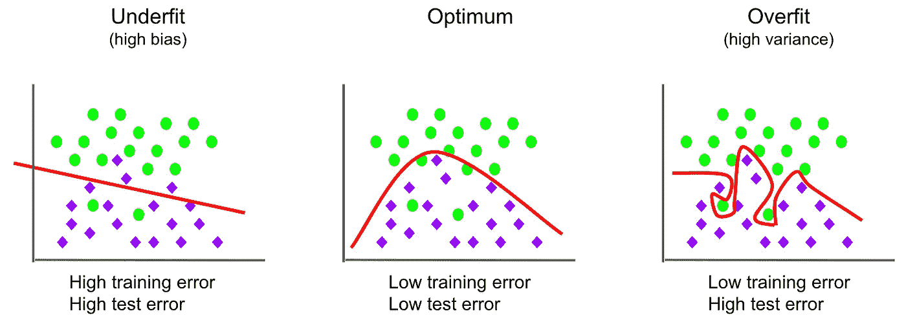
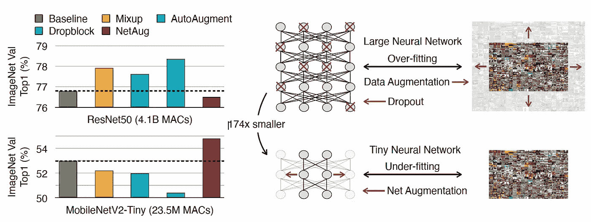
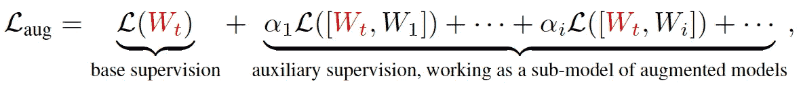

# 提高微型神经网络的训练性能

> 原文：<https://towardsdatascience.com/enhancing-the-performance-in-training-tiny-neural-networks-601b0321716b>

## 注意训练大型和小型神经网络的区别

克雷格·麦克戈尼格尔在 [Unsplash](https://unsplash.com?utm_source=medium&utm_medium=referral) 上的照片

训练深度神经网络(NN)是困难的，有时甚至对于资深从业者来说也是棘手的。为了在给定特定数据集的情况下达到模型的最高潜在性能，我们需要考虑许多方面:超参数调整、正则化、验证度量、归一化等等。**然而，我们应该考虑的问题并不是对所有不结盟国家都适用的。这取决于模型的大小。**

由于大模型容易过拟合，使用各种正则化方法消除过拟合是训练大模型时最重要的课题之一。然而，对于微型模型来说，情况并非如此，因为微型模型容易出现拟合不足的情况。如果在训练微小模型时使用正则化方法，性能可能会变差。

为什么会这样？模型容量和正则化有什么关系？这篇文章将讨论它们。

## 模型拟合应考虑模型容量

深度学习模型通常很大，可扩展，这意味着模型规模越大，性能越好，尤其是对变形金刚而言。然而，有时我们需要在资源受限的 AI 芯片上部署微小的模型。工业上既需要大型号，也需要小型号。

这就是问题所在。大多数书籍，教程，博客等。关于如何训练一个模特实际上是关于如何训练大模特。这将留下一种错觉，即所有规模的模型都可以以类似的方式训练，以获得良好的性能。

事实上，如果你用训练大模型的方式训练一个小模型，你可能会错过要点。

## 大模型往往会过度拟合

由于大模型有如此多的参数，它们容易学习数据集的所有噪声，这被称为过拟合。**所有取自真实物理世界的数据集都包含大量噪声，在训练过程中消除这些噪声对于模型泛化至关重要**。

欠拟合与过拟合(图片由作者提供)

过度拟合也意味着该模型不是抗噪声的。这就是为什么该模型在训练数据集上表现良好，但在验证数据集上表现不佳，因为包含在验证数据集中的噪声没有被该模型学习到。正则化是使模型对噪声鲁棒所必需的，因此该模型也可以在验证数据集上表现良好，即使它包含与训练数据集不同的噪声。

## 为什么正则化对小模型不起作用

**正则化通过向数据集或模型添加噪声来工作**。数据扩充等正则化方法会向数据集添加噪声，而丢弃等方法会向模型添加噪声。因为标签是固定的，所以模型可以被训练来推断具有这种噪声的相同标签，因此是抗噪声的。

但是，如果模型很小，容易出现欠拟合怎么办？如上图，**容量低的微小模型都无法很好的学习数据集，更不用说数据集中包含的噪音了。**在这种情况下，我们应该扩大模型容量，使其先过拟合，然后再正则化。

## **增强模型，而不是数据集**

如何放大微小的模型？模型尺寸根本放大不了怎么办？

幸运的是，麻省理工学院最近在 ICLR2022 上发表的一篇论文提出了一个名为 NetAug 的解决方案。

[NetAug](https://arxiv.org/pdf/2110.08890.pdf)

作者提出了一种简单的方法，在训练过程中扩大 CNN 模型的宽度(通道),在推理过程中保持原有的结构。如上图，结果很惊人。它还表明，正则化对小模型有负面影响。

[NetAug 损失函数](https://arxiv.org/pdf/2110.08890.pdf)

NetAug 的损耗函数是原始和扩充架构损耗的组合。由于每一层的增强的可能性，例如如何扩展信道，不是唯一的，所以我们可以有多个增强的架构。为了计算这些损失，将向前和向后通过的总次数相乘。然而，训练时间开销不会增加太多，因为模型很小，训练时间主要由数据加载和通信决定。

## 参考

[面向微小深度学习的网络增强，2021](https://arxiv.org/pdf/2110.08890.pdf)

<https://dushuchen.medium.com/membership> 