# 使用以下提示丰富您的 GitHub 个人资料

> 原文：<https://towardsdatascience.com/enrich-your-github-profile-with-these-tips-272fa1eafe05>

## 开源代码库

## 在 GitHub 上建立自己独特档案的灵感创意

你知道我们可以通过使用一个特殊的库来定制我们的 GitHub 配置文件吗？我最近对我的 GitHub 个人资料进行了个性化处理，使其更加个性化，信息量更大。在这篇文章中，我分享了一些我一路走来学到的技巧。我希望这些建议能让你更容易创建自己独特的个人资料。

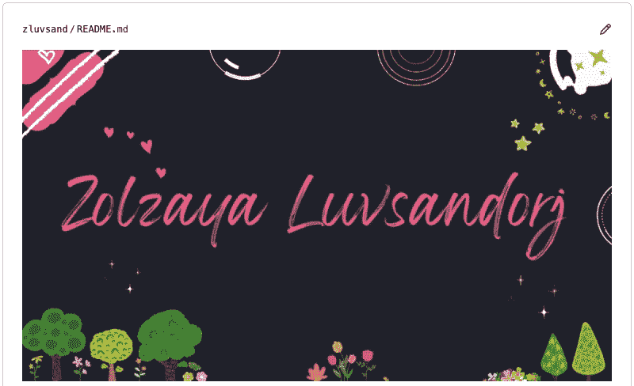

我的新 GitHub 个人资料部分|作者图片

# 📍 0.创建个人资料自述文件

让我们先了解一下配置文件定制的基本原理。我使用[这个库](https://github.com/zluvsand/zluvsand)、*一个以我的 GitHub 用户名*命名的特殊库，来定制[我的 GitHub](https://github.com/zluvsand) 。然后，我在存储库中的 *README.md* 中包含了我想在我的个人资料上显示的内容。在这之后，我的 GitHub 个人资料被漂亮地定制了。

现在，让我们为您创建一个特殊的存储库并初始化一个 README.md 文件。如果您对 GitHub 感到满意，请继续使用您喜欢的方法，并跳到下一节。否则，您可以在登录 GitHub 后按照以下步骤操作:

1.  点击位于️and 右上角的+,选择*新建库，创建一个新的*公共* GitHub 库。*

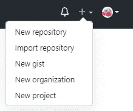

2.以你的 *GitHub 用户名命名这个库。*输入存储库名称后，您将会看到一个关于*✨特殊✨存储库*的提示，如下图所示。

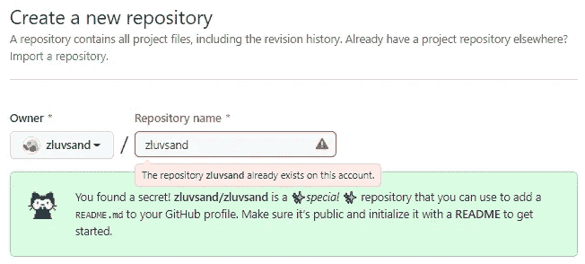

我已经有了一个特殊的存储库，因此警告消息是粉红色的。

3.特殊存储库必须是公开的，才能显示在您的 GitHub 个人资料上。所以对资源库做一个简要的描述(例如*“GitHub profile”*，这一步是可选的)，选择 *Public】，*打勾*“添加一个自述文件”*，点击*“创建资源库”:*

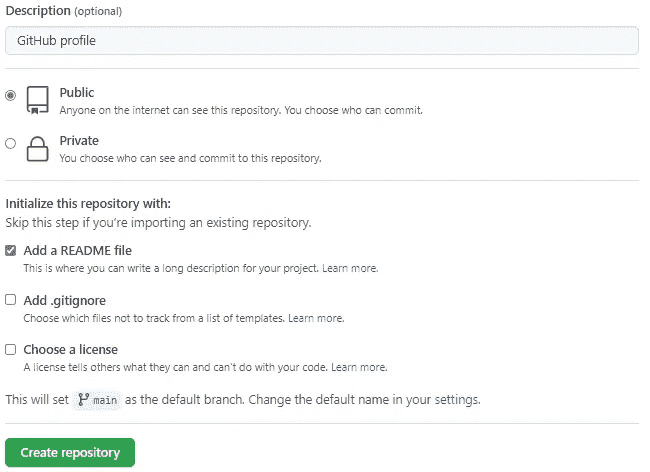

很好，您刚刚创建了您的特殊存储库并在其中初始化了一个 README.md 文件。现在，有趣的部分开始了！我们将看看几种丰富 GitHub 概要文件的方法。将显示示例提示和示例代码来说明一个想法。通过选择和调整您最喜欢的文件，并将其包含在 README.md 文件中，您可以根据自己的喜好设计您的个人资料！

# 👽 1.“关于我”部分

在 GitHub 个人资料中包含简短的自我介绍是很常见的。如果您不太确定是否开始，这里有一个示例提示:

```
### Hi there 👋
* 👂 My name is ...
* 👩 Pronouns: ...
* 🔭 I’m currently working on ...
* 🌱 I’m currently learning ...
* 🤝 I’m looking to collaborate on ...
* 🤔 I’m looking for help with ...
* 💬 Ask me about ...
* 📫 How to reach me: ...
* ❤️ I love ...
* ⚡ Fun fact: ...
```

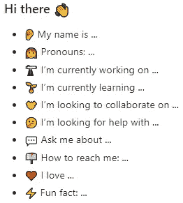

## 👽 1.1.**附加资源:**

◼️各种表情符号如下:[github markdown 表情符号标记的完整列表](https://gist.github.com/rxaviers/7360908)

# 🎨 2.形象

## 🎨 2.1.嵌入图像

添加图像，包括 GIF:动画图像，可以丰富您的个人资料。我们将使用以下两种方法中的一种来嵌入`.jpg`、`.png`、`.gif`或`.svg`文件:
◼️降价方法:`` 带有``标签的◼️ HTML 方法:`"/>` HTML 方法允许进一步定制渲染图像，例如调整大小和对齐。此外，HTML 方法与其他 HTML 标签协调工作(我们将在第 6 节看到一个这样的例子)。

我们可以使用原始文件链接嵌入存储在存储库中的图像。嵌入此类图像的语法如下所示:

```
<!-- Markdown approach -->
<username>/<repository>/<branch>/<file_path>)<!-- HTML approach -->
/<repository>/<branch>/<file_path>"/>
```

或者，我们可以嵌入存储在网络其他地方的图像:

```
<!-- Markdown approach -->
)<!-- HTML approach -->

```


由[塞德里克·弗里克森](https://unsplash.com/@cedric_frixon?utm_source=medium&utm_medium=referral)在 [Unsplash](https://unsplash.com?utm_source=medium&utm_medium=referral) 上拍摄的照片

使用外部 url 的一个潜在风险是链接将来可能会断开。

已经学会了如何嵌入图像，让我们来学习一些方法来嵌入图像。

## 🎨 2.2.寻找/设计图像

上面的海龟图片取自 [Unsplash](https://unsplash.com/) ，这是一个寻找*高质量免费可用的*图片的绝佳平台。如果你想找一张照片放在你的个人资料里，平台上有很多漂亮的照片。

另一个选择是设计你自己的横幅。可以使用 Adobe Photoshop、PowerPoint 和 Keynote 等常见工具制作横幅。至于我，我喜欢用 [Canva](https://www.canva.com/) ，一个用户友好的直观设计工具。使用其中一个免费模板，我在几分钟内制作了以下横幅:


如果你不确定从哪里开始，我建议从免费的[模板](https://www.canva.com/templates/)开始，在*‘脸书封面’，【YouTube 频道艺术’，*和*‘LinkedIn 横幅’下。*此外，[](https://excalidraw.com/)**或*[*draw . io*](https://app.diagrams.net/)*都是免费的有用探索工具。****

***GIF 让我们表达的不仅仅是静态图像。你可以从 [GIPHY](https://giphy.com/) 或 [Tenor](https://tenor.com/) 等平台上找到一个 GIF 来补充你的个人资料。或者，你可以制作你独特的 GIF，这就是我为我的个人资料所做的。***

## ***🎨 2.3.免费资源整理列表***

***◼️ **设计工具:** PowerPoint、Keynote、 [Canva](https://www.canva.com/) 、 [Excalidraw](https://excalidraw.com/) 或[draw . io](https://app.diagrams.net/)◼️**高质量图片:**[unsplash](https://unsplash.com/)◼️**gif:**[giphy](https://giphy.com/)或[男高音](https://tenor.com/)***

# **📈 3.GitHub 自述文件统计**

**如果你在 GitHub 上很活跃，显示你的 GitHub 活动摘要可以很好地增加你的个人资料。我们将考虑几个选项。**

## **📈 3.1.GitHub 统计**

**通过在示例 url 中将`zluvsand`替换为您的用户名，摘要将适应您的 GitHub 活动。**

```
****
```

**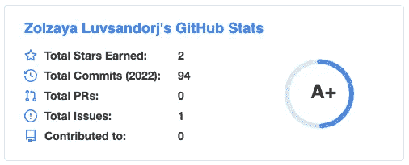**

## **📈 3.2.最常用的语言**

**该统计基于您的公共存储库:**

```
****
```

**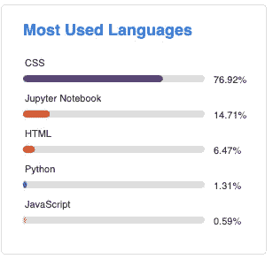**

**通过将`&layout=compact`添加到 url，我们可以使它更紧凑:**

```
****
```

**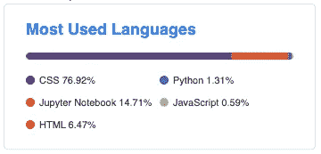**

## **📈 3.3.总贡献和条纹**

**这个用来追踪条纹:**

```
****
```

**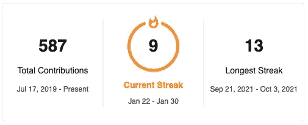**

## **📈 3.4.GitHub 知识库**

**如果您想在个人资料中突出显示一两个存储库。这个例子基于我的名为`github_profile`的知识库:**

```
****
```

**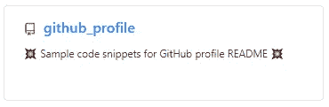**

## **📈 3.5.主题**

**这些摘要可以用[主题](https://github.com/anuraghazra/github-readme-stats/blob/master/themes/README.md)中的一个进一步设计。要应用你最喜欢的主题，我们只需要在 url 的末尾添加`&theme=<theme_name>`。以下是如何在 GitHub stats 的例子中应用黑暗主题:**

```
****
```

**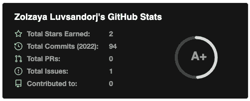**

## **📈 3.6.额外资源**

**要了解更多关于 GitHub README stats 的信息，请查看以下内容:
◼️[github readme stats](https://github.com/anuraghazra/github-readme-stats)
◼️[github readme streak stats](https://github.com/DenverCoder1/github-readme-streak-stats)
◼️[令人惊叹的 GitHub Stats Demo](https://awesome-github-stats.azurewebsites.net/)**

# **☎️ 4.“与我联系”部分**

**如果你想和你的访客保持联系，在你的 GitHub 个人资料中添加你的社交媒体和其他平台上的个人资料的链接会很有用。让我们看 3 个例子。**

## **☎️ 4.1.示例 1: Shields.io 徽章**

**在本例中，我们将使用 [Shields.io](https://shields.io/) 徽章并链接徽章。我们将使用这个 Markdown 语法结构:`[](<hyperlink>)`。**

```
**[](https://medium.com/@zluvsand)[](https://www.linkedin.com/in/zluvsand/)[](https://open.spotify.com/playlist/7KmIUNWrK8wEHfQcQfFrQ1?si=0e2d44043b5a40a4)**
```

****

**这些徽章非常灵活，可以根据您的喜好定制。让我们学习一些关于格式化这些徽章之类的基本东西:
◼ ️Let's 从一个简单的中等徽章开始，`?`之前的部分:`[https://img.shields.io/badge/Medium-12100E](https://img.shields.io/badge/Medium-12100E)`。**

****

**◼️我们给格式加上第一个参数:`?<argument>=<value>`。我们将通过添加`?style=for-the-badge` : `[https://img.shields.io/badge/Medium-12100E?style=for-the-badge](https://img.shields.io/badge/Medium-12100E?style=for-the-badge)`来改变徽章的样式。**

****

**◼️我们可以在后面加上`&<argument>=<value>`。您可能还记得，我们在第 3 节中应用主题时已经这样做了。我们通过添加`&logo=medium` : `[https://img.shields.io/badge/Medium-12100E?style=for-the-badge&logo=medium](https://img.shields.io/badge/Medium-12100E?style=for-the-badge&logo=medium)`来添加中号 logo 吧。**

****

**如果你想了解更多关于这些徽章的信息， [Shields.io](https://shields.io/) 也有例子。或者，您可以从[这里](http://Markdown Badges)或[这里](https://dev.to/envoy_/150-badges-for-github-pnk)找到预先格式化的徽章。**

## **☎️ 4.2.示例 2:图标**

**在本例中，我们将展示不带任何品牌名称的徽标。这一次，我们将使用 HTML 语法:`<a href="<hyperlink>">"/></a>`。**

```
**<a href="[https://medium.com/@zluvsand](https://medium.com/@zluvsand)">
    
</a>
<a href="[https://www.linkedin.com/in/zluvsand/](https://www.linkedin.com/in/zluvsand/)">
    
</a>
<a href="[https://open.spotify.com/playlist/7KmIUNWrK8wEHfQcQfFrQ1?si=0e2d44043b5a40a4](https://open.spotify.com/playlist/7KmIUNWrK8wEHfQcQfFrQ1?si=0e2d44043b5a40a4)">
    
</a>**
```

****

**在``标签中，我们用`height`参数定制了图标的大小。**

**这些徽标图片来自全球最大的图标和插图市场 [Iconfinder](https://www.iconfinder.com/) 。**

## **☎️ 4.3.示例 3:图标和表格**

**在最后一个例子中，我们将使用 HTML 语法创建一个表格，使徽标看起来更有条理。**

```
**<table>
    <tbody>
        <tr>
            <td><a href="[https://medium.com/@zluvsand](https://medium.com/@zluvsand)">
            
            </a></td>
            <td><a href="[https://www.linkedin.com/in/zluvsand/](https://www.linkedin.com/in/zluvsand/)">
            
            </a></td>
            <td><a href="[https://open.spotify.com/playlist/7KmIUNWrK8wEHfQcQfFrQ1?si=0e2d44043b5a40a4](https://open.spotify.com/playlist/7KmIUNWrK8wEHfQcQfFrQ1?si=0e2d44043b5a40a4)">
            
            </a></td>
        </tr>
    </tbody>
</table>**
```

**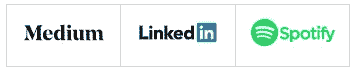**

**这些标志取自[矢量标志专区](https://www.vectorlogo.zone/index.html)，一个以`.svg`格式展示华丽标志的网站。**

**在这些示例中，徽章和徽标直接来自网站。下载徽章和徽标的图像并保存在存储库中是一种替代方法。**

## **☎️ 4.4.免费资源整理列表**

**◼️ **徽章:** [Shields.io](https://shields.io/) ， [Markdown 徽章](https://github.com/Ileriayo/markdown-badges)或 [150+徽章为 GitHub](https://dev.to/envoy_/150-badges-for-github-pnk)
◼️ **图标:** [Iconfinder](https://www.iconfinder.com/) ， [VectorLogoZone](https://www.vectorlogo.zone/index.html) 或[简单图标](https://simpleicons.org/)
◼️5.4。免费资源整理列表**

# **🛠️ 5.语言和工具**

**本节与第 4 节非常相似。因此，第 4 节和第 5 节中的资源和设计可以互换使用。我们将再次看 3 个例子。**

## **🛠️ 5.1.示例 1**

**[Devicon](https://devicon.dev/) 为编程语言提供许多图标，设计&开发工具。在本例中，我们将使用 Devicon 的图标:**

```
****
```

****

**对于给定的图标，可以使用 [Devicon 网站](https://devicon.dev/)左侧窗格上的< img > element" 在*下找到 url。这里的语法更简单，因为我们不需要链接图片。***

## **🛠️ 5.2.示例 2**

**我们现在将使用来自矢量徽标区的徽标，并将使用`<code>`标签格式化图标，以呈现略有不同的外观:**

```
**<code></code>
<code></code>
<code></code>
<code></code>
<br />
<code></code>
<code></code>
<code></code>
<code></code>**
```

****

**这给徽标增加了一个松散的结构。**

## **🛠️ 5.3.示例 3**

**我们将使用一张 2x4 的桌子来组织我们之前使用的 Devicon 徽标:**

```
**<table width="320px">
    <tbody>
        <tr valign="top">
            <td width="80px" align="center">
            <span><strong>Python</strong></span><br>
            
            </td>
            <td width="80px" align="center">
            <span><strong>Java</strong></span><br>
            
            </td>
            <td width="80px" align="center">
            <span><strong>HTML</strong></span><br>
            
            </td>
            <td width="80px" align="center">
            <span><strong>CSS</strong></span><br>
            
            </td>
        </tr>
        <tr valign="top">
            <td width="80px" align="center">
            <span><strong>React</strong></span><br>
            
            </td>
            <td width="80px" align="center">
            <span><strong>git</strong></span><br>
            
            </td>
            <td width="80px" align="center">
            <span><strong>GitHub</strong></span><br>
            
            <td width="80px" align="center">
            <span><strong>Canva</strong></span><br>
            
            </td>
        </tr>
    </tbody>
</table>**
```

**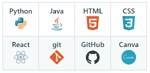**

**语法增长了不少。我们使用`width`参数来[使列宽等于](https://stackoverflow.com/a/2919995/9724079)和`align`参数来居中对齐内容。**

## **🛠️ 5.4.免费资源整理列表**

**◼️ **图标:** [图标](https://devicon.dev/)
◼️节☎️️ 4.4。免费资源整理列表**

# **📁 6.可折叠部分**

**如果你有很多东西要放在你的个人资料中，但是你不想让你的访问者不知所措，你会发现可折叠的部分很有帮助。我们可以使用`<details>` HTML 标签创建可折叠的部分:**

```
**<details>
    <summary><b>✨About Me</b></summary><br/>
    Sample text
</details><details>
    <summary><b>🛠️ Languages & Tools</b></summary><br/>
    Sample text
</details>**
```

**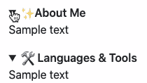**

**如果您想在折叠部分嵌入一个图像，您需要使用 HTML 方法:**

```
**<details>
    <summary><b>🎁 Open me (Markdown approach) </b></summary>
    )
</details>
<details>
    <summary><b>🎁 Open me (HTML approach) </b></summary>
    
</details>**
```

**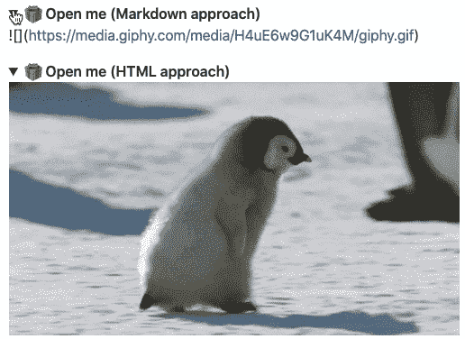**

# **❄️ 7.主观因素**

**在设计 GitHub profile 的时候，你可能想加入一些你的个人风格。我将分享我所做的作为一个例子，希望这能给你一些想法，并帮助你找到你的个人风格。我是这样做的:
◼️尝试用我最喜欢的一些颜色为整个档案使用相同的调色板:[黑色和粉红色](https://www.youtube.com/watch?v=IHNzOHi8sJs&list=PLNF8K9Ddz0kKfujG6blfAxngYh_C66C_q&index=10)
◼️找到了我的两个兴趣的很好的交集:喜剧和编程。我找到了[这个神奇的笑话 API](https://github.com/ABSphreak/readme-jokes) ，它随机生成编程笑话，只有一行代码:**

```
****
```

****

**◼ ️Put 在一点点努力变成我的旗帜。**

**那么你呢？你可以做些什么来让你的个人资料更独特？**

# **📚 8.额外资源**

**瞧，就是这样。希望这些提示能给你一些启发，让你开始创建自己的 GitHub 档案！**

**🔗如果你在设计你的个人资料方面有更多的灵感，这里有一些整理了 awesome 个人资料的仓库:
◼️ ️️ [Awesome GitHub 个人资料自述文件](https://github.com/abhisheknaiidu/awesome-github-profile-readme)-awesome github 个人资料收藏库
◼️️️[github 个人资料收藏库](https://github.com/topics/profile-readme)
◼️ ️️ [Awesome GitHub 个人资料自述文件模板收藏库](https://github.com/durgeshsamariya/awesome-github-profile-readme-templates)
通过点击 *README.md* 然后点击 *Raw* ，你可以看到底层代码。**

**🔗如果您想学习更高级的主题，比如动态更新内容，这里有一些资源可以探索:
◼️ ️️ [复杂的可嵌入指标](https://github.com/lowlighter/metrics)
◼️ ️️ [了解 GitHub 动作](https://docs.github.com/en/actions/learn-github-actions/understanding-github-actions)**

**🔗如果您想尝试用户友好的界面来自动生成 GitHub Profile 的自定义自述脚本，那么 [GitHub Profile 自述文件生成器](https://rahuldkjain.github.io/gh-profile-readme-generator/)可能会让您感兴趣。**

**最后，我总结了我们今天在 GitHub 库中学到的代码片段。如果你在设计你的 GitHub 个人资料时使用了一些技巧，请不要犹豫，留下你的个人资料链接的评论——我很乐意看到！**

****

**罗伯特·卡茨基在 [Unsplash](https://unsplash.com?utm_source=medium&utm_medium=referral) 上拍摄的照片**

**您想要访问更多这样的内容吗？媒体会员可以无限制地访问媒体上的任何文章。如果你使用 [*我的推荐链接*](https://zluvsand.medium.com/membership) ，*成为会员，你的一部分会费会直接去支持我。***

**谢谢你看我的帖子。如果你感兴趣，这里有我的一些帖子的链接:**

**◼️️ [用这些技巧充实你的 Jupyter 笔记本](/enrich-your-jupyter-notebook-with-these-tips-55c8ead25255)
◼️ [用这些技巧整理你的 Jupyter 笔记本](/organise-your-jupyter-notebook-with-these-tips-d164d5dcd51f)
◼️ [有用的 IPython 魔法命令](/useful-ipython-magic-commands-245e6c024711)
◼️[python 虚拟数据科学环境简介](/introduction-to-python-virtual-environment-for-data-science-3c216929f1a7)
◼️[git 数据科学简介](/introduction-to-git-for-data-science-ca5ffd1cebbe?source=your_stories_page-------------------------------------)
◼️[python 中的简单数据可视化，你会发现有用的](/simple-data-visualisations-in-python-that-you-will-find-useful-5e42c92df51e)
◼️ [6 个简单技巧，让情节更漂亮，更定制](/6-simple-tips-for-prettier-and-customised-plots-in-seaborn-python-22f02ecc2393)**

**再见🏃💨**