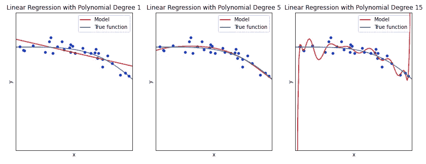
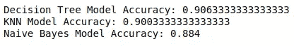
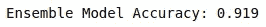
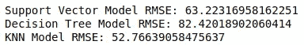
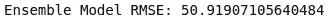
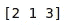
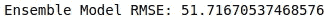

# 集成平均—通过投票提高机器学习性能

> 原文：<https://towardsdatascience.com/ensemble-averaging-improve-machine-learning-performance-by-voting-246106c753ee>

## 整体平均利用多个模型预测来开发稳健的性能


帕克·约翰逊在 [Unsplash](https://unsplash.com?utm_source=medium&utm_medium=referral) 上拍摄的照片

人多力量大。令人惊讶的是，在机器学习领域也可以做出同样的观察。整体平均是**设计多个不同模型**的技术，即线性回归或梯度增强树**，并允许它们对最终预测**形成意见。

该技术可以通过以下三个步骤轻松应用:

*   开发多个预测模型，每个模型都能够做出自己的预测
*   使用同一组训练数据训练每个预测模型
*   通过使用每一个模型预测结果，并平均它们的值

这看起来似乎很容易实现，与单一的独立预测模型相比，它真的会产生更好的结果吗？事实上，一组模型经常比任何一个单独的模型显示出更好的结果。为什么这样

# 为什么系综平均有效？

## 偏差和方差

为了理解它的工作原理，我们首先来看看机器学习模型的两个最重要的属性:**偏差**和**方差**。



作者的代码输出图

偏差本质上是模型使用目标函数将给定输入映射到输出的**假设。例如，简单的普通最小二乘(OLS)回归是一种具有高偏差的模型。具有高偏差的模型允许它自己容易地学习输入和输出之间的关系。然而，它们总是对目标函数做更多的假设，因此灵活性较低。所以**偏高**的机型往往会出现**欠配**的问题(左图)。**

另一方面，模型的**方差**测量模型在不同训练数据上的表现。决策树不对目标函数做任何假设。因此，它非常灵活，并且通常具有低偏差。然而，由于灵活性，它倾向于学习最初用于训练模型的所有噪声。因此，这些模型引入了另一个问题— **高方差**。这在另一方面经常导致**过拟合**的问题(右图)。


乔恩·泰森在 [Unsplash](https://unsplash.com?utm_source=medium&utm_medium=referral) 上的照片

**偏差-方差困境**因此存在于机器学习的世界中，因为试图同时最小化偏差和方差存在冲突。越来越复杂的模型通常具有低偏差和高方差，而相对简单的模型通常具有高偏差和低方差。因此，困境描述了模型学习输入和输出之间的最佳关系，同时在原始训练集之外进行概括的难度。

## 投票机概述

一群模型就像投票机一样工作。每个合奏成员**通过使用他们的预测**进行投票来平等地做出贡献。因此，当每个模型被集合时，它引入了多样性的概念。这种多样性将减少方差，并提高超越训练数据的概括能力。

让我们假设下图中的八杯咖啡分别代表不同的预测模型。每一种都有不同的口味(有些更甜，有些微苦)。由于我们事先不了解顾客，所以我们无法确定我们用来招待顾客(预测结果)的咖啡是否合适。我们的主要目标是想出一种新的咖啡，味道好，更适合大多数人的口味。


照片由[内森·杜姆劳](https://unsplash.com/@nate_dumlao?utm_source=medium&utm_medium=referral)在 [Unsplash](https://unsplash.com?utm_source=medium&utm_medium=referral) 上拍摄

我们在这里可以做的是，通过混合八杯咖啡，我们得到了一种新的咖啡混合物，它保留了每种咖啡的焦糖、巧克力和苦味。与例如纯浓咖啡相比，这种咖啡在理论上应该能够服务于更广泛的顾客。这是因为最初浓缩咖啡的苦味可能不适合一些顾客，但这种混合已经抵消了。

## 多样性的定义？

然而，多样性的确切定义在任何地方都没有定义。然而,**经验表明，在大多数情况下，集合的性能优于单个模型。由于数据科学是一个需要经验证据的领域，能够在大多数时间工作实际上比你想象的更有说服力。这意味着它能够**解决偏差-方差困境**，通过使用模型集合减少方差，而不增加偏差。**

从金融角度来看这个问题，这个概念与投资组合多样化非常相似。如果投资组合中的每只股票都是独立的或者相关性很低。非系统风险(每个模型的差异或限制)可以通过多样化来减轻，而每个单独组件的回报不会改变。

# Python 演示

在本文中，我将演示集成平均在回归问题和分类问题上的实现。


照片由[克里斯里德](https://unsplash.com/@cdr6934?utm_source=medium&utm_medium=referral)在 [Unsplash](https://unsplash.com?utm_source=medium&utm_medium=referral) 拍摄

## 分类

首先，我们从 Scikit Learn 导入一些必要的模块。

```
from sklearn.datasets import make_classification
from sklearn.model_selection import train_test_split
from sklearn.metrics import accuracy_score
from sklearn.tree import DecisionTreeClassifier
from sklearn.naive_bayes import GaussianNB
from sklearn.ensemble import VotingClassifier 
from sklearn.neighbors import KNeighborsClassifier
```

我们使用来自 Scitkit Learn 的 make_classification()来模拟具有 50 个特征和 10000 个样本的二元分类问题。

模拟数据被进一步分成训练集和测试集。

```
X, y = make_classification(n_samples=10000, n_features=50, n_redundant= 15, random_state=42)
X_train, X_test, y_train, y_test = train_test_split(X, y, test_size=0.30, random_state=43)
```

现在，我们训练几个独立的模型来预测分类问题。在本文中，我们将使用决策树分类器，KNN 和朴素贝叶斯。

```
models = [('Decision Tree', DecisionTreeClassifier()),
         ('KNN', KNeighborsClassifier()),
         ('Naive Bayes', GaussianNB())]for name, model in models:
    model.fit(X_train, y_train)

    prediction = model.predict(X_test)
    score = accuracy_score(y_test, prediction)
    print('{} Model Accuracy: {}'.format(name,score))
```



作者输出的代码

在拟合模型之后，我们可以观察到模型本身已经做得很好了。让我们看看使用 Scitkit Learn 的 VotingClassifier 实现集成技术后的结果。

```
ensemble = VotingClassifier(estimators=models)
ensemble.fit(X_train, y_train)prediction = ensemble.predict(X_test)
score = accuracy_score(y_test, prediction)
print('Ensemble Model Accuracy: {}'.format(score))
```



作者输出的代码

VotingClassifier 通过使用多数规则投票选择预测的类别标签来实现三个模型的集成。例如，如果有两个模型预测实例为 A 类，而只有一个模型预测为 B 类，则预测的最终结果将是 A 类。

从这个实验中，我们可以看到，在我们实现集成平均之后，预测性能有了显著的提高。

## 回归


照片由[马库斯·温克勒](https://unsplash.com/@markuswinkler?utm_source=medium&utm_medium=referral)在 [Unsplash](https://unsplash.com?utm_source=medium&utm_medium=referral) 拍摄

该技术也可以应用于回归问题。类似于我们在分类问题中介绍的，我们首先从 Scitkit Learn 导入一些必要的模块。

```
import numpy as np
from sklearn.datasets import make_classification
from sklearn.model_selection import train_test_split
from sklearn.metrics import mean_squared_error
from sklearn.datasets import make_regression
from sklearn.svm import SVR
from sklearn.tree import DecisionTreeRegressor
from sklearn.neighbors import KNeighborsRegressor
from sklearn.ensemble import VotingRegressor
```

我们这次用 make_regression()模拟一个 10 个特征，10000 个样本的回归问题。

模拟数据再次被进一步分成训练集和测试集。

```
X, y = make_regression(n_samples=10000, n_features=10, random_state=42)
X_train, X_test, y_train, y_test = train_test_split(X, y, test_size=0.30, random_state=43)
```

我们训练支持向量回归机、决策树回归机、KNN 来预测回归问题。

```
models = [('Support Vector', SVR()),
         ('Decision Tree', DecisionTreeRegressor()),
         ('KNN', KNeighborsRegressor())]
score = []for name, model in models:
    model.fit(X_train, y_train)

    prediction = model.predict(X_test)
    score = mean_squared_error(y_test, prediction, squared = False)
    scores.append(score)
    print('{} Model RMSE: {}'.format(name,score))
```



作者输出的代码

像往常一样，我们现在使用 Scitkit Learn 的 VotingRegressor 实现集成技术。

```
ensemble = VotingRegressor(estimators=models)
ensemble.fit(X_train, y_train)prediction = ensemble.predict(X_test)
score = mean_squared_error(y_test, prediction, squared = False)
print('Ensemble Model RMSE: {}'.format(score))
```



作者输出的代码

VotingRegressor 的工作方式与 VotingClassifier 非常相似，只是它通过平均各个预测来实现集成，从而形成最终预测。

**额外的实用技巧**

在 VotingRegressor 和 VotingClassifier 中，我们可以利用参数“权重”来改变集成结果。“权重”参数指定了每个模型在最终结果中的能力。例如，在这个回归问题中，我们可以看到 KNN 模型在预测结果方面比其同行相对更强。在这种情况下，我们可以为其对最终预测的贡献分配更强的权重。为此，我们只需将权重列表传递给 VotingRegressor 函数。


由 [Unsplash](https://unsplash.com?utm_source=medium&utm_medium=referral) 上的[图形节点](https://unsplash.com/@graphicnode?utm_source=medium&utm_medium=referral)拍摄

事实上，我们可以根据模型相对于其他模型的排名来分配它们的权重。通过这样做，我们让那些预测更好的人在最终结果的投票中有更大的发言权。

```
scores = [-x for x in scores]
ranking = 1 + np.argsort(scores)
print(ranking)
```



作者输出的代码

使用模型中的 RMSE，我们实现了 np.argsort 来根据它们的等级对它们进行排序。由于 np.argsort 从一个较小的值开始排序，所以我们在排序之前先对分数取反。这样，RMSE 较低的模型将具有较高的权重。例如，KNN 模型的权重为 3 分(满分为 6 分)。

让我们再训练一次，看看我们的结果是否会更好。

```
ensemble = VotingRegressor(estimators=models, weights = ranking)
ensemble.fit(X_train, y_train)prediction = ensemble.predict(X_test)
score = mean_squared_error(y_test, prediction, squared = False)
print('Ensemble Model RMSE: {}'.format(score))
```



作者输出的代码

不幸的是，与正常平均相比，我们的集合模型这次具有更高的 RMSE。您可能会问，我们如何知道设置哪个权重，以便为每个模型获得最合适的权重？

幸运的是，我们可以使用堆叠回归器，它将**从预测器**中学习最佳线性组合，这能够以提高的预测精度再次达到最终输出。我将在我的下一篇文章[中详细阐述更多关于 ***堆叠回归变量*** 。](/stacked-ensembles-improving-model-performance-on-a-higher-level-99ffc4ea5523)

# 外卖

整体平均是一项伟大的技术，可以通过**引入多样性以减少方差**来提高模型性能。请注意，尽管这种技术经常奏效，但它并不像药丸那样奏效。有时，您可能会看到模型的集合比单个模型工作得更差。

然而，鉴于它易于实现，它绝对值得被包含在您的机器学习管道中。

再次感谢您在百忙之中抽出更多的时间来阅读这篇文章。


由[凯利·西克玛](https://unsplash.com/@kellysikkema?utm_source=medium&utm_medium=referral)在 [Unsplash](https://unsplash.com?utm_source=medium&utm_medium=referral) 上拍摄的照片