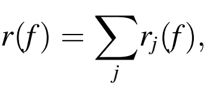
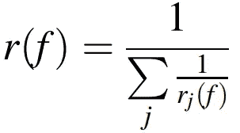
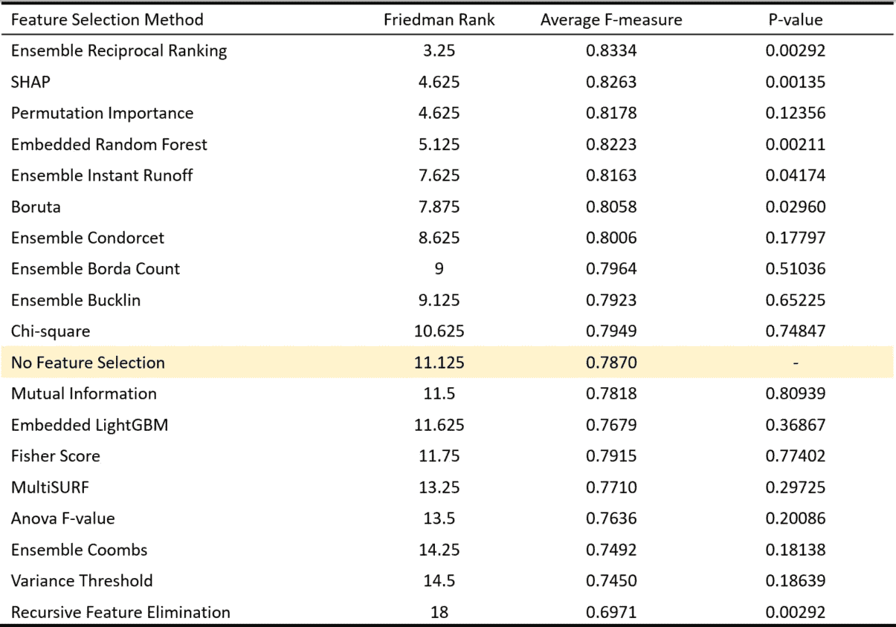

# 用于机器学习的集成特征选择

> 原文：<https://towardsdatascience.com/ensemble-feature-selection-for-machine-learning-c0df77b970f9>

## 通过组合单个特征选择方法来选择最佳特征

[op23](https://unsplash.com/@op23) 在 [Unsplash](https://unsplash.com/photos/aQLhhQOX9CI) 上拍照

这篇文章的大部分内容来自我的论文:
“环境数据特征选择方法的评估”，有兴趣的人可以在[这里](https://www.sciencedirect.com/science/article/pii/S1574954121000157)找到。

在我之前的[文章](/feature-selection-for-machine-learning-3-categories-and-12-methods-6a4403f86543)中，我介绍了 12 种单独的特征选择方法。本文是特性选择的下一步。

如果你在这里，我想你已经熟悉了在分类算法上建立良好的集成，它提供了比使用单一算法更好的结果和鲁棒性。相同的原理可以应用于特征选择算法。

# 集成特征选择

集成特征选择背后的思想是结合多种不同的特征选择方法，考虑它们的优势，并创建最优的最佳子集。
总的来说，它构成了更好的特征空间，降低了选择不稳定子集的风险。
此外，单个方法可能产生被认为是局部最优的子集，而集成可能提供更稳定的结果。

# 集成方法

集合方法是基于投票系统的。

> 为了使用它们，我们首先必须运行至少几个单独的特征选择方法，并获得它们为每个特征给出的排名。

## 1.博尔达伯爵

Borda Count 是最著名的投票系统之一。它相当简单，根据特征选择方法的各个等级的总和给每个特征打分。

然后从特征总数中减去这个分数。因此最强的特征将具有最大等级 *N* ，其中 *N* 是特征。

计算 Borda 计数的简单公式是:

其中 *j = 1，2，…，N* 为特征选择方法， *rj(f)* 为特征按照 *j* 方法的等级。

博尔达计数可以有许多名称，如线性聚集，平均平均排名和排名聚集。

## 2.倒数排名

倒数排名基于根据以下等式对特征 f 的最终排名 *r(f)* 的计算:

它相当于调和平均秩，也称为逆秩位置。

## 3.瞬时径流

这是一种用于选举的投票方法，是 1850 年单一可转移投票的特例。

对于 ML，特征选择方法是投票者，特征是候选者。在选举中，获胜的候选人获得第一优先选择的多数选票，即超过 50%的选票。如果没有这样的候选人，得票最少的候选人将被除名，下一个优先候选人将取而代之。

重复这一过程，直到找到获胜者。为了创建特征(候选)的排名，每次发现获胜者时，它被放置在排名列表上，并且该方法对剩余的特征再次运行。

## 4.孔多塞

这种方法从偏好等级列表中选择获胜者，属于配对比较的范畴。

在一对一的战斗中“赢得”所有其他特征选择方法的特征被称为孔多塞赢家。为了应用孔多塞方法，有必要创建一个尺寸为 *n × n* 的表格 *T* ，其中 *n* 是特征的数量。

该表被置零，并且特征比较被初始化。如果特征 *fi* 优于特征 *fj* (意味着它的等级更高)，那么将‘1’添加到单元 *ti，j* 。表 *T* 完成后，对于每个元素，两个特征之间的胜者确定如下:

如果 *ti，j > n/2* ，那么 feature *fi* 获胜，否则 feature *fj* 获胜，而他们之间可以有平局。

每个特征的最终得分从配对产生的所有单独得分的总和中扣除，因此最终排名可以被导出。

在平局的情况下，他们的排名将是随机的。

## 5.库姆斯

这是排名榜的另一种投票系统。它类似于即时决胜，因为它每轮删除一个功能，并将投票重新分配给剩余的功能，直到其中一个获得多数票。

每种特征选择方法都按优先顺序排列特征。对最后位置持有最多投票的特征被记录在最终合并列表的最后位置。

对剩余的特征进行新一轮，并且该过程继续直到完成。

## 6.巴克林

这是另一个系统，它基于拥有大多数选票的获胜者的选举。

然而，目前的制度在选举方式上有所不同，在这种情况下，没有候选人成功地从第一轮选举中收集到获得多数票所需的票数，需要增加下一轮选举的票数。

重复该过程，直到至少一个特征获得多数票。

当找到这个特征时，它被添加到最终的合并列表中。然后，Bucklin 再次运行，直到所有特征都在最终列表中排序。

# 集成特征选择是否优越？

我在一个分类任务的 8 个数据集中比较了 12 种单独的特征选择方法和上述的 6 种集成方法(可以在[论文](https://www.sciencedirect.com/science/article/abs/pii/S1574954121000157)中看到)。
结果如下表所示:

结果按 Friedman rank 排序，它只是计算每个方法在数据集中的平均排名。

根据该表，最好的方法是倒数排名，与第二种方法(SHAP)相差近 1.4 位。
除了 Coombs 之外，所有集成方法都优于无特征选择基线，并且实现了高性能。

总之，集成特征选择方法，尤其是倒数排序值得关注，因为它们可以提供高性能。

然而，如果寻找一个强大的个人方法，SHAP 是一个使用。

# 不确定接下来要读什么？这里有两个选择:

    

# 保持联络

关注我在[媒体](https://medium.com/@dimitris.effrosynidis)上的更多内容。
我们在 [LinkedIn](https://www.linkedin.com/in/dimitrios-effrosynidis/) 上连线吧。检查我的 GitHub。